# COSIGN: Contextual Facts Guided Generation for Knowledge Graph Completion

Jinpeng Li1, Hang Yu1\*, Xiangfeng Luo1, Qian Liu2

1Shanghai University, China

2School of Computer Science, The University of Auckland, New Zealand {lijinpeng,yuhang,luoxf}@shu.edu.cn, liu.qian@auckland.ac.nz

## Abstract

Knowledge graph completion (KGC) aims to infer missing facts based on existing facts within a KG. Recently, research on generative models (GMs) has addressed the limitations of embedding methods in terms of generality and scalability. However, GM-based methods are sensitive to contextual facts on KG, so the contextual facts of poor quality can cause GMs to generate erroneous results. To improve the performance of GM-based methods for various KGC tasks, we propose a COntextual FactS GuIded GeneratioN (COSIGN) model. First, to enhance the inference ability of the generative model, we designed a contextual facts collector to achieve human-like retrieval behavior. Second, a contextual facts organizer is proposed to learn the organized capabilities of LLMs through knowledge distillation. Finally, the organized contextual facts as the input of the inference generator to generate missing facts. Experimental results demonstrate that COSIGN outperforms state-of-the-art baseline techniques in terms of performance.

## 1 Introduction

A knowledge graph (KG) represents a network of real-world entities and illustrates the relationship between them (Ji et al., 2021; Cambria et al., 2022). Knowledge graph completion (KGC) is a task aimed at inferring missing facts based on existing facts within KGs, including static KGC (SKGC) (Bordes et al., 2013), temporal KGC (TKGC) (Han et al., 2021) and few-shot KGC (FKGC) (Xiong et al., 2018). TKGC involves time facts with timestamps, while FKGC predicts facts with limited or zero trained samples for relationships.

Previous approaches primarily relied on graph embedding, which involves embedding entities and relationships into high-dimensional vectors to represent their associations (Gao et al., 2023). The training and inference models of SKGC (Yang et al.,2014; Trouillon et al.,2016; Sun et al.,2018) depend on various transitional relationships on graph paths, while TKGC (Xu et al.,2020a; Han et al.,2021; Gao et al.,2023) and FKGC Xiong et al.,2018; Chen et al.,2019; Niu et al.,2021) methods further integrate with special components or learning paradigms to handle additional time information or training requirements. However, these differences in methods result in significant maintenance costs and an inability to adapt to emerging knowledge queries, ingestion, and presentation.

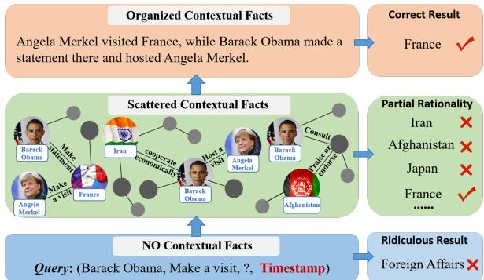  
Figure 1: Examples of the comparative effects of no contextual facts, scattered contextual facts, and organized contextual facts. The timestamp only exists in TKGC.

Recently, generative models (GMs) including large language models (LLMs) have demonstrated advanced performance in handling various natural language processing tasks. Despite having heterogeneous inputs and outputs, generative models transform these tasks into a "text-to-text" format, taking the text as input and producing another text as output (Yao et al.,2019; Kim et al.,2020; Yu et al.,2022a). Moreover, GMs embed a significant amount of real-world knowledge from pre-training (Ye et al.,2022; Chen et al.,2022, Li et al.,2024), which holds potential benefits for KGC tasks.

However, GM-based methods are sensitive to contextual facts on KG (Kim et al., 2023). As illustrated in Figure 1, when the reasoning process lacks contextual facts, the flexibility of the model will be invoked, resulting in significant differences in the generated results. Therefore, it is necessary to gather effective contextual facts to guide the model’s generation. However, scattered contextual facts can make it difficult for the generative model to understand thereby generating erroneous results. Therefore, organizing scattered contextual facts into structured and logical contextual facts is an important challenge of GM-based methods for various KGC tasks.

To address the important challenge, we propose a COntextual FactS GuIded GeneratioN (COSIGN) model to infer missing facts on KGs. First, to enhance the inference ability of the generative model, we designed a contextual facts collector. Given a triple $( s , r , o , m )$ , the collector collects all the paths that the head entity s can infer to the tail entity o in the subgraph as the contextual facts. Second, a contextual facts organizer is proposed, which replaces inefficient manual organization works with automated information organization, to learn the organized capabilities of LLMs through knowledge distillation (Hsieh et al.,2023; Yu et al.,2023). Finally, the organized contextual facts as the input of the inference generator to generate missing facts. Additionally, we add prefix constraints to our model’s inference process to ensure the rationality of the generated results. The contributions of our work can be summarized as follows:

• Inspired by human-like retrieval behavior, we have learned a contextual facts collector based on positive set confidence dominance, which greatly enhances the ability to generate contextual facts.

• We have designed a contextual facts organizer to furnish the necessary basis for inference. To the best of our knowledge, our work is the first to explore how to distillate the LLM to achieve the KGC.

• Extensive experiments verify the effectiveness of each module and its superiority over stateof-the-art baselines.

## 2 Related Works

## 2.1 Embedding KGC models

Early methods such as TransE (Bordes et al., 2013), DistMult (Yang et al., 2014), and ComplEx (Trouillon et al., 2016) achieved success by representing entities and relations as continuous vectors in a low-dimensional space. To address the limitations of these early models, neural network architectures like ConvE (Dettmers et al., 2018) and CompGCN (Sun et al., 2019) were introduced, utilizing neural networks to capture complex patterns in the graph structure. Recent research has explored integrating external information and meta-paths into embedding models (Dong et al., 2017; Zhang et al., 2020). Additionally, TTransE (Leblay and Chekol, 2018), TComplEx (Xu et al., 2020b) extended the models to incorporate temporal information into relation embeddings, and OG-NET (Zheng et al., 2022) embedded the spatial information into representations. TeLM (Xu et al., 2021) introduced a novel linear time regularization function to enhance temporal features. In contrast, LCGE (Niu and Li, 2023) established models for the timeliness and causal relationships of facts, recognizing their time sensitivity in inferring missing information. However, these methods are tailored to specific data and tasks, limiting their generality.

## 2.2 Generative KGC Models

GenKGC (Xie et al., 2022) transforms the KGC task into a sequence-to-sequence generation task, utilizing generative models to enhance generalization capability. KGT5 (Saxena et al., 2022) leverages the generality of the generation model and employs the prompt methodology to concurrently address KGC tasks. SQUIRE (Bai et al., 2022) employs historical paths as context to enhance generative model performance. However, their applicability is limited to static KGC. KG-S2S (Chen et al., 2022) unifies input formats across various types of KGs to address Temporal Knowledge Graph Completion (TKGC) tasks. However, it does not incorporate context, leading to limited performance.

## 3 Preliminaries

Knowledge Graph Completion. Let $\mathcal { E } , \mathcal { R } , \mathcal { T }$ , and denote a finite set of entities, relations, timestamps, and facts, respectively. a fact list ${ \mathcal { F } } =$ $\left\{ { \left( s , r , o , m \right) } _ { 1 } , . . . , { \left( s , r , o , m \right) } _ { n } \right\}$ where $s , o \in { \mathcal { E } }$ is subject and object entity, $r \in \mathcal { R }$ is the tuple relation and m represents the representational form under different types of KG configurations. For instance, in the context of SKGC, m denotes null because it does not consider the time. However, in TKGC, it signifies a timestamp and $m \in \mathcal { T }$ . Knowledge Graph Completion (KGC) predicts the missing entities for the queries $( s , r , ? , m )$ or $\left( ? , r ^ { - 1 } , o , m \right)$ where $r ^ { - 1 } \in \bar { \mathcal { R } } ^ { - 1 }$ is the reverse edge of r.

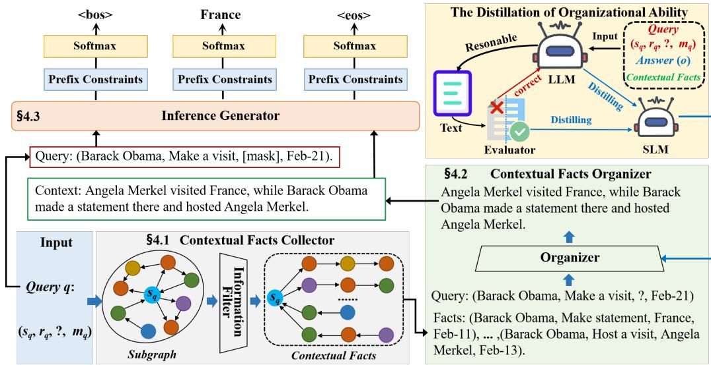  
Figure 2: An overview of the COSIGN. The collector emulates human-like retrieval behavior, the organizer arranges contextual facts, and the inference generator generates answers based on well-organized contextual facts. Here, we use temporal KGC as an illustration.

Generative Knowledge Graph Completion. The generative models have transformed the representation of KGC (Xie et al., 2022; Saxena et al., 2022). The typical generative models of an encoder and a decoder, which can be viewed as $\begin{array} { r } { P \left( y | x \right) = \prod _ { i = 1 } ^ { | y | } P \left( y _ { i } | y _ { < i } , x \right) } \end{array}$ , where x is the input sequence and y is the generated output sequence. In generative KGC, x represents the query $\mathcal { Q } = ( s , r , ? , m )$ (or $( ? , r ^ { - 1 } , o , m ) )$ , and the predicted ground-truth object (or subject) as y. It is noteworthy that both x and y are flattened textual representations of knowledge (Chen et al., 2022).

## 4 Proposed Method

Figure 2 shows there are three key technical components in COSIGN: the contextual facts collector, the contextual facts organizer, and the inference generator. Please note that we take the temporal KGC task as an example when introducing the method, but our method also applies to the static KGC task and few-shot KGC.

## 4.1 Contextual Facts Collector

Collecting information relevant to the query $( s _ { q } , r _ { q } , ? , m _ { q } )$ as the context for inference has tradi tionally been accomplished using a neighborhood sampling strategy (Ding et al., 2022; Wei et al., 2023). However, random sampling can overlook contextual facts and lack an understanding of factual details. Therefore, there is a need to design an efficient and context-aware method for collecting contextual facts to achieve human-like retrieval behavior.

Pruning Neighborhood. Intuitively, human memory primarily focuses on the most recent events (Li et al., 2021). Thus, we extract the lth order neighborhood subgraph $\mathcal { N }$ of the query $( s _ { q } , r _ { q } , ? , m _ { q } )$ to serve as the background,

$$
\begin{array} { r l r } & { } & { \mathcal { N } _ { \left( s _ { q } , r _ { q } , m _ { q } , l \right) } = \left\{ \left( s _ { q } , r _ { j } ^ { 1 } , n _ { i } ^ { 1 } , m _ { q } ^ { 1 } \right) , \left( n _ { i } ^ { 1 } , r _ { j } ^ { 2 } , n _ { i } ^ { 2 } , m _ { t } ^ { 2 } \right) \right. } \\ & { } & { \left. , . . . , \left( n _ { i } ^ { l - 1 } , r _ { j } ^ { l } , n _ { i } ^ { l } , m _ { t } ^ { l } \right) \right\} , 0 \leq i < \left| \mathcal { E } \right| } \\ & { } & { , 0 \leq j < \left| \mathcal { R } \right| , 0 \leq t < \left| \mathcal { T } \right| } \end{array}\tag{1}
$$

where $n _ { i }$ represents the neighboring nodes.

Filtering Information. Next, we filter queryrelevant facts within a subgraph using our proposed information filter module. Previous methods predominantly involved setting similarity thresholds for filtering, leading to challenges in adapting to different KGs (Wang and Yu,2023; Yu et al.,2024b). Therefore, we utilize a generative model for a nuanced understanding of facts, enabling rapid adaptation to filter information across diverse KGs. Specifically, we employ a template $X _ { k }$ to textually represent both the query and the facts within the neighborhood subgraph :

$$
\begin{array} { c } { { X _ { k } = 0 \mathsf { u e r y } \colon ( s _ { q } , r _ { q } , ? , m _ { q } ) \mathsf { F a c t } : ( s _ { i } , r _ { j } , o _ { i } , m _ { t } ) } } \\ { { \qquad 0 \leq i < \left| \mathscr { E } \right| , 0 \leq j < \left| \mathscr { R } \right| , 0 \leq t < \left| T \right| } } \end{array}\tag{2}
$$

where $( s _ { i } , r _ { j } , o _ { i } , m _ { t } )$ represents a specific fact in the neighborhood subgraph  .

Then, the template $X _ { k }$ is input into the information filter module, which outputs $K \in \{ y e s , n o \}$ yes indicates a positive sample related to the query, while no represents a negative sample. It is crucial to emphasize that instances in which entities missing in the query are present in the facts are considered positive samples, while conversely, they constitute negative samples. Our learning objective is to maximize the likelihood of the token $k _ { i }$ given the input text $X _ { K }$ and the tokens $k _ { < i }$ in the base class $K$ , and to define the loss function as follows:

$$
\mathcal { L } _ { k _ { \theta } } = - \sum _ { i = 1 } ^ { | K | } \mathrm { l o g } P _ { k _ { \theta } } \left( k _ { i } | k _ { < i } , X _ { k } \right)\tag{3}
$$

where $P _ { k _ { \theta } } \left( k _ { i } | k _ { < i } , X _ { k } \right)$ is the log-likelihood of the i-th token of the ground class $K$

However, facts with high literal overlap but different semantics pose challenges for generative models. This is because, under the guidance of teacher forcing, the similarity of these facts is forcibly reduced, leading to overfitting. To tackle this issue, we propose a training approach based on a positive-set confidence advantage to diminish model sensitivity during learning. Specifically, we seek to ensure that the probability of the positive sample set outputting yes surpasses that of the negative sample set,

$$
\mathcal { L } _ { c o n } = \log \left( 1 + \sum _ { i \in \Omega _ { n e g } , j \in \Omega _ { p o s } } e ^ { \lambda \left( s _ { i } - s _ { j } \right) } \right)\tag{4}
$$

where λ is a margin value, which is detailed in the experimental section regarding its configuration. $\Omega _ { n e g }$ refers to the negative sample set, and $\Omega _ { p o s }$ represents the positive sample set. s represents the similarity score.

Please note that if $\lambda ( s _ { i } - s _ { j } )$ is an extremely large negative number, it will cause the training gradient to become zero. Therefore, we have incorporated the negative log-likelihood loss $\mathcal { L } _ { k _ { \theta } }$ to prevent such overfitting scenarios, as expressed by $\mathcal { L } _ { k _ { \theta } } + \mathcal { L } _ { c o n }$

Collecting Contextual Facts. The logic of a single fact lacking inferential reasoning is akin to O. Henry’s novels. If only a few keywords are skimmed, it is difficult to understand the twist at the end. However, the path of facts can intuitively describe the process of events. Therefore, by seeking the path between queries and facts, the completeness of information can be achieved. Here, we are seeking the shortest path, as it represents the most direct association of facts. The shortest path between query q and fact $F _ { i }$ is as follows:

$$
\nu _ { ( q , \mathcal { F } _ { i } ) } = \sigma \left( \mathcal { N } _ { q } , ( s _ { q } , m _ { q } ) , ( s _ { i } , m _ { t } ) \right)\tag{5}
$$

where σ is the shortest path function, and in this paper, Dijkstra’s method (Jurkiewicz et al., 2021; Yu et al., 2022b) is used. $\textstyle { \mathcal { N } } _ { q }$ is the l-th order neighborhood subgraph of the query. Subsequently, all identified paths for positive sample facts will be utilized as contextual facts.

## 4.2 Contextual Facts Organizer

As shown in Figure 1, only the coherent contextual fact is helpful to various KGC tasks. So, this part organizes scattered contextual facts into coherent contextual facts.

Learning Organization. The LLM has a good ability to organize, so we need to guide the LLM to generate organized logic. Due to the organized contextual facts is organized from the scattered contextual facts, we can obtain organized contextual facts by using reverse generation thinking. Specifically, we let the LLM generate the contextual facts C in reverse based on the query, scattered contextual facts, and answer. To facilitate the LLM’s comprehension of the task’s intent, the prompt should encompass three sections: task description, solution conditions, and generation constraints (Yang et al., 2023), as follows:

Your task is to summarize the relevant information related to the answerfrom the given context.

I have a query $( s _ { q } , r _ { q } , ? , m _ { q } ) ,$ an answer (o), and a series ofcontexts: SCFs.

Please provide concise and coherent answers. where SCFs represents the scattered contextual facts collected in Sec 4.1. To generate reliable C, we designed an evaluator to assess the recall of o in C, and based on the correction approach proposed in (Zhou et al., 2022), return instances with low recall to the LLM for modification.

LLM Distillation. During the inference stage, the answer is unknown, resulting in the inability of LLMs to generate coherent logic. However, inspired by the knowledge distillation (Brown et al., 2023), it is possible to leverage a small language model (SLM) to inherit the capability of generating logical coherence from the LLM. Specifically, based on the given query and scattered contextual facts, the SLM is trained to learn the organizational ability of the LLM as the contextual facts organizer.

$$
\begin{array} { c } { X _ { c } = 0 \mathsf { u e r y } \colon ( s _ { q } , r _ { q } , ? , m _ { q } ) } \\ { { \mathsf { F a c t s } \colon S C F s } } \end{array}\tag{6}
$$

The optimization procedure will be taken as an estimate of the parameters with log-likelihood maximization as follows:

$$
\mathcal { L } _ { c _ { \theta } } = - \sum _ { i = 1 } ^ { | C | } \log P _ { c _ { \theta } } \left( c _ { i } | c _ { < i } , X _ { c } \right)\tag{7}
$$

where $P _ { c _ { \theta } } \left( c _ { i } | c _ { < i } , X _ { c } \right)$ is the log-likelihood of the i-th token of the contextual facts C.

## 4.3 Inference Generator

For the generator, the input $X _ { g }$ is formed by concatenating the query with the contextual facts C. The output is required to infer the word to fill in the [MASK] token, and the words are further mapped to corresponding labels through an expression mechanism (Cui et al., 2022). The input template is as follows:

$$
\begin{array} { r } { X _ { g } = \mathsf { Q u e r y } \colon ( s _ { q } , r _ { q } , [ \mathsf { M A S K } ] , m ) } \\ { \mathsf { C o n t e x t } \colon C \qquad } \end{array}\tag{8}
$$

where C signifies the contextual facts organized in Sec 4.2. The text of the object entity, denoted as $Y = ( y _ { 1 } , y _ { 2 } , . . . )$ , can also be optimized through an estimation using log-likelihood maximization:

$$
\mathcal { L } _ { g _ { \theta } } = - \sum _ { i = 1 } ^ { | Y | } \log P _ { g _ { \theta } } \left( y _ { i } | y _ { < i } , X _ { g } \right)\tag{9}
$$

where $P _ { g _ { \theta } } \left( y _ { i } | y _ { < i } , X _ { g } \right)$ is the log-likelihood of the i-th token of the object entity Y.

In addition, the beam search and prefix constraints techniques play a crucial role in generating coherent and plausible results.

Beam Search. For KGC tasks, given a query $( s _ { q } , r _ { q } , ? , m _ { q } )$ or $\left( ? , r _ { q } ^ { - 1 } , o _ { q } , m _ { q } \right)$ , multiple valid entities can be generated. So, we adopt the standard beam search algorithm (Cui et al., 2022) with a beam width of B, which can generate different entity texts with high probability in each beam.

Prefix Constraints. Flexible auto-regressive generation can result in the generation of entities that are not present in the set . To address this issue, we propose the utilization of prefix constraints (Takeno et al., 2017) to govern the COSIGN decoder, ensuring the generation of valid tokens given a prefix sequence.

<table><tr><td>Datasets</td><td>Type</td><td>|ε|</td><td>|R|</td><td> $N _ { t r a i n }$ </td><td> $N _ { v a l i d }$ </td><td> $N _ { t e s t }$ </td></tr><tr><td>WN18RR</td><td>SKGC</td><td>40,943</td><td>11</td><td>86,835</td><td>3,034</td><td>3,134</td></tr><tr><td>FB15K-237</td><td>SKGC</td><td>14,541</td><td>237</td><td>272,115</td><td>17,535</td><td>20,466</td></tr><tr><td>FB15K-237N</td><td>SKGC</td><td>14,541</td><td>93</td><td>87,282</td><td>7,041</td><td>8,226</td></tr><tr><td>ICEWS14</td><td>TKGC</td><td>6,869</td><td>230</td><td>72,826</td><td>8,941</td><td>8,963</td></tr><tr><td>NELL-One</td><td>FKGC</td><td>68,544</td><td>358</td><td>189,635</td><td>1,004</td><td>2,158</td></tr></table>

Table 1: Statistics of the experimental datasets.

## 5 Experiment

We combined PyTorch (Paszke et al., 2019; Yu et al., 2024a) with the HuggingFace (Wolf et al., 2020) Transformers library to implement COSIGN, and evaluated its performance on an AMD EPYC 7T83 CPU (64 cores) and two RTX-4090 GPUs (24GB each).

## 5.1 Experimental Setup

## 5.1.1 Datasets

We utilized three distinct types of datasets, namely SKGC, TKGC, and FKGC, to evaluate the performance of COSIGN. The SKGC dataset comprises WN18RR (Toutanova and Chen, 2015), FB15K-237 (Schlichtkrull et al., 2018), and FB15K-237N (Lv et al., 2022). Meanwhile, TKGC and FKGC datasets consist of ICEWS14 (Garcia-Duran et al., 2018) and NELL-One (Xiong et al., 2018), respectively. Statistics for these datasets are presented in Table 1. We employ the commonly used metrics of Mean Reciprocal Rank (MRR) and Hits@n (n $\in \{ 1 , 3 , 1 0 \} \rangle$ to evaluate the outcomes of KGC.

## 5.1.2 Baseline Methods

We select two types of state-of-the-art baseline models for comparison:

(1) The previous well-performed knowledge graph-embedding models (KGEs), including TransE (Bordes et al., 2013), DistMult (Yang et al., 2014), ComplEx (Trouillon et al., 2016), GMatching (Xiong et al., 2018), HyTE (Dasgupta et al., 2018), ConvE (Dettmers et al., 2018), RotatE (Sun et al., 2018), TComplEx (Lacroix et al., 2019), MetaR (Chen et al., 2019), CompGCN (Sun et al., 2019), DE-SimplE (Goel et al., 2020), ATiSE (Xu et al., 2020b), Tero (Xu et al., 2020a), MTransH(Niu et al., 2021), T+TransE (Han et al., 2021), sToKE (Gao et al., 2023), LCGE (Niu and Li, 2023).

(2) Existing advanced generative models (GMs): including KG-BERT (Yao et al., 2019), MTL-KGC (Kim et al., 2020), StAR (Wang et al., 2021), KGT5 (Saxena et al., 2022), GenKGC (Xie et al., 2022),

<table><tr><td rowspan="2" colspan="2">Models</td><td colspan="4">WN18RR</td><td colspan="4">FB15K-237</td><td colspan="4">FB15K-237N</td></tr><tr><td>MRR</td><td>H@1</td><td>H@3</td><td>H@10</td><td>MRR</td><td>H@1</td><td>H@3</td><td>H@10</td><td>MRR</td><td>H@1</td><td>H@3</td><td>H@10</td></tr><tr><td rowspan="6">KGEs</td><td>TranE DistMult ComplEx</td><td>0.243 0.444 0.449</td><td>0.043 0.412 0.409</td><td>0.441 0.470 0.469</td><td>0.532 0.504 0.530</td><td>0.279 0.281 0.278</td><td>0.198 0.199 0.194</td><td>0.376 0.301 0.297</td><td>0.441 0.446 0.450</td><td>0.255 0.209 0.249</td><td>0.152 0.143 0.180</td><td>0.301 0.234</td><td>0.459 0.330</td></tr><tr><td></td><td></td><td></td><td></td><td></td><td></td><td></td><td></td><td></td><td></td><td></td><td>0.276</td><td>0.380</td></tr><tr><td>RotatE</td><td>0.476</td><td>0.428</td><td>0.492</td><td>0.571</td><td>0.338</td><td>0.241</td><td>0.375</td><td>0.533</td><td>0.279</td><td>0.177</td><td>0.320</td><td>0.481</td></tr><tr><td>ConvE</td><td>0.456</td><td>0.419</td><td>0.470</td><td>0.531</td><td>0.312</td><td>0.225</td><td>0.341</td><td>0.497</td><td>0.273</td><td>0.192</td><td>0.305</td><td>0.429</td></tr><tr><td>CompGCN</td><td>0.479</td><td>0.443</td><td>0.494</td><td>0.546</td><td>0.355</td><td>0.264</td><td>0.390</td><td>0.535</td><td>0.316</td><td>0.231</td><td>0.349</td><td>0.480</td></tr><tr><td></td><td></td><td></td><td></td><td></td><td></td><td></td><td></td><td></td><td></td><td></td><td></td><td></td></tr><tr><td rowspan="8">GMs</td><td>KG-BERT MTL-KGC</td><td>0.216</td><td>0.041</td><td>0.302</td><td>0.524</td><td></td><td></td><td>0.298</td><td>0.420 0.458</td><td>0.203</td><td>0.139 0.160</td><td>0.201 0.284</td><td>0.403 0.430</td></tr><tr><td></td><td>0.331</td><td>0.203</td><td>0.383</td><td>0.597</td><td>0.267</td><td>0.172</td><td></td><td></td><td>0.241</td><td></td><td></td><td></td></tr><tr><td>StAR</td><td>0.401</td><td>0.243</td><td>0.491</td><td>0.709</td><td>0.296</td><td>0.205</td><td>0.322</td><td>0.482</td><td></td><td></td><td></td><td></td></tr><tr><td>PKGC</td><td></td><td>0.287</td><td></td><td></td><td></td><td></td><td></td><td></td><td>0.307</td><td>0.232</td><td>0.328</td><td>0.471</td></tr><tr><td>GenKGC</td><td>0.508</td><td>0.487</td><td>0.403</td><td>0.535</td><td></td><td>0.192</td><td>0.355</td><td>0.439</td><td></td><td></td><td></td><td></td></tr><tr><td>KGT5</td><td></td><td></td><td></td><td>0.544</td><td>0.276</td><td>0.210</td><td></td><td>0.414</td><td></td><td></td><td></td><td></td></tr><tr><td>SimKGC</td><td>0.671 0.574</td><td>0.588 0.531</td><td>0.731 0.595</td><td>0.817</td><td>0.336</td><td>0.249</td><td>0.365</td><td>0.511</td><td></td><td></td><td></td><td></td></tr><tr><td>KG-S2S Ours</td><td>0.641</td><td>0.610</td><td>0.654</td><td>0.661 0.714</td><td>0.336 0.368</td><td>0.257 0.315</td><td>0.373 0.434</td><td>0.498 0.520</td><td>0.353 0.394</td><td>0.282 0.355</td><td>0.385 0.457</td><td>0.495 0.526</td></tr></table>

Table 2: The SKGC experiment results. Building upon the work of (Chen et al., 2022), we have incorporated the SimKGC (Wang et al., 2022). The best-performing method results are in bold and the second best results are in underline.

<table><tr><td rowspan=1 colspan=3>Models</td><td rowspan=1 colspan=1>ICEWS14MRRH@1  H@3 H@10</td></tr><tr><td rowspan=3 colspan=2></td><td rowspan=1 colspan=1></td><td rowspan=1 colspan=1></td></tr><tr><td rowspan=7 colspan=2>KGEs</td><td rowspan=2 colspan=1>TransE</td><td></td></tr><tr><td rowspan=1 colspan=1>0.255 0.074          0.601</td></tr><tr><td rowspan=1 colspan=1>HyTE</td><td rowspan=1 colspan=1>0.297 0.108  0.416 0.655</td></tr><tr><td rowspan=1 colspan=1>ATiSE</td><td rowspan=1 colspan=1>0.5500.436  0.629 0.750</td></tr><tr><td rowspan=1 colspan=1>DE-SimplETero</td><td rowspan=2 colspan=1>0.5260.418  0.592 0.7250.5260.468  0.621 0.7320.5600.470  0.610 0.730</td></tr><tr><td rowspan=1 colspan=1>TComplEx</td></tr><tr><td rowspan=1 colspan=1>T+TransEsToKELCGE</td><td rowspan=1 colspan=1>0.5530.437  0.627 0.7650.659 0.574  0.693 0.8030.6670.588 0.714 0.815</td></tr><tr><td rowspan=1 colspan=2>GMs</td><td rowspan=1 colspan=1>KG-S2SOurs</td><td rowspan=1 colspan=1>0.5950.516  0.642 0.7370.689 0.645  0.720 0.821</td></tr></table>

Table 3: The TKGC experiment results. Building upon the work of (Chen et al., 2022), we have incorporated the latest sToKE (Gao et al., 2023) and LCGE (Niu and Li, 2023) models. The best-performing baseline is denoted as LCGE.

PKGC (Lv et al., 2022), SimKGC (Wang et al., 2022), KG-S2S (Chen et al., 2022).

Additionally, the baseline comparisons in this paper are derived from the recommended values of the above-mentioned method.

## 5.2 Experimental Results

Static KGC. The experimental results are shown in Table 2. On WN18RR, FB15K-237, and FB15K-237N, COSIGN achieved competitive performance. Compared to the latest generative model KG-S2S, COSIGN significantly outperforms it. Specifically, we observe a relative improvement in Hit@1 for WN18RR by 7.9% (from 0.531 to 0.610), for FB15K-237 by 5.8% (from 0.257 to 0.315), and for FB15K-237N by 7.3% (from 0.355 to 0.282). This confirms the effectiveness of incorporating organizational context. We were surprised to discover that, for the non-CPR dataset FB15K-237N, the improvement was more substantial compared to the CPR dataset FB15K-237 (non-CPR 7.3% > CPR 5.8%). This could be a result of the organizational context inadvertently enriching the semantics of non-CPR. In comparison with the graph embedding-based approach, COSIGN consistently achieves performance improvements on WN18RR, albeit maintaining moderate results on FB15K-237 and FB15K-237N.

<table><tr><td rowspan="2"></td><td rowspan="2">Models</td><td colspan="3">NELL-One</td></tr><tr><td>N-shot</td><td>H@1</td><td>H@10</td></tr><tr><td rowspan="6">KGEs</td><td>GMatching (TransE)</td><td>One</td><td>0.120</td><td>0.260</td></tr><tr><td>GMatching (DistMult)</td><td>One</td><td>0.110</td><td>0.300</td></tr><tr><td>GMatching (ComplEx)</td><td>One</td><td>0.120</td><td>0.310</td></tr><tr><td>GMatching (ComplEx)</td><td>Five</td><td>0.140</td><td>0.310</td></tr><tr><td>MetaR</td><td>One</td><td>0.170</td><td>0.400</td></tr><tr><td>MetaR MTransH</td><td>Five Five</td><td>0.170 0.210</td><td>0.440</td></tr><tr><td rowspan="4">GMs</td><td>StAR</td><td>Zero</td><td></td><td>0.480</td></tr><tr><td>KG-S2S</td><td>Zero</td><td>0.170</td><td>0.450</td></tr><tr><td></td><td></td><td>0.220</td><td>0.490</td></tr><tr><td>Ours</td><td>Zero</td><td>0.240</td><td>0.500</td></tr></table>

Table 4: The FKGC experiment results. NELL-One results are taken from (Chen et al., 2022). The bestperforming baseline is denoted as KG-S2S.

Temporal KGC. To assess COSIGN’s ability to handle temporal aspects in knowledge graphs, we conducted experiments on the TKGC benchmark ICEWS14. The results are presented in Table 3. Our proposed COSIGN achieved new state-of-the-art results in MRR, Hit@1, Hit@3, and Hit@10, confirming COSIGN’s capability to learn additional temporal features from pure textual forms. We observed a relative improvement of 5.7% in Hit@1 (from 0.588 to 0.645), the most significant enhancement among recent methods. This can be attributed to the rich semantic associations in the context of ICEWS14, where COSIGN’s contextual organization ability played a crucial role. We believe that as global knowledge continues to grow, semantically rich scenarios will become mainstream, providing further opportunities for COSIGN to excel.

Few-shot KGC. Finally, we validated the fewshot learning capability of Hit@1 on NELL-One, as shown in Table 4. We opted for the same zeroshot setting as (Chen et al., 2022) (i.e., evaluation relations not occurring in the training set). Surprisingly, COSIGN outperformed all variants of previous graph embedding-based models that transferred knowledge from training data to evaluation relations (i.e., one-shot and five-shot learning). Additionally, compared to the latest generative model KG-S2S, COSIGN achieved a 2% improvement in Hit@1 (from 0.220 to 0.240) and a 1% improvement in Hit@10 (from 0.490 to 0.500). In terms of metrics, the performance improvement of COSIGN in the NELL-One scenario is limited compared to the SKGC and TKGC scenarios. This could be attributed to the presence of unseen relations in NELL-One, leading to the generation of poorquality contextual facts that impact COSIGN’s organizational ability. Nevertheless, it underscores the significance of high-quality contextual facts for reasoning.

## 5.3 Ablation Study

We validate the effectiveness of each module in COSIGN across three types of datasets: WN18RR (SKGC), ICEWS14 (TKGC), and NELL-One (FKGC). "w/o CFC" or "w/o CFO" denotes the removal of the contextual facts collector (CFC) or the contextual facts organizer (CFO), respectively. The symbol  represents the performance decrease when removing a specific module compared to the overall performance. Evaluations are conducted based on two variants of the generator: one utilizing small-model training (with T5-base as an example), and the other relying on non-training with a large model (with GPT3.5 as an example).

First, apply CFC and CFO to the trained generator. The experimental results are shown in Table

<table><tr><td rowspan=1 colspan=1>Ablation</td><td rowspan=1 colspan=1>WN18RRH@1H@10</td><td rowspan=1 colspan=1>ICEWS14H@1 H@10</td><td rowspan=1 colspan=1>NELL-OneH@1 H@10</td></tr><tr><td rowspan=1 colspan=1>C-T5</td><td rowspan=1 colspan=1>0.6100.714</td><td rowspan=1 colspan=1>0.6450.821</td><td rowspan=1 colspan=1>0.2400.500</td></tr><tr><td rowspan=1 colspan=1>w/o CFC△</td><td rowspan=1 colspan=1>0.5150.6479.5%6.7%</td><td rowspan=1 colspan=1>0.4960.70814.9% 11.3%</td><td rowspan=1 colspan=1>0.2000.4404.0%6.0%</td></tr><tr><td rowspan=1 colspan=1>w/o CFO△</td><td rowspan=1 colspan=1>0.5960.6921.4%2.2%</td><td rowspan=1 colspan=1>0.6320.8001.4%2.1%</td><td rowspan=1 colspan=1>0.2200.4702.0%3.0%</td></tr></table>

Table 5: Application of ablation results on the trained generator. C-T5 refers to the generator of COSIGN utilizing the trained T5 model (Raffel et al., 2020).

5. For COSIGN as a whole, both are crucial. However, the cost of losing CFC is more significant (Hit@1 decreases by 9.5% and 14.9% in WN18RR and ICEWS14, respectively). Meanwhile, we observe that CFO performs better in NELL-One compared to WN18RR and ICEWS14. This may be attributed to the rich semantic information present in WN18RR and ICEWS14, leading to the emergence of some logical implications. Additionally, the generator training process pays attention to useful features, implying that the training process itself serves as a form of data organization. This confirms why CFO’s performance contribution is not as significant as CFC’s.

<table><tr><td rowspan=1 colspan=1>Ablation</td><td rowspan=1 colspan=1>WN18RRH@1H@10</td><td rowspan=1 colspan=1>ICEWS14H@1H@10</td><td rowspan=1 colspan=1>NELL-OneH@1H@10</td></tr><tr><td rowspan=1 colspan=1>C-GPT</td><td rowspan=1 colspan=1>0.5760.693</td><td rowspan=1 colspan=1>0.6240.781</td><td rowspan=1 colspan=1>0.1800.460</td></tr><tr><td rowspan=1 colspan=1>w/o CFC△</td><td rowspan=1 colspan=1>0.2620.38731.4% 30.6%</td><td rowspan=1 colspan=1>0.3540.41327.0% 36.8%</td><td rowspan=1 colspan=1>0.1000.2808.0% 18.0%</td></tr><tr><td rowspan=1 colspan=1>w/o CFO△</td><td rowspan=1 colspan=1>0.4370.49513.9% 19.8%</td><td rowspan=1 colspan=1>0.4880.57913.6% 20.2%</td><td rowspan=1 colspan=1>0.1300.3505.0% 11.0%</td></tr></table>

Table 6: Application of ablation results on the nontrained generator. C-GPT refers to the generator of COSIGN utilizing the non-trained GPT3.5 model.

Next, apply CFC and CFO to the non-trained generator. The experimental results are shown in Table 6. For COSIGN as a whole, both are crucial. Without CFC, the generator cannot rely on context for reasoning, resulting in a decrease of 31.4% and 27.0% in Hit@1 on WN18RR and ICEWS14, respectively. Removing CFO leads to the generator relying solely on scattered contextual facts generated by CFC, causing significant performance fluctuations with a decline of 13.9% and 13.6% in Hit@1 on WN18RR and ICEWS14, respectively. Due to the lack of samples, the nontrained generator struggles to form internal data organizational logic. Therefore, the contribution of the CFO is more pronounced on the non-trained generator compared to the trained generator.

The overall experiments indicate that the inference of the generator not only requires contextual facts but also benefits significantly from logically organized contextual facts.

## 5.4 Case Study

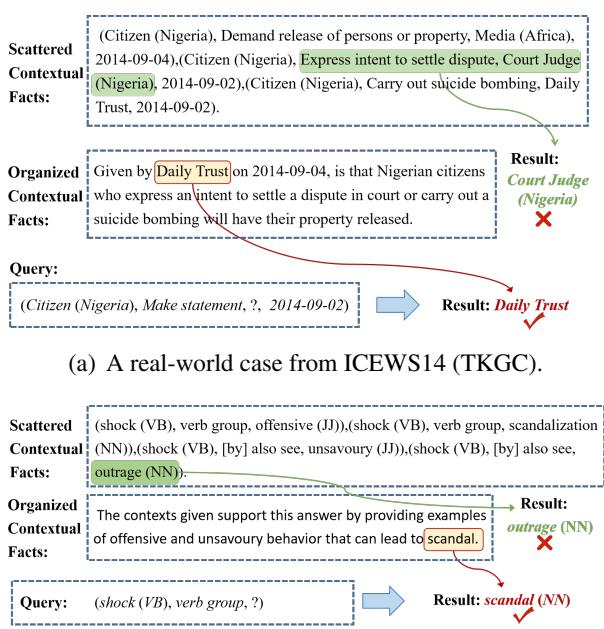  
(b) A real-world case from WN18RR (SKGC).  
Figure 3: Cases of TKGC and SKGC, inferred through organized contextual facts.

The real-world case studies in Figure 3 demonstrate COSIGN’s information organization capability through two types of KGC. Taking TKGC as an example, given a query (Citizen (Nigeria), Make statement, ?, 2014-09-02), through the collector, scattered contextual facts, i.e., facts lacking strong internal logical connections, are obtained. The reason for inference failure using it is that the inference model may perceive Make statement and Express intent to settle dispute as more similar, leading to incorrect results, such as Court Judge (Nigeria). When the organizer further refines the scattered contextual facts into logically connected contextual facts, the inference model gains a better understanding that the key supporting point for the background is Daily Trust, thereby enhancing the performance of the inference model.

## 5.5 Model Analysis

We conducted a detailed analysis of the effectiveness of COSIGN in terms of model component performance, hyperparameter settings, and runtime efficiency.

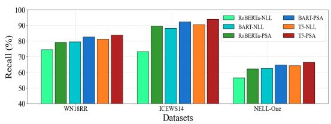  
(a) Results of the collector.

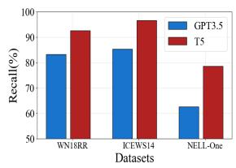  
(b) Results of the organizer.

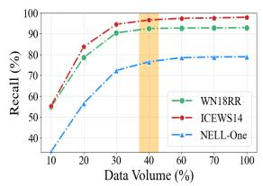  
(c) Distillation effectiveness.

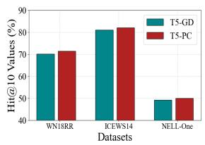

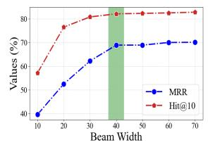  
(d) Prefix constraints.  
(e) Beam search (ICEWS14).  
Figure 4: The effects of COSIGN. "-PSA" indicates the training method using positive-set confidence advantage, while "-NLL" denotes the training method using typical negative log-likelihood. "-PC" refers to the results generated using prefix constraints, while "-GD" denotes the results generated directly.

Firstly, we chose two generative models, T5- base and BART-base (Lewis et al., 2019), as well as a classification model RoBERTa (Liu et al., 2019), to validate the effectiveness of our proposed positive set confidence. The results are illustrated in Figure 4(a). In comparison to typical training methods, our approach led to further improvements in the performance of three models, especially achieving an average recall increase of 4% on ICEWS14. Secondly, as indicated by Figure 4(b), in the absence of answer references, the distilled performance of T5 surpasses that of GPT3.5 (Wang et al., 2023). This improvement is attributed to the powerful organizational capabilities through the distillation process. Furthermore, based on Figure 4(c), it was observed that achieving performance close to optimal levels requires only about 40% of the training data volume. Thirdly, experimental results depicted in Figure 4(d) reveal that the inclusion of prefix constraints leads to an average improvement of 1.2%. Although the enhancement is modest, this simple calculation successfully constrains the rationality of the outcomes. Finally, we observed a stable trend starting from a beam width of 40, as illustrated in Figure 4(e).

## 6 Conclusion

In this paper, we propose a generative model, called COSIGN, for various KGC tasks. Different from previous methods, we do not directly use contextual facts to guide the model to infer missing facts. In contrast, we use the organizational ability of the LLM to transform the collected scattered contextual facts into coherent contextual facts, and use coherent contextual facts to guide the model to infer missing facts. Specifically, we designed a contextual facts collector to achieve human-like retrieval behavior. Then, a contextual facts organizer is proposed to learn the organized capabilities of LLMs through knowledge distillation. Finally, the organized contextual facts as the input of the inference generator to generate missing facts. Experimental results on five datasets for three types of KGC tasks highlight its significant performance.

## 7 Limitations

While COSIGN effectively leverages contextual facts to enhance the performance of the reasoning model, it fundamentally relies on the richness of the data. When the context in the data is too sparse, it significantly impacts the model’s performance. An ablation study conducted on the NELL-One dataset (Section 5.2 Few-shot experiments) also indicates that performance is greatly affected in situations of semantic sparsity in the data. in fact, it may even degrade fact verification performance. Addressing this, in the future, we intend to rely more on data that is both effective and covers a broader semantic context, thereby mitigating the performance fluctuations caused by semantic sparsity.

## 8 Ethics Statement

In this work, we aim to develop a contextual information retrieval system based on COSIGN, providing users with efficient and accurate retrieval results, including support for retrieving knowledge graphs of various types available on the internet. Our information retrieval system based on COSIGN is designed to assist users in automatically avoiding misleading information and mitigating risks associated with the propagation of misinformation. When COSIGN is misused for unconventional operations, it may lead to the widespread exploitation and dissemination of information, potentially causing social unrest. Given this concern, the responsible development of information retrieval systems is crucial to mitigate the risks of information leakage and maintain the integrity of information dissemination.

## Acknowledgements

This work was supported by National Natural Science Foundation of China Youth Fund (No.62302287), the National Key Research and Development Program of China (2021YFC3300602), and the Shanghai Committee of Science and Technology, China (Grant No.23ZR1423500).

## References

Yushi Bai, Xin Lv, Juanzi Li, Lei Hou, Yincen Qu, Zelin Dai, and Feiyu Xiong. 2022. Squire: A sequence-tosequence framework for multi-hop knowledge graph reasoning. In Proceedings ofthe 2022 Conference on Empirical Methods in Natural Language Processing, pages 1649–1662.

Antoine Bordes, Nicolas Usunier, Alberto Garcia-Duran, Jason Weston, and Oksana Yakhnenko. 2013. Translating embeddings for modeling multirelational data. Advances in neural information processing systems, 26.

Nathan Brown, Ashton Williamson, Tahj Anderson, and Logan Lawrence. 2023. Efficient transformer knowledge distillation: A performance review. arXiv preprint arXiv:2311.13657.

Erik Cambria, Qian Liu, Sergio Decherchi, Frank Xing, and Kenneth Kwok. 2022. Senticnet 7: A commonsense-based neurosymbolic AI framework for explainable sentiment analysis. In Proceedings of the Thirteenth Language Resources and Evaluation Conference, LREC, pages 3829–3839.

Chen Chen, Yufei Wang, Bing Li, and Kwok-Yan Lam. 2022. Knowledge is flat: A seq2seq generative framework for various knowledge graph completion. In Proceedings of the 29th International Conference on Computational Linguistics, pages 4005–4017.

Mingyang Chen, Wen Zhang, Wei Zhang, Qiang Chen, and Huajun Chen. 2019. Meta relational learning for few-shot link prediction in knowledge graphs. In Proceedings of the 2019 Conference on Empirical Methods in Natural Language Processing and the 9th International Joint Conference on Natural Language Processing (EMNLP-IJCNLP), pages 4217–4226.

Ganqu Cui, Shengding Hu, Ning Ding, Longtao Huang, and Zhiyuan Liu. 2022. Prototypical verbalizer for prompt-based few-shot tuning. In Proceedings of the 60th Annual Meeting of the Association for Computational Linguistics, pages 7014–7024.

Shib Sankar Dasgupta, Swayambhu Nath Ray, and Partha Talukdar. 2018. Hyte: Hyperplane-based temporally aware knowledge graph embedding. In Proceedings of the conference on empirical methods in natural language processing, pages 2001–2011.

Tim Dettmers, Pasquale Minervini, Pontus Stenetorp, and Sebastian Riedel. 2018. Convolutional 2d knowledge graph embeddings. In Proceedings of the AAAI conference on artificial intelligence, volume 32.

Zifeng Ding, Yunpu Ma, Bailan He, Zhen Han, and Volker Tresp. 2022. A simple but powerful graph encoder for temporal knowledge graph completion. In NeurIPS 2022 Temporal Graph Learning Workshop.

Yuxiao Dong, Nitesh V Chawla, and Ananthram Swami. 2017. metapath2vec: Scalable representation learning for heterogeneous networks. In Proceedings of the 23rd ACM SIGKDD international conference on knowledge discovery and data mining, pages 135– 144.

Yifu Gao, Yongquan He, Zhigang Kan, Yi Han, Linbo Qiao, and Dongsheng Li. 2023. Learning joint structural and temporal contextualized knowledge embeddings for temporal knowledge graph completion. In Findings ofthe Associationfor Computational Linguistics (ACL), pages 417–430.

Alberto Garcia-Duran, Sebastijan Dumanciˇ c, and Math-´ ias Niepert. 2018. Learning sequence encoders for temporal knowledge graph completion. In Proceedings ofthe 2018 Conference on Empirical Methods in Natural Language Processing, pages 4816–4821.

Rishab Goel, Seyed Mehran Kazemi, Marcus Brubaker, and Pascal Poupart. 2020. Diachronic embedding for temporal knowledge graph completion. In Proceedings ofthe AAAI conference on artificial intelligence, volume 34, pages 3988–3995.

Aric Hagberg, Pieter Swart, and Daniel S Chult. 2008. Exploring network structure, dynamics, and function using networkx. Technical report, Los Alamos National Lab.(LANL), Los Alamos, NM (United States).

Zhen Han, Gengyuan Zhang, Yunpu Ma, and Volker Tresp. 2021. Time-dependent entity embedding is not all you need: A re-evaluation of temporal knowledge graph completion models under a unified framework. In Proceedings of the 2021 Conference on Empirical Methods in Natural Language Processing, pages 8104–8118.

Cheng-Yu Hsieh, Chun-Liang Li, Chih-Kuan Yeh, Hootan Nakhost, Yasuhisa Fujii, Alexander Ratner, Ranjay Krishna, Chen-Yu Lee, and Tomas Pfister. 2023. Distilling step-by-step! outperforming larger language models with less training data and smaller model sizes. arXiv e-prints, pages arXiv–2305.

Shaoxiong Ji, Shirui Pan, Erik Cambria, Pekka Marttinen, and S Yu Philip. 2021. A survey on knowledge graphs: Representation, acquisition, and applications.

IEEE transactions on neural networks and learning systems, 33(2):494–514.

Piotr Jurkiewicz, Edyta Biernacka, Jerzy Domzał, and ˙ Robert Wójcik. 2021. Empirical time complexity of generic dijkstra algorithm. In 2021 IFIP/IEEE International Symposium on Integrated Network Management (IM), pages 594–598.

Bosung Kim, Taesuk Hong, Youngjoong Ko, and Jungyun Seo. 2020. Multi-task learning for knowledge graph completion with pre-trained language models. In Proceedings of the 28th International Conference on Computational Linguistics, pages 1737–1743.

Jiho Kim, Yeonsu Kwon, Yohan Jo, and Edward Choi. 2023. Kg-gpt: A general framework for reasoning on knowledge graphs using large language models. In Findings of the Association for Computational Linguistics: EMNLP 2023, pages 9410–9421.

Timothée Lacroix, Guillaume Obozinski, and Nicolas Usunier. 2019. Tensor decompositions for temporal knowledge base completion. In International Conference on Learning Representations.

Julien Leblay and Melisachew Wudage Chekol. 2018. Deriving validity time in knowledge graph. In Companion Proceedings of the The Web Conference, pages 1771–1776.

Mike Lewis, Yinhan Liu, Naman Goyal, Marjan Ghazvininejad, Abdelrahman Mohamed, Omer Levy, Ves Stoyanov, and Luke Zettlemoyer. 2019. Bart: Denoising sequence-to-sequence pre-training for natural language generation, translation, and comprehension. arXiv preprint arXiv:1910.13461.

Jinpeng Li, Hang Yu, Zhenyu Zhang, Xiangfeng Luo, and Shaorong Xie. 2024. Concept drift adaptation by exploiting drift type. ACM Transactions on Knowledge Discovery from Data, 18(4):1–22.

Zixuan Li, Xiaolong Jin, Saiping Guan, Wei Li, Jiafeng Guo, Yuanzhuo Wang, and Xueqi Cheng. 2021. Search from history and reason for future: Two-stage reasoning on temporal knowledge graphs. In Proceedings of the 59th Annual Meeting of the Association for Computational Linguistics and the 11th International Joint Conference on Natural Language Processing, pages 4732–4743.

Yinhan Liu, Myle Ott, Naman Goyal, Jingfei Du, Mandar Joshi, Danqi Chen, Omer Levy, Mike Lewis, Luke Zettlemoyer, and Veselin Stoyanov. 2019. Roberta: A robustly optimized bert pretraining approach. arXiv preprint arXiv:1907.11692.

Xin Lv, Yankai Lin, Yixin Cao, Lei Hou, Juanzi Li, Zhiyuan Liu, Peng Li, and Jie Zhou. 2022. Do pretrained models benefit knowledge graph completion? a reliable evaluation and a reasonable approach.

Guanglin Niu and Bo Li. 2023. Logic and commonsense-guided temporal knowledge graph completion. In Proceedings ofthe AAAI Conference on Artificial Intelligence, volume 37, pages 4569– 4577.

Guanglin Niu, Yang Li, Chengguang Tang, Ruiying Geng, Jian Dai, Qiao Liu, Hao Wang, Jian Sun, Fei Huang, and Luo Si. 2021. Relational learning with gated and attentive neighbor aggregator for few-shot knowledge graph completion. In Proceedings of the 44th International ACM SIGIR conference on research and development in information retrieval, pages 213–222.

Adam Paszke, Sam Gross, Francisco Massa, Adam Lerer, James Bradbury, Gregory Chanan, Trevor Killeen, Zeming Lin, Natalia Gimelshein, Luca Antiga, et al. 2019. Pytorch: an imperative style, high-performance deep learning library. In Proceedings ofthe 33rd International Conference on Neural Information Processing Systems, pages 8026–8037.

Colin Raffel, Noam Shazeer, Adam Roberts, Katherine Lee, Sharan Narang, Michael Matena, Yanqi Zhou, Wei Li, and Peter J Liu. 2020. Exploring the limits of transfer learning with a unified text-to-text transformer. The Journal of Machine Learning Research, 21(1):5485–5551.

Apoorv Saxena, Adrian Kochsiek, and Rainer Gemulla. 2022. Sequence-to-sequence knowledge graph completion and question answering. In Proceedings of the 60th Annual Meeting of the Association for Computational Linguistics, pages 2814–2828.

Michael Schlichtkrull, Thomas N Kipf, Peter Bloem, Rianne Van Den Berg, Ivan Titov, and Max Welling. 2018. Modeling relational data with graph convolutional networks. In The Semantic Web: 15th International Conference, ESWC, pages 593–607.

Zhiqing Sun, Zhi-Hong Deng, Jian-Yun Nie, and Jian Tang. 2018. Rotate: Knowledge graph embedding by relational rotation in complex space. In International Conference on Learning Representations.

Zhiqing Sun, Shikhar Vashishth, Soumya Sanyal, Partha Talukdar, and Yiming Yang. 2019. A re-evaluation of knowledge graph completion methods. arXiv preprint arXiv:1911.03903.

Shunsuke Takeno, Masaaki Nagata, and Kazuhide Yamamoto. 2017. Controlling target features in neural machine translation via prefix constraints. In Proceedings ofthe 4th Workshop on Asian Translation (WAT2017), pages 55–63.

Kristina Toutanova and Danqi Chen. 2015. Observed versus latent features for knowledge base and text inference. In Proceedings of the 3rd workshop on continuous vector space models and their compositionality, pages 57–66.

Théo Trouillon, Johannes Welbl, Sebastian Riedel, Éric Gaussier, and Guillaume Bouchard. 2016. Complex

embeddings for simple link prediction. In International conference on machine learning, pages 2071– 2080.

Bo Wang, Tao Shen, Guodong Long, Tianyi Zhou, Ying Wang, and Yi Chang. 2021. Structure-augmented text representation learning for efficient knowledge graph completion. In Proceedings ofthe Web Conference 2021, pages 1737–1748.

Hongwei Wang and Dong Yu. 2023. Going beyond sentence embeddings: A token-level matching algorithm for calculating semantic textual similarity. In Proceedings ofthe 61st Annual Meeting ofthe Associationfor Computational Linguistics, pages 563–570.

Liang Wang, Wei Zhao, Zhuoyu Wei, and Jingming Liu. 2022. Simkgc: Simple contrastive knowledge graph completion with pre-trained language models. In Proceedings of the 60th Annual Meeting of the Associationfor Computational Linguistics, pages 4281–4294.

Xiaofei Wang, Hayley M Sanders, Yuchen Liu, Kennarey Seang, Bach Xuan Tran, Atanas G Atanasov, Yue Qiu, Shenglan Tang, Josip Car, Ya Xing Wang, et al. 2023. Chatgpt: promise and challenges for deployment in low-and middle-income countries. The Lancet Regional Health–Western Pacific, 41.

Xiao Wei, Jianbao Huang, Hang Yu, and Qian Liu. 2023. Ptcspell: Pre-trained corrector based on character shape and pinyin for chinese spelling correction. In Findings ofthe Associationfor Computational Linguistics: ACL 2023, pages 6330–6343.

Thomas Wolf, Lysandre Debut, Victor Sanh, Julien Chaumond, Clement Delangue, Anthony Moi, Pierric Cistac, Tim Rault, Remi Louf, Morgan Funtowicz, et al. 2020. Transformers: State-of-the-art natural language processing. In Proceedings of the 2020 Conference on Empirical Methods in Natural Language Processing: System Demonstrations.

Xin Xie, Ningyu Zhang, Zhoubo Li, Shumin Deng, Hui Chen, Feiyu Xiong, Mosha Chen, and Huajun Chen. 2022. From discrimination to generation: Knowledge graph completion with generative transformer. In Companion Proceedings of the Web Conference 2022, pages 162–165.

Wenhan Xiong, Mo Yu, Shiyu Chang, Xiaoxiao Guo, and William Yang Wang. 2018. One-shot relational learning for knowledge graphs. In Conference on Empirical Methods in Natural Language Processing.

Chengjin Xu, Yung-Yu Chen, Mojtaba Nayyeri, and Jens Lehmann. 2021. Temporal knowledge graph completion using a linear temporal regularizer and multivector embeddings. In Proceedings of the Conference of the North American Chapter of the Associationfor Computational Linguistics: Human Language Technologies, pages 2569–2578.

Chengjin Xu, Mojtaba Nayyeri, Fouad Alkhoury, Hamed Shariat Yazdi, and Jens Lehmann. 2020a. Tero: A time-aware knowledge graph embedding via temporal rotation. In Proceedings of the 28th International Conference on Computational Linguistics, pages 1583–1593.

Chenjin Xu, Mojtaba Nayyeri, Fouad Alkhoury, Hamed Yazdi, and Jens Lehmann. 2020b. Temporal knowledge graph completion based on time series gaussian embedding. In The Semantic Web–ISWC: 19th International Semantic Web Conference, pages 654–671.

Bishan Yang, Wen-tau Yih, Xiaodong He, Jianfeng Gao, and Li Deng. 2014. Embedding entities and relations for learning and inference in knowledge bases. arXiv preprint arXiv:1412.6575.

Chengrun Yang, Xuezhi Wang, Yifeng Lu, Hanxiao Liu, Quoc V Le, Denny Zhou, and Xinyun Chen. 2023. Large language models as optimizers. arXiv e-prints, pages arXiv–2309.

Liang Yao, Chengsheng Mao, and Yuan Luo. 2019. Kgbert: Bert for knowledge graph completion. arXiv e-prints, pages arXiv–1909.

Hongbin Ye, Ningyu Zhang, Hui Chen, and Huajun Chen. 2022. Generative knowledge graph construction: A review. In Proceedings of the 2022 Conference on Empirical Methods in Natural Language Processing, pages 1–17.

Hang Yu, Jinpeng Li, Jie Lu, Yiliao Song, Shaorong Xie, and Guangquan Zhang. 2023. Type-ldd: A typedriven lite concept drift detector for data streams. IEEE Transactions on Knowledge and Data Engineering.

Hang Yu, Ruilin Li, Shaorong Xie, and Jiayan Qiu. 2024a. Shadow-enlightened image outpainting. In Proceedings ofthe IEEE/CVF Conference on Computer Vision and Pattern Recognition (CVPR).

Hang Yu, Zhengyang Liu, and Xiangfeng Luo. 2024b. Barely supervised learning for graph-based fraud detection. In Proceedings of the AAAI Conference on Artificial Intelligence, volume 38, pages 16548– 16557.

Hang Yu, Jie Lu, Anjin Liu, Bin Wang, Ruimin Li, and Guangquan Zhang. 2022a. Real-time prediction system of train carriage load based on multi-stream fuzzy learning. IEEE Transactions on Intelligent Transportation Systems, 23(9):15155–15165.

Hang Yu, Jie Lu, and Guangquan Zhang. 2022b. Continuous support vector regression for nonstationary streaming data. IEEE transactions on cybernetics, 52(5):3592–3605.

Xuanmeng Zhang, Minyue Jiang, Zhedong Zheng, Xiao Tan, Errui Ding, and Yi Yang. 2020. Understanding image retrieval re-ranking: A graph neural network perspective. arXiv preprint arXiv:2012.07620.

Zhedong Zheng, Xiaohan Wang, Nenggan Zheng, and Yi Yang. 2022. Parameter-efficient person reidentification in the 3d space. IEEE Transactions on Neural Networks and Learning Systems.

Yongchao Zhou, Andrei Ioan Muresanu, Ziwen Han, Keiran Paster, Silviu Pitis, Harris Chan, and Jimmy Ba. 2022. Large language models are human-level prompt engineers. arXiv preprint arXiv:2211.01910.

## A Inplementation Details of the COSGIN

We analyze the details of COSGIN in terms of graph construction, hyperparameter settings, and runtime efficiency.

## A.1 Graph Construction

We use the networkx package (Hagberg et al., 2008) for creating, manipulating, and storing graphs, primarily involving the design of static and temporal graph types. For static graphs, they are inherently triple structures $( s _ { i } , r _ { j } , o _ { i } ) \ \in \mathcal { F } _ { : }$ thus easily recognized by networkx. However, for temporal graphs, being quadruple structures $( s _ { i } , r _ { j } , o _ { i } , m _ { t } ) \in \mathcal { F }$ , they cannot be directly loaded by networkx. Therefore, we establish entitytime pairs, combining entities with the occurrence time to form a new representation, for example: $\left( { { s _ { i } } - { m _ { t } } , { r _ { j } } , { o _ { i } } - { m _ { t } } } \right)$ . Here, we introduce selfconnected edges $\hat { r }$ to enable the interconnection of information across different time points, for instance: $\left( s _ { i } - m _ { t } , \hat { r } , o _ { i } - m _ { < t } \right)$

For the process of reverse inference, we achieve reverse prediction of the model by constructing the reverse relation $r ^ { - 1 }$ , i.e., based on $\left( ? , r ^ { - 1 } , o , m \right)$ Each $r ^ { - 1 }$ is an added extension of r in semantic space, as detailed below:

$$
r _ { i } ^ { - 1 } = r _ { i } + \left| \mathcal { R } \right| , r _ { i } \in \mathcal { R }\tag{10}
$$

To make it easier for the generative model to distinguish between $r _ { i } ^ { - 1 }$ and $r _ { i }$ , we add a [by] tag to $r _ { i }$ as the mapping text for $r _ { i } ^ { - 1 }$ , for example: $r _ { i } { = } " \mathrm { A c c u s e " } , r _ { i } ^ { - 1 } { = } " [ \mathbf { b y } ]$ Accuse".

## A.2 Hyperparameter setting

In our experiments, Throughout the entire training process, the model is optimized using the ADAM function. We set the learning parameters for the contextual facts collector, the contextual facts organizer, and the contextual facts generator respectively, to better adapt to the size and distribution of the dataset.

In terms of contextual facts collector, we set the epoch and batch size to 50, 64 respectively, learning rate to $\{ 1 e - 3 , 2 e - 4 \}$ , input and output length to 60, 20 respectively. In terms of contextualfacts summarizer, we set the epoch and batch size to 30, 24 respectively, learning rate to 1e 3, input length to 300, 360 , output length to 200. In terms of contextualfacts generator, we set the epoch and batch size to 50, 64 respectively, learning rate to 2e  4, 5e  4 , input length to 350, 420 , output length to 50. The optimal configurations for the collector, summarizer and the generator are presented in Table 7.

<table><tr><td>Parameters</td><td>WN18RR</td><td>FB15K-237</td><td>ICEWS14</td><td>NELL-One</td></tr><tr><td rowspan="5">Epoch Genrrtor</td><td>60</td><td>60</td><td>60</td><td>60</td></tr><tr><td>Batch_Size 32</td><td>32</td><td>32</td><td>32</td></tr><tr><td>Learning_Rate</td><td>5e-4 2e-4</td><td>2e-4</td><td>5e-4</td></tr><tr><td>Input_Length</td><td>350 350</td><td>420</td><td>350</td></tr><tr><td>Output_Length 50</td><td>50</td><td>50</td><td>50</td></tr><tr><td rowspan="5">Ornzer</td><td>Epoch</td><td>30</td><td>30</td><td>30</td><td>30</td></tr><tr><td>Batch_Size</td><td>24</td><td>24</td><td>24</td><td>24</td></tr><tr><td>Learning_Rate</td><td>1e-3</td><td>1e-3</td><td>1e-3</td><td>1e-3</td></tr><tr><td>Input_Length</td><td>300</td><td>300</td><td>360</td><td>300</td></tr><tr><td>Output_Length</td><td>200</td><td>200</td><td>200</td><td>200</td></tr><tr><td rowspan="5">COolItor</td><td>Epoch</td><td>50</td><td>50</td><td>50</td><td>50</td></tr><tr><td>Batch_Size</td><td>64</td><td>64</td><td>64</td><td>64</td></tr><tr><td>Learning_Rate</td><td>1e-3</td><td>2e-4</td><td>2e-4</td><td>1e-3</td></tr><tr><td>Input_Length</td><td>60</td><td>60</td><td>60</td><td>60</td></tr><tr><td>Output_Length</td><td>20</td><td>20</td><td>20</td><td>20</td></tr></table>

Table 7: The model parameters of each component in COSIGN.

We evaluated the impact of the margin value λ on the performance of the contextual facts collector, using recall as the evaluation metric, as shown in Figure 5. Generally, as the margin value λ increases, the model’s performance gradually improves. However, when reaching a certain point, the performance reaches its optimal level, or even may decrease. We found that for relatively sparse datasets WN18RR and NELL-One, larger margin values are needed, set at 25 and 20 respectively. This also indicates that their internal semantic distributions are not distinct, and further relaxing the constraints of similarity can improve fault tolerance. For relatively dense datasets FB15K-237 and ICEWS14, only smaller margin values (λ=15) are required to achieve optimal performance for the model, as their internal semantic distinctions are relatively clear.

For the subgraph pruning threshold l, it directly affects the results of the contextual facts collector. We use recall rate as the metric to evaluate the optimal l, as shown in Figure 6. It’s noteworthy that as l increases, the recall rate of correctly included candidates in the subgraph also increases. We observed that when l is set to 3, the recall rates for all datasets exceed 80%, which is considered sufficient for inference, and the memory resources occupied are also acceptable (with the maximum storage requirement for FB15K-237 being 782MB). Although setting l to 4 leads to a further increase in the recall rate, the corresponding storage resource exhibits exponential growth, with a maximum occupation of 1728MB for FB15K-237. In order to achieve an effective balance between recall rate and storage resources, in actual experiments, we set l to 3.

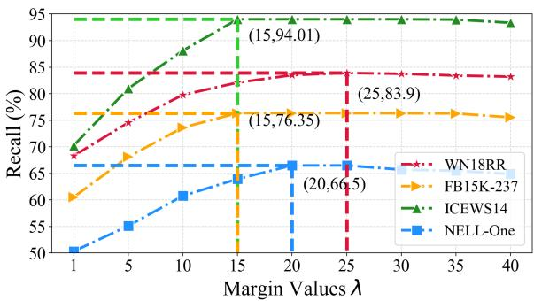

Figure 5: The effects of margin values.  
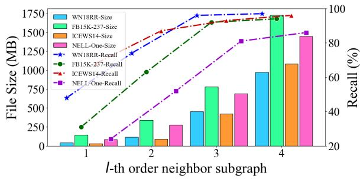  
Figure 6: The effects of sampling.

## A.3 Runtime Efficiency Analysis

To test the efficiency of COSIGN, we conducted experiments on the WN18RR, FB15K-237, ICEWS14, and NELL-One datasets, as shown in Figure 7. Due to the inherently higher computational cost of generative methods compared to conventional models, it is not feasible to directly compare their efficiency. Therefore, we only provide comparative results with recent generative model KG-S2S. While COSIGN has additional modules for collecting and summarizing contextual information compared to KG-S2S, surprisingly, its runtime efficiency is not significantly different from KG-S2S, with only a marginal increase in average runtime by 149ms. However, under the condition of sacrificing acceptable runtime efficiency, COSIGN’s hit@1 performance is on average improved by 7.18% compared to KG-S2S.

<table><tr><td rowspan=1 colspan=1></td><td rowspan=1 colspan=1>Prompt Template</td><td rowspan=1 colspan=1>WN18RR</td><td rowspan=1 colspan=1>ICEWS14</td></tr><tr><td rowspan=1 colspan=1>1</td><td rowspan=1 colspan=1>Given the query $( s _ { q } , r _ { q } , ? , m _ { q } )$ and answer (o), please help me summarizethe relevant information from the following context that can be used to inferthe answer.The context you can refer to is: SCFs.</td><td rowspan=1 colspan=1>0.88</td><td rowspan=1 colspan=1>0.92</td></tr><tr><td rowspan=1 colspan=1>2</td><td rowspan=1 colspan=1>Given the query $( s _ { q } , r _ { q } , ? , m _ { q } ) .$ please help me summarize the relevantinformation from the following context.The context you can refer to is: SCFs.</td><td rowspan=1 colspan=1>0.70</td><td rowspan=1 colspan=1>0.63</td></tr><tr><td rowspan=1 colspan=1>3</td><td rowspan=1 colspan=1>Your task is to summarize the information relevant to the answer from thegiven context using concise and coherent language.I have a question $( s _ { q } , r _ { q } , ? , m _ { q } )$ , an answer (o), and a series of contexts:SCFs.</td><td rowspan=1 colspan=1>0.91</td><td rowspan=1 colspan=1>0.95</td></tr><tr><td rowspan=1 colspan=1>4</td><td rowspan=1 colspan=1>Your task is to summarize the information relevant to the question from thegiven context using concise and coherent language.I have a question $( s _ { q } , r _ { q } , ? , m _ { q } )$ , and a series of contexts: SCFs.</td><td rowspan=1 colspan=1>0.73</td><td rowspan=1 colspan=1>0.65</td></tr><tr><td rowspan=1 colspan=1>5</td><td rowspan=1 colspan=1>I have a question $( s _ { q } , r _ { q } , ? , m _ { q } )$ , an answer (o), and a series of contexts:SCFs.Please help me summarize the information relevant to the inference answer.</td><td rowspan=1 colspan=1>0.85</td><td rowspan=1 colspan=1>0.87</td></tr><tr><td rowspan=1 colspan=1>6</td><td rowspan=1 colspan=1>I have a question $( s _ { q } , r _ { q } , ? , m _ { q } )$ and a series of contexts: SCFs.Please help me summarize the information relevant to the question</td><td rowspan=1 colspan=1>0.67</td><td rowspan=1 colspan=1>0.62</td></tr></table>

Table 8: Prompt template used in GPT3.5 distillation process. It is worth noting that SCFs are a series of context facts. The best-performing prompt results are in bold.

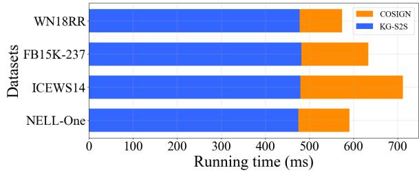  
Figure 7: The running average times of COSIGN.

## B LLM Prompt Design

During the distillation process, it is necessary to elicit the internal logic of GPT3.5 through prompts. Therefore, we designed different prompt templates and evaluated their effectiveness on the WN18RR and ICEWS14 datasets using the metric recall rate, as shown in Table 8. For each dataset, we randomly sample 500 test set examples for evaluation. We divided each type of template into two groups, one with answers and one without. Generally, adding answers gives purpose to the information summarization by GPT3.5, thus yielding better results. At the same time, we found that providing explicit tasks and constraints for GPT3.5 from the outset (as in prompt templates 3 and 4) is useful because such instructions clarify the user’s intent.

For the non-trained mode of the generator, we designed a prompt to combine queries with context and let GPT3.5 complete confidence scoring for candidate entities, as shown below:

Given an incomplete tuple (s, r, [MASK], m), now you will help me complete the entity [MASK] and make the tuple complete.

I have a candidate entity set and a contextual text available for your reference.

Candidate entity set: ES. Contextual text: CT.

Please output the confidence scores for each candidate entity, which ranges from 0 to 1. The output format should be: entity1:score1, entity2:score2,...,entityn:scoren.

where ES represents the collection of all entities obtained through the contextual facts collector, while CT denotes the results obtained from the contextual facts organizer. When GPT3.5 outputs confidence scores for each candidate entity, we sort the candidates based on confidence scores and evaluate the results using MRR and Hit@n.