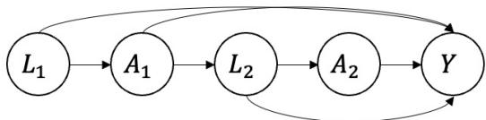
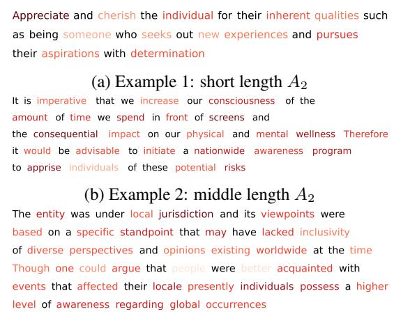
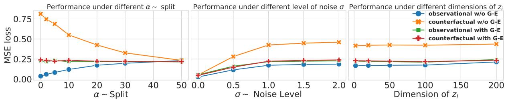

# Causal Inference for Human-Language Model Collaboration

Bohan Zhang University of Michigan Ann Arbor, MI, USA zbohan@umich.edu

Yixin Wang University of Michigan Ann Arbor, MI, USA yixinw@umich.edu

Paramveer S. Dhillon University of Michigan Ann Arbor, MI, USA dhillonp@umich.edu

## Abstract

In this paper, we examine the collaborative dynamics between humans and language models (LMs), where the interactions typically involve LMs proposing text segments and humans edit ing or responding to these proposals. Produc tive engagement with LMs in such scenarios necessitates that humans discern effective text based interaction strategies, such as editing and response styles, from historical human-LM interactions. This objective is inherently causal, driven by the counterfactual ‘what-if’ question: how would the outcome of collaboration change if humans employed a different text editing/refinement strategy? A key challenge in answering this causal inference question is for mulating an appropriate causal estimand: the conventional average treatment effect (ATE) estimand is inapplicable to text-based treat ments due to their high dimensionality. To address this concern, we introduce a new causal estimand—Incremental Stylistic Effect (ISE), which characterizes the average impact of infinitesimally shifting a text towards a specific style, such as increasing formality. We establish the conditions for the non-parametric identification of ISE. Building on this, we develop CausalCollab, an algorithm designed to estimate the ISE of various interaction strategies in dynamic human-LM collaborations. Our empirical investigations across three distinct human-LM collaboration scenarios reveal that CausalCollab effectively reduces confounding and significantly improves counterfactual estimation over a set of competitive baselines.

## 1 Introduction

Dialog agents like ChatGPT and Claude, built on Pretrained Language Models (LMs), have significantly transformed the landscape of text generation, showcasing extraordinary performance improvements across a wide range of tasks (Brown et al., 2020; OpenAI, 2023; Chowdhery et al., 2023). This shift has heralded a new era in interaction design, particularly in dialog systems. As illustrated in Figure 1, these systems are designed for interactive human collaboration, involving sequential actions such as editing, rephrasing, or revising text (Lee et al., 2022). This innovative design has empowered users to augment their own capabilities in various fields, including data analysis, customer support, and social media strategy formulation (Brynjolfsson et al., 2023; Noy and Zhang, 2023; Epstein et al., 2023). Consequently, it has become crucial for users to learn how to adeptly collaborate with these LMs to fully harness their potential. This paper investigates how users can optimize their collaboration with LMs by drawing on insightsfrom historical human-LM interactions. We primarily seek to identify effective collaboration strategies from past dialogues, with the goal of enhancing the synergy between human intuition and machine intelligence in these sophisticated dialog systems.

Improving human-LM collaboration by having humans learn from past human-LM interactions is an inherently causal problem. Applying editing strategies from past successful collaborations may not always be effective, since the success of these strategies could be confounded by specific prompt setups. For instance, editing strategies such as “increasing the level of politeness in the generated text” may prove beneficial when collaborating on customer support responses, as it helps to build rapport and maintain a positive relationship with the customer. However, the same strategy may not be as effective when working on a scientific research paper, where a neutral and objective tone is often preferred to convey the findings accurately. Similarly, “adjusting the text to use more confident language” may be advantageous when crafting persuasive arguments in an editorial piece, but it could be less appropriate when generating content for a balanced news article, where impartiality is key.

These examples illustrate how editing strategies (increasing politeness and adjusting language confidence) can have varying levels of effectiveness depending on the specific collaboration context (customer support, scientific writing, editorials, and news articles). They underscore the importance of understanding the causal impact of such strategies across different situations to determine their overall usefulness in enhancing human-LM collaboration and bring us to the key counterfactual question: How would the collaboration outcome change if we implemented an alternative text editing strategy?1 Answering such questions will provide insights into editing strategies that reliably improve human-LM collaboration versus those that only work in certain situational contexts.

  
Figure 1: An interactive view of human-LM Collaborative Writing. The writer iteratively selected and rewrote suggestions from the LM to make the article have a better outcome.

This causal inference problem, however, is challenging since it is unclear what constitutes a suitable causal estimand for human-LM collaboration. The traditional causal estimand, Average Treatment Effect (ATE) (Imbens and Rubin, 2015), faces limitations in this context due to the high-dimensional nature of text-based treatments, which violate the “positivity” assumption. Positivity requires that all possible word sequences occur with non-zero probability in all editing strategies. This condition is readily met in binary treatment situations, where treatments are categorized as either ‘treated’ or ‘control.’ However, it becomes problematic for textbased treatments. Numerous word sequences either fail to form coherent sentences or are implausible as human edits, resulting in some configurations having a zero probability of occurring. Hence, the question arises: What is an appropriate causal estimand for human-LM collaboration? This causal estimand must account for the distinctive characteristics of text as a treatment, particularly its high-dimensional and non-binary nature.

In this paper, we propose a novel causal estimand for human-LM collaboration—Incremental Stylistic Effect (ISE). ISE is based on the key insight that instead of focusing on the effect of specific edits (e.g., insertion/deletion/rephrasing of words) as effective collaboration (text refinement) strategies, we should instead focus on the implications of these edits on text style. For instance, consider a financial analyst collaborating with an LM to write a quarterly report for clients. Multiple edits could make the writing more formal, e.g., removing contractions (‘can’t’ ‘cannot’) or replacing phrasal verbs with more precise terms. In this case, the ISE of “formalizing” text would measure the cumulative incremental effect of systematically enhancing formality through any such edits. If the analyst finds that increasing formality improves client evaluations (outcome), they learn that a more formal writing style is effective and can implement appropriate edits in future reports to increase formality (the exact wording changes don’t matter). ISE is also more practical to communicate and is actionable. Instead of recommending specific edits, which may not always be applicable, it advises users on broader stylistic changes that are likely to enhance collaboration outcomes. Finally, the universal applicability of these stylistic changes meets the positivity condition in causal inference, as there is always the possibility to make any text more formal (in our stylized example).

Next, we present an algorithm CausalCollab, to evaluate the effectiveness of human-LM collaboration strategies over time, using the Incremental Stylistic Effect (ISE) as its guiding estimand. This algorithm operates by identifying and analyzing prevalent stylistic changes in past human-LM interactions. It then evaluates the impact of these changes in various dynamic human-LM collaboration contexts. Our empirical studies, encompassing three distinct scenarios of human-LM collaboration, demonstrate that CausalCollab is effective in mitigating confounding factors and enhancing counterfactual estimation and provides valuable insights for humans to improve their collaboration strategies with LMs.

Contributions: This paper makes the following contributions:

• Formalizing the problem of dynamic human-LM interaction as a causal inference problem.

• Introducing a novel causal estimand for human-LM collaboration—Incremental Stylistic Effect (ISE) which addresses the issues of highdimensionality for text-based treatments.

• Providing theory establishing identification conditions for ISE.

• Proposing a new algorithm called CausalCollab that employs ISE to effectively extract key editing strategies for human-LM collaborations.

• Thorough, empirical validation of CausalCollab on three datasets establishing its superior ability for counterfactual prediction.

## 2 Related Work:

Our work is related to two strands of prior work.

Human-LM Collaboration. Building on the foundational research in human-LM collaboration across text generation (Chakrabarty et al., 2022; Goldfarb-Tarrant et al., 2019), dialogue (Gabriel et al., 2019; Bonaldi et al., 2022), and summarization (Avinesh et al., 2018; Shapira et al., 2021), our work delves into optimizing human interaction strategies with LMs. We focus on understanding the causal impacts of various editing strategies, such as the editing strategies employed by systems like R3 (Du et al., 2022a) and CoAuthor (Lee et al., 2022). Our key contribution is the development of the Incremental Stylistic Effect (ISE) estimand (and the associated CausalCollab algorithm), which assesses the cumulative incremental effect of stylebased edits on collaboration outcomes. This novel approach guides how humans can adapt their collaboration methods with LMs more effectively, enhancing the synergy between human intuition and machine intelligence in complex tasks like those explored in TaleBrush (Chung et al., 2022) and Dramatron (Mirowski et al., 2023). By offering a framework for analyzing and optimizing human-LM interactions, we aim to improve both the practical application and theoretical understanding of these human-LM collaboration dynamics.

Causal Inferencefor Text: Our research is also situated within a rapidly evolving landscape of studies applying causal methods to language tasks, particularly in the context of human-LM collaborations. Influential works such as Veitch et al. (2020) have pioneered the use of text embeddings from LMs and topic modeling to address textual confounding, improving treatment effect estimation. This approach is further expanded by a series of studies (Egami et al., 2022; Roberts et al., 2020; Sridhar and Getoor, 2019; Pryzant et al., 2021), which propose learning latent representations of high-dimensional texts as confounders or treatments, utilizing topic modeling and Variational Autoencoders (VAEs). These studies highlight the importance of distilling low-dimensional latent representations for accurate treatment effect estimation from complex, high-dimensional data such as text (Louizos et al., 2017; Kim et al., 2021a).

Our work distinguishes from this line of work in addressing the dynamic nature of human-LM collaborations and proposing a novel causal estimand—Incremental Stylistic Effect (ISE) for this scenario. Further, unlike prior work, we employ a novel combination of G-estimation (Taubman et al., 2009; Naimi et al., 2014; Van der Laan et al., 2011; Petersen et al., 2012) and Conditional Variational Autoencoders (CVAE) for learning lowdimensional latent representations in a setup with time-varying textual treatments.

## 3 Causal Inference for Human-LM Collaboration

We begin with framing human-LM collaboration as a causal inference problem.

## 3.1 A causal perspective on Human-LM collaboration

We conceptualize the interaction between a human and a language model (LM) as a sequential series of human actions, each focused on optimizing task outcomes. In these iterative collaborations, humans consistently adjust the responses generated by LMs to attain the desired results. This approach is supported by various studies, including Xu et al. (2023); Bonaldi et al. (2022); Du et al. (2022b); Lee et al. (2023), which explore the nuances of human-LM interactions in achieving specific goals.

To establish our notation, we represent the refinement action (such as the post-refinement text) performed by user i at time t as $A _ { i t } ,$ , with $t = 1 \dots T$ Further, let’s denote $Y _ { i } ( a _ { 1 } , \dots , a _ { T } )$ as the outcome rating (like a quality score) of the text, assuming user i had executed the refinement $a _ { 1 }$ at time $t = 1$ $a _ { 2 }$ at time $t = 2 , \ldots$ , and $a _ { T }$ at time $t = T$ during their interactions with the LM. This outcome $Y _ { i } ( a _ { 1 } , \dots , a _ { T } )$ is conceptualized as a potential outcome or counterfactual outcome (Imbens and Rubin, 2015; Pearl, 2009; Hernán and Robins, 2010). In this context, the sequence of user refinements is regarded as the “treatment,” and the outcome rating of the text is the “outcome.” The potential outcome $Y _ { i } ( a _ { 1 } , \dots , a _ { T } )$ is observable only when user i actually performs these refinements, that is, when $A _ { i t } = a _ { t }$ for all $t = 1 , \dots , T$ . All other potential outcomes $Y _ { i } ( a _ { 1 } ^ { \prime } , \dots , a _ { T } ^ { \prime } )$ , where $a _ { t } ^ { \prime } \neq A _ { i t }$ are unobserved.

At each time step t, the refinement action $A _ { i t }$ by user i is typically in response to the output of the LM, denoted as $L _ { i t }$ . For instance, $L _ { i t }$ could be the LM’s suggestions for completing an unfinished essay at time t during the interaction with user i, while $A _ { i t }$ might involve selective editing, refinement, and rewriting by the human participant. This action $A _ { i t }$ then acts as a prompt for the LM’s subsequent response $L _ { i , t + 1 }$ at the following time step. The two-step process of human-LM collaboration can be visualized as a directed acyclic graph (DAG), as shown in Figure 2, with the user subscript i omitted for simplicity; this DAG can be readily extended to more than two steps. (A real-world example of our human-LM collaborative writing setup is shown in Figure 1.)

  
Figure 2: The causal graph of human-LM collaboration (T=2).

Our goal is to evaluate the impact of various user refinements on the final text outcome by examining a dataset comprising historical human-LM interactions. This dataset typically includes: (1) the sequence of actions performed by previous users, denoted as $\{ \{ A _ { i t } \} _ { i = 1 } ^ { I } \} _ { t = 1 } ^ { T } , ( 2 )$ the LM’s responses at each time step, represented by $\{ \{ L _ { i t } \} _ { i = 1 } ^ { I } \} _ { t = 1 } ^ { T }$ and (3) the observed outcomes, such as the quality scores of the texts, labeled as $\{ Y _ { i } \} _ { i = 1 } ^ { I }$ , for all the interactions $\begin{array} { r l r } { i } & { { } = } & { 1 \dots I . } \end{array}$ These observed outcomes are the potential outcomes for the actual action taken by the user, expressed as $Y _ { i } = Y _ { i } ( A _ { i 1 } , \dots , A _ { i T } )$

To evaluate the efficacy of user refinements, we are often interested in the causal estimand known as the average treatment effect (ATE) of a given action sequence $( a _ { 1 } , \ldots , a _ { T } )$ . This is mathematically represented as $\mathbb { E } \left[ Y _ { i } ( a _ { 1 } , \dots , a _ { T } ) - Y _ { i } ( a _ { 1 } ^ { \emptyset } , \dots , a _ { T } ) \right]$ where $a _ { 1 } , \dots , a _ { T }$ denotes the sequence of user actions. This expectation is calculated across users. The sequence $a _ { 1 } ^ { \scriptscriptstyle \emptyset } , \ldots , a _ { T } ^ { \scriptscriptstyle \emptyset }$ represents a baseline or ‘null’ action sequence, wherein the user does not perform any refinements.

## 3.2 The challenge of textual treatments in causal human-LM collaboration

The causal estimand of ATE can be identified using standard tools in dynamic treatment regimes when the treatment is binary. For example, when each user can only choose between two actions to execute at each time step, we can identify the ATE using the g-formula,

$$
\begin{array} { l } { { \mathbb { E } \left[ Y _ { i } ( a _ { 1 } , \dots , a _ { T } ) \right] = \displaystyle \int \mathbb { E } \left[ Y _ { i } | \bar { A } _ { i T } = \bar { a } _ { T } , \bar { L } _ { i T } = \bar { l } _ { T } \right] } } \\ { { \mathrm { } } } \\ { { \displaystyle \mathrm { } \mathrm { } \times \prod _ { t = 1 } ^ { T } P ( L _ { i t } = l _ { t } | \bar { A } _ { i , t - 1 } = \bar { a } _ { t - 1 } , \bar { L } _ { i , t - 1 } = \bar { l } _ { t - 1 } ) \mathrm { d } \bar { l } _ { T } , } } \end{array}
$$

where ${ \bar { A } } _ { i t } = A _ { i , 1 : t } , { \bar { a } } _ { t } = a _ { 1 : t } , { \bar { L } } _ { i t } = L _ { i , 1 : t }$ , and $\bar { l } _ { t } = l _ { 1 : t }$ (Hernán and Robins, 2010).

This g-formula for ATE requires two conditions: the sequential exchangeability condition and the positivity (a.k.a. overlap) condition. The sequential exchangeability condition roughly requires that $\bar { L } _ { i t } , \bar { A } _ { i , t - 1 }$ capture all confounders (variables that affect both $A _ { i t }$ and $Y _ { i } )$ at time t. This requirement is often satisfied in human-LM collaboration: the LM’s text response $\bar { L } _ { i t }$ and the previous actions $\bar { A } _ { i , t - 1 }$ are the only factors that affect both the outcome and the human’s actions (cf. Fig. 2).

The second positivity condition, however, is often violated in handling textual treatments in human-LM collaboration. The positivity condition loosely requires that all possible values of the actions $a _ { t }$ shall occur with nonzero probability given any confounder values $\bar { l } _ { t }$ . This condition is challenging to satisfy even when $T = 1$ ; the reason is that each $a _ { t }$ is a textual treatment—composed of a sequence of words—hence high-dimensional. It often violates the positivity condition in that many values of the treatment are not possible: a sequence of randomly chosen words likely occurs with zero probability as a human refinement strategy. This violation of positivity renders the ATE hard to identify in human-LM collaboration.

Moreover, the causal estimand involving the average treatment effect (ATE), represented as E $\left[ Y _ { i } ( a _ { 1 } , \dots , a _ { T } ) - Y _ { i } ( a _ { 1 } ^ { \emptyset } , \dots , a _ { T } ^ { \emptyset } ) \right]$ , holds limited practical significance for enhancing future human-LM interactions. Specifically, the treatment $a _ { t }$ usually refers to the post-refinement human text; for example, setting the text to “the prince proposed to the princess.” The ATE in this context quantifies the effect of this specific post-refinement text on the outcome, regardless of the context (like the LM’s preceding prompts or human responses). However, this ATE might not be practically useful since such text refinement cannot be universally applied across different human-LM collaboration scenarios. For instance, applying this edit is illogical when the initial LM prompt pertains to the animal world, rather than a story about a prince and princess. Consequently, the traditional causal estimand of ATE is unsuitable for causal inference in scenarios involving textual treatments.

## 3.3 Incremental Stylistic Effect (ISE): A causal estimand for textual treatments

Considering the limitations of the average treatment effect (ATE) in the context of textual treatments for human-LM collaboration, it becomes essential to ask: what is an appropriate causal estimand for these types of collaborations? We propose the causal estimand—incremental stylistic effect (ISE), which focuses on the impact of style change in human refinements, a concept we will define more formally later. Focusing on stylistic modifications helps overcome the challenges typically encountered with raw textual treatments. Style Change as a treatment (e.g., editing the text to be more formal) can often meet the positivity condition; that is, all variations of the ‘style change treatment have a nonzero probability of occurrence since any style modification can be applied regardless of the confounder values. Moreover, it is also more practically relevant than ATE: regardless of the context, a user can always apply the “style change” treatment to the text, e.g., rewrite to be more formal.

More formally, we define the “style change” treatment as an intervention on some dimension-reducing function $f _ { t } ( \cdot )$ of the post-refinement text and the LM’s previous response $f _ { t } ( A _ { i t } , L _ { i t } ; \bar { A } _ { i , t - 1 } , \bar { L } _ { i , t - 1 } )$ (abbreviated as $f _ { t } ( \bar { A } _ { i t } , \bar { L } _ { i t } ) )$ at each time step; it captures how $A _ { i t }$ is different from $L _ { i t }$ given previous histories $\bar { A } _ { i , t - 1 } , \bar { L } _ { i , t - 1 }$ , hence revealing the style change performed by user i at time t. Thus we define incremental stylistic effect (ISE) as

$$
\begin{array} { r l } & { \mathrm { I S E } = \underset { \delta  0 } { \operatorname* { l i m } } [ \mathbb { E } [ Y _ { i } ( \{ f _ { t } ( \bar { a } _ { t } , \bar { L } _ { i t } ) + \delta \} _ { t = 1 } ^ { T } ) ] } \\ & { \quad \quad \quad - \mathbb { E } [ Y _ { i } ( \{ f _ { t } ( \bar { a } _ { t } , \bar { L } _ { i t } ) \} _ { t = 1 } ^ { T } ) ] ] / \delta , } \end{array}\tag{1}
$$

where $Y _ { i } ( \{ f _ { t } ( \bar { a } _ { t } , \bar { L } _ { i t } ) \} _ { t = 1 } ^ { T } )$ denotes the potential outcome of executing the style change sequence $( f _ { 1 } , . . . , f _ { T } ) ; f _ { t } ( \bar { a } _ { t } , \bar { L } _ { i t } )$ extracts the style feature of interest on text $a _ { t } , L _ { i t }$ given history up to t 1; it can characterize how $a _ { t }$ differs from $L _ { i t }$ in terms of politeness (or formality), for instance. At a high level, ISE characterizes the impact of an infinitesimal style change sequence on the final outcome; we focus on infinitesimal changes due to the hardness to quantify style change.

We next define the conditional expected potential outcome over style change as follows,

$$
\begin{array} { l } { { \displaystyle \mathbb E \left[ Y _ { i } ( \{ f _ { t } ( \bar { a } _ { t } , \bar { L } _ { i t } ) \} _ { t = 1 } ^ { T } ) \mid \bar { L } _ { i T } \right] } } \\ { { \displaystyle \triangleq \int \{ \mathbb E \left[ Y _ { i } ( \bar { a } _ { T } ^ { \prime } ) \mid \bar { L } _ { i T } \right] } } \\ { { \displaystyle \quad \times \prod _ { t = 1 } ^ { T } P ( A _ { i t } = \bar { a } _ { t } ^ { \prime } \mid \bar { L } _ { i t } , \bar { A } _ { i , t - 1 } , } } \\ { { \displaystyle f _ { t } ( \bar { A } _ { i t } , \bar { L } _ { i t } ) = f _ { t } ( \bar { a } _ { t } , \bar { L } _ { i t } ) ) \} \mathrm d \bar { a } _ { T } ^ { \prime } . } } \end{array}\tag{2}
$$

It describes the conditional potential outcome of the style change sequence $f _ { 1 : T }$ as the average outcome over all refinements $\bar { a } _ { T } ^ { \prime }$ that correspond to the same style change $f _ { 1 : T } ( \bar { a } _ { t } , \bar { L } _ { i t } )$ given contexts $\bar { L } _ { i t } \mathrm { ' s }$ . This definition aligns with functional interventions (Puli et al., 2020; Correa and Bareinboim, 2020; Pearl, 2009; Wang and Jordan, 2021), where interventions are performed on some deterministic functions of high-dimensional treatments. It reflects the goal of assessing the impact of style change, regardless of context or specific text edit.

To estimate ISE from observational human-LM interaction data, we establish nonparametric identification conditions for the causal estimand ISE.

Theorem 1 (Non-parametric identification of ISE). Under (1) the positivity conditionfor $\{ f _ { t } ( \cdot , \cdot ) \} _ { t = 1 } ^ { T } ,$ and (2) the sequential exchangeability condition, the ISE of the style change sequence $f _ { 1 : T }$ can be non-parametrically identified by plugging Eq. (3) into Eq. (1),

$$
\begin{array} { r l r } {  { \mathbb { E } [ Y _ { i } ( \{ f _ { t } ( \bar { a } _ { t } , \bar { L } _ { i t } ) \} _ { t = 1 } ^ { T } ) ] } } \\ & { = \int \mathbb { E } [ Y _ { i } | \{ f _ { s } ( \bar { A } _ { i s } , \bar { L } _ { i s } ) = f _ { s } ( \bar { a } _ { s } , \bar { L } _ { i s } ) \} _ { 1 } ^ { T } , \bar { L } _ { i T } = \bar { l } _ { T } ] }  \\ & { \times \prod _ { t = 1 } ^ { T } P ( \bar { L } _ { i t } = \bar { l } _ { t } \mid \{ f _ { s } ( \bar { A } _ { i s } , \bar { L } _ { i s } ) = f _ { s } ( \bar { a } _ { s } , \bar { L } _ { i s } ) \} _ { s = 1 } ^ { t - 1 } , } \\ & { } & { \bar { L } _ { i , t - 1 } = \bar { l } _ { t - 1 } ) \mathrm { d } \bar { l } _ { T } . } \end{array}
$$

The proof of Thm. 1 is in Appendix A. Thm. 1 generalizes the classical g-formula for ATE: when $f _ { t } ( \cdot ) \mathbf { \bar { s } }$ are identity functions as opposed to dimensionality-reducing functions, Eq. (3) recovers the classical g-formula (Hernán and Robins, 2010). The sequential exchangeability condition requires $\begin{array} { r } { Y _ { i } ( \bar { a } _ { t } ) \perp A _ { i t } | \bar { A } _ { i , t - 1 } , \bar { L } _ { t } , \forall t = } \end{array}$ $1 , \ldots , T$ (Hernán and Robins, 2010). The positivity condition requires that $P ( f _ { t } ( A _ { i t } , L _ { i t } ) \ \in$ $\gamma | \bar { L } _ { i , t - 1 } ) \quad > \quad 0$ for any set  that satisfies $P ( f _ { t } ( A _ { i t } , L _ { i t } ) \ \in \ \mathcal { V } ) > 0$ (Imbens and Rubin, 2015). Thm. 1 shows that, if we are interested in some style changes $f _ { t }$ that are common in historical human-LM interactions, one can employ Eqs. (1) and (3) to estimate their ISE. Such common style changes are more likely to satisfy the positivity condition; loosely, these style changes can be applied to any text, regardless of context.

## 3.4 CausalCollab: An algorithm for dynamic human-LM Collaboration

We next operationalize Thm. 1 to perform causal inference for human-LM collaboration.

The first step is to extract common style changes $f _ { 1 : T }$ in historical human-LM collaboration dataset. These are the style changes often adopted by human users; their ISE can be calculated using Thm. 1. We perform this extraction by fitting a conditional variational autoencoder (CVAE) (Zhao et al., 2017; Lopez-Martin et al., 2017; Mishra et al., 2018; Kim et al., 2021b) to all historical human-LM interactions $\{ \bar { A } _ { i T } , \bar { L } _ { i T } \} _ { i = 1 } ^ { I }$

$$
z _ { i t } \sim { \mathcal { N } } ( 0 , \sigma ^ { 2 } I _ { K } ) ,\tag{4}
$$

$$
A _ { i t } \mid \bar { A } _ { i , t - 1 } , z _ { i t } , \bar { L } _ { i t } \sim \mathcal { N } ( h ( \bar { A } _ { i , t - 1 } , z _ { i t } , \bar { L } _ { i t } ) , \sigma ^ { 2 } I _ { d } )
$$

where $K \ll d .$ . We use variational inference (Blei et al., 2017) to infer the latent variables $z _ { i t }$ , employing a variational approximating family of $z _ { i t } \sim \mathcal { N } ( \hat { f } _ { t } ( \bar { A } _ { i t } , \bar { L } _ { i t } ) , \sigma ^ { 2 } )$ . Specifically, we maximize the evidence lower bound (ELBO) of the CVAE over h and $\hat { f }$ (Kingma and Welling, 2014). The resulting posterior mean of the latents $z _ { i t }$ reveals the common style changes in the dataset. One may choose the style changes of interest as the posterior mean of $z _ { i t }$ in the CVAE fit, i.e. setting $f _ { t } = \hat { f _ { t } } . ^ { 2 }$

Given the chosen style changes, we use Thm. 1 to estimate their ISEs. To employ Eq. (3), we fit an outcome model of $Y _ { i }$ against $\{ \hat { f } _ { s } ( A _ { i s } , L _ { i s } ) , \bar { L } _ { i s } , \bar { A } _ { i , s - 1 } \}$ . One example is generalized additive model $\therefore Y _ { i } = b _ { 1 } ( \hat { f } _ { s } ( \bar { A } _ { i s } , \bar { L } _ { i s } ) ) +$ $b _ { 2 } ( \bar { L } _ { i s } ) + b _ { 3 } ( \bar { A } _ { i , s - 1 } ) + \epsilon _ { i }$ , where both $b _ { k } ( \cdot ) , k$ $1 , 2 , 3$ are neural networks and $\epsilon _ { i } \sim \mathcal { N } ( 0 , \sigma ^ { 2 } )$ We then employ Monte Carlo estimation (Shapiro, 2003) for the integrals in Eqs. (1) and (3). We leave the details of these steps to Appendix B.

<table><tr><td>Algorithm 1 The CausalCollab algorithm</td></tr><tr><td>Input: A dataset of historical human-LM interac- tions  $\{ ( \bar { A } _ { i T } , \bar { L } _ { i T } , Y _ { i } ) \} _ { i = 1 } ^ { I }$  Output: The incremental stylistic effect of com-</td></tr><tr><td>mon style changes  $\mathrm { I S E } _ { f _ { 1 : T } }$  1. Fit CVAE to the historical data from Eq. (4), and</td></tr><tr><td>extract the fitted  $\hat { f } _ { 1 : T }$  as common style changes;</td></tr><tr><td>2. Fit an outcome model for  $\{ Y _ { i } \} _ { i = 1 } ^ { I }$  against  $\{ \{ \hat { f } _ { s } ( \bar { A } _ { i s } , \bar { L } _ { i s } ) \} _ { s = 1 } ^ { T } \} _ { i = 1 } ^ { I } , \bar { L } _ { i T } \}$ </td></tr></table>

These two steps constitute CausalCollab (Algorithm 1), an algorithm that performs causal inference for human-LM collaboration.

## 4 Empirical Studies

## 4.1 Experiment setup and evaluation metrics

Evaluation metrics of CausalCollab: The quality of ISE estimates from CausalCollab can be evaluated by evaluating the quality of the intermediate potential outcome estimates for $\mathbb { E } \left[ \{ Y _ { i } ( \{ f _ { t } ( a _ { t } , L _ { i t } ) \} _ { i = 1 } ^ { T } \right] )$ . It is because ISE is the limiting difference between two such potential outcome estimates. The potential outcome estimates can only be evaluated using semi-synthetic studies since potential outcomes are in general not observable in real data (Imbens and Rubin, 2015). Thus, we simulate semi-synthetic data from real human-LM interactions and assess the closeness between the actual potential outcome $Y _ { i } ( \{ f _ { t } ( a _ { t } , L _ { i t } ) \} _ { i = 1 } ^ { T } )$ and the CausalCollab estimates of E $\left[ Y _ { i } ( \{ f _ { t } ( a _ { t } , L _ { i t } ) \} _ { i = 1 } ^ { T } ) \right]$ , uniformly averaging over all possible values of $a _ { t }$

Confounder, Outcome, Observational and Counterfactual Data: To effectively test causal methods, both observational and counterfactual data are necessary (Pearl, 2009; Imbens and Rubin, 2015). Constructing counterfactual language datasets presents a significant challenge because generating plausible “what if” scenarios requires a deep understanding of text and is often subjective as the possible counterfactual space of language is vast. Hence, we use ChatGPT to generate the counterfactual data thanks to their ability to generate a large volume of coherent texts given counterfactual instructions (Li et al., 2023; Fryer et al., 2022). Thus, if $Y ( \bar { a } _ { 2 } ) = 1$ for an observation, we ask ChatGPT to rewrite $\bar { a } _ { 2 }$ to counterfactual $\bar { a } _ { 2 } ^ { \prime }$ so that $Y ( \bar { a } _ { 2 } ^ { \prime } ) = 0$ and vice versa for $Y ( { \bar { a } } _ { 2 } ) = 0$

We then identify a potential confounding signal X embedded within the high dimensional $L _ { i }$ that will decide both the outcome Y and the treatment ${ \bar { A } } _ { 2 }$ . For example, if the outcome is the formality of articles in the human-LM collaborative writing task, then the type of articles (e.g., argumentative or creative) can confound the impact of human refinement on the outcome. For instance, if, in the observational dataset, argumentative articles tend to be more formal and creative ones less formal, then for effectively testing our proposed ISE estimand, it’s essential to see a non-existent or reversed correlation in the counterfactual data. In other words, we would need the creative articles to be more formal and the argumentative articles to be less formal in the counterfactual scenario.

After identifying the confounding signal, we establish an α  split in the dataset to generate the observational and counterfactual data quantitatively. In the observational data, the probability $P ( Y = 0 | { X = 1 } )$ is set to α, and $P ( \boldsymbol { Y } = 0 | \boldsymbol { X } =$ 0) to 1 α. Conversely, in the counterfactual data, these probabilities are reversed: $P ( Y = 0 | X = 1 )$ becomes $1 - \alpha$ and $P ( Y = 0 | { X = 0 } )$ is α. For instance, with $\alpha = 0 . 2 .$ , in observational data, an argumentative article $( X = 1 )$ has a 80% (0.8) chance of being formal $( Y = 1 )$ , but in counterfactual data, this likelihood drops to 20%. Here, α indicates the strength of the confounding correlation, with a lower α (for $\alpha < 0 . 5 )$ suggesting a stronger correlation. Our data generation approach remains the same for different α.

Labeling subjective textual outcomes (Y), like formality, is challenging. LMs trained on diverse textual datasets, often provide more consistent and accurate annotations for subjective tasks (such as political affiliation labeling, relevance assessment, and stance detection) than humans. Here again we employ ChatGPT for labeling task-specific outcomes. Detailed information about the prompts used for counterfactual generation and outcome labeling across different datasets is in Appendix D.

We employ three human-LM dynamic interaction datasets for our empirical study, each focusing on distinct tasks: CoAuthor (Lee et al., 2022), Baize (Xu et al., 2023), and DIALOCO-NAN (Bonaldi et al., 2022). CoAuthor features 1445 human-GPT-3 collaborative writing tasks, focusing on the dynamic between human edits and language model suggestions in both creative and argumentative writing. Baize, created through self-chat with ChatGPT, contains over 200k dialogues from sources like Quora and StackOverflow, focusing on the helpfulness of revised answers in chats. DIALOCONAN addresses multi-turn counter-narrative generation against hate speech using a hybrid human-machine approach, editing dialogues generated by DialoGPT (Zhang et al., 2020) and T5 (Raffel et al., 2020). The dataset details are in Appendix C and are summarized in Table 1. More implementation details of CVAE and the Monte Carlo estimations for CausalCollab are provided in Appendix F. For comparison, other than CVAE, we also implement a PCA to extract style changes adopted by humans. We refer to CVAE and PCA as treatment embeddings in the results discussion as they both attempt to learn lowdimensional embeddings for human treatments.

## 4.2 Results

Quantitative analysis: The results of using each method for predicting the outcome in each of the three datasets (averaged over three random seeds) are shown in Table 2. The performance is measured using Mean Squared Error (MSE) so a lower number indicates better performance. Across all three datasets, G-estimation + CVAE or PCA (Row 5 and 6) intervention significantly narrows the gap between observational and counterfactual MSE. Our approach improves counterfactual performance significantly while maintaining competitive or better observational performance in all three datasets compared to methods without adjustments.

The large performance gap between the counterfactual and observational performance when there is no confounder adjustment shows that baseline models heavily rely on confounders for prediction. However, using G-estimation alone without treatment embeddings for adjustment is not effective in closing the gap for the Baize and DIALOCO-NAN datasets and it also performs worse than the one with treatment embeddings in the CoAuthor dataset. Using treatment embeddings alone also shows significantly worse performance compared to when it is combined with G-estimation across all datasets. This suggests that integrating both Gestimation and treatment embeddings are crucial for causal observational and counterfactual predictions. CVAE consistently matches the performance of PCA, which implies that the human strategies underlying Ai may be invariant. If a human rewrites the LM output to be more formal, they may be rewriting phrases from the informal subspaces to formal subspaces, which can be linear and independent of the words themselves.

<table><tr><td>Dataset</td><td>Coauthor (Lee et al., 2022)</td><td>Baize (Xu et al., 2023)</td><td>DIALOCONAN (Bonaldi et al., 2022)</td></tr><tr><td>Tasks</td><td>human-LM Collaborative Writing</td><td>Multi-turn Chat</td><td>Hate Speech Countering</td></tr><tr><td>Outcome</td><td>Formality</td><td>Helpfulness</td><td>Effectiveness</td></tr><tr><td>Confounding Signal</td><td>Type of Text (collaborative/argumentative)</td><td>Confidence (high/low)</td><td>Formality (high/low)</td></tr></table>

Table 1: Summary of Datasets
<table><tr><td rowspan="2">Dataset Model</td><td colspan="2">Coauthor</td><td colspan="2">Baize</td><td colspan="2">DIALOCONAN</td></tr><tr><td>Observational</td><td>Counterfactual</td><td>Observational</td><td>Counterfactual</td><td>Observational</td><td>Counterfactual</td></tr><tr><td>No Adjustment</td><td>.188 (.004)</td><td>.353 (.018)</td><td>.270 (.011)</td><td>.351 (.003)</td><td>.287 (.018)</td><td>.489 (.017)</td></tr><tr><td>No Adjustment + PCA</td><td>.163 (.006)</td><td>.383 (.015)</td><td>.215 (.010)</td><td>.276 (.005)</td><td>.227 (.005)</td><td>.363 (.003)</td></tr><tr><td>No Adjustment + CVAE</td><td>.173 (.003)</td><td>.407 (.016)</td><td>.218 (.004)</td><td>.276 (.006)</td><td>.236 (.004)</td><td>.357 (.003)</td></tr><tr><td>G-E</td><td>.213 (.010)</td><td>.252 (.009)</td><td>.266 (.009)</td><td>.346 (.006)</td><td>.283 (.016)</td><td>.488 (.018)</td></tr><tr><td>G-E + PCA</td><td>.201 (.003)</td><td>.219 (.004)</td><td>.199 (.005)</td><td>.232 (.003)</td><td>.222 (.002)</td><td>.273 (.004)</td></tr><tr><td> $\mathrm { G - E + C V A E }$ </td><td>.216 (.001)</td><td>.219 (.004)</td><td>.202 (.004)</td><td>.232 (.001)</td><td>.227 (.000)</td><td>.272 (.002)</td></tr></table>

Table 2: Performances (MSE) of different methods under three datasets. All datasets are $\alpha = 0 . 2 \sim$ split and the noise level $\sigma = 1 . 0 . \mathrm { G } \mathrm { - E }$ stands for G-estimation. The numbers are the average of three different random seeds with the standard deviation recorded within the parentheses.

  
(c) Example 3: long length A2  
Figure 3: Three examples of $A _ { 2 }$ with different lengths. The color of words is decided by their cosine distance to the treatment $z _ { 2 }$ learned by the CVAE. The darker the color, the closer a word is $\operatorname { t o } z _ { i } .$ . Stopwords are black.

Qualitative Analysis: What does z capture? Our quantitative results show that the learned treatment embeddings successfully narrow the performance gap between the counterfactual and observational data. But what does z capture that can help predict the outcomes? We identify words in the human refinement $A _ { i }$ that are semantically closest to their learned treatment embeddings $z _ { i }$ from CVAE. As the outcome of the CoAuthor dataset, formality, is more intuitive for analysis than the other two, our following investigation is based on the CoAuthor dataset and specifically on the second step of the collaboration $\left( A _ { 2 } \right)$

To embed words in $A _ { 2 } ,$ we trained a 50- dimensional Word2Vec model (Mikolov et al., 2013) for consistency with $z _ { \mathrm { 2 } } \mathrm { ^ { * } s }$ dimension. Cosine distances between Word2Vec embeddings of each word in $A _ { 2 }$ and the corresponding $z _ { 2 }$ were calculated. These distances, standardized and represented by color intensity (darker hues indicating closer proximity $\mathbf { t o } \ z _ { 2 }$ and stop words in black), are visualized for three different lengths of $A _ { \mathrm { 2 } } \mathrm { s }$ in Figure 3. The top 3 words that were closest to z2 are: ‘Appreciate’, ‘pursues’, and ‘individual’ for Figure 3a; ‘apprise’, ‘consequential’, and ‘wellness’ for Figure 3b; ‘jurisdiction’, ‘individuals’, ‘may’ for Figure 3c. Conversely, words deemed informal or neutral, such as ‘someone’, ‘people’, and ‘better’, were observed to be more distant from $z _ { 2 } .$ . The qualitative findings suggest that the CVAE model is capable of learning explainable human strategies according to the outcomes of the task.

Robustness to 1) α split, 2) noise, and 3) dimension of $z _ { i } \mathbf { : }$ We assess the robustness of our methods to α  split, noise, and the varying dimensions of the CVAE’s latent space by conducting empirical studies on the CoAuthor dataset. These tests were performed with and without G-estimation, incorporating $\alpha \in \{ 0 , 2 , 5 , 1 0 , 2 0 , 3 0 , 5 0 \}$ , noise levels $\sigma \in \{ 0 , 0 . 5 , 1 . 0 , 1 . 5 , 2 . 0 \}$ and dimensions for $z _ { i }$ set at 2, 20, 50, 100, 200 .

  
Figure 4: Performances of our methods under different $\alpha \sim \mathrm { s p l i t }$ , levels of noise $\sigma ,$ and dimensions of $z _ { i }$ on the coauthor dataset. As α increases, the confounding correlation weakens, and our adjustment maintains similar counterfactual and observational performances. The method is robust to varying noise levels $\sigma ,$ , keeping both counterfactual and observational performance low. The choice of $z _ { i }$ dimension has minimal impact on performance, indicating that predictive treatments can be effectively represented in a low-dimensional space.

As shown in Figure 4, our adjustment keeps the counterfactual and observational performances close consistently regardless of the intensity of the confounding correlations (Note the confounding correlation is stronger as for smaller $\alpha ,$ i.e., $\alpha < 0 . 5 . )$ When $\alpha$ is 0.5, the confounder $L _ { i }$ is independent of the independent variable $A _ { i } ,$ , so the performances on both data are expected to be close. For noise and dimension of $z _ { i } ,$ detailed results are provided in the Appendix G; we observed that our approach significantly outperformed others in scenarios with higher noise levels. Additionally, it demonstrated minimal performance variation across the different dimensions of $z _ { i }$

## 5 Conclusion

In conclusion, our work introduces the Incremental Stylistic Effect (ISE) as a novel causal estimand for human-LM collaboration, addressing the challenges posed by high-dimensional text-based treatments in causal inference. We establish the conditions for the non-parametric identification of ISE, providing a solid theoretical foundation for our approach. Building upon this, we propose the Causal-Collab algorithm, which leverages G-estimation for time-varying text variables and Conditional Variational Autoencoders (CVAE) to extract human strategies, enabling the estimation of ISE in practice.

Our research makes significant contributions to the field of human-LM collaboration by offering a fresh perspective on understanding the dynamics of these interactions through a causal lens. By focusing on the stylistic implications of text edits rather than specific wording changes, ISE provides a more practical and actionable approach to identifying effective collaboration strategies. The universal applicability of stylistic changes also ensures that the positivity condition in causal inference is met, overcoming the limitations of traditional causal estimands like Average Treatment Effect (ATE).

We demonstrate the effectiveness of our approach through extensive empirical studies on three diverse human-LM collaboration datasets. The results validate that CausalCollab significantly narrows the gap between observational and counterfactual evaluations, highlighting its ability to accurately estimate the causal impact of interaction strategies. This has important implications for enhancing human-LM collaboration, as it enables users to make informed decisions about their editing strategies based on a deeper understanding of their causal effects.

In summary, our work introduces a novel causal estimand, establishes its theoretical properties, proposes a practical algorithm for its estimation, and validates its effectiveness through empirical studies. We believe that our contributions provide a valuable foundation for further research in this area and have the potential to significantly improve the dynamics of human-LM collaboration. As language models continue to advance and become more integrated into various domains, understanding and optimizing the interaction between humans and these models will be crucial. Our work takes an important step in this direction, and we hope it inspires further exploration of causal approaches to human-LM collaboration.

Data & Code for this paper is available at: https://github.com/XMUBQ/ $\mathsf { d t } \mathtt { r } \mathtt { - t } \mathtt { e x t } .$

## Limitations

A limitation of our work is that it purely estimates the effectiveness of existing human-LM collaboration strategies, as opposed to directly finding the optimal collaboration strategies, which could be an interesting avenue for future work. Giving optimal strategies requires more complex methods and models like Q-learning with deep generative models to guide human behaviors.

## Ethical Considerations

Our use of OpenAI API as well as CoAuthor, DI-ALOCONAN, and BAIZE datasets follows their corresponding licenses. The API and datasets can be used for research purposes. As we rebuild the datasets to fit our task, the rebuilt datasets will also only be used for research purposes and cannot be redistributed. No information enables unique identifications of individual people. The DIALOCO-NAN dataset collects offensive languages online. The original authors (Bonaldi et al., 2022) mentioned several guidelines to avoid the certain side effects of creating such a dataset. Our change to the dataset is more stylistic and we don’t notice any change that violates their guidelines.

## Acknowledgments

This work was supported in part by the Office of Naval Research under grant number N00014-23-1- 2590 and the National Science Foundation under Grant No. 2231174 and No. 2310831.

## References

PVS Avinesh, Carsten Binnig, Benjamin Hättasch, Christian M. Meyer, and Orkan Özyurt. 2018. Sherlock: A system for interactive summarization of large text collections. Proc. VLDB Endow., 11(12):1902– 1905.

David M. Blei, Alp Kucukelbir, and Jon D. McAuliffe. 2017. Variational inference: A review for statisticians. Journal of the American Statistical Association, 112(518):859–877.

Helena Bonaldi, Sara Dellantonio, Serra Sinem Tekiroglu, and Marco Guerini. 2022. Human-˘ machine collaboration approaches to build a dialogue dataset for hate speech countering. In Proceedings of the 2022 Conference on Empirical Methods in Natural Language Processing, pages 8031–8049, Abu Dhabi, United Arab Emirates. Association for Computational Linguistics.

Tom Brown, Benjamin Mann, Nick Ryder, Melanie Subbiah, Jared D. Kaplan, Prafulla Dhariwal, Arvind Neelakantan, Pranav Shyam, Girish Sastry, Amanda Askell, et al. 2020. Language models are few-shot learners. Advances in Neural Information Processing Systems, 33:1877–1901.

Erik Brynjolfsson, Danielle Li, and Lindsey R. Raymond. 2023. Generative AI at work. Technical report, National Bureau of Economic Research.

Tuhin Chakrabarty, Vishakh Padmakumar, and He He. 2022. Help me write a poem: Instruction tuning as a vehicle for collaborative poetry writing. In Proceedings of the 2022 Conference on Empirical Methods in Natural Language Processing, pages 6848–6863, Abu Dhabi, United Arab Emirates. Association for Computational Linguistics.

Aakanksha Chowdhery, Sharan Narang, Jacob Devlin, Maarten Bosma, Gaurav Mishra, Adam Roberts, Paul Barham, Hyung Won Chung, Charles Sutton, Sebastian Gehrmann, et al. 2023. PALM: Scaling language modeling with pathways. Journal ofMachine Learning Research, 24(240):1–113.

John Joon Young Chung, Wooseok Kim, Kang Min Yoo, Hwaran Lee, Eytan Adar, and Minsuk Chang. 2022. Talebrush: Sketching stories with generative pretrained language models. In Proceedings of the 2022 CHI Conference on Human Factors in Computing Systems, CHI ’22, pages 1–19, New York, NY, USA. Association for Computing Machinery.

Jacob Cohen. 1960. A coefficient of agreement for nominal scales. Educational and Psychological Measurement, 20(1):37–46.

Juan Correa and Elias Bareinboim. 2020. A calculus for stochastic interventions: Causal effect identification and surrogate experiments. In Proceedings of the AAAI Conference on Artificial Intelligence, volume 34, pages 10093–10100. AAAI Press.

Wanyu Du, Zae Myung Kim, Vipul Raheja, Dhruv Kumar, and Dongyeop Kang. 2022a. Read, revise, repeat: A system demonstration for human-in-the-loop iterative text revision. Proceedings ofthe First Workshop on Intelligent and Interactive Writing Assistants (In2Writing 2022), pages 96–108.

Wanyu Du, Vipul Raheja, Dhruv Kumar, Zae Myung Kim, Melissa Lopez, and Dongyeop Kang. 2022b. Understanding iterative revision from human-written text. Proceedings of the 60th Annual Meeting of the Association for Computational Linguistics, pages 3573–3590.

Naoki Egami, Christian J. Fong, Justin Grimmer, Margaret E. Roberts, and Brandon M. Stewart. 2022. How to make causal inferences using texts. Science Advances, 8(42):eabg2652.

Ziv Epstein, Aaron Hertzmann, Investigators of Human Creativity, Memo Akten, Hany Farid, Jessica

Fjeld, Morgan R. Frank, Matthew Groh, Laura Herman, Neil Leach, et al. 2023. Art and the science of generative AI. Science, 380(6650):1110–1111.

Zee Fryer, Vera Axelrod, Ben Packer, Alex Beutel, Jilin Chen, and Kellie Webster. 2022. Flexible text generation for counterfactual fairness probing. In Proceedings ofthe Sixth Workshop on Online Abuse and Harms (WOAH), pages 209–229, Seattle, Washington (Hybrid). Association for Computational Linguistics.

Raefer Gabriel, Yang Liu, Anna Gottardi, Mihail Eric, Anju Khatri, Anjali Chadha, Qinlang Chen, Behnam Hedayatnia, Pankaj Rajan, Ali Binici, et al. 2019. Further advances in open domain dialog systems in the third alexa prize socialbot grand challenge. Amazon Science.

Seraphina Goldfarb-Tarrant, Haining Feng, and Nanyun Peng. 2019. Plan, write, and revise: An interactive system for open-domain story generation. In Proceedings of the 2019 Conference of the North American Chapter of the Association for Computational Linguistics (Demonstrations), pages 89–97, Minneapolis, Minnesota. Association for Computational Linguistics.

Miguel A. Hernán and James M. Robins. 2010. Causal Inference.

Irina Higgins, Loic Matthey, Arka Pal, Christopher P. Burgess, Xavier Glorot, Matthew M. Botvinick, Shakir Mohamed, and Alexander Lerchner. 2017. beta-VAE: Learning basic visual concepts with a constrained variational framework. ICLR (Poster), 3.

Guido W. Imbens and Donald B. Rubin. 2015. Causal Inference in Statistics, Social, and Biomedical Sciences. Cambridge University Press.

Hyemi Kim, Seungjae Shin, JoonHo Jang, Kyungwoo Song, Weonyoung Joo, Wanmo Kang, and Il-Chul Moon. 2021a. Counterfactual fairness with disentangled causal effect variational autoencoder. In Proceedings of the AAAI Conference on Artificial Intelligence, volume 35, pages 8128–8136.

Jaehyeon Kim, Jungil Kong, and Juhee Son. 2021b. Conditional variational autoencoder with adversarial learning for end-to-end text-to-speech. In International Conference on Machine Learning, pages 5530–5540. PMLR.

Diederik P. Kingma and Max Welling. 2014. Autoencoding variational bayes. In 2nd International Conference on Learning Representations, ICLR 2014, Banff, AB, Canada, April 14-16, 2014, Conference Track Proceedings.

Dirk P. Kroese, Thomas Taimre, and Zdravko I. Botev. 2013. Handbook of Monte Carlo Methods. John Wiley & Sons, Hoboken, NJ.

Mina Lee, Percy Liang, and Qian Yang. 2022. Coauthor: Designing a human-AI collaborative writing dataset for exploring language model capabilities. In

Proceedings ofthe 2022 CHI Conference on Human Factors in Computing Systems, CHI ’22, New York, NY, USA. Association for Computing Machinery.

Mina Lee, Megha Srivastava, Amelia Hardy, John Thickstun, Esin Durmus, Ashwin Paranjape, Ines Gerard-Ursin, Xiang Lisa Li, Faisal Ladhak, Frieda Rong, Rose E Wang, Minae Kwon, Joon Sung Park, Hancheng Cao, Tony Lee, Rishi Bommasani, Michael S. Bernstein, and Percy Liang. 2023. Evaluating human-language model interaction. Transactions on Machine Learning Research.

Yongqi Li, Mayi Xu, Xin Miao, Shen Zhou, and Tieyun Qian. 2023. Large language models as counterfactual generator: Strengths and weaknesses. arXiv preprint arXiv:2305.14791.

Manuel Lopez-Martin, Belen Carro, Antonio Sanchez-Esguevillas, and Jaime Lloret. 2017. Conditional variational autoencoder for prediction and feature recovery applied to intrusion detection in IoT. Sensors, 17(9):1967.

Christos Louizos, Uri Shalit, Joris M. Mooij, David Sontag, Richard Zemel, and Max Welling. 2017. Causal effect inference with deep latent-variable models. Advances in Neural Information Processing Systems, 30.

Andrew L. Maas, Awni Y. Hannun, and Andrew Y. Ng. 2013. Rectifier nonlinearities improve neural network acoustic models. In Proceedings ofthe International Conference on Machine Learning, volume 30, page 3, Atlanta, Georgia.

Tomas Mikolov, Kai Chen, Greg Corrado, and Jeffrey Dean. 2013. Efficient estimation of word representations in vector space. arXiv preprint arXiv:1301.3781.

Piotr Mirowski, Kory W. Mathewson, Jaylen Pittman, and Richard Evans. 2023. Co-Writing screenplays and theatre scripts with language models: Evaluation by industry professionals. In Proceedings ofthe 2023 CHI Conference on Human Factors in Computing Systems, pages 1–34.

Ashish Mishra, Shiva Krishna Reddy, Anurag Mittal, and Hema A. Murthy. 2018. A generative model for zero shot learning using conditional variational autoencoders. In Proceedings of the IEEE Conference on Computer Vision and Pattern Recognition Workshops, pages 2188–2196.

Ashley I. Naimi, Erica E.M. Moodie, Nathalie Auger, and Jay S. Kaufman. 2014. Constructing inverse probability weights for continuous exposures: A comparison of methods. Epidemiology, pages 292–299.

Shakked Noy and Whitney Zhang. 2023. Experimental evidence on the productivity effects of generative artificial intelligence. Science, 381(6654):187–192.

OpenAI. 2023. GPT-4 technical report.

Judea Pearl. 2009. Causality. Cambridge University Press.

F. Pedregosa, G. Varoquaux, A. Gramfort, V. Michel, B. Thirion, O. Grisel, M. Blondel, P. Prettenhofer, R. Weiss, V. Dubourg, J. Vanderplas, A. Passos, D. Cournapeau, M. Brucher, M. Perrot, and E. Duchesnay. 2011. Scikit-learn: Machine learning in python. Journal of Machine Learning Research, 12:2825–2830.

Maya L. Petersen, Kristin E. Porter, Susan Gruber, Yue Wang, and Mark J. Van Der Laan. 2012. Diagnosing and responding to violations in the positivity assumption. Statistical Methods in Medical Research, 21(1):31–54.

Reid Pryzant, Dallas Card, Dan Jurafsky, Victor Veitch, and Dhanya Sridhar. 2021. Causal effects of linguistic properties. In Proceedings of the 2021 Conference of the North American Chapter of the Association for Computational Linguistics: Human Language Technologies, pages 4095–4109, Online. Association for Computational Linguistics.

Aahlad Puli, Adler Perotte, and Rajesh Ranganath. 2020. Causal estimation with functional confounders. Advances in Neural Information Processing Systems, 33:5115–5125.

Colin Raffel, Noam Shazeer, Adam Roberts, Katherine Lee, Sharan Narang, Michael Matena, Yanqi Zhou, Wei Li, and Peter J. Liu. 2020. Exploring the limits of transfer learning with a unified text-to-text transformer. The Journal of Machine Learning Research, 21(1):5485–5551.

Margaret E. Roberts, Brandon M. Stewart, and Richard A. Nielsen. 2020. Adjusting for confounding with text matching. American Journal ofPolitical Science, 64(4):887–903.

Victor Sanh, Lysandre Debut, Julien Chaumond, and Thomas Wolf. 2019. DistilBERT, a distilled version of BERT: Smaller, faster, cheaper and lighter. arXiv preprint arXiv:1910.01108.

Ori Shapira, Ramakanth Pasunuru, Hadar Ronen, Mohit Bansal, Yael Amsterdamer, and Ido Dagan. 2021. Extending multi-document summarization evaluation to the interactive setting. In Proceedings ofthe 2021 Conference of the North American Chapter of the Associationfor Computational Linguistics: Human Language Technologies, pages 657–677, Online. Association for Computational Linguistics.

Alexander Shapiro. 2003. Monte Carlo sampling methods. Handbooks in Operations Research and Management Science, 10:353–425.

Dhanya Sridhar and Lise Getoor. 2019. Estimating causal effects of tone in online debates. In Proceedings of the Twenty-Eighth International Joint Conference on Artificial Intelligence, IJCAI-19, pages 1872–1878. International Joint Conferences on Artificial Intelligence Organization.

Sarah L. Taubman, James M. Robins, Murray A. Mittleman, and Miguel A. Hernán. 2009. Intervening on risk factors for coronary heart disease: an application of the parametric g-formula. International journal of epidemiology, 38(6):1599–1611.

Michael E. Tipping and Christopher M. Bishop. 1999. Probabilistic principal component analysis. Journal ofthe Royal Statistical Society: Series B (Statistical Methodology), 61(3):611–622.

Mark J. Van der Laan, Sherri Rose, et al. 2011. Targeted Learning: Causal Inference for Observational and Experimental Data, volume 4. Springer.

Victor Veitch, Dhanya Sridhar, and David Blei. 2020. Adapting text embeddings for causal inference. In Proceedings of the 36th Conference on Uncertainty in Artificial Intelligence (UAI), volume 124 of Proceedings of Machine Learning Research, pages 919–928. PMLR.

Yixin Wang and Michael I. Jordan. 2021. Desiderata for representation learning: A causal perspective. arXiv preprint arXiv:2109.03795.

Canwen Xu, Daya Guo, Nan Duan, and Julian McAuley. 2023. Baize: An open-source chat model with parameter-efficient tuning on self-chat data. In Proceedings of the 2023 Conference on Empirical Methods in Natural Language Processing, pages 6268– 6278, Singapore. Association for Computational Linguistics.

Yizhe Zhang, Siqi Sun, Michel Galley, Yen-Chun Chen, Chris Brockett, Xiang Gao, Jianfeng Gao, Jingjing Liu, and Bill Dolan. 2020. DIALOGPT: Large-scale generative pre-training for conversational response generation. In Proceedings ofthe 58th Annual Meeting of the Association for Computational Linguistics: System Demonstrations, pages 270–278, Online. Association for Computational Linguistics.

Tiancheng Zhao, Ran Zhao, and Maxine Eskenazi. 2017. Learning discourse-level diversity for neural dialog models using conditional variational autoencoders. arXiv preprint arXiv:1703.10960.

## A Proof of Thm. 1

We first prove Eq. (3). Thm. 1 is then an immediate consequence of Eqs. (1) and (3),

Begin with the definition of expected potential outcome over style change in Eq. (2)

$$
\begin{array} { r l }  \mathbb { P } \left[ \Gamma ( \mathbf { S } ) \cdot \mathbf { S } \cdot \mathbf { S } \cdot \mathbf { S } \cdot \mathbf { S } \cdot \mathbf { S } \cdot \mathbf { S } \cdot \mathbf { S } \right] , \quad | \mathbf { S } \cdot \mathbf { S } \cdot \mathbf { S } \cdot \mathbf { S } \cdot \mathbf { S } \cdot \mathbf { S } \cdot \mathbf { S } \cdot \mathbf { S } \cdot \mathbf { S } \cdot \mathbf { S } \cdot \mathbf { S } \cdot \mathbf { S } \cdot \mathbf { S } \cdot \mathbf { S } \cdot \mathbf { S } \cdot \mathbf { S } \cdot \mathbf { S } \cdot \mathbf { S } \cdot \mathbf { S } \cdot \mathbf { S } \cdot \mathbf { S } \cdot \mathbf { S } \cdot \mathbf { S } \cdot \mathbf { S } \cdot \mathbf { S } \cdot \mathbf { S } \cdot \mathbf { S } \cdot \mathbf { S } \cdot \mathbf { S } \cdot \mathbf { S } \cdot \mathbf { S } \cdot \mathbf { S } \cdot \mathbf { S } \cdot \mathbf { S } \cdot \mathbf { S } \cdot \mathbf { S } \cdot \mathbf { S } \cdot \mathbf { S } \cdot \mathbf { S } \cdot \mathbf { S } \cdot \mathbf { S } \cdot \mathbf { S } \cdot \mathbf { S } \cdot \mathbf { S } \cdot \mathbf { S } \cdot \mathbf { S } \cdot \mathbf { S } \cdot \mathbf { S } \cdot \mathbf { S } \cdot \mathbf { S } \cdot \mathbf { S } \cdot \mathbf { S } \cdot \mathbf { S } \cdot \mathbf { S } \cdot \mathbf { S } \cdot \mathbf { S } \cdot \mathbf { S } \cdot \mathbf { S } \cdot \mathbf { S } \cdot \mathbf { S } \cdot \mathbf { S } \cdot \mathbf { S } \cdot \mathbf { S } \cdot \mathbf { S } \cdot \mathbf { S } \cdot \mathbf { S } \cdot \mathbf { S } \cdot \mathbf { S } \cdot \mathbf { S } \cdot \mathbf { S } \cdot \mathbf { S } \cdot \mathbf { S } \cdot \mathbf { S } \cdot \mathbf { S } \cdot \mathbf { S } \cdot \mathbf { S } \cdot \mathbf { S } \cdot \mathbf { S } \cdot \mathbf { S } \cdot \mathbf { S } \cdot \mathbf { S } \cdot \mathbf { S } \cdot \mathbf { S } \cdot \mathbf { S } \cdot \mathbf { S } \cdot \mathbf { S } \cdot \mathbf { S } \cdot \mathbf { S } \cdot \mathbf { S } \cdot \mathbf { S } \cdot \mathbf { S } \cdot \mathbf { S } \cdot \mathbf { S } \cdot \end{array}\tag{}
$$

)

(8)

The second equality is due to the sequential exchangeability condition $Y _ { i } ( \bar { a } _ { t } ) \perp A _ { i t } \mid \bar { A } _ { i , t - 1 } , \bar { L } _ { t }$ for all $t = 1 , \dots , T$ . The third equality integrates out $a _ { T } ^ { \prime }$ while keeping $\bar { a } _ { T - 1 } ^ { \prime }$ . The fourth equality repeats the integration for all $a _ { 1 : T } ^ { \prime }$

Therefore, we have

$$
\mathbb { E } \left[ \{ Y _ { i } ( \{ f _ { t } ( \bar { a } _ { t } , \bar { L } _ { i t } ) \} _ { t = 1 } ^ { T } ) \right]\tag{9}
$$

$$
= \mathbb { E } \left[ \mathbb { E } \left[ \{ Y _ { i } ( \{ f _ { t } ( \bar { a } _ { t } , \bar { L } _ { i t } ) \} _ { t = 1 } ^ { T } ) \mid \bar { L } _ { i T } \right] \right]\tag{10}
$$

$$
= \int \mathbb { E } \left[ Y _ { i } \mid \{ f _ { t } ( \bar { A } _ { i t } , \bar { L } _ { i t } ) = f _ { t } ( \bar { a } _ { t } , \bar { L } _ { i t } ) \} _ { t = 1 } ^ { T } , \right.
$$

$$
\bar { L } _ { i , T } = \bar { l } _ { T } ]
$$

$$
\begin{array} { c } { { \displaystyle { \times \prod _ { t = 1 } ^ { T } P ( \bar { L } _ { i t } = \bar { l } _ { t } \mid \{ f _ { s } ( \bar { A } _ { i s } , \bar { L } _ { i s } ) = f _ { s } ( \bar { a } _ { s } , \bar { L } _ { i s } ) \} _ { 1 } ^ { t - 1 } , } } } \\ { { \displaystyle { \qquad \bar { L } _ { i , t - 1 } = \bar { l } _ { t - 1 } ) \mathrm { d } \bar { l } . } } } \end{array}
$$

The first equality is due to the tower property. The second equality is due to a similar calculation as in the classical g-formula for binary treatments, following the causal graph in Fig. 2 (Hernán and

Robins, 2010). Eq. (11) is the same as Eq. (3); thus, Thm. 1 is proved.

## B Details of CausalCollab

## B.1 Monte Carlo for G-estimation

As G-estimation is traditionally used for binary time-varying tasks, we aim to expand it to language tasks where the treatment and confounder texts are high-dimensional. In a two-step example, the primary objective of G-estimation is to estimate the conditional expectation

$$
\mathbb { E } ( Y | \bar { A } _ { 2 } = \bar { a } _ { 2 } ) = \mathbb { E } ( Y | A _ { 1 } = a _ { 1 } , A _ { 2 } = a _ { 2 } )
$$

By the law of total expectation, it equals

$$
\begin{array} { r l r } {  { \sum _ { l _ { 1 } , l _ { 2 } } \mathbb { E } ( \boldsymbol { Y } \big | \bar { \boldsymbol { A } } _ { 2 } = \bar { a } _ { 2 } , \bar { L } _ { 2 } = \bar { l } _ { 2 } ) } } \\ & { } & { ~ \times ~ P ( L _ { 2 } = l _ { 2 } | \boldsymbol { A } _ { 1 } = a _ { 1 } , L _ { 1 } = l _ { 1 } ) } \\ & { } & { ~ \times ~ P ( L _ { 1 } = l _ { 1 } ) } \end{array}\tag{12}
$$

To estimate this, we first train a logistic regression to obtain $P ( Y = 1 | \bar { A } _ { 2 } , \bar { L } _ { 2 } )$ which equals to the expectation E $\left( Y | \bar { A } _ { 2 } = \bar { a } _ { 2 } , \bar { L } _ { 2 } = \bar { l } _ { 2 } \right)$ when the outcome is binary. Then, apply a Monte Carlo approach in the following steps:

• Assuming $L _ { 2 }$ follows a Gaussian distribution $\mathcal { N } ( \mu ( A _ { 1 } , L _ { 1 } ) , I _ { d } )$ given previous steps where $\mu$ can be approximated by an MLP trained on the observational data. For simplicity, the variance is set to $I _ { d }$ where d is the initial dimension of the text variables.

• Sampling $L _ { \mathrm { 1 } } \mathrm { : }$ For each observation of a1, a2, first draw $n _ { 1 }$ samples of $l _ { 1 }$ from the entire observational data.

• Sampling $L _ { \mathrm { 2 } } { \mathrm { : } }$ Under the sampled $l _ { 1 }$ , draw $n _ { 2 }$ samples of $l _ { 2 }$ from the Gaussian distribution $\mathcal { N } ( \mu ( l _ { 1 } , a _ { 1 } ) , \sigma ^ { 2 } )$ where $\mu$ is the trained MLP mentioned above.

• With all sampled variables, plug them into the trained logistic regression model to get $P ( Y ~ = ~ 1 | \bar { A } _ { 2 } ~ = ~ \bar { a } _ { 2 } , \bar { L } _ { 2 } ~ = ~ \bar { l } _ { 2 } )$ , which is equivalently the expectation when Y is binary. Then take the average of the expectations over all samples to approximate equation 12 to estimate the causal effect $\mathbb { E } [ Y | \bar { A } _ { 2 } = \bar { a } _ { 2 } ]$

• To study the effect of style changes adopted by humans, replace ${ \bar { A } } _ { 2 }$ with the latent variables $\bar { z } _ { 2 }$ learned from CVAEs at each time step during the sampling and compute the target expectation.

## C Dataset Details

## C.1 CoAuthor

Lee et al. (2022) presents the design and creation of a novel dataset aimed at studying human-LM collaboration in writing tasks. It is designed to have a better understanding of language model capabilities and limitations and prompt the development of more effective human-LM collaborative writing systems. The dataset includes 1445 collaborative writing tasks where 830 are creative story writings and 615 are argumentative essay writing. On average, each article has 11.8 suggestion queries. Human participants receive suggestions from GPT-3 based on the current text and then decide to select, reject, or revise the suggestions. The acceptance rate of LM suggestions by humans is 72.3%. However, in all texts, 72.6% are still completed by the human writer. This means that LMs can provide good intuition, but humans still have more complex strategies (revising) to have better outcomes for the article.

Here, $L _ { i }$ represents the accumulated texts at time step i plus the LM’s suggestions. $A _ { i }$ represents selected and revised suggestions from human. If the LM’s suggestions are rejected at step $i , A _ { i }$ is set to none. The outcome is the formality of the article. The confounding signal is the type of articles, either argumentative or creative as given by the original dataset. When the confounding correlation $\alpha = 0 . 2 ,$ , in the observational data, there are 800 articles with formal outcomes and 582 with informal outcomes; in the corresponding counterfactual data, there are 667 formal articles and 715 informal articles. Quality control of outcome labels was performed on a small scale (n = 100) for ChatGPTgenerated examples using a human annotator. The labels generated by the human and AI annotators yielded a significant positive correlation (Cohen’s $\kappa = 0 . 8 7$ (Cohen, 1960)).

## C.2 Baize

Xu et al. (2023) propose an innovative chat data collection procedure using the ChatGPT in a selfchat setup for efficiently fine-tuning large language models. ChatGPT alternated between the roles of a human and an LM assistant to complete a chat. A question sourced from popular online platforms like Quora and StackOverflow was considered as the initial dialogue prompt. The LM will answer the question and the human will rewrite the answer to make it more helpful. This iterative process continues throughout the chat. Baize consists of more than 200k dialogues across multiple domains in total. In our settings, we randomly select the 1260 dialogue samples whose topics cover a wide range of programming languages like C++ and Python sourced from StackOverflow. The average interaction turn in this part of the dataset is 3.81. Unlike the coauthor dataset where the confounding signal is naturally defined in the original dataset, Baize does not have tentative answers as the data is built to provide a high-quality chat corpus. Thus, we again ask ChatGPT to rewrite half of the original $A _ { i }$ to be more tentative and the other half to be more confident without losing their original information. The prompts used for confidence rewriting are listed in Appendix D.3. The process of building counterfactual data, outcome labeling, and split of data remains the same as described in 4.1.

$L _ { i }$ here represents all finished turns of the chat plus the LM’s original answer in time step i. $A _ { i }$ represents the rewritten answer by the human. The outcome Y is the helpfulness of the adjusted answers to the questions. The confounding signal is the confidence of the answer. Tentative answers with less confidence may be associated with less helpful answers. When the confounding correlation $\alpha = 0 . 2$ , in the observational data, there are 668 dialogues with helpful outcomes and 582 with unhelpful outcomes; in the corresponding counterfactual data, there are 590 helpful dialogues and 660 unhelpful dialogues.

## C.3 DIALOCONAN

DIALOCONAN (Bonaldi et al., 2022) contributes the first large-scale dialogue dataset for training multi-turn counter-narrative (CN) generation models against hate speech (HS). The authors use a hybrid human-machine approach to generate the dialogues: concatenating and paraphrasing existing HS/CN pairs and using generative language models like DialoGPT (Zhang et al., 2020) and T5 (Raffel et al., 2020) to generate completely new dialogues. The generated dialogues are edited and validated by trained human annotators.

Similar to Baize, $L _ { i }$ represents the HS plus the LM’s original CN. $A _ { i }$ represents the rewritten CN by the human. The outcome $Y$ is the effectiveness of the adjusted CN in refuting the HS. The confounding signal is the formality of the CN as a more formal response may be more effective in addressing the HS. We randomly select 1200 dialogues from the original dataset and the average interaction turn in this part is 2.71. Again due to the lack of confounding signals in the original dataset, we add the confounding signal by randomly rewriting half of the original $A _ { i }$ to be more informal and the other half to be more formal similar to what we did for Baize. More examples of the synthetic generation for the three datasets are shown in Appendix E. When the confounding correlation α = 0.2, in the observational data, there are 615 dialogues with effective outcomes and 585 with ineffective outcomes; in the corresponding counterfactual data, there are 569 effective dialogues and 631 ineffective dialogues.

## D Prompts

For all prompts mentioned below, we are using gpt-3.5-turbo with them in the OpenAI API.4

## D.1 For Counterfactual Generation

## D.1.1 CoAuthor

For the coauthor dataset, the prompt for counterfactual generation is: “Paraphrase the following text using more [formality] language: [TEXT]” where [formality] can be either ‘casual’ or ‘formal’ and [TEXT] is the observational text.

## D.1.2 Baize

For Baize dataset, as the outcome is more complex, the LMs need some contexts and examples to generate quality output. The prompt is:

“Given the following incomplete conversation between the Inquirer and the Responder, please complete the Responder’s answers by replacing ‘[ANSWER]’. The inquirer’s questions are already given to you. The responder’s answers should NOT be helpful at all to the Inquirer’s questions but remain in the main topic of the conversation. You should give the complete conversation including ALL inquirer’s questions and responder’s answers. I will give you an example first. Suppose you get an incomplete conversation like this:

Inquirer: How do I make a flat list out of a list of lists in python?

Responder: [ANSWER]

Inquirer: This is hard for me to understand. Could you explain more about it?

Responder: [ANSWER]

A sample completion of the above conversation:

Inquirer: How do I make a flat list out of a list of lists in python?

Responder: It’s similar to theoretical physics’ parallel universes, where individual universes (lists) are unified in a multiverse system, presenting a compelling analogy.

Inquirer: This is hard for me to understand. Could you explain more about it?

Responder: Certainly! Have you ever pondered the intricacies of the quantum yield in photosynthesis? It’s a fascinating phenomenon that involves the conversion of light energy into chemical energy.

Now here’s the conversation you should complete: [CONV]" where [CONV] is the conversation to be completed.

## D.1.3 DIALOCONAN

Similar to Baize, We give examples and contexts to ChatGPT in the prompt. We also ask it to generate the reason why ChatGPT believes its outputs are more effective in order to get more reasonable responses. The prompt for DIALOCONAN dataset is:

“Given the following incomplete conversation between two persons, please complete the conversation by replacing ‘[REPLY]’. The counternarratives (CN) are trying to refute the hate speech (HS). However, the reply you generate should NOT be effective in refuting the HS at all. The reply should not be too long. You should give the complete conversation including ALL previous HS and CN. Also, give an explanation of why you think the reply is not effective following the conversation starting with ‘Explanation:’. I will give you an example first. Suppose you get an incomplete conversation like this:

HS: There’s a rumour that Terry Gilliam’s new production has been cancelled because the theatre is concerned about his anti-trans statements. More cancel culture madness!

CN: [REPLY]

HS: Its dangerous censorship and an assault on free speech.

CN: [REPLY]

A sample output should be like:

HS: There’s a rumour that Terry Gilliam’s new production has been cancelled because the theatre is concerned about his anti-trans statements. More cancel culture madness!

CN: I think Terry Gilliam has made some great movies in the past.

HS: Its dangerous censorship and an assault on

free speech.

CN: Some of his films really have unique storylines.

Explanation: The replies are not effective in refuting the hate speech because they merely comment on Terry Gilliam’s past work and don’t address the issues of cancel culture, alleged anti-trans statements, or concerns about censorship and free speech. The replies are vaguely relevant in that they pertain to Terry Gilliam, but they don’t engage with the main points being made by the hate speech.

Here’s the conversation we request you to complete: [CONV]" where [CONV] is the conversation to be completed.

## D.2 For Outcome Labeling

## D.2.1 CoAuthor

The ChatGPT will receive a system prompt first: "You are able to decide the formality of the given text.". Then the prompt for rating the formality is: “[TEXT] Decide the formality of the above text. Reply in one word with either formal or informal only." where [TEXT] is the text to be rated.

## D.2.2 Baize

We ask CHATGPT to also generate reasons for its ratings of helpfulness based on several metrics to ensure the reliability of the outputs: “We request you to evaluate the helpfulness of the Responder in response to the Inquirer’s questions from the following conversation. Please indicate whether the Responder’s answers are ’Helpful’ or ’Not Helpful to the inquirer’s questions in the first line of your output. Then starting from the second line, please provide a comprehensive explanation of your evaluation from perspectives of clarity, factualness, relevance and comprehensiveness, ensuring objectivity and avoiding any potential bias. However, you can be and tough grader and your explanation shouldn’t be too long. Here’s the conversation: [CONV]" where [CONV] is the conversation to be rated.

## D.2.3 DIALOCONAN

As we already asked ChatGPT to generate reasons for counterfactual rewriting, here we didn’t rate its effectiveness again. We just treated the counterfactual rewriting as "ineffective" and the original as "effective" due to the nature of the data collection procedure of the original dataset.

## D.3 For Confounding Signal

## D.3.1 Baize

To rewrite the text with more confidence: “We request you to paraphrase a piece of text using language with more confidence. The text is an answer to a question raised by a human. You don’t need to know the exact question but you can paraphrase under an imagination of a conversation between two humans. One person tries to give an answer with more confidence. Please output your paraphrase directly. Here’s the text: [TEXT] Here’s your output:" where [TEXT] is the text to be rewritten.

To rewrite the text with less confidence: “We request you to paraphrase a piece of text using language with more uncertainty. The text is an answer to a question raised by a human. You don’t need to know the exact question but you can paraphrase under an imagination of a conversation between two humans. One person tries to give an answer but may lack confidence. Please output your paraphrase directly. Here’s the text: [TEXT] Here’s your output:"

## D.3.2 DIALOCONAN

To rewrite the text to be more formal: “We request you to paraphrase a piece of text using more formal language. The text is a counter-narrative to hate speech. You don’t need to know the exact context but you can paraphrase under an imagination of a conversation between two humans. One person tries to give a formal counter-narrative. Please output your paraphrase directly without any prefixes. Here’s the text: [TEXT] Here’s your output:" where [TEXT] is the text to be rewritten.

To rewrite the text to be more casual: “We request you to paraphrase a piece of text using more casual language. The text is a counter-narrative to hate speech. You don’t need to know the exact context but you can paraphrase under an imagination of a conversation between two humans. One person tries to give a casual counter-narrative. Please output your paraphrase directly without any prefixes. Here’s the text: [TEXT] Here’s your output:"

## E Synthetic Generation Examples

## E.1 CoAuthor

A creative story but was rewritten to be more formal as highlighted in yellow:

“Humans once wielded formidable magical power. But with over 7 billion of us on the planet now, Mana has spread far too thinly to have any effect. When hostile aliens reduce humanity to a mere fraction, the survivors discover an old power has begun to reawaken once again. The initial manifestation of the intriguing novel capability resides in the aptitude to decelerate the passage of time for approximately 6 seconds. This phenomenon holds practical applicability across various scenarios. One instance pertains to a situation where a man faced a potential car collision with a tree, but due to his heightened state of panic, he was able to manipulate time and decelerate its flow. Consequently, he successfully accessed a means of exit, disembarked from the vehicle, and landed onto some vegetation, uninjured, while the automobile combusted into fragments that did not include any components of his physical being."

## E.2 Baize

An example of helpful with less confidence responses:

Inquirer: I’m having an issue with Flot’s Pie Chart not showing up in IE7 when using Javascript.

Responder: Hmm, I think I might have some additional information on that matter.

Inquirer: Sure, the chart appears fine in other browsers, but in IE7 it doesn’t show up at all.

Responder: I’m not entirely sure, but I think it might be worth considering if the version of Flot you’re currently using is compatible with IE7.

## E.3 DIALOCONAN

An example of an ineffective and casual counternarrative to hate speech.

HS: Gays are sick.

CN: Oh, dude, I know this awesome guy who’s gay and seriously the nicest and most caring person you’ll ever meet.

HS: Are you sure? Gays are poisoning our children with their icky homosexuality.

CN: Hey, did you know about this one person I know who’s gay? They’re actually super successful in their career. It just goes to show that being gay doesn’t define someone’s abilities or achievements.

## F Details of CausalCollab Implementation in Empirical Studies

Treatment Embeddings. For CVAE, both the encoder (mean and variance network) and decoder are two-layer MLP to avoid overfitting on relatively small datasets. The initial dimension for the latent variable $z _ { i }$ is 50 and we will present the results for different dimensions in $\ S \ G . 2$ . CVAE models are trained for 500 epochs and the learning rate is $1 e ^ { - 4 }$ . The loss is a weighted sum of the MSE decoding loss and the KL divergence loss following beta-VAE (Higgins et al., 2017). For PCA, it decomposes $A _ { i }$ to the same dimension as CVAE and plug it into the G-estimation.

Monte Carlo Estimation for Eqs. (1) and (3). The MLP for sampling $L _ { 2 }$ has three layers. The hidden dimension between the layers is 128. Batch normalization and LeakyReLU activation (Maas et al., 2013) are deployed between the layers. The model is trained for 1000 epochs and the learning rate is $1 e ^ { - 5 }$

We use the scikit-learn (Pedregosa et al., 2011) implementation for logistic regression as the outcome model. The solver is ‘liblinear’ and the regularizer is 1. The number of samples for $L _ { 1 }$ and $L _ { 2 }$ are both 50 so for each Monte Carlo estimation we will have $n _ { 1 } \times n _ { 2 } = 2 5 0 0$ samples.

Text Variable Representations. We use uncased base distilbert(Sanh et al., 2019) to get embedding representations for all text variables so the dimension of the representation is 768 which highlights the challenge of the task in the causal context. We add a Gaussian noise ${ \mathcal { N } } ( 0 , \sigma ^ { 2 } )$ to the representation of $A _ { i }$ to further test the robustness of our methods. The initial σ is 1 and the influence of different levels of noise is shown in G.1.

For all three datasets, we do a 5-fold crossvalidation and report the average performance.

## G Details of Robustness Analysis

## G.1 Noise

We evaluated our methods’ robustness to noise by testing our model with and without G-estimation in the CoAuthor dataset with noise levels $\sigma \in$ 0, 0.5, 1.0, 1.5, 2.0 . The treatment embedding is learned by CVAE. As expected, results shown in Figure 4 indicated a performance decline with higher noise but our methods are robust to different levels of noise by keeping both counterfactual and observational performances low and comparable. Our methods manifest more advantages when the noise is larger.

## G.2 Dimension of $z _ { i }$

We examined the effect of $z _ { i } { } ^ { \dag } \mathrm { s }$ dimensionality on our method’s performance, testing our model with and without G-estimation in the CoAuthor dataset with dimensions of 2, 20, 50, 100, 200 . The treatment embedding is learned by CVAE. As shown in Figure 4, the performances exhibit a minimal variation (3%) for different choices of dimensions. This suggests that the predictive treatments encoded by $z _ { i }$ can be effectively represented within a lowdimensional space as we proposed.