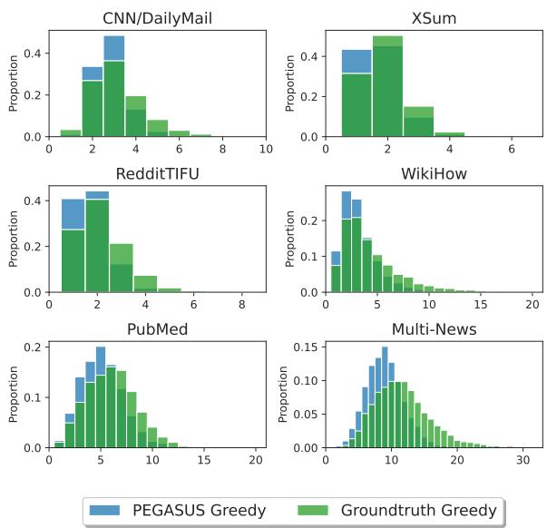
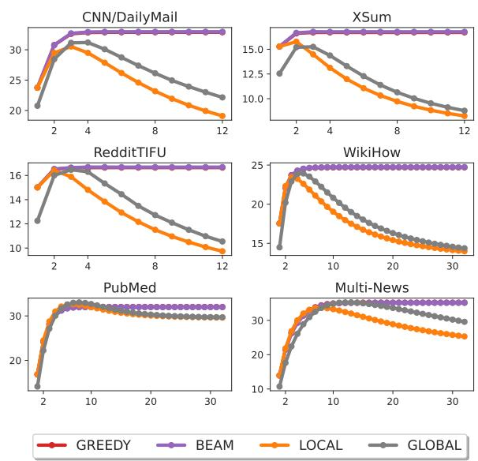

# Extractive Summarization with Text Generator

Thang Le VinAI Research v.thangld16@vinai.io

Luu Anh Tuan\* Nanyang Technological University anhtuan.luu@ntu.edu.sg

## Abstract

Standard extractive systems suffer from the lack of gold training signals since existing corpora solely provide document and humanwritten summary pairs while disregarding ex tractive labels. As a result, existing methods resort to imperfect pseudo-labels that are both biased and error-prone, thereby hindering the learning process of extractive models. In contrast, text generators which are commonly employed in abstractive summarization can effortlessly overcome this predicament on account of flexible sequence-to-sequence architectures. Motivated to bypass this inherent limitation, we investigate the possibility of conducting extractive summarization with text generators. Through extensive experiments covering six summarization benchmarks, we show that highquality extractive summaries can be assembled via approximating the outputs (abstractive summaries) of these generators. Moreover, we find that the approximate summaries correlate positively with the auxiliary summaries (i.e. a better generator enables the production of better extractive summaries). Our results signify a new paradigm for training extractive summarizers i.e. learning with generation (abstractive) objectives rather than extractive schemes.

## 1 Introduction

Text summarization, owing to its practical application, has received increasing interest from the research community (Nguyen and Luu, 2022, Kumar and Chakkaravarthy, 2023). Current approaches mainly follow two directions: extractive and abstractive summarization (Yadav et al., 2022). While abstractive methods skillfully paraphrase the primary contents, extractive ones are less inventive as they seek to extract salient units (e.g. sentences) without making any textual modification. Nonetheless, extractive methods effectively avoid hallucinations and inconsistencies which commonly occur in abstractive summaries (Ladhak et al., 2022). We present an illustrative example in Table 1.

<table><tr><td>Source Article Heat the broth to the boiling point. Add your Worcestershire sauce to taste. Reduce the heat and let it sit for 3 to 5 minutes. Alternatively, you can sift flour directly into the gravy, but that won&#x27;t taste as good.</td></tr><tr><td>Abstractive Summary Heat the broth in a large saucepan over medium heat. Sift the flour into the gravy.</td></tr><tr><td>Extractive Summary Heat the broth to the boiling point. Alterna- tively, you can sift flour directly into the gravy, but that won&#x27;t taste as good.</td></tr></table>

Table 1: An example from the WikiHow dataset showcasing an abstractive summary (BART) and an extractive summary (our method). Here the abstractive summary hallucinates the information boiling point to medium heat while the extractive summary preserves this detail as there is no textual change.

The training of abstractive models is rather straightforward as they can fit arbitrary target sequences (Sutskever et al., 2014, Shi et al., 2021). Meanwhile, extractive models suffer from the lack of gold training labels since most existing datasets only provide document and human-written summary pairs while disregarding extractive labels (Nallapati et al., 2017). The annotation process for manually obtaining these labels is also both labor-intensive and hard to control (Cheng and Lapata, 2016, Narayan et al., 2018b), further diminishing the presence of high-quality supervision. As a result, training labels for extractive models have often been secured via heuristic algorithms (Nallapati et al., 2017, Zhou et al., 2018, Xu et al., 2020, Zhang et al., 2023) which produce suboptimal alternatives (Zhang et al., 2018) and contain labeling biases (Xing et al., 2021) that lead to underfitting (Narayan et al., 2018b) as well as the error propagation phenomenon (Xu and Lapata, 2023). Attributable to these instigating problems, research on acquiring better extractive labels has always been an actively developed topic (Jia et al., 2022, Xu and Lapata, 2023).

This gives rise to an intriguing research ques tion: Can we construct good extractive summarization models that learn directly from the ground truth summaries? Being able to learn directly from the ground-truth summaries should eliminate the reliance on imperfect labeling algo rithms which potentially introduce noise in the training process and allow learned models to make full use of available resources (summaries). However, deriving such a methodology is non-trivial as extractive models need to produce extract outputs (Liu and Lapata, 2019) which are often sen tences or sub-sentential units (Zhou et al., 2020) that originate from the source document. Meanwhile, ground truth summaries are often abstrac tively written snippets that do not conform to this constraint and necessitate fine-grained token-level output modelings which aren’t inherent in the de coder of extractive models (Cheng et al., 2023). In contrast, these limitations can be seamlessly over come with abstractive models which are typically based on flexible seq2seq architectures (Nallapati et al., 2016). As summarization datasets are inherently extractive to a certain degree, abstractive models trained on these sources likely exhibit unequivocal extractive behaviors (Song et al., 2020). Previous works have characterized this property as the faithfulness-abstractiveness tradeoff (Ladhak et al., 2022) and opt to find a balance in extractivity that does not hurt the performance of abstractive models (Ge et al., 2023, Dixit et al., 2023). We hy pothesize, however, that this property can serve as essential clues in transforming abstractive models into compelling extractive ones that concomitantly overcome the aforementioned gap. To decipher this conjecture as well as answer the research question, we propose to approximate the output summaries of abstractive models with heuristic algorithms, thereby deriving summaries of extractive formats. With the aim of examining the quality of these extractive outputs, we conduct exhaustive evaluations spanning six summarization benchmarks while taking into account state-of-the-art standard methods on extractive summarization. To our surprise, the evaluated models perform competitively, even out perform previous state-of-the-art methods across a wide range of settings despite not undergoing any (sentential) extractive training. Remarkably, these results are achieved without setting any extraction threshold which is unprecedented in traditional methods.

In summary, our contributions can be listed as follows:

• We present Abstract2Extract (A2E), a methodology that transforms existing abstractive models into powerful extractive epitomes by taking advantage of their innate extractiveness via heuristic algorithms, all the while not incurring additional training or inference cost.

• We demonstrate through experiments on a variety of domains that A2E models exhibit either superior or comparable performance to previous state-of-the-art extractive methods despite not undertaking any extractive supervision. In addition, A2E keeps track of both abstractive and extractive summaries which provides a straightforward unification of the two paradigms.

## 2 Related Works

Abstractive Summarization Together with the introduction of neural sequence-to-sequence learning (Sutskever et al., 2014), progress in the field significantly skyrocketed (Nallapati et al., 2016, Liu et al., 2022). To better guide the learning of these models and avoid hallucination, many existing works attempt to explicitly control the content selection process (Wang et al., 2020, Jiang et al., 2021, Nguyen et al., 2021b, Ladhak et al., 2022). Among different categories of guidance, extractive summarization and extractive labels have also been adopted. For example, Liu and Lapata, 2019 trained a two-stage model where the base architecture is sequentially fine-tuned on the extractive and abstractive summarization tasks. Bao and Zhang, 2021 rewrote the whole extractive summaries conditioned on the input documents. Similarly, Dou et al., 2021 designed a framework incorporating extractive guidance in abstractive models and observed increased faithfulness.

Extractive Summarization Extraction summarization has often been formulated as a sentence ranking task, where the goal is to predict the importance score of each sentence and perform selection accordingly (Gupta et al., 2014, Nallapati et al.,

2017). Due to the lack of extractive labels, Nallapati et al., 2017 employs a greedy approach to collectively select a subset of sentences that maximize the ROUGE (Lin, 2004) scores, whose strategy is also re-used in follow-up works (Kedzie et al., 2018, Zhong et al., 2019). This widely adopted approach, however, generates uncalibrated label sets containing biases (Jia et al., 2022) that potentially hurt the training of extractive models and further cause underfitting (Dong et al., 2018). To tackle this problem, Xu and Lapata, 2023 proposed to integrate a pool of summary candidates to derive fine-grained soft sentence labels. The approach remains limited as these scores represent merely a portion of an intractable hypothesis space and inevitably result in inferior approximators of the true ground truth which still hinder models’ learning capacities.

Concurrent to our work, Varab and Xu, 2023 proposed to employ the abstractive model BRIO (Liu et al., 2022) as the scorer in guiding summary searches and achieved encouraging extractive results. Their approach, however, relies on the coordination property (i.e. the ability to properly rank summary hypotheses) which isn’t inherent in most abstractive systems, and significantly degrades when the underlying model does not possess this characteristic. In contrast, we do not make any assumption about the underlying abstractive model and solely make use of the generated outputs as pseudo-references in heuristic practices which follows a black-box manner with high flexibility. Different from theirs, our approach neither diverges from the generation process of abstractive models nor additionally incurs any inference cost and can therefore seamlessly support the creation of dual summaries (i.e. abstractive and extractive).

## 3 Abstract2Extract

## 3.1 From Generation to Extraction

Given an input document $D _ { ; }$ , suppose that we have access to a sequence-to-sequence abstractive summarization model $M _ { \theta }$ which imitates the conditional likelihood $\begin{array} { r } { P _ { \theta } ( Y | D ) = \prod _ { i = 1 } ^ { t } P _ { \theta } ( Y _ { t } | Y _ { < t } , D ) } \end{array}$

where Y represents the output summary. This probability distribution is primarily learned via the Maximum Likelihood Estimation (MLE) objective (Rehman et al., 2023). At inference time, heuristic decoding methods (e.g. beam decoding) are customarily used to generate the output sequence Y autoregressively (Kasai et al., 2022).

Denote $Y _ { A } = M _ { \theta } ( D )$ as the abstractive summary generated from $M _ { \theta }$ . We opt to find an alternative extractive summary $Y _ { E }$ conditioned on $Y _ { A } \colon$ $Y _ { E } = \mathrm { a r g m a x } _ { Y _ { E } \in H ( D ) } Q ( Y _ { E } , Y _ { A } )$ where $H ( D )$ is the hypothesis space1 and $Q ( . )$ is the reference metric.

This formulation allows the construction of extractive summaries conditioned on the directly learned ground truth distribution Y while also taking advantage of useful fine-grained token-level output information which is otherwise impracticable in standard extractive paradigms. Accordingly, we can also bypass the problem of error propagation/noisy signal caused by imperfect pseudo-labels employed in extractive training.

## 3.2 Approximator

Since the pool of probable extractive candidates is literally intractable making the argmax operation expensive, we adopt heuristic practices to efficiently deduce good targets.

We delineate two groups of heuristics: summary output - which produces summary-level (or setlevel) rankings and sentence output - which yields sentence-level rankings. For the prior, we choose the summary (or set) with the highest ranking as the extractive summary. For the latter, we select the top $K _ { S }$ highest-ranked sentences to acquire the extractive summary.

## 3.2.1 Summary Output

These algorithms explore the hypothesis space $H ( D )$ and maintain the rankings of summaries (or sets) found during the process based on $Q ( . )$ We harness two classic algorithms that are highly capable: greedy and beam search.

Greedy Search Starting from an empty selection set $H \ = \ \{ \}$ , at each step t, the algorithm picks the locally highest quality sentence $s _ { t } ~ =$ $\mathrm { a r g m a x } _ { s _ { t } \in H ^ { \prime } } Q ( H \cup s _ { t } , Y _ { A } )$ and perform update $H = H \cup s _ { t }$ , where $H ^ { \prime } = D _ { S } \backslash H$ and $D _ { S }$ is the set of input sentences. The algorithm converges when the quality of the selection set cannot be further improved i.e. $\begin{array} { r } { \operatorname* { m a x } _ { s _ { t } \in H ^ { \prime } } Q ( H \cup s _ { t } , Y _ { A } ) \leq Q ( H , Y _ { A } ) } \end{array}$ or additional constraints are met (e.g. maximum search steps).

Beam Search Instead of keeping only the locally best candidate H, beam search maintains a list of $K _ { C }$ best found sets $\{ H _ { i } \} _ { i = 1 \dots K }$ . At each iteration, it sequentially expands and prunes candidates in $\{ H _ { i } \}$ based on $Q .$ . Similar to greedy search, the algorithm converges if either no better candidate gets discovered or extra restrictions are fulfilled.

## 3.2.2 Sentence Output

These algorithms are oriented to bring out rankings of individual input sentences. We exploit two scoring mechanisms: local and global.

Local Scorer For each sentence $s _ { i } \in D _ { S }$ in the source document, we evaluate its affinity with the auxiliary reference $Y _ { A }$ as $r _ { i } = Q ( s _ { i } , Y _ { A } )$ , where $Q$ is the established criterion. The computed affinity scores $\{ r _ { i } \}$ are then applied to determine sentence rankings.

Global Scorer Inspired by Xu and Lapata, 2023, we further incorporate summary-level information into the scoring of sentences. In particular, we first utilize beam search to retrieve a pool of $K _ { C }$ highquality candidates $\{ H _ { i } \} _ { i = 1 \dots K }$ . Afterward, we iterate through the list and for each sentence $s _ { i } ^ { k }$ appearing in the candidate $H _ { k }$ , we update its affinity score as $r _ { i } = r _ { i } + Q ( H _ { k } , Y _ { A } )$ . To begin with, each affinity score is initialized as $r _ { i } = 0$ and subsequently gets revamped according to its contribution (presence) in forming high-quality summaries.

## 3.3 Criterion

Employed heuristics rely on the criterion $Q ,$ which should encapsulate both relevance and conciseness in grading different sentences/summaries with respect to the pseudo-reference $Y _ { A }$ . While embedding-based criteria depend on latent features from pre-trained language models and can therefore capture contextualized information, they are computationally too demanding. In this work, we exploit the de-facto metric ROUGE2 (Lin, 2004) as the optimization criterion following past literature (Chen et al., 2021, Gu et al., 2022). To justify this decision, we measure the lexical overlap between the abstractive summaries (PEGASUS) and the source documents in terms of extractive ngrams in Table 2. Overall, we observe high overlap rates which signify the method’s feasibility.

## 4 Experiments

## 4.1 Settings

To examine our approaches, we conduct experiments on six summarization datasets: CNN/DailyMail (Nallapati et al., 2016) - a news-story dataset from the CNN and Daily Mail websites; XSum (Narayan et al., 2018a) - an extreme summarization dataset from BBC; Reddit-TIFU (Kim et al., 2019) - a social media dataset from the TIFU subreddit; WikiHow (Koupaee and Wang, 2018) - a knowledge-based dataset from the WikiHow website; PubMed (Cohan et al., 2018) - a medical dataset; Multi-News (Fabbri et al., 2019) - a multi-document news summarization dataset. 3

<table><tr><td></td><td>CD</td><td>XS</td><td>RD</td><td>WH</td><td>PM</td><td>MN</td></tr><tr><td>Uni. Bi.</td><td>94.46 77.80</td><td>73.95 26.03</td><td>89.75 44.41</td><td>88.59 48.85</td><td>82.00 60.77</td><td>94.39 72.59</td></tr></table>

Table 2: Percentage of extractive (non-novel) n-grams in PEGASUS’s summaries. CD, XS, RD, WH, PM and MN stand for CNN/DailyMail, XSum, RedditTIFU, WikiHow, PubMed and Multi-News, respectively.

As underlying abstractive systems, we primarily use the following four models: PEGASUS (Zhang et al., 2020a) - a transformer model pre-trained with gap-sentence objectives; BART (Lewis et al., 2020) - a similar architecture pre-trained with denoising objectives; BRIO (Liu et al., 2022) - a multi-task optimized model; PRIMERA (Xiao et al., 2022) - a longformer encoder-decoder model pre-trained with the pyramid framework. During inference, we use beam decoding with hyperparameters determined following respective papers4. To guide heuristic algorithms, we use the ROUGE-1 F1 score in all experiments unless explicitly specified otherwise5.

## 4.2 Can abstractive summaries serve as good pseudo-references ?

For the first experiment, we examine the quality of the approximate summaries with respect to the abstractive pseudo-references. In particular, we show the results in Table 3. For evaluation, we use an average of the three ROUGE scores i.e. ROUGE-1, ROUGE-2 and ROUGE-L F1 scores. Column A, E and $\Delta$ each denotes scores of the abstractive, approximate extractive and the accompanying quality loss during approximation. We additionally highlight the highest score in each block (or lowest in terms of loss).

On all datasets, we observe a consistent trend that the superior the abstractive summary, the better the extractive summary. This indicates that if we use a better abstractive model, we can expect a higher-quality extractive summary. Moreover, the finer the abstractive summary, the higher the transfer loss. This indicates that highgrade abstractive summaries pose increasing difficulties in approximation. Besides, we observe that the transfer loss is typically inflated on abstractive datasets such as XSum and WikiHow. Meanwhile, on fairly extractive datasets such as CNN/DailyMail or Multi-News, the approximate extractive summaries are comparatively close in quality compared to the auxiliary summaries. Ultimately, we find that abstractive summaries can serve as good pseudo-references, enabling extraction of non-trivial summaries on all datasets.

<table><tr><td>Dataset</td><td>Model</td><td>A↑</td><td>E↑</td><td>∆↓</td></tr><tr><td>CNN/DailyMail</td><td>PEGASUS BART BRIO</td><td>33.08 35.72 38.99</td><td>32.88 33.26 35.31</td><td>0.2 2.46 3.68</td></tr><tr><td>XSum</td><td>PEGASUS BART BRIO</td><td>37.03 35.16 38.51</td><td>16.71 16.60 17.01</td><td>20.33 18.56 21.5</td></tr><tr><td>RedditTIFU</td><td>PEGASUS BART</td><td>21.50 22.96</td><td>16.65 17.71</td><td>4.85 5.25</td></tr><tr><td>WikiHow</td><td>PEGASUS BART</td><td>34.35 35.59</td><td>24.71 25.62</td><td>9.65 9.98</td></tr><tr><td>PubMed</td><td>PEGASUS BART PRIMERA</td><td>32.78 33.54 33.89</td><td>32.02 32.59 32.88</td><td>0.76 0.95</td></tr><tr><td>Multi-News</td><td>PEGASUS BART PRIMERA</td><td>36.57 36.32 38.65</td><td>35.16 35.12 36.73</td><td>1.01 1.41 1.2 1.92</td></tr></table>

Table 3: Abstractive and approximate extractive summaries (greedy search).

## 4.3 Comparison between approximators

<table><tr><td rowspan="2">Dataset</td><td rowspan="2">Model</td><td colspan="2">-SUMMARY-</td><td colspan="2">-SENTENCE-</td></tr><tr><td>GREEDY</td><td>BEAM</td><td>LOCAL</td><td>GLOBAL</td></tr><tr><td rowspan="3">CNN/DailyMail</td><td>PEGASUS</td><td>32.88</td><td>32.96</td><td>30.53</td><td>31.20</td></tr><tr><td>BART</td><td>33.26</td><td>33.39</td><td>30.61</td><td>31.73</td></tr><tr><td>BRIO</td><td>35.31</td><td>35.55</td><td>31.86</td><td>33.77</td></tr><tr><td rowspan="3">XSum</td><td>PEGASUS</td><td>16.71</td><td>16.77</td><td>15.77</td><td>15.25</td></tr><tr><td>BART</td><td>16.60</td><td>16.64</td><td>15.64</td><td>15.15</td></tr><tr><td>BRIO</td><td>17.01</td><td>17.11</td><td>15.85</td><td>15.44</td></tr><tr><td rowspan="2">RedditTIFU</td><td>PEGASUS</td><td>16.65</td><td>16.69</td><td>16.41</td><td>16.47</td></tr><tr><td>BART</td><td>17.71</td><td>17.75</td><td>17.38</td><td>17.24</td></tr><tr><td rowspan="2">WikiHow</td><td>PEGASUS</td><td>24.71</td><td>24.74</td><td>23.46</td><td>23.93</td></tr><tr><td>BART</td><td>25.62</td><td>25.63</td><td>23.59</td><td>24.26</td></tr><tr><td rowspan="3">PubMed</td><td>PEGASUS</td><td>32.02</td><td>31.97</td><td>32.61</td><td>33.05</td></tr><tr><td>BART</td><td>32.59</td><td>32.55</td><td>32.68</td><td>33.15</td></tr><tr><td>PRIMERA</td><td>32.88</td><td>32.89</td><td>32.80</td><td>33.33</td></tr><tr><td rowspan="3">Multi-News</td><td>PEGASUS</td><td>35.16</td><td>35.10</td><td>33.68</td><td>35.23</td></tr><tr><td>BART</td><td>35.12</td><td>35.11</td><td>33.34</td><td>34.80</td></tr><tr><td>PRIMERA</td><td>36.73</td><td>36.75</td><td>34.02</td><td>36.14</td></tr></table>

Table 4: Comparison between heuristic algorithms

Next, we present a comprehensive comparison of different algorithms. For sentence output heuristics, we determine the optimal extraction threshold based on grid search in the range [1..32] and select the top highest-scored sentences according to this threshold. We report an average of the three ROUGE variants6 in Table 4. We highlight the best heuristic for each model, and underline the better heuristic in each category. In most cases, summary output heuristics produce the best summaries, with beam search typically improves over greedy search. For those with sentence output, we find that the global scorer often achieves better results than the local scorer. These observations show that summary-wise (or set-wise) comparisons are necessary to deduce good extractive summaries. Drawing on this conclusion, we focus on summary output heuristics for the rest of the paper.

## 4.4 Comparison with standard extractive methods

<table><tr><td>Model</td><td>R-1</td><td>R-2</td><td>R-L</td></tr><tr><td>ORACLE (upper bound)</td><td>58.67</td><td>32.26</td><td>53.96</td></tr><tr><td>Customized Extractive Methods LEAD-3 (2020)</td><td>40.43</td><td>17.62</td><td>36.67 39.04 40.55</td></tr><tr><td>BERTSum (2019) MatchSum (2020) CoLo (2022) SetSum (2023) DiffuSum (2023)</td><td>42.57 44.41 44.58 44.62</td><td>19.96 20.86 21.25 20.81</td><td>40.65 40.76</td></tr><tr><td>Abstractive-driven Methods</td><td>44.83</td><td>22.56</td><td>40.56</td></tr><tr><td>BART - GenX Search (2023) BRIO - GenX Search (2023)</td><td>38.46 43.57</td><td>16.43 20.55</td><td>34.93 40.01</td></tr><tr><td>PEGASUS - A2E Greedy PEGASUS - A2E Beam BART - A2E Greedy BART - A2E Beam BRIO - A2E Greedy</td><td>41.69 41.78 42.03 42.00 44.18</td><td>18.93 18.96 19.26 19.32</td><td>38.03 38.15 38.5 38.67</td></tr></table>

Table 5: Results on CNN/DailyMail.

We examine the quality of the obtained summaries with respect to standard extractive systems. For reference purposes only, we provide the ORA-CLE results which involve executing greedy search on the ground truth summaries, serving as the upper bound of all extractive systems. Next, we specifically consider the strong baselines: LEADk (extracting first k sentences), BERTSum (Liu and Lapata, 2019) - a sentence-level summarizer with BERT, MatchSum (Zhong et al., 2020) - a two-stage matching framework, CoLo (An et al., 2022) - an one-stage re-ranking framework, Set-Sum (Cheng et al., 2023) - a set prediction network, DiffuSum (Zhang et al., 2023) - a transformerbased denoising diffusion framework, MemSum (Gu et al., 2022) - a highly customized model for long extractive summarization. We also provide comparisons with GenX (Varab and Xu, 2023) - a concurrent work close to ours that also employs abstractive model but relies on likelihood comparison instead of pseudo-references. We compare these standard methods with summary output heuristics. In addition, we do not set any extraction threshold for these heuristics (greedy and beam search) i.e. the algorithms converge only when no better candidates are found without extra constraints such as a maximum number of extracted sentences or search steps. Also, we use a default beam width of 4 unless specified otherwise7. For evaluation, we report the ROUGE-1, ROUGE-2 and ROUGE-L F1 scores achieved with each system. The results are presented in Table 5, 6, 7, 8, 9 and 108.

<table><tr><td>Model</td><td>R-1</td><td>R-2</td><td>R-L</td></tr><tr><td>ORACLE (upper bound)</td><td>33.15</td><td>7.52</td><td>23.79</td></tr><tr><td>Customized Extractive Methods BERTSum (2019)</td><td>22.86</td><td>4.48</td><td>17.16</td></tr><tr><td>MatchSum (2020) CoLo (2022) SetSum (2023)</td><td>24.86 24.51 24.80</td><td>4.66 5.04 4.59</td><td>18.41 18.21 18.52</td></tr><tr><td>DiffuSum (2023)</td><td>24.00</td><td>5.44</td><td>18.01</td></tr><tr><td>Abstractive-driven Methods</td><td></td><td></td><td></td></tr><tr><td>BRIO - GenX Search (2023) PEGASUS - A2E Greedy</td><td>17.90 25.79*</td><td>2.79</td><td>13.36</td></tr><tr><td>PEGASUS - A2E Beam</td><td>25.86*</td><td>5.23 5.21</td><td>19.10* 19.23*</td></tr><tr><td>BART - A2E Greedy</td><td>25.61*</td><td>5.20</td><td>19.00*</td></tr><tr><td>BART - A2E Beam</td><td>25.65*</td><td></td><td></td></tr><tr><td>BRIO - A2E Greedy</td><td></td><td>5.23</td><td>19.10*</td></tr><tr><td>BRIO - A2E Beam</td><td>26.2* 26.31*</td><td>5.39 5.37</td><td>19.44* 19.64*</td></tr></table>

Table 6: Results on XSum.

<table><tr><td>Model</td><td>R-1</td><td>R-2</td><td>R-L</td></tr><tr><td>ORACLE (upper bound)</td><td>38.41</td><td>11.92</td><td>29.8</td></tr><tr><td>Customized Extractive Methods</td><td></td><td></td><td></td></tr><tr><td>BERTSum (2019) MatchSum (2020)</td><td>23.86 25.09</td><td>5.85 6.17</td><td>19.11 20.13</td></tr><tr><td>CoLo (2022)</td><td>25.06</td><td>5.90</td><td>19.52</td></tr><tr><td>SetSum (2023)</td><td>25.49</td><td>6.39</td><td>20.33</td></tr><tr><td>Abstractive-driven Methods</td><td></td><td></td><td></td></tr><tr><td>PEGASUS - A2E Greedy</td><td>24.57</td><td>5.72</td><td>19.66</td></tr><tr><td>PEGASUS - A2E Beam</td><td>24.63</td><td></td><td></td></tr><tr><td>BART - A2E Greedy</td><td></td><td>5.68</td><td>19.75</td></tr><tr><td></td><td>26.1</td><td>6.48</td><td>20.55</td></tr><tr><td>BART - A2E Beam</td><td>26.12</td><td>6.41</td><td>20.72</td></tr></table>

Table 7: Results on RedditTIFU.

<table><tr><td>Model</td><td>R-1</td><td>R-2</td><td>R-L</td></tr><tr><td>ORACLE (upper bound)</td><td>45.39</td><td>13.93</td><td>41.76</td></tr><tr><td>Customized Extractive Methods</td><td></td><td></td><td></td></tr><tr><td>BERTSum (2019)</td><td>30.31</td><td>8.71</td><td>28.24</td></tr><tr><td>MatchSum (2020)</td><td>31.85</td><td>8.98</td><td>29.58</td></tr><tr><td>SetSum (2023)</td><td>31.66</td><td>8.72</td><td>29.36</td></tr><tr><td>Abstractive-driven Methods</td><td></td><td></td><td></td></tr><tr><td>PEGASUS - A2E Greedy</td><td>33.40*</td><td>9.72*</td><td>31.00*</td></tr><tr><td>PEGASUS - A2E Beam</td><td>33.44*</td><td>9.72*</td><td>31.07*</td></tr><tr><td>BART - A2E Greedy</td><td>34.65*</td><td>10.05*</td><td>32.12*</td></tr><tr><td>BART - A2E Beam</td><td>34.66*</td><td>10.01*</td><td>32.22*</td></tr></table>

Table 8: Results on WikiHow.

<table><tr><td>Model</td><td>R-1</td><td>R-2</td><td>R-L</td></tr><tr><td>ORACLE (upper bound)</td><td>48.92</td><td>19.71</td><td>44.58</td></tr><tr><td>Customized Extractive Methods BERTSum (2019)</td><td>41.05</td><td>14.88</td><td>36.57 36.75</td></tr><tr><td>MatchSum (2020) SetSum (2023) DiffuSum (2023) CoLo (2022)</td><td>41.21 41.53 41.40</td><td>14.91 15.11 15.55</td><td>36.88 37.48</td></tr><tr><td>MemSum (2022)</td><td>41.93 43.08</td><td>16.51 16.71</td><td>38.28 38.30</td></tr><tr><td>Abstractive-driven Methods PEGASUS - A2E Greedy</td><td>41.65</td><td></td><td></td></tr><tr><td>PEGASUS - A2E Beam</td><td></td><td>16.25</td><td>38.15</td></tr><tr><td>BART - A2E Greedy</td><td>41.59</td><td>16.22</td><td>38.11</td></tr><tr><td></td><td>42.37</td><td>16.54</td><td>38.85*</td></tr><tr><td>BART - A2E Beam</td><td>42.32</td><td>16.51</td><td></td></tr><tr><td>PRIMERA - A2E Greedy PRIMERA - A2E Beam</td><td>42.72</td><td>16.76</td><td>38.82* 39.16*</td></tr></table>

Table 9: Results on PubMed.
<table><tr><td>Model</td><td>R-1</td><td>R-2</td><td>R-L</td></tr><tr><td>ORACLE (upper bound)</td><td>62.77</td><td>30.47</td><td>57.64</td></tr><tr><td>Customized Extractive Methods</td><td></td><td></td><td></td></tr><tr><td>BERTSum (2019)</td><td>45.80</td><td>16.42</td><td>41.53</td></tr><tr><td>MatchSum (2020)</td><td>46.20</td><td>16.51</td><td>41.89</td></tr><tr><td>SetSum (2023)</td><td>46.33</td><td>16.80</td><td>42.00</td></tr><tr><td>Abstractive-driven Methods</td><td></td><td></td><td></td></tr><tr><td>PEGASUS - A2E Greedy</td><td>45.99</td><td>17.4*</td><td>42.1</td></tr><tr><td>PEGASUS - A2E Beam</td><td>45.86</td><td>17.39*</td><td>42.05</td></tr><tr><td>BART - A2E Greedy</td><td>46.21</td><td>16.84</td><td>42.32*</td></tr><tr><td>BART - A2E Beam</td><td>46.17</td><td>16.84</td><td>42.32*</td></tr><tr><td>PRIMERA - A2E Greedy</td><td>47.71*</td><td>18.67*</td><td>43.81*</td></tr><tr><td>PRIMERA - A2E Beam</td><td>47.71*</td><td>18.69*</td><td>43.86*</td></tr></table>

Table 10: Results on Multi-News.

On CNN/DailyMail, our methods coupled with the BRIO model achieve results on par with stateof-the-art models such as MatchSum and DiffuSum. The PEGASUS/BART models also perform comparably to the BERTSum baseline. Noticeably, the BRIO - A2E Beam model achieves the highest ROUGE-L score. Compared with GenX, we also achieve consistently better scores. In addition, when the underlying system is not coordinated, our models do not significantly degrade, unlike GenX. For example, when switching from BRIO to BART whose summaries are of lower quality, we only suffer a 2-point drop in ROUGE-1 compared to GenX which degenerates by 5 ROUGE-1 points.

On XSum, our models consistently produce summaries with higher quality than baseline methods, especially in terms of ROUGE-1 and ROUGE-L.

On RedditTIFU and WikiHow, our models also outperform existing systems. In particular, our BART - A2E models surpass the best baseline Set-Sum on RedditTIFU. On WikiHow, our advantages are even more amplified, as all models improve 2 to nearly 3 ROUGE-1 points over the state-of-the-art model MatchSum with similar gains in ROUGE-2 and ROUGE-L.

On PubMed and Multi-News, we continually set new state-of-the-arts with persistent advances. On PubMed, our least competent models (PEGA-SUS) perform better than most previous systems while our best models (PRIMERA) outperform the best baseline MemSum regarding ROUGE-2 and ROUGE-L. We also observe similar results on Multi-News where our PEGASUS/BART models exceed most baselines and our PRIMERA models achieve absolute improvement over all methods.

Conclusively, we reach new state-of-the-arts in extractive summarization despite not undergoing customized training.

## 4.5 Evaluation with other metrics

We additionally report the results in terms of SummaQA (Scialom et al., 2019) and BERTScore (Zhang et al., 2020b). The prior is based on a question answering framework whereas the latter relies on greedy matching of contextualized embeddings. We repeat the comparisons with the Match-Sum system. For generators, we use BRIO on CNN/DailyMail & XSum, BART on RedditTIFU & WikiHow and PRIMERA on PubMed & Multi-News. As for heuristics, we simply use greedy search. Dataset names are abbreviated9. We report the results in Table 11 and 12. Aligning with the previous section, we achieve consistently superior results on all benchmarks.

<table><tr><td></td><td>CD</td><td>XS</td><td>RD</td><td>WH</td><td>PM</td><td>MN</td></tr><tr><td>MatchSum</td><td>25.96</td><td>9.88</td><td>2.25</td><td>2.19</td><td>2.75</td><td>8.04</td></tr><tr><td>Our method</td><td>27.15</td><td>11.92</td><td>2.58</td><td>3.59</td><td>3.09</td><td>9.74</td></tr></table>

Table 11: Results in SummaQA scores.

<table><tr><td></td><td>CD</td><td>XS</td><td>RD</td><td>WH</td><td>PM</td><td>MN</td></tr><tr><td>MatchSum</td><td>64.05</td><td>57.24</td><td>52.55</td><td>56.29</td><td>58.83</td><td>61.00</td></tr><tr><td>Our method</td><td>65.11</td><td>58.84</td><td>54.49</td><td>58.07</td><td>60.54</td><td>62.88</td></tr></table>

Table 12: Results in BERTScore scores.

## 4.6 Manual Evaluation

To examine whether the automated evaluations align with human preferences, we further conduct a manual evaluation campaign. In particular, we randomly sampled 150 instances from the CNN/DailyMall test set and included extracted summaries from the MatchSum system and the A2E Greedy - BRIO model (we avoided samples where both extracted sentence sets are identical). Following Cheng et al., 2023, we invited three volunteers who are professional English speakers to examine the summaries based on two criteria: informativeness and coherence. System outputs were presented in random order and no participant was aware of the different systems beforehand. Each participant then, given the source article and gold reference, elected the summary which he/she preferred for each aspect separately. Each system then received one point for every vote.

We present the average results (percentage) in Table 13. It is clear that the summaries produced by A2E were preferred more by humans on both categories. Moreover, we obtained these results with substantial inter-annotator agreement as indicated by Fleiss’ Kappa scores (Fleiss, 1971), which we show in Table 14.

<table><tr><td></td><td>Informativeness</td><td>Coherence</td></tr><tr><td>MatchSum</td><td>19.56</td><td>24.67</td></tr><tr><td>Our method</td><td>80.44</td><td>75.33</td></tr></table>

Table 13: Human evaluation results on CNN/DailyMall.

<table><tr><td></td><td>Informativeness</td><td>Coherence</td></tr><tr><td>Fleiss&#x27; Kappa</td><td>0.7034</td><td>0.6532</td></tr></table>

Table 14: Inter-Annotator Agreement.

## 4.7 Analysis on Lead Bias

Traditionally extractive systems often exhibit spurious correlations with beginning sentence positions, also known as lead bias, which emerges from an imbalance in the distribution of information positioning (Grenander et al., 2019, Xing et al., 2021). Compared to previous approaches, in our method, the learning process is identical to abstractive generation and the model thus learns to actually generate summaries rather than simply extract sentences which should supposedly lessen this spurious correlation.

To verify this argument, we examine the positions of sentences extracted with our models and the MatchSum system. In particular, we report the percentage of sentences with relative positions belonging to each of the range 0 10%, 10 30% and 30  100%. We experiment with CNN/DailyMall - a dataset where lead bias is prevalent (See et al., 2017), and report results in Table 15:

<table><tr><td></td><td>0 - 10%</td><td>10 - 30%</td><td>30 - 100%</td></tr><tr><td>MatchSum</td><td>39.17</td><td>43.11</td><td>17.72</td></tr><tr><td>A2E Greedy - BRIO</td><td>31.19</td><td>37.57</td><td>31.24</td></tr><tr><td>A2E Greedy - BART</td><td>27.01</td><td>39.97</td><td>33.02</td></tr></table>

Table 15: Distribution of sentence positions in CNN/DailyMall extractive summaries.

As we expected, A2E models suffer less from lead bias. However, we find that the bias still exists. Specifically, when we compared the sentence positions of A2E models that were trained in-domain on XSum - a dataset with weak lead bias (Narayan et al., 2018a), versus cross-domain from CNN/DailyMall, we observed higher rates of extraction in the beginning parts for the latter. We illustrate this in Table 16.

<table><tr><td></td><td>0 − 10% (In)</td><td>0 − 10% (Cross)</td></tr><tr><td>A2E Greedy - BRIO</td><td>8.11</td><td>25.75</td></tr><tr><td>A2E Greedy - BART</td><td>8.65</td><td>26.00</td></tr></table>

Table 16: Propagation of dataset bias on information positioning. Models were tested either in-domain or crossdomain (from CNN/DailyMall) on the XSum dataset.

This means that completely eliminating lead bias remains a non-trivial feat, which aligns with the results from Xing et al., 2021.

## 4.8 Further Optimization

We next study whether exact optimization can yield better extractive summaries (than heuristics). To experiment with this direction, we sample 100 documents from the CNN/DailyMail test set, each containing 9 sentences. We then compare the quality of extractive summaries conditioned on the abstractive ones (BRIO) obtained through greedy search and brute $f o r c e ^ { 1 0 }$ . We show the results in Table 17. Even though the gains are visible, the speed trade-offs are enormous.

<table><tr><td></td><td>R-1</td><td>R-2</td><td>R-L</td><td>Speed</td></tr><tr><td>Greedy</td><td>47.2</td><td>24.65</td><td>42.95</td><td>270.6 (iter/s)</td></tr><tr><td>Brute Force</td><td>47.58</td><td>24.91</td><td>43.43</td><td>4.6 (iter/s)</td></tr></table>

Table 17: Results with greedy search and brute force on CNN/DailyMall.

## 4.9 Cross-domain generalization

Although abstractive models are known to possess certain generalization capabilities (Chen et al., 2020), whether our approaches can leverage these properties remains a puzzle. To elucidate this matter, we employ a BRIO model fine-tuned on the CNN/DailyMail dataset and conduct cross-dataset inference on three benchmarks with distinct properties: XSum, RedditTIFU and WikiHow. We also compare with standard systems such as BERT-Sum, MatchSum and additionally include results for GenX. As Xu and Lapata, 2023 use ROUGE-L when reporting performances of standard systems, we also report ROUGE-L scores for our models accordingly. We show the results in Table 18. It can be inferred that not only can our models generalize across domains but we also achieve massive improvements especially when testing on non-news domain such as RedditTIFU and WikiHow.

<table><tr><td>Model</td><td>XS</td><td>RD</td><td>WH</td></tr><tr><td>Customized Extractive Methods</td><td></td><td></td><td></td></tr><tr><td>BERTSum (2019, 2023)</td><td>15.62</td><td>17.06</td><td>25.39</td></tr><tr><td>MatchSum (2020, 2023)</td><td>15.75</td><td>17.82</td><td>25.1</td></tr><tr><td>Abstractive-driven Methods</td><td></td><td></td><td></td></tr><tr><td>BRIO - GenX Search (2023)</td><td>15.92</td><td>一</td><td></td></tr><tr><td>BRIO - A2E Greedy</td><td>15.96</td><td>19.25*</td><td>27.02*</td></tr><tr><td>BRIO - A2E Beam</td><td>16.00</td><td>19.51*</td><td>27.06*</td></tr></table>

Table 18: Results for cross-domain summarization (ROUGE-L). Models are trained on the CNN/DailyMail dataset.

## 4.10 Faithfulness

In Section 4.2, we observed that the extractive summaries yielded lower ROUGE scores than their abstractive counterparts. However, are extractive summaries actually inferior ? We re-evaluate the two types of summaries from a distinct but important aspect -faithfulness. In particular, we collect the PEGASUS model’s summaries along with the extractive ones obtained via greedy search and feed them through SummaC-Conv (Laban et al., 2022) - a strong factuality metric. We report the results in Table 19. As we can see, the extractive summaries are far more faithful than the abstractive ones, making them more reliable in real world deployment. Nevertheless, our methods always keep track of the extractive summaries along with the abstractive ones which allows the end users to freely choose whichever kind that suits their needs.

<table><tr><td></td><td>CD</td><td>XS</td><td>RD</td><td>WH</td><td>PM</td><td>MN</td></tr><tr><td>Abstractive</td><td>51.96</td><td>24.97</td><td>28.32</td><td>68.02</td><td>47.21</td><td>62.12</td></tr><tr><td>Our method</td><td>90.82</td><td>90.19</td><td>91.25</td><td>88.87</td><td>86.9</td><td>91.52</td></tr></table>

Table 19: Faithfulness evaluation with abstractive summaries (PEGASUS) and extractive summaries (our method).

## 4.11 Application in hallucination detection

Unlike extractive systems, abstractive ones are more prone to factual errors (Cao et al., 2022). Towards mitigating this phenomenon, hallucination detection models have been developed aiming to automatically detect these errors, often via comparison between the produced summary and the source document (Goyal and Durrett, 2021, Fabbri et al., 2022). However, not all information present in the source document is relevant, and thus effective, in detecting factual errors. Therefore, instead of conducting comparison with the whole document, only using a subset of the most relevant parts can possibly help in improving the performance of these systems. Accordingly, we conduct trial experiments on the AggreFact-CNN and AggreFact-XSum datasets (Tang et al., 2023), focusing on the FTSOTA split as advised in the original paper. These datasets come with prepared outputs of abstractive systems and the corresponding source articles. For each sample, similar to previous experiments, we apply summary output heuristics to obtain the extractive summaries and then conduct hallucination detection conditioned on these summaries along with the abstractive ones.

We choose SummaC-ZS (Laban et al., 2022) as the underlying detector - a zero-shot method that’s sensitive to outliers and extrema. For evaluation, we use balanced accuracy and AUC scores. Similar to Tang et al., 2023, we choose the prediction threshold based on validation performance. The results are presented in Table 20 and 21. Generally, we obtain promising improvement on both datasets. On the CNN split, the AUC scores significantly improve upon the original model, whereas on the XSum split, we observe consistent gains on both metrics. These results show that our methods can also help develop better hallucination detectors.

<table><tr><td rowspan="2"></td><td colspan="2">AggreFact-CNN</td></tr><tr><td>Acc.</td><td>AUC</td></tr><tr><td>SummaC-ZS</td><td>64.01</td><td>0.6421</td></tr><tr><td>SummaC-ZS + A2E Greedy</td><td>63.88</td><td>0.6728</td></tr><tr><td>SummaC-ZS + A2E Beam (k=2)</td><td>64.55</td><td>0.6688</td></tr><tr><td>SummaC-ZS + A2E Beam (k=4)</td><td>63.88</td><td>0.6687</td></tr></table>

Table 20: Results for hallucination detection on AggreFact-CNN (FTSOTA).

<table><tr><td rowspan="2"></td><td colspan="2">AggreFact-XSum</td></tr><tr><td>Acc.</td><td>AUC</td></tr><tr><td>SummaC-ZS</td><td>56.35</td><td>0.5228</td></tr><tr><td>SummaC-ZS + A2E Greedy</td><td>57.21</td><td>0.5287</td></tr><tr><td>SummaC-ZS + A2E Beam (k=2)</td><td>57.58</td><td>0.5293</td></tr><tr><td>SummaC-ZS + A2E Beam (k=4)</td><td>58.27</td><td>0.5402</td></tr></table>

Table 21: Results for hallucination detection on AggreFact-XSum (FTSOTA).

## 5 Conclusion

In this work, we explore the use of existing abstractive models for extractive summarization. We make no assumption on the underlying abstractive models and follow a black-box approach. Utilising abstractive summaries, we show that state-of-theart extractive summaries can be achieved without extractive training. To validate the method’s effectiveness, we conduct extensive experiments on six datasets and provide comparison with existing methods, where our models demonstrate either superior or comparable performance.

## Limitations

Our works build on top of text generators (or abstractive summarizers) and thus the effectiveness of the whole pipeline also depends on these models. As we have illustrated in the experiments, a worse generator will produce auxiliary summaries with lower qualities which negatively affect the approximate summaries. Hence, adapting the methods to situations where generation models struggle to maintain peak performance (e.g. zero-shot crosslingual (Vu et al., 2022), dialectal scenarios (Ziems et al., 2023, Le and Luu, 2023) and continual learning (Qin et al., 2023, Zhang et al., 2022, Nguyen et al., 2023)) is a worth-exploring direction. In addition, since we center on extractive summarization, the end summaries also inherit intrinsic limitations (e.g. lack of expressiveness, possible coreference issues). Nevertheless, as the pipeline seamlessly enables creation of dual summaries (i.e. abstractive and extractive), prospective future works can take advantage of this property to efficiently overcome these restrictions. For example, an end user might want an expressive summary (e.g. entertainment purposes) and accordingly choose the abstractive summary instead of the extractive one - which our method supports out of the box. Alternatively, another user might prioritize reliability (e.g. medical domains) and thus opts for the extractive summary.

## Acknowledgement

We thank the anonymous reviewers and meta reviewer for their constructive feedback and helpful suggestions.

## References

Chenxin An, Ming Zhong, Zhiyong Wu, Qin Zhu, Xuanjing Huang, and Xipeng Qiu. 2022. Colo: A contrastive learning based re-ranking framework for onestage summarization. In Proceedings of the 29th International Conference on Computational Linguistics, COLING 2022, Gyeongju, Republic of Korea, October 12-17, 2022, pages 5783–5793. International Committee on Computational Linguistics.

Guangsheng Bao and Yue Zhang. 2021. Contextualized rewriting for text summarization. In Thirty-Fifth AAAI Conference on Artificial Intelligence, AAAI 2021, Thirty-Third Conference on Innovative Applications ofArtificial Intelligence, IAAI 2021, The Eleventh Symposium on Educational Advances in Artificial Intelligence, EAAI 2021, Virtual Event, February 2-9, 2021, pages 12544–12553. AAAI Press.

Meng Cao, Yue Dong, and Jackie Chi Kit Cheung. 2022. Hallucinated but factual! inspecting the factuality of hallucinations in abstractive summarization. In Proceedings of the 60th Annual Meeting of the Association for Computational Linguistics (Volume 1: Long Papers), ACL 2022, Dublin, Ireland, May 22-27, 2022, pages 3340–3354. Association for Computational Linguistics.

William Chen, Kensal Ramos, and Kalyan Naidu Mullaguri. 2021. Genetic algorithms for extractive summarization. CoRR, abs/2105.02365.

Yiran Chen, Pengfei Liu, Ming Zhong, Zi-Yi Dou, Danqing Wang, Xipeng Qiu, and Xuanjing Huang. 2020. CDEvalSumm: An empirical study of cross-dataset evaluation for neural summarization systems. In Findings ofthe Associationfor Computational Linguistics: EMNLP 2020, pages 3679–3691, Online. Association for Computational Linguistics.

Jianpeng Cheng and Mirella Lapata. 2016. Neural summarization by extracting sentences and words. In Proceedings of the 54th Annual Meeting of the Associationfor Computational Linguistics, ACL 2016, August 7-12, 2016, Berlin, Germany, Volume 1: Long Papers. The Association for Computer Linguistics.

Xiaoxia Cheng, Yongliang Shen, and Weiming Lu. 2023. A set prediction network for extractive summarization. In Findings of the Association for Computational Linguistics: ACL 2023, Toronto, Canada, July 9-14, 2023, pages 4766–4777. Association for Computational Linguistics.

Arman Cohan, Franck Dernoncourt, Doo Soon Kim, Trung Bui, Seokhwan Kim, Walter Chang, and Nazli Goharian. 2018. A discourse-aware attention model for abstractive summarization of long documents. In Proceedings of the 2018 Conference of the North American Chapter ofthe Association for Computational Linguistics: Human Language Technologies, NAACL-HLT, New Orleans, Louisiana, USA, June 1-6, 2018, Volume 2 (Short Papers), pages 615–621. Association for Computational Linguistics.

Tanay Dixit, Fei Wang, and Muhao Chen. 2023. Improving factuality of abstractive summarization without sacrificing summary quality. In Proceedings of the 61st Annual Meeting ofthe Associationfor Computational Linguistics (Volume 2: Short Papers), ACL 2023, Toronto, Canada, July 9-14, 2023, pages 902– 913. Association for Computational Linguistics.

Yue Dong, Yikang Shen, Eric Crawford, Herke van Hoof, and Jackie Chi Kit Cheung. 2018. Banditsum: Extractive summarization as a contextual bandit. In Proceedings of the 2018 Conference on Empirical Methods in Natural Language Processing, Brussels, Belgium, October 31 - November 4, 2018, pages 3739–3748. Association for Computational Linguistics.

Zi-Yi Dou, Pengfei Liu, Hiroaki Hayashi, Zhengbao Jiang, and Graham Neubig. 2021. Gsum: A general framework for guided neural abstractive summarization. In Proceedings ofthe 2021 Conference ofthe North American Chapter ofthe Associationfor Computational Linguistics: Human Language Technologies, NAACL-HLT 2021, Online, June 6-11, 2021, pages 4830–4842. Association for Computational Linguistics.

Alexander R. Fabbri, Irene Li, Tianwei She, Suyi Li, and Dragomir R. Radev. 2019. Multi-news: A large-scale

multi-document summarization dataset and abstractive hierarchical model. In Proceedings of the 57th Conference ofthe Associationfor Computational Linguistics, ACL 2019, Florence, Italy, July 28- August 2, 2019, Volume 1: Long Papers, pages 1074–1084. Association for Computational Linguistics.

Alexander R. Fabbri, Chien-Sheng Wu, Wenhao Liu, and Caiming Xiong. 2022. Qafacteval: Improved qa-based factual consistency evaluation for summarization. In Proceedings ofthe 2022 Conference of the North American Chapter ofthe Associationfor Computational Linguistics: Human Language Technologies, NAACL 2022, Seattle, WA, United States, July 10-15, 2022, pages 2587–2601. Association for Computational Linguistics.

Joseph L. Fleiss. 1971. Measuring nominal scale agreement among many raters. Psychological Bulletin, 76:378–382.

Yubin Ge, Sullam Jeoung, Ly Dinh, and Jana Diesner. 2023. Detection and mitigation of the negative impact of dataset extractivity on abstractive summarization. In Findings of the Association for Computational Linguistics: ACL 2023, Toronto, Canada, July 9-14, 2023, pages 13963–13976. Association for Computational Linguistics.

Tanya Goyal and Greg Durrett. 2021. Annotating and modeling fine-grained factuality in summarization. In Proceedings ofthe 2021 Conference ofthe North American Chapter of the Association for Computational Linguistics: Human Language Technologies, NAACL-HLT 2021, Online, June 6-11, 2021, pages 1449–1462. Association for Computational Linguistics.

Matt Grenander, Yue Dong, Jackie Chi Kit Cheung, and Annie Louis. 2019. Countering the effects of lead bias in news summarization via multi-stage training and auxiliary losses. In Proceedings of the 2019 Conference on Empirical Methods in Natural Language Processing and the 9th International Joint Conference on Natural Language Processing, EMNLP-IJCNLP 2019, Hong Kong, China, November 3-7, 2019, pages 6018–6023. Association for Computational Linguistics.

Nianlong Gu, Elliott Ash, and Richard H. R. Hahnloser. 2022. Memsum: Extractive summarization of long documents using multi-step episodic markov decision processes. In Proceedings ofthe 60th Annual Meeting ofthe Associationfor Computational Linguistics (Volume 1: Long Papers), ACL 2022, Dublin, Ireland, May 22-27, 2022, pages 6507–6522. Association for Computational Linguistics.

Anand Gupta, Manpreet Kaur, Shachar Mirkin, Adarsh Singh, and Aseem Goyal. 2014. Text summarization through entailment-based minimum vertex cover. In Proceedings of the Third Joint Conference on Lexical and Computational Semantics, \*SEM@COLING 2014, August 23-24, 2014, Dublin, Ireland, pages 75–80. The \*SEM 2014 Organizing Committee.

Ruipeng Jia, Xingxing Zhang, Yanan Cao, Zheng Lin, Shi Wang, and Furu Wei. 2022. Neural label search for zero-shot multi-lingual extractive summarization. In Proceedings of the 60th Annual Meeting of the Associationfor Computational Linguistics (Volume 1: Long Papers), ACL 2022, Dublin, Ireland, May 22-27, 2022, pages 561–570. Association for Computational Linguistics.

Yichen Jiang, Asli Celikyilmaz, Paul Smolensky, Paul Soulos, Sudha Rao, Hamid Palangi, Roland Fernandez, Caitlin Smith, Mohit Bansal, and Jianfeng Gao. 2021. Enriching transformers with structured tensorproduct representations for abstractive summarization. In Proceedings of the 2021 Conference of the North American Chapter ofthe Associationfor Computational Linguistics: Human Language Technologies, NAACL-HLT 2021, Online, June 6-11, 2021, pages 4780–4793. Association for Computational Linguistics.

Jungo Kasai, Keisuke Sakaguchi, Ronan Le Bras, Dragomir R. Radev, Yejin Choi, and Noah A. Smith. 2022. Beam decoding with controlled patience. CoRR, abs/2204.05424.

Chris Kedzie, Kathleen R. McKeown, and Hal Daumé III. 2018. Content selection in deep learning models of summarization. In Proceedings of the 2018 Conference on Empirical Methods in Natural Language Processing, Brussels, Belgium, October 31 - November 4, 2018, pages 1818–1828. Association for Computational Linguistics.

Byeongchang Kim, Hyunwoo Kim, and Gunhee Kim. 2019. Abstractive summarization of reddit posts with multi-level memory networks. In Proceedings of the 2019 Conference of the North American Chapter ofthe Associationfor Computational Linguistics: Human Language Technologies, NAACL-HLT 2019, Minneapolis, MN, USA, June 2-7, 2019, Volume 1 (Long and Short Papers), pages 2519–2531. Association for Computational Linguistics.

Mahnaz Koupaee and William Yang Wang. 2018. Wikihow: A large scale text summarization dataset. CoRR, abs/1810.09305.

G. Senthil Kumar and Midhun Chakkaravarthy. 2023. A survey on recent text summarization techniques. In Multi-disciplinary Trends in Artificial Intelligence - 16th International Conference, MIWAI 2023, Hyderabad, India, July 21-22, 2023, Proceedings, volume 14078 of Lecture Notes in Computer Science, pages 496–502. Springer.

Philippe Laban, Tobias Schnabel, Paul N. Bennett, and Marti A. Hearst. 2022. Summac: Re-visiting nlibased models for inconsistency detection in summarization. Trans. Assoc. Comput. Linguistics, 10:163– 177.

Faisal Ladhak, Esin Durmus, He He, Claire Cardie, and Kathleen R. McKeown. 2022. Faithful or extractive? on mitigating the faithfulness-abstractiveness tradeoff in abstractive summarization. In Proceedings of

the 60th Annual Meeting ofthe Associationfor Computational Linguistics (Volume 1: Long Papers), ACL 2022, Dublin, Ireland, May 22-27, 2022, pages 1410– 1421. Association for Computational Linguistics.

Thang Le and Anh Luu. 2023. A parallel corpus for Vietnamese central-northern dialect text transfer. In Findings of the Association for Computational Linguistics: EMNLP 2023, pages 13839–13855, Singapore. Association for Computational Linguistics.

Mike Lewis, Yinhan Liu, Naman Goyal, Marjan Ghazvininejad, Abdelrahman Mohamed, Omer Levy, Veselin Stoyanov, and Luke Zettlemoyer. 2020. BART: denoising sequence-to-sequence pre-training for natural language generation, translation, and comprehension. In Proceedings ofthe 58th Annual Meeting of the Association for Computational Linguistics, ACL 2020, Online, July 5-10, 2020, pages 7871–7880. Association for Computational Linguistics.

Quentin Lhoest, Albert Villanova del Moral, Yacine Jernite, Abhishek Thakur, Patrick von Platen, Suraj Patil, Julien Chaumond, Mariama Drame, Julien Plu, Lewis Tunstall, Joe Davison, Mario Šaško, Gunjan Chhablani, Bhavitvya Malik, Simon Brandeis, Teven Le Scao, Victor Sanh, Canwen Xu, Nicolas Patry, Angelina McMillan-Major, Philipp Schmid, Sylvain Gugger, Clément Delangue, Théo Matussière, Lysandre Debut, Stas Bekman, Pierric Cistac, Thibault Goehringer, Victor Mustar, François Lagunas, Alexander Rush, and Thomas Wolf. 2021. Datasets: A community library for natural language processing. In Proceedings of the 2021 Conference on Empirical Methods in Natural Language Processing: System Demonstrations, pages 175–184, Online and Punta Cana, Dominican Republic. Association for Computational Linguistics.

Chin-Yew Lin. 2004. ROUGE: A package for automatic evaluation of summaries. In Text Summarization Branches Out, pages 74–81, Barcelona, Spain. Association for Computational Linguistics.

Yang Liu and Mirella Lapata. 2019. Text summarization with pretrained encoders. In Proceedings of the 2019 Conference on Empirical Methods in Natural Language Processing and the 9th International Joint Conference on Natural Language Processing, EMNLP-IJCNLP 2019, Hong Kong, China, November 3-7, 2019, pages 3728–3738. Association for Computational Linguistics.

Yixin Liu, Pengfei Liu, Dragomir R. Radev, and Graham Neubig. 2022. BRIO: bringing order to abstractive summarization. In Proceedings ofthe 60th Annual Meeting of the Association for Computational Linguistics (Volume 1: Long Papers), ACL 2022, Dublin, Ireland, May 22-27, 2022, pages 2890–2903. Association for Computational Linguistics.

Ilya Loshchilov and Frank Hutter. 2017. Decoupled weight decay regularization. In International Conference on Learning Representations.

Ramesh Nallapati, Feifei Zhai, and Bowen Zhou. 2017. Summarunner: A recurrent neural network based sequence model for extractive summarization of documents. In Proceedings of the Thirty-First AAAI Conference on Artificial Intelligence, February 4-9, 2017, San Francisco, California, USA, pages 3075– 3081. AAAI Press.

Ramesh Nallapati, Bowen Zhou, Cícero Nogueira dos Santos, Çaglar Gülçehre, and Bing Xiang. 2016. Abstractive text summarization using sequence-tosequence rnns and beyond. In Proceedings of the 20th SIGNLL Conference on Computational Natural Language Learning, CoNLL 2016, Berlin, Germany, August 11-12, 2016, pages 280–290. ACL.

Shashi Narayan, Shay B. Cohen, and Mirella Lapata. 2018a. Don’t give me the details, just the summary! topic-aware convolutional neural networks for extreme summarization. In Proceedings of the 2018 Conference on Empirical Methods in Natural Language Processing, Brussels, Belgium, October 31 - November 4, 2018, pages 1797–1807. Association for Computational Linguistics.

Shashi Narayan, Shay B. Cohen, and Mirella Lapata. 2018b. Ranking sentences for extractive summarization with reinforcement learning. In Proceedings of the 2018 Conference of the North American Chapter of the Association for Computational Linguistics: Human Language Technologies, NAACL-HLT 2018, New Orleans, Louisiana, USA, June 1-6, 2018, Volume 1 (Long Papers), pages 1747–1759. Association for Computational Linguistics.

Huy Nguyen, Chien Nguyen, Linh Ngo, Anh Luu, and Thien Nguyen. 2023. A spectral viewpoint on continual relation extraction. In Findings of the Associationfor Computational Linguistics: EMNLP 2023, pages 9621–9629, Singapore. Association for Computational Linguistics.

Minh Van Nguyen, Viet Dac Lai, Amir Pouran Ben Veyseh, and Thien Huu Nguyen. 2021a. Trankit: A light-weight transformer-based toolkit for multilingual natural language processing. In Proceedings of the 16th Conference ofthe European Chapter ofthe Association for Computational Linguistics: System Demonstrations, pages 80–90, Online. Association for Computational Linguistics.

Thong Nguyen, Anh Tuan Luu, Truc Lu, and Tho Quan. 2021b. Enriching and controlling global semantics for text summarization. In Proceedings ofthe 2021 Conference on Empirical Methods in Natural Language Processing, pages 9443–9456.

Thong Thanh Nguyen and Anh Tuan Luu. 2022. Improving neural cross-lingual abstractive summarization via employing optimal transport distance for knowledge distillation. In Proceedings of the AAAI Conference on Artificial Intelligence, volume 36, pages 11103–11111.

Long Ouyang, Jeffrey Wu, Xu Jiang, Diogo Almeida, Carroll Wainwright, Pamela Mishkin, Chong Zhang,

Sandhini Agarwal, Katarina Slama, Alex Gray, John Schulman, Jacob Hilton, Fraser Kelton, Luke Miller, Maddie Simens, Amanda Askell, Peter Welinder, Paul Christiano, Jan Leike, and Ryan Lowe. 2022. Training language models to follow instructions with human feedback. In Advances in Neural Information Processing Systems.

Adam Paszke, Sam Gross, Francisco Massa, Adam Lerer, James Bradbury, Gregory Chanan, Trevor Killeen, Zeming Lin, Natalia Gimelshein, Luca Antiga, Alban Desmaison, Andreas Köpf, Edward Yang, Zach DeVito, Martin Raison, Alykhan Tejani, Sasank Chilamkurthy, Benoit Steiner, Lu Fang, Junjie Bai, and Soumith Chintala. 2019. Pytorch: An imperative style, high-performance deep learning library. ArXiv, abs/1912.01703.

Chengwei Qin, Chen Chen, and Shafiq Joty. 2023. Lifelong sequence generation with dynamic module expansion and adaptation. In Proceedings of the 2023 Conference on Empirical Methods in Natural Language Processing, pages 6701–6714, Singapore. Association for Computational Linguistics.

Tohida Rehman, Suchandan Das, Debarshi Kumar Sanyal, and Samiran Chattopadhyay. 2023. An analysis of abstractive text summarization using pretrained models. CoRR, abs/2303.12796.

Rylan Schaeffer, Brando Miranda, and Sanmi Koyejo. 2023. Are emergent abilities of large language models a mirage? In Thirty-seventh Conference on Neural Information Processing Systems.

Thomas Scialom, Sylvain Lamprier, Benjamin Piwowarski, and Jacopo Staiano. 2019. Answers unite! unsupervised metrics for reinforced summarization models. In Proceedings ofthe 2019 Conference on Empirical Methods in Natural Language Processing and the 9th International Joint Conference on Natural Language Processing, EMNLP-IJCNLP 2019, Hong Kong, China, November 3-7, 2019, pages 3244– 3254. Association for Computational Linguistics.

Abigail See, Peter J. Liu, and Christopher D. Manning. 2017. Get to the point: Summarization with pointergenerator networks. In Proceedings ofthe 55th Annual Meeting ofthe Associationfor Computational Linguistics, ACL 2017, Vancouver, Canada, July 30 - August 4, Volume 1: Long Papers, pages 1073–1083. Association for Computational Linguistics.

Tian Shi, Yaser Keneshloo, Naren Ramakrishnan, and Chandan K. Reddy. 2021. Neural abstractive text summarization with sequence-to-sequence models. Trans. Data Sci., 2(1):1:1–1:37.

Kaiqiang Song, Bingqing Wang, Zhe Feng, Ren Liu, and Fei Liu. 2020. Controlling the amount of verbatim copying in abstractive summarization. In The Thirty-Fourth AAAI Conference on Artificial Intelligence, AAAI 2020, The Thirty-Second Innovative Applications of Artificial Intelligence Conference, IAAI 2020, The Tenth AAAI Symposium on Educational

Advances in Artificial Intelligence, EAAI 2020, New York, NY, USA, February 7-12, 2020, pages 8902– 8909. AAAI Press.

Ilya Sutskever, Oriol Vinyals, and Quoc V. Le. 2014. Sequence to sequence learning with neural networks. In Advances in Neural Information Processing Systems 27: Annual Conference on Neural Information Processing Systems 2014, December 8-13 2014, Montreal, Quebec, Canada, pages 3104–3112.

Liyan Tang, Tanya Goyal, Alexander R. Fabbri, Philippe Laban, Jiacheng Xu, Semih Yavuz, Wojciech Kryscinski, Justin F. Rousseau, and Greg Durrett. 2023. Understanding factual errors in summarization: Errors, summarizers, datasets, error detectors. In Proceedings ofthe 61st Annual Meeting of the Associationfor Computational Linguistics (Volume 1: Long Papers), ACL 2023, Toronto, Canada, July 9-14, 2023, pages 11626–11644. Association for Computational Linguistics.

Daniel Varab and Yumo Xu. 2023. Abstractive summarizers are excellent extractive summarizers. In Proceedings of the 61st Annual Meeting of the Associationfor Computational Linguistics (Volume 2: Short Papers), ACL 2023, Toronto, Canada, July 9-14, 2023, pages 330–339. Association for Computational Linguistics.

Tu Vu, Aditya Barua, Brian Lester, Daniel Cer, Mohit Iyyer, and Noah Constant. 2022. Overcoming catastrophic forgetting in zero-shot cross-lingual generation. In Proceedings ofthe 2022 Conference on Empirical Methods in Natural Language Processing, pages 9279–9300, Abu Dhabi, United Arab Emirates. Association for Computational Linguistics.

Zhengjue Wang, Zhibin Duan, Hao Zhang, Chaojie Wang, Long Tian, Bo Chen, and Mingyuan Zhou. 2020. Friendly topic assistant for transformer based abstractive summarization. In Proceedings of the 2020 Conference on Empirical Methods in Natural Language Processing, EMNLP 2020, Online, November 16-20, 2020, pages 485–497. Association for Computational Linguistics.

Thomas Wolf, Lysandre Debut, Victor Sanh, Julien Chaumond, Clement Delangue, Anthony Moi, Pierric Cistac, Tim Rault, Rémi Louf, Morgan Funtowicz, and Jamie Brew. 2019. Huggingface’s transformers: State-of-the-art natural language processing. ArXiv, abs/1910.03771.

Wen Xiao, Iz Beltagy, Giuseppe Carenini, and Arman Cohan. 2022. PRIMERA: pyramid-based masked sentence pre-training for multi-document summarization. In Proceedings of the 60th Annual Meeting of the Associationfor Computational Linguistics (Volume 1: Long Papers), ACL 2022, Dublin, Ireland, May 22-27, 2022, pages 5245–5263. Association for Computational Linguistics.

Linzi Xing, Wen Xiao, and Giuseppe Carenini. 2021. Demoting the lead bias in news summarization via alternating adversarial learning. In Proceedings ofthe

59th Annual Meeting of the Association for Computational Linguistics and the 11th International Joint Conference on Natural Language Processing, ACL/IJCNLP 2021, (Volume 2: Short Papers), Virtual Event, August 1-6, 2021, pages 948–954. Association for Computational Linguistics.

Jiacheng Xu, Zhe Gan, Yu Cheng, and Jingjing Liu. 2020. Discourse-aware neural extractive text summarization. In Proceedings ofthe 58th Annual Meeting of the Association for Computational Linguistics, ACL 2020, Online, July 5-10, 2020, pages 5021–5031. Association for Computational Linguistics.

Yumo Xu and Mirella Lapata. 2023. Text summarization with oracle expectation. In The Eleventh International Conference on Learning Representations, ICLR 2023, Kigali, Rwanda, May 1-5, 2023. Open-Review.net.

Divakar Yadav, Rishabh Katna, Arun Kumar Yadav, and Jorge Morato. 2022. Feature based automatic text summarization methods: A comprehensive state-ofthe-art survey. IEEE Access, 10:133981–134003.

Haopeng Zhang, Xiao Liu, and Jiawei Zhang. 2023. Diffusum: Generation enhanced extractive summarization with diffusion. In Findings ofthe Association for Computational Linguistics: ACL 2023, Toronto, Canada, July 9-14, 2023, pages 13089–13100. Association for Computational Linguistics.

Jingqing Zhang, Yao Zhao, Mohammad Saleh, and Peter J. Liu. 2020a. PEGASUS: pre-training with extracted gap-sentences for abstractive summarization. In Proceedings ofthe 37th International Conference on Machine Learning, ICML 2020, 13-18 July 2020, Virtual Event, volume 119 of Proceedings ofMachine Learning Research, pages 11328–11339. PMLR.

Tianyi Zhang, Varsha Kishore, Felix Wu, Kilian Q. Weinberger, and Yoav Artzi. 2020b. Bertscore: Evaluating text generation with BERT. In 8th International Conference on Learning Representations, ICLR 2020, Addis Ababa, Ethiopia, April 26-30, 2020. OpenReview.net.

Tianyi Zhang, Faisal Ladhak, Esin Durmus, Percy Liang, Kathleen McKeown, and Tatsunori B. Hashimoto. 2024. Benchmarking Large Language Models for News Summarization. Transactions ofthe Associationfor Computational Linguistics, 12:39–57.

Xingxing Zhang, Mirella Lapata, Furu Wei, and Ming Zhou. 2018. Neural latent extractive document summarization. In Proceedings of the 2018 Conference on Empirical Methods in Natural Language Processing, Brussels, Belgium, October 31 - November 4, 2018, pages 779–784. Association for Computational Linguistics.

Yanzhe Zhang, Xuezhi Wang, and Diyi Yang. 2022. Continual sequence generation with adaptive compositional modules. In Proceedings of the 60th Annual Meeting of the Association for Computational Linguistics (Volume 1: Long Papers), pages 3653–3667,

Dublin, Ireland. Association for Computational Linguistics.

Ming Zhong, Pengfei Liu, Yiran Chen, Danqing Wang, Xipeng Qiu, and Xuanjing Huang. 2020. Extractive summarization as text matching. In Proceedings of the 58th Annual Meeting ofthe Associationfor Computational Linguistics, ACL 2020, Online, July 5-10, 2020, pages 6197–6208. Association for Computational Linguistics.

Ming Zhong, Pengfei Liu, Danqing Wang, Xipeng Qiu, and Xuanjing Huang. 2019. Searching for effective neural extractive summarization: What works and what’s next. In Proceedings ofthe 57th Conference of the Associationfor Computational Linguistics, ACL 2019, Florence, Italy, July 28- August 2, 2019, Volume 1: Long Papers, pages 1049–1058. Association for Computational Linguistics.

Qingyu Zhou, Furu Wei, and Ming Zhou. 2020. At which level should we extract? an empirical analysis on extractive document summarization. In Proceedings of the 28th International Conference on Computational Linguistics, COLING 2020, Barcelona, Spain (Online), December 8-13, 2020, pages 5617– 5628. International Committee on Computational Linguistics.

Qingyu Zhou, Nan Yang, Furu Wei, Shaohan Huang, Ming Zhou, and Tiejun Zhao. 2018. Neural document summarization by jointly learning to score and select sentences. In Proceedings ofthe 56th Annual Meeting ofthe Associationfor Computational Linguistics, ACL 2018, Melbourne, Australia, July 15-20, 2018, Volume 1: Long Papers, pages 654–663. Association for Computational Linguistics.

Caleb Ziems, William Held, Jingfeng Yang, Jwala Dhamala, Rahul Gupta, and Diyi Yang. 2023. Multi-VALUE: A framework for cross-dialectal English NLP. In Proceedings of the 61st Annual Meeting of the Association for Computational Linguistics (Volume 1: Long Papers), pages 744–768, Toronto, Canada. Association for Computational Linguistics.

## A Dataset Statistics

Statistics of the used datasets can be found in Table 22.

The data files for CNN/DailyMall11 (Nallapati et al., 2016), XSum12 (Narayan et al., 2018a) and Multi-News13 (Fabbri et al., 2019) are available in Hugging Face (Lhoest et al., 2021). WikiHow (Koupaee and Wang, 2018) can be obtained via following instructions in the authors’ repository14. For RedditTIFU (Kim et al., 2019) where there is no official split, we adopt the partitions used by Zhong et al., 2020. For PubMed (Cohan et al., 2018), we use the truncated version similar to Zhong et al., 2020 and follow-up works (An et al., 2022, Zhang et al., 2023, Cheng et al., 2023). The data files for these two datasets can be retrieved from the repository of Zhong et al., 202015. For sentence segmentation, we utilize the Trankit package (Nguyen et al., 2021a).

CNN/DailyMail (Nallapati et al., 2016), XSum (Narayan et al., 2018a) and RedditTIFU (Kim et al., 2019) are available under the MIT license. Wiki-How (Koupaee and Wang, 2018) and PubMed (Cohan et al., 2018) are released under the Creative Commons License (CC-BY-NC-SA). Multi-News (Fabbri et al., 2019) is provided under a Dataset Usage Agreement with LILY LAB16.

## B Implementation Details

All experiments were implemented with the Py-Torch framework (Paszke et al., 2019) and the Transformers library (Wolf et al., 2019). For ROUGE calculation, we use the package rougescore17 following Gu et al., 2022. For BERTScore, we use the microsoft/deberta-large-mnli model as advised by the authors18.

Our works build on text generation models and we re-use pre-trained checkpoints whenever possible. Specifically, the details are shown in Table

23. The asterisk symbol "\*" implies that we finetune from the corresponding raw checkpoint. In particular, we use a learning rate of 1e  5 with AdamW (Loshchilov and Hutter, 2017) optimizer and a linear decay scheduler. Every model was trained with the MLE objective for a maximum of 300K steps on an A100 GPU and the checkpoint with the lowest validation loss was selected for inference. We also include the thresholds used in experiments with sentence output heuristics (#Ext-Local and #Ext-Global). Additionally, the hyperparameters for generation are presented in Table 24. No tri-grams could appear more than once during the generation process.

## C Additional Ablations & Analyses

## C.0.1 #Extracted Sentences

  
Figure 1: Length Distribution (#Sentences) - PEGASUS - A2E Greedy

We examine the length distribution of A2E models when conditioned on PEGASUS’s summaries versus ground truth summaries. We present the histograms in Figure 1. It can be inferred that for the same dataset, the optimal extraction threshold differs per sample basis as indicated by the ground truth A2E outputs. Compared with the ground truth summaries, auxiliary summaries also provide good supervision imitating this property, as we can easily observe the two distributions closely resemble each other. As a result, heuristics with flexible extraction threshold (summary output) would gain advantages over fixed counterparts (sentence output).

<table><tr><td>Dataset</td><td>Source</td><td>Type</td><td>Train</td><td>Val</td><td>Test</td><td>#Tokens (doc)</td><td>#Tokens (sum)</td></tr><tr><td>CNN/DailyMail</td><td>News</td><td>SDS</td><td>286,010</td><td>13,295</td><td>11,490</td><td>861.5</td><td>62.5</td></tr><tr><td>XSum</td><td>News</td><td>SDS</td><td>203,509</td><td>11,296</td><td>11,334</td><td>469.0</td><td>26.1</td></tr><tr><td>RedditTIFU</td><td>Social Media</td><td>SDS</td><td>41,675</td><td>645</td><td>645</td><td>470.4</td><td>25.1</td></tr><tr><td>WikiHow</td><td>Knowledge Base</td><td>SDS</td><td>168,127</td><td>6,000</td><td>6,000</td><td>634.9</td><td>74.7</td></tr><tr><td>PubMed</td><td>Scientific Paper</td><td>SDS</td><td>83,233</td><td>4,676</td><td>5,025</td><td>561.0</td><td>260.7</td></tr><tr><td>Multi-News</td><td>News</td><td>MDS</td><td>44,972</td><td>5,622</td><td>5,622</td><td>921.9</td><td>277.8</td></tr></table>

Table 22: Dataset Statistics. Average sequence length was computed with BART’s tokenizer.
<table><tr><td>Dataset</td><td>Model</td><td>Pre-trained</td><td>#Ext-Local</td><td>#Ext-Global</td></tr><tr><td rowspan="3">CNN/DailyMail</td><td>PEGASUS</td><td>google/pegasus-cnn_dailymail</td><td>3</td><td>4</td></tr><tr><td>BART</td><td>facebook/bart-large-cnn</td><td>3</td><td>4</td></tr><tr><td>BRIO</td><td>Yale-LILY/brio-cnndm-cased</td><td>3</td><td>3</td></tr><tr><td rowspan="3">XSum</td><td>PEGASUS</td><td>google/pegasus-xsum</td><td>2</td><td>3</td></tr><tr><td>BART</td><td>facebook/bart-large-xsum</td><td>2</td><td>3</td></tr><tr><td>BRIO</td><td>Yale-LILY/brio-xsum-cased</td><td>2</td><td>3</td></tr><tr><td rowspan="2">RedditTIFU</td><td>PEGASUS*</td><td>google/pegasus-large</td><td>2</td><td>3</td></tr><tr><td>BART*</td><td>facebook/bart-large</td><td>2</td><td>3</td></tr><tr><td rowspan="2">WikiHow</td><td>PEGASUS*</td><td>google/pegasus-large</td><td>3</td><td>5</td></tr><tr><td>BART*</td><td>facebook/bart-large</td><td>3</td><td>5</td></tr><tr><td rowspan="3">PubMed</td><td>PEGASUS*</td><td>google/pegasus-large</td><td>7</td><td>8</td></tr><tr><td>BART*</td><td>facebook/bart-large</td><td>7</td><td>8</td></tr><tr><td>PRIMERA*</td><td>allenai/PRIMERA</td><td>7</td><td>8</td></tr><tr><td rowspan="3">Multi-News</td><td>PEGASUS</td><td>google/pegasus-multi_news</td><td>8</td><td>13</td></tr><tr><td>BART*</td><td>facebook/bart-large</td><td>8</td><td>12</td></tr><tr><td>PRIMERA</td><td>allenai/PRIMERA-multinews</td><td>8</td><td>12</td></tr></table>

Table 23: Pre-trained Models and Extraction Threshold (Sentence Output). Asterisk symbol "\*" indicates that we fine-tuned from the corresponding raw checkpoint.
<table><tr><td>Dataset</td><td>Model</td><td>Beam Size</td><td>Min Length</td><td>Max Length</td><td>Length Penalty</td></tr><tr><td rowspan="3">CNN/DailyMail</td><td>PEGASUS</td><td>3</td><td>56</td><td>142</td><td>0.8</td></tr><tr><td>BART</td><td>2</td><td>56</td><td>142</td><td>0.8</td></tr><tr><td>BRIO</td><td>128</td><td>56</td><td>142</td><td>0.8</td></tr><tr><td rowspan="3">XSum</td><td>PEGASUS</td><td>6</td><td>11</td><td>62</td><td>0.6</td></tr><tr><td>BART</td><td>6</td><td>11</td><td>62</td><td>0.6</td></tr><tr><td>BRIO</td><td>64</td><td>11</td><td>62</td><td>0.6</td></tr><tr><td rowspan="2">RedditTIFU</td><td>PEGASUS</td><td>1</td><td>-</td><td>128</td><td>0.6</td></tr><tr><td>BART</td><td>1</td><td>-</td><td>128</td><td>0.6</td></tr><tr><td rowspan="2">WikiHow</td><td>PEGASUS</td><td>8</td><td>-</td><td>256</td><td>0.6</td></tr><tr><td>BART</td><td>4</td><td>-</td><td>256</td><td>0.6</td></tr><tr><td rowspan="3">PubMed</td><td>PEGASUS</td><td>3</td><td>–</td><td>512</td><td>0.8</td></tr><tr><td>BART</td><td>3</td><td>-</td><td>512</td><td>0.8</td></tr><tr><td>PRIMERA</td><td>3</td><td>-</td><td>512</td><td>0.8</td></tr><tr><td rowspan="3">Multi-News</td><td>PEGASUS</td><td>8</td><td>32</td><td>256</td><td>0.8</td></tr><tr><td>BART</td><td>2</td><td>32</td><td>256</td><td>0.8</td></tr><tr><td>PRIMERA</td><td>5</td><td>一</td><td>1024</td><td>1.0</td></tr></table>

Table 24: Generation hyperparameters.

  
Figure 2: A2E with constrained length (Summary Output) and fixed threshold (Sentence Output)

## C.0.2 Optimization with constrained length

To further study the effect of extraction threshold, we additionally apply summary size constraint on summary output heuristics while comparing them with sentence output heuristics with the according fixed thresholds. We show the results reported in average ROUGE scores19 in Figure 2 with PEGA-SUS as the base generator. Apparently, summary output heuristics (i.e. greedy and beam) do not degenerate with excessive thresholds and typically discover better candidates compared to sentence output counterparts (local and global).

## C.0.3 Criteria

To study the effect of different criteria, we re-execute greedy search with three evaluators: ROUGE-1, ROUGE-2 and sum of the two ROUGE-1220. We show the results in Table 25. The results are measured in an average of ROUGE scores21. In most scenarios, we observe that using ROUGE-1 leads to better results than related criteria.

## C.0.4 Beam width

To explore the effect of different beam widths, we repeat the experiments with beam search while accounting for different beam values. The results are measured in an average of ROUGE scores22 and presented in Table 26. Note that a beam size of 1 means the algorithm falls back to greedy search.

<table><tr><td>Dataset</td><td>Model</td><td>R-1</td><td>R-2</td><td>R-12</td></tr><tr><td>CNN/DailyMail</td><td>PEGASUS BART BRIO</td><td>32.88 33.26 35.31</td><td>32.38 32.89 35.29</td><td>32.75 33.19 35.47</td></tr><tr><td>XSum</td><td>PEGASUS BART BRIO</td><td>16.71 16.60 17.01</td><td>15.59 15.53</td><td>16.68 16.54</td></tr><tr><td>RedditTIFU</td><td>PEGASUS BART</td><td>16.65 17.71</td><td>15.82 15.94 16.65</td><td>17.00 16.62 17.44</td></tr><tr><td>WikiHow</td><td>PEGASUS BART</td><td>24.71 25.62</td><td>23.33 24.36</td><td>24.54 25.56</td></tr><tr><td>PubMed</td><td>PEGASUS BART PRIMERA</td><td>32.02 32.59 32.88</td><td>29.62 30.11</td><td>31.31 31.94</td></tr><tr><td>Multi-News</td><td>PEGASUS BART PRIMERA</td><td>35.16 35.12 36.73</td><td>30.75 33.05 33.44 35.43</td><td>32.38 34.43 34.55 36.34</td></tr></table>

Table 25: Comparison between different criteria

<table><tr><td>Dataset</td><td>Model</td><td>1</td><td>4</td><td>8</td><td>16</td></tr><tr><td rowspan="3">CNN/DailyMail</td><td>PEGASUS</td><td>32.88</td><td>32.96</td><td>32.96</td><td>32.97</td></tr><tr><td>BART</td><td>33.26</td><td>33.39</td><td>33.39</td><td>33.39</td></tr><tr><td>BRIO</td><td>35.31</td><td>35.55</td><td>35.58</td><td>35.58</td></tr><tr><td rowspan="3">XSum</td><td>PEGASUS</td><td>16.71</td><td>16.77</td><td>16.77</td><td>16.77</td></tr><tr><td>BART</td><td>16.60</td><td>16.64</td><td>16.64</td><td>16.64</td></tr><tr><td>BRIO</td><td>17.01</td><td>17.11</td><td>17.11</td><td>17.11</td></tr><tr><td rowspan="2">RedditTIFU</td><td>PEGASUS</td><td>16.65</td><td>16.69</td><td>16.67</td><td>16.67</td></tr><tr><td>BART</td><td>17.71</td><td>17.75</td><td>17.72</td><td>17.74</td></tr><tr><td rowspan="2">WikiHow</td><td>PEGASUS</td><td>24.71</td><td>24.74</td><td>24.76</td><td>24.74</td></tr><tr><td>BART</td><td>25.62</td><td>25.63</td><td>25.64</td><td>25.64</td></tr><tr><td rowspan="3">PubMed</td><td>PEGASUS</td><td>32.02</td><td>31.97</td><td>31.97</td><td>31.97</td></tr><tr><td>BART</td><td>32.59</td><td>32.55</td><td>32.56</td><td>32.56</td></tr><tr><td>PRIMERA</td><td>32.88</td><td>32.89</td><td>32.89</td><td>32.88</td></tr><tr><td rowspan="3">Multi-News</td><td>PEGASUS</td><td>35.16</td><td>35.10</td><td>35.08</td><td>35.06</td></tr><tr><td>BART</td><td>35.12</td><td>35.11</td><td>35.09</td><td>35.09</td></tr><tr><td>PRIMERA</td><td>36.73</td><td>36.75</td><td>36.75</td><td>36.75</td></tr></table>

Table 26: Effect of different beam widths

For most cases, we observe that a beam size of 4 achieves good results and higher values do not significantly improve over it.

## C.0.5 Inference with Large Language Model

Recent advances on large language models (LLMs) have unraveled emergent abilities (Schaeffer et al., 2023) that facilitate promising improvements in abstractive summarization (Zhang et al., 2024). To examine whether A2E can take advantage of these LLMs for extractive summarization, we reused and experimented with the corpus released by Zhang et al., 2024 which contains summaries generated by the InstructGPT davinci v2 model (Ouyang et al., 2022) in zero- and few-shot (k = 5) in-context settings for 100 random samples in the CNN/DailyMall and XSum test sets. We present the details in Table 27 and 28. Under automatic

evaluation, we find that A2E closely approaches the abstractive summaries in CNN/DailyMall and achieves reasonable performance in XSum. The summaries from A2E sometimes even achieve higher scores than the abstractive counterparts, e.g., the zero-shot results in CNN/DailyMall.
<table><tr><td></td><td>R-1</td><td>R-2</td><td>R-L</td><td>BERTScore</td></tr><tr><td>Abstractive (Zero-shot)</td><td>37.05</td><td>13.72</td><td>34.42</td><td>62.03</td></tr><tr><td>Abstractive (Few-shot)</td><td>40.31</td><td>16.41</td><td>36.78</td><td>63.97</td></tr><tr><td>A2E Greedy (Zero-shot)</td><td>37.92</td><td>15.14</td><td>34.73</td><td>62.10</td></tr><tr><td>A2E Greedy (Few-shot)</td><td>39.61</td><td>16.81</td><td>35.78</td><td>62.98</td></tr></table>

Table 27: Zero-shot results with the InstructGPT davinci v2 model on CNN/DailyMall.

<table><tr><td></td><td>R-1</td><td>R-2</td><td>R-L</td><td>BERTScore</td></tr><tr><td>Abstractive (Zero-shot)</td><td>28.41</td><td>6.99</td><td>20.22</td><td>63.60</td></tr><tr><td>Abstractive (Few-shot)</td><td>34.87</td><td>12.97</td><td>26.37</td><td>67.84</td></tr><tr><td>A2E Greedy (Zero-shot)</td><td>21.04</td><td>3.50</td><td>16.40</td><td>56.65</td></tr><tr><td>A2E Greedy (Few-shot)</td><td>22.76</td><td>4.01</td><td>17.36</td><td>57.69</td></tr></table>

Table 28: Zero-shot results with the InstructGPT davinci v2 model on Xsum.