# JAMDEC: Unsupervised Authorship Obfuscation using Constrained Decoding over Small Language Models

Jillian Fisher1 Ximing Lu1,2 Jaehun Jung1 Liwei Jiang1,2 Zaid Harchaoui1 Yejin Choi1,2

1University of Washington 2Allen Institute for Artificial Intelligence jrfish@uw.edu

## Abstract

The permanence of online content combined with the enhanced authorship identification techniques calls for stronger computational methods to protect the identity and privacy of online authorship when needed, e.g., blind reviews for scientific papers, anonymous online reviews, or anonymous interactions in the mental health forums. In this paper, we propose an unsupervised inference-time approach to authorship obfuscation to address the unique challenges of authorship obfuscation: lack of supervision data for diverse authorship and domains, and the need for a sufficient level of revision beyond simple paraphrasing to obfuscate the authorship, all the while preserving the original content and fluency.

We introduce JAMDEC, a user-controlled, inference-time algorithm for authorship obfuscation that can be in principle applied to any text and authorship. Our approach builds on small language models such as GPT2-XL in order to help avoid disclosing the original content to proprietary LLM’s APIs, while also reducing the performance gap between small and large language models via algorithmic enhancement. The key idea behind our approach is to boost the creative power of smaller language models through constrained decoding, while also allowing for user-specified controls and flexibility. Experimental results demonstrate that our approach based on GPT2-XL outperforms previous state-of-the-art methods based on comparably small models, while performing competitively against GPT3.5 175B, a propriety model that is two orders of magnitudes larger.

## 1 Introduction

Authorship obfuscation, the task of rewriting a text to protect the original writer’s identity, has become increasingly important given the permanence of online content combined with new enhanced authorship attribution techniques (Bright et al., 2021;

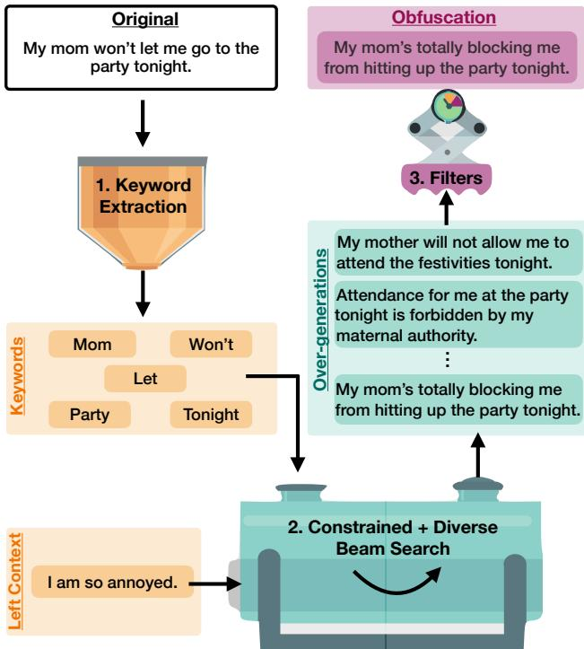  
Figure 1: JAMDEC framework.

Altakrori et al., 2022). This task holds implications in various domains, including online privacy, and blind review in academic research. However, safeguarding an authorship style, while maintaining the same content and grammatical fluency, is a complex task.

Unlike other authorship-related tasks such as paraphrasing or style transfer, authorship obfuscation poses unique technical challenges due to its different assumptions. For example, paraphrasing involves rephrasing an original text, but can be accomplished without altering the original style. Conversely, for style transfer, the task requires a predetermined target style. However, in the case of authorship obfuscation, there is no fixed endpoint style to guide the generation because the main goal is the absence or avoidance of a particular style. In fact, it may involve incorporating multiple styles or navigating a wide spectrum of possibilities to achieve success.1

One approach to authorship obfuscation is to use large language models, such as ChatGPT or GPT4. However, these models require large computing resources. Furthermore, if a user employs a method based on proprietary LLMs that retain user data, they are vulnerable to extra privacy threats or the leakage of their original content. To mitigate these risks, non-model or smaller closed model methods are preferred.

Other previous approaches for authorship obfuscation include the use of round-trip machine translation (Keswani et al., 2016), strict rule-based algorithms (Karadzhov et al., 2017), or iterativechange algorithms (Mahmood et al., 2019a). However, these methods either do not lead to enough modification (Keswani et al., 2016), diverge into grammatically incorrect text due to the rigid rules (Karadzhov et al., 2017), or require an additional large-scale authorship corpus (Mahmood et al., 2019a). Therefore, in comparison to modern LLMs, we find a notable performance gap between previous methods developed for smaller models.

To overcome these limitations, we present JAMDEC, a light-weight, user-controlled, unsupervised inference time algorithm for authorship obfuscation that can be used with any arbitrary text. JAMDEC employs smaller base models such as GPT2, which by themselves are too weak to produce accurate paraphrases, let alone obfuscation (Jung et al., 2023). To overcome this weakness, we frame the task as a constraint decoding problem, where the constraint is given as lexical keywords to include to control the content of the generation. To identify these keywords automatically, we leverage likelihood scores from smaller models. Lastly, since the decoded text is not guaranteed to be faithful to the original text, we design a filtering step that can be uniquely adjusted by the user. An overview of JAMDEC three-stage framework can be found in Figure 1. The name is inspired by Jambalaya, the popular American Creole and Cajun rice dish which is a mixture of meat, vegetables and spices.

We provide experimentation on two datasets, scholarly articles and diary-style entries with a range of three to ten authors. The results show that JAMDEC performs better than state-of-the-art methods of similar size and comparable to significantly larger language models in both automatic and human evaluations. In particular, we demonstrate that JAMDEC is able to obfuscate, while simultaneously preserving the original content, which previous methods cannot achieve. 2

## 2 Background on Authorship Obfuscation

Setup. Let be a given set of authors. We consider an original text $y _ { \mathrm { o r i g } }$ that was written by author $B \in { \mathcal { A } }$ . The task of authorship obfuscation aims to create a new text $y _ { \mathrm { o b f } }$ which can not be identified as written by author B. For evaluation, we consider a classification model $M ( \cdot )$ (also known as an authorship attribution models), which has been trained to classify texts of each author in . The aim is to create a method $f ( \cdot )$ such that $M ( f ( y _ { \mathrm { o r i g } } ) ) \ne B .$ Measure of a Successful Algorithm. Our goal is to create an obfuscated version of the original text that preserves the meaning and intent of the original text, while making it difficult to attribute the authorship to the original author. Following past literature (Mahmood et al., 2019a; PAN2018; Altakrori et al., 2022), we consider an obfuscation method successful if the obfuscated text satisfies the following three requirements:

• Style Concealment Analysis of the obfuscated text does not reveal the original author. This is usually measured using an authorship attribution model or a threat model (Mahmood et al., 2019b).

• Content Preservation The content of the original text is maintained. Metrics such as METEOR (Lavie et al., 2004), and Natural Language Inference models (NLI) (Liu et al., 2022) can be used to measure content overlap.

• Language Quality The obfuscated text is grammatically correct and natural sounding. Grammaticality of a text can be measured using a Corpus of Linguistic Acceptability (CoLA) model (Warstadt et al., 2019). Text fluency can be determined using human evaluation.

Inference-time Algorithms for Authorship Obfuscation. To address this task, we propose using an inference time algorithm that can obfuscate a text on-the-fly, rather than training a model on a specific author’s writing style. We choose to use a decoding time algorithm over fine-tuning as it offers several benefits, including more flexibility in the generation and the ability to obfuscate text without access to a corpus of the author’s writing.

<table><tr><td rowspan="2">Dataset</td><td>Method</td><td colspan="2">Mutant-X</td><td>Paraphrase</td><td>Machine Transl.</td><td>Stylometric</td><td colspan="2">JAMDEC</td></tr><tr><td>Metric</td><td>ENS</td><td>RFC</td><td></td><td></td><td></td><td>W/O Stylo</td><td>W/ Stylo</td></tr><tr><td rowspan="6">AMT-3</td><td>Drop Rate (ENS)</td><td>★</td><td>-0.04</td><td>0.04</td><td>0.04</td><td>-0.03</td><td>0.11</td><td>0.11</td></tr><tr><td>Drop Rate (BertAA)</td><td>0.10</td><td>0.04</td><td>0.04</td><td>0.08</td><td>0.12</td><td>0.04</td><td>0.04</td></tr><tr><td>METEOR</td><td>0.80</td><td>0.81</td><td>0.55</td><td>0.69</td><td>0.80</td><td>0.62</td><td>0.62</td></tr><tr><td>NLI</td><td>0.60</td><td>0.61</td><td>0.62</td><td>0.75</td><td>0.50</td><td>0.75</td><td>0.81</td></tr><tr><td>CoLA</td><td>0.50</td><td>0.51</td><td>0.78</td><td>0.69</td><td>0.46</td><td>0.85</td><td>0.79</td></tr><tr><td>Task Score (ENS)</td><td>★</td><td>0.36</td><td>0.48</td><td>0.49</td><td>0.31</td><td>0.57</td><td>0.57</td></tr><tr><td rowspan="8"></td><td>Task Score (BertAA)</td><td>0.40</td><td>0.39</td><td>0.48</td><td>0.51</td><td>0.36</td><td>0.55</td><td>0.55</td></tr><tr><td>Drop Rate (ENS)</td><td>★</td><td>0.08</td><td>0.20</td><td>0.20</td><td>0.23</td><td>0.10</td><td>0.13</td></tr><tr><td>Drop Rate (BertAA)</td><td>0.07</td><td>0.00</td><td>-0.06</td><td>0.07</td><td>0.04</td><td>0.14</td><td>0.14</td></tr><tr><td>METEOR</td><td>0.74</td><td>0.72</td><td>0.57</td><td>0.68</td><td>0.79</td><td>0.61</td><td>0.61</td></tr><tr><td>NLI</td><td>0.56</td><td>0.57</td><td>0.62</td><td>0.74</td><td>0.48</td><td>0.76</td><td>0.82</td></tr><tr><td>CoLA</td><td>0.51</td><td>0.55</td><td>0.77</td><td>0.69</td><td>0.46</td><td>0.85</td><td>0.79</td></tr><tr><td>Task Score (ENS)</td><td>★</td><td>0.40</td><td>0.53</td><td>0.54</td><td>0.39</td><td>0.57</td><td>0.58</td></tr><tr><td>Task Score (BertAA)</td><td>0.38</td><td>0.37</td><td>0.44</td><td>0.50</td><td>0.33</td><td>0.58</td><td>0.58</td></tr><tr><td rowspan="7">AMT-10</td><td>Drop Rate (ENS)</td><td>★</td><td>0.10</td><td>0.07</td><td>0.19</td><td>0.11</td><td>0.44</td><td>0.41</td></tr><tr><td>Drop Rate (BertAA)</td><td>0.03</td><td>0.04</td><td>-0.04</td><td>0.06</td><td>0.00</td><td>-0.03</td><td>-0.02</td></tr><tr><td>METEOR</td><td>0.84</td><td>0.86</td><td>0.54</td><td>0.66</td><td>0.81</td><td>0.60</td><td>0.61</td></tr><tr><td>NLI</td><td>0.61</td><td>0.64</td><td>0.61</td><td>0.73</td><td>0.45</td><td>0.79</td><td>0.79</td></tr><tr><td>CoLA</td><td>0.53</td><td>0.57</td><td>0.77</td><td>0.68</td><td>0.46</td><td>0.78</td><td>0.78</td></tr><tr><td>Task Score (ENS)</td><td>★</td><td>0.44</td><td>0.48</td><td>0.53</td><td>0.34</td><td>0.67</td><td>0.66</td></tr><tr><td>Task Score (BertAA)</td><td>0.39</td><td>0.42</td><td>0.45</td><td>0.49</td><td>0.30</td><td>0.51</td><td>0.52</td></tr><tr><td rowspan="7">BLOG-5</td><td>Drop Rate (ENS)</td><td>★</td><td>0.28</td><td>0.31</td><td>0.18</td><td>0.03</td><td>0.03</td><td>0.03</td></tr><tr><td>Drop Rate (BertAA)</td><td>0.06</td><td>0.30</td><td>0.47</td><td>0.0</td><td>0.0</td><td>0.29</td><td>0.29</td></tr><tr><td>METEOR</td><td>0.79</td><td>0.59</td><td>0.44</td><td>0.58</td><td>0.82</td><td>0.53</td><td>0.52</td></tr><tr><td>NLI</td><td>0.58</td><td>0.47</td><td>0.49</td><td>0.65</td><td>0.75</td><td>0.68</td><td>0.68</td></tr><tr><td>CoLA</td><td>0.44</td><td>0.46</td><td>0.63</td><td>0.55</td><td>0.44</td><td>0.74</td><td>0.73</td></tr><tr><td>Task Score (ENS)</td><td>★</td><td>0.40</td><td>0.47</td><td>0.46</td><td>0.41</td><td>0.48</td><td>0.48</td></tr><tr><td>Task Score (BertAA)</td><td>0.36</td><td>0.41</td><td>0.53</td><td>0.40</td><td>0.40</td><td>0.57</td><td>0.57</td></tr><tr><td rowspan="6">BLOG-10</td><td>Drop Rate (ENS)</td><td>★</td><td>0.13</td><td>0.35</td><td>0.30</td><td>0.21</td><td>0.23</td><td>0.32</td></tr><tr><td>Drop Rate (BertAA)</td><td>0.37</td><td>0.06</td><td>0.40</td><td>0.11</td><td>0.08</td><td>0.32</td><td>0.32</td></tr><tr><td>METEOR</td><td>0.55</td><td>0.85</td><td>0.43</td><td>0.61</td><td>0.82</td><td>0.54</td><td>0.53</td></tr><tr><td>NLI</td><td>0.46</td><td>0.61</td><td>0.46</td><td>0.62</td><td>0.75</td><td>0.67</td><td>0.67</td></tr><tr><td>CoLA</td><td>0.47</td><td>0.45</td><td>0.62</td><td>0.54</td><td>0.41</td><td>0.74</td><td>0.74</td></tr><tr><td>Task Score (ENS)</td><td>★</td><td>0.40</td><td>0.48</td><td>0.49</td><td>0.46</td><td>0.55</td><td>0.58</td></tr><tr><td></td><td>Task Score (BertAA)</td><td>0.43</td><td>0.37</td><td>0.49</td><td>0.42</td><td>0.41</td><td>0.58</td><td>0.58</td></tr></table>

Table 1: Results from the automatic evaluation for Mutant-X (using two internal classifiers; ENS and RFC), GPT3, Paraphrasing, Machine Translation, Stylometric and JAMDEC (using two variation of filtering; with and without stylometric-based obfuscator Stylo) across all datasets. The highest value is bolded and the second-highest value is underlined. Methods that use the same evaluation classifier during obfuscation are excluded (⋆).

Our proposed algorithm draws inspiration from various sources, including Diverse Beam Search (Vijayakumar et al., 2016), Lexically Constrained Decoding (Post and Vilar, 2018), and Neurologic decoding (Lu et al., 2021).

## 3 JAMDEC

We present JAMDEC, which obfuscates any text without any prior knowledge of the author. JAMDEC is composed of three main steps: keyword extraction, over-generation, and filtering, which can be implemented on a sentence, paragraph, or full document level.

## 3.1 Step 1: Keyword Extraction

First, we identify crucial keywords that encapsulate the original text’s content, and later ensure its inclusion in the generated obfuscated text to maintain content preservation. We explore multiple keyword extraction methods, including embedding-based extraction and likelihood-based extraction.

Embedding-based method. KeyBERT is a popular method for keyword extraction (Grootendorst,

2020), which uses BERT-embeddings and cosine similarity to find the sub-phrases in a document that are the most similar to the document itself.

Likelihood-based method. At a high level, we select the top-k tokens with the lowest conditional probabilities, as measured by a specific language model, as keywords for a given sentence. Intuitively, these tokens represent content that a language model might most struggle to generate accurately. We experiment with both an auto-regressive language model GPT2, and text-to-text language model T5. For GPT2, we compute the likelihood of each token conditioned on its previous content. For T5, we leverage its fill-in-the-blank ability by providing an input sentence with a specific token masked. We then calculate the probability of T5 generating that particular token as the infill, which serves as the likelihood of that token.

Since all the methods yield valid keywords in practice (see Appendix A.3), we utilize them all to generate numerous candidates for subsequent filtering to achieve high-quality obfuscation.

## 3.2 Step 2: Over-Generating Candidate Obfuscations

Next, we utilize the previously extracted keywords and the left context of $y _ { \mathrm { o r i g } }$ to over-generate many variations of $y _ { \mathrm { o r i g } }$ . We use m sentences occurring before $y _ { \mathrm { o r i g } }$ as the left context to encourage fluid generation. Our goal is to produce multiple generations constrained by the extracted keywords, ensuring content similar to $y _ { \mathrm { o r i g } } .$ . At the same time, we aim to produce a variety of generations with diverse authorship styles to achieve obfuscation effectively. To achieve these seemingly opposing goals, we merge two decoding techniques, Lexically Constrained Beam Search (Post and Vilar, 2018)and Diverse Beam Search (Vijayakumar et al., 2016), and refer to the combined approach as Constrained Diverse Beam Search (CoDi-BS).

Constrained Diverse Beam Search. CoDi-BS employs Constrained Beam Search (Co-BS) as the base algorithm, but uses the scoring function from Diverse Beam Search (Di-BS) instead of likelihoods when iteratively selecting the top k candidates from each bank. Its objective function can be represented as:

$$
\underset { w \in W } { \arg \operatorname* { m a x } } P _ { w } ( y | x ) + \lambda _ { 1 } D ( y , Y ) + \lambda _ { 2 } C ( y )
$$

where x is the sequence of previous tokens, $D ( y , Y )$ is a diversity term measuring the dissimilarity between the output sequence y and the set of previously selected sequences Y within the beam, $C ( y )$ is a constraint function quantifying the degree to which the output sequence y satisfies the constraints, $\lambda _ { 1 } , \lambda _ { 2 }$ are hyperparameters controlling the weight of the diversity and constraint penalty, and $w \in W$ is the parameter vector. Intuitively, CoDi-BS promotes candidates distinct from the previously chosen ones, while also ensuring that they satisfy a specific number of constraints. Appendix H has an overview of the CoDi-BS algorithm and details of both Constraint and Diverse Beam Search separately.

## 3.3 Step 3: Filtering Candidate Obfuscations

The filtering stage comprises multiple steps to refine the pool of candidates from the previous stage, ultimately choosing the most suitable obfuscation. This step enables the user to have full control in selecting generations based on any metric. In our pipeline, we first filter based on an NLI (Natural Language Inference) threshold, which evaluates the coherence and content overlap between the generations and the original text. Next, we further filter the remaining candidates based on a CoLA (Corpus of Linguistic Acceptability) threshold, which focuses on the grammatical correctness and linguistic acceptability of the generations. Finally, and optionally, taking into account any previous knowledge of the author, we choose the ultimate obfuscation to be the generation that deviates the most from the original author’s style. In our experiment, we do not assume any prior knowledge of the authors to showcase the effectiveness of our method in a more challenging situation.

## 4 EXPERIMENTS

We evaluate two versions of JAMDEC on two benchmarks in distinct domains: scholarly passages and diary-style entries. For baselines, we consider three state-of-the-art methods for authorship obfuscation: Mutant-X (Mahmood et al., 2019a), Round-Trip Translation (Keswani et al., 2016), and Stylometric (Karadzhov et al., 2017), and a paraphrasing method (Zhang et al., 2020). As a stronger baseline, we also consider using zero-shot prompting of GPT3.5 175B which is orders of magnitude larger (Brown et al., 2020). For further details, see Appendix G and for access to the code see here.

## 4.1 Setup

Datasets. We used two datasets to evaluate JAMDEC. The first is the Extended-Brennan-

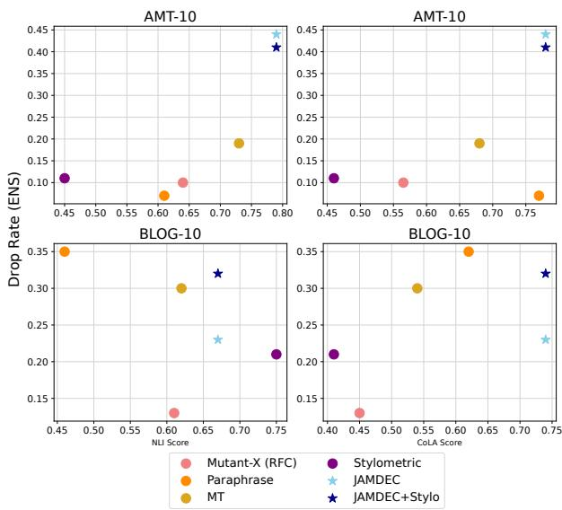  
Figure 2: Highlighting the trade-offs between obfuscation (Drop Rate (ENS)), content preservation (NLI), and language quality (CoLA) of each method for the AMT-10 and BLOG-10 datasets. The dotted line indicates the trend through all methods.

Greenstadt (Brennan et al., 2012) which is a collection of "scholarly" short ( 500-word) paragraphs gathered from Amazon Mechanical Turk (AMT). We use this dataset, which we refer to as AMT, to produce three test datasets with 3, 5, and 10 authors, with n = 27, 30, 49 texts respectively (AMT-3, AMT-5, AMT-10).

The second dataset is the Blog Authorship corpus (Schler et al., 2006), a collection of blogs (diary-style entries) that were posted to blog.com. Similarly, we use this dataset to construct two datasets with 5 and 10 authors, with n = 72, 150 texts respectively (BLOG-5, BLOG-10).

JAMDEC Configuration. To promote diversity of generated candidates, we employ all three types of keyword extraction methods, (KeyBERT, Likelihood-GPT2, and Likelihood-T5), and either CoDi-BS or only CBS. We ran with a beam width of 50. All other details can be found in Appendix G.

In the filtering stage, we occasionally find cases where none of the generations passes either NLI or CoLA filter. We consider two ways of handling such cases – (1) JAMDEC, where we simply output the original sentence, (2) JAMDEC + STYLO, where we run a basic stylometric obfuscator on the original sentence.3

<table><tr><td rowspan=1 colspan=1>Method</td><td rowspan=1 colspan=1>Generation</td></tr><tr><td rowspan=1 colspan=1>Original</td><td rowspan=1 colspan=1>The Ex. An ex holding a grudge can do a lot of damage in ashort amount of time. He knows enough to open accounts inyour name, and he has the motive to hurt you.</td></tr><tr><td rowspan=1 colspan=1>Mutant-X</td><td rowspan=1 colspan=1>The Ex. An ex holding a bitterness able ought a lot ofdamage in a length quantity of time. He knows enough toascend accounts in Your prefix, and he has the justifiable toimpair You.</td></tr><tr><td rowspan=1 colspan=1>Paraphrase</td><td rowspan=1 colspan=1>A lot of damage can be done In a short period of time. Heknows how to open accounts In your name and he wants tohurt you.</td></tr><tr><td rowspan=1 colspan=1>MachineTranslation</td><td rowspan=1 colspan=1>The former. An old man who holds a knife can make a lotof damage in a short time. He knows enough to open accountsin your name, and he has the reason to hurt you</td></tr><tr><td rowspan=1 colspan=1>Stylometric</td><td rowspan=1 colspan=1>An ex holding, a grudge can do a lot inside damage in abrief amount in time, yet he knows enough to open accountsin your name, and he has the motive to hurt you.</td></tr><tr><td rowspan=1 colspan=1>JAMDEC</td><td rowspan=1 colspan=1>The Ex. When the ex is holding his grudge against theperson who caused him lot of damage to his life, he isshort sighted and will do anything in his power to getback at that person, no matter how much it will hurt theperson he is trying to get revenge against. He knowsenough to open accounts in your name, and he has the motive</td></tr><tr><td rowspan=1 colspan=1>JAMDEC +Stylo</td><td rowspan=1 colspan=1>The Ex. When the ex is holding his grudge against theperson who caused him lot of damage to his life, he isshort sighted and will do anything in his power to getback at that person, no matter how much it will hurt theperson he is trying to get revenge against. He believesenough to open accounts in your name, and he has the reasonto hurt you.</td></tr></table>

Figure 3: Qualitative examples of obfuscated text created by each method. The sentences are taken from the AMT-3 dataset. Changes to the original are outline in blue (correct grammatically and in context) and red (incorrect grammatically or out of context).

Baselines.4 We use the following baselines.

Stylometric Obfuscation: A stylometric obfuscation (Stylometric) proposed by Karadzhov et al. (2017), calculates a suite of statistical features (e.g. average number of words per sentence, word frequency, etc.) that are indicative of style, then modifies the text such that these metrics align with an "average" value, pre-calculated on a training set.

Mutant-X: Mutant-X (Mahmood et al., 2019a) is a genetic algorithm which iteratively substitutes words in the original text with the synonyms selected by an internal classifier. Additionally, at random iterations, it incorporates a "crossover" effect that involves cutting two parent texts at a random position and combining them to create two new child texts. This method does require an additional authorship corpus to train the internal classifier. For consistency, we adopt the same features and architectures for the internal classifier (Ensemble and Random Forest), as suggested in the subsequent work by Haroon et al. (Haroon et al., 2021). For more information on training these classifier models, reference Section 4.1. To accurately compare with all methods, we leave out any results from Mutant-X where the internal classifier matches the evaluation classifier, since we do not assume access to the evaluation models during obfuscation.

Paraphrasing: Although paraphrasing has a slightly different goal than authorship obfuscation, we include the comparison for a thorough investigation of all methods. We employ a state-of-the-art paraphrasing model, PEGASUS Paraphrase (Zhang et al., 2020; par) a PEGASUS model fine-tuned on a self-supervised task for paraphrasing.

Round-Trip MT: Additionally, we consider a baseline powered by round-trip translation, a popular approach for authorship obfuscation (Keswani et al., 2016). We implement the approach using M2M100, a state-of-the-art translation model, translation English text into German, then to French, and finally back to English.

GPT3.5: Lastly, considering the significant progress made in large language models, we include a comparison with zero-shot prompted GPT3.5 (text-davinci-003) (Brown et al., 2020). We consider two approaches – sentence-level obfuscation (obfuscating each sentence individually), and paragraph-level obfuscation (obfuscating the entire text as a whole). We note that prompt selection is very important and tried to find the best prompt for the task. The specific prompts utilized for this purpose can be found in Appendix G. Due to financial constraints, we limit this baseline to AMT-3.

A time consumption analysis of these methods can be found in Appendix E.

<table><tr><td rowspan="2">Method Metric</td><td colspan="2">GPT3.5</td><td colspan="2">JAMDEC</td></tr><tr><td>Sentence</td><td>Paragraph</td><td>W/O Stylo</td><td>W/ Stylo</td></tr><tr><td>Drop Rate (ENS)</td><td>0.23</td><td>0.23</td><td>0.11</td><td>0.11</td></tr><tr><td>Drop Rate (BertAA)</td><td>0.13</td><td>0.09</td><td>0.04</td><td>0.04</td></tr><tr><td>METEOR</td><td>0.33</td><td>0.41</td><td>0.62</td><td>0.62</td></tr><tr><td>NLI</td><td>0.77</td><td>0.73</td><td>0.75</td><td>0.81</td></tr><tr><td>CoLA</td><td>0.76</td><td>0.80</td><td>0.85</td><td>0.79</td></tr><tr><td>Task Score (ENS)</td><td>0.59</td><td>0.59</td><td>0.57</td><td>0.57</td></tr><tr><td>Task Score (BertAA)</td><td>0.55</td><td>0.54</td><td>0.55</td><td>0.55</td></tr></table>

Table 2: Results from the automatic evaluation for GPT3 and JAMDEC (using two variation of filtering; with and without stylometric-based obfuscator Stylo) for AMT-3. The highest value is bolded and the second-highest value is underlined.

Automatic Evaluation. We evaluate all method along the following three axes.

1. Style Concealment: In line with past work, we use two authorship attribution models trained on stylometric features for authorship verification.

The first employs Writeprints-static (Brennan et al., 2012), a collection of lexical and syntactic features, such as word length, average word count, and usage of function words, among others. Recognizing that classification from one model may not transfer effectively to all text (Mahmood et al., 2019a), we adopt the ensemble attribution classifier (ENS) methodology introduced by Haroon et al. (2021), which comprises several attribute-based classifiers, each utilizing different attributes, and leverages a voting system for their aggregation. Since this has been shown to give the most accurate classification results (Haroon et al., 2021), we use ENS for both the Mutant-X method and evaluation. We also train a random forest classifier (RFC) as another internal classifier for the Mutant-X method. Further details on the training can be found in Appendix G.

Second, we use a more sophisticated architecture by using BertAA model (Fabien et al., 2020), a BERT fine-tuned specifically for authorship attribution. 5

Using an authorship attribution model (either ENS or BertAA), we calculate the Drop Rate or the average drop in the percentage of obfuscated text that were not identified as the true author compared to the original text. This metric accounts for any inaccuracy of the attribution models, see Appendix G.2 for more information.

We note that adversarial threat model can be used for further evaluation and comparison (Zhai et al., 2022; Mahmood et al., 2020), therefore provide an ablation study in Appendix C using this type of evaluation.

2. Content Preservation: To maintain consistency with previous studies, we compute the ME-TEOR (Banerjee and Lavie, 2005) score between the original and obfuscated text, which evaluates token overlap (Mahmood et al., 2019a; Shetty et al., 2018). However, we note that content semantics can be preserved without direct token overlap by the use of synonyms, therefore we also assess the probability of entailment between the original and obfuscated text using a natural language inference (NLI) model called WANLI (Liu et al., 2022). We will rely on NLI as the main component of content overlap due to its flexibility in measuring content preservation and coherence.

3. Language Quality: To measure language quality, we employ a TextAttack (Morris et al.,

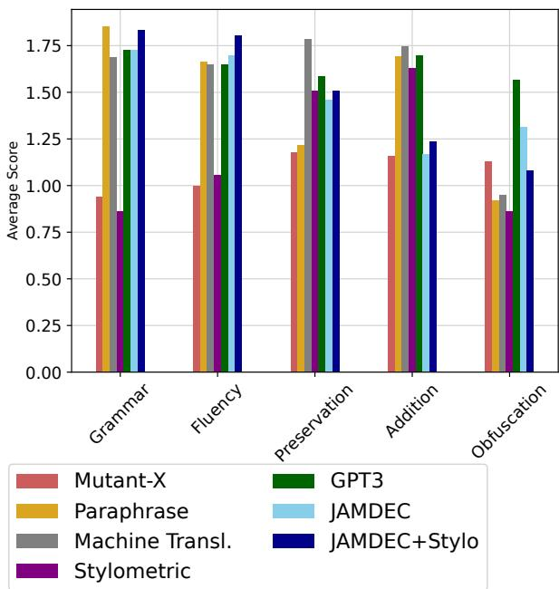  
Figure 4: Human Evaluation on 102 random samples from AMT-3. We include two versions of our method with differing filtering stages (with and without Stylo).

2020), which fine-tunes RoBERTa (Liu et al., 2019) on the Corpus of Linguistic Acceptability (CoLA) (Warstadt et al., 2019). The CoLA dataset consists of 10.6k sentences that have been linguistically annotated to assess their grammatical correctness.

Overall Task Score: While each of the dimensions above is crucial for the holistic evaluation of author obfuscation system, we also aim to provide an aggregate of the scores into a single task score. Therefore, we also define Task Score, an unweighted average of the Drop Rate (using ENS or BertAA), NLI score, and CoLA score. We use the mean of the dimension, as the task of authorship obfuscation is deemed to be successful only if all three goals are satisfied. 6:

$$
{ \mathrm { T a s k ~ S c o r e } } = { \frac { { \mathrm { D r o p ~ R a t e } } + { \mathrm { N L I } } + { \mathrm { C o L A } } } { 3 } } .
$$

Human Evaluation. On dataset AMT-3, we additionally use human evaluations to validate our automatic measures. We randomly select 102 short passages (one to four sentences) from AMT-3 for this evaluation. We employed Amazon Mechanical Turk workers to read both the original and obfuscated text, and then asked a series of five questions to be rated on a three-point likert scale.

## 4.2 Main Results

JAMDEC has higher Task Score compared to all task-specific methods and similar or better to GPT3. In Table 1 and Table 2, we present the results from the automatic evaluations. JAMDEC (with or without Stylo) with 1.5B GPT2-XL has the highest Task Scores for almost every dataset, and only 2% lower BertAA Task Score than 175B GPT3.5. Of note, is AMT-10, where it performs more than 10% higher than almost all other methods on ENS and BertAA Task Score. This indicates, that JAMDEC is successful in all three goals of authorship obfuscation across different genre of texts. Also, we observe that the two variations of JAMDEC perform similarly across the datasets.

JAMDEC strikes a better balance between content preservation and author obfuscation. Figure 2 depicts the variability in the AMT-10 and BLOG-10 datasets’ Drop Rate, NLI score, and CoLA score. Preferably, a method should score high in all metrics, resulting in a position in the top right quadrant of each graph. However, we observe a clear trade-off for each of the task-specific baselines. For example, in BLOG-10, the Paraphrase method has an ENS Drop Rate 3% higher than JAMDEC, but it also has a 12% lower CoLA rate and 21% lower NLI, as seen by the orange dots in the top left corner and center of the bottom left and right graph. In contrast, we observe that JAMDEC lies closely to the top right in each graph, demonstrating its effectiveness in balancing the various objectives of authorship obfuscation. Other datasets show similar results and can be viewed in Appendix A.5.

This is also supported by qualitative inspection, where we notice poor grammar quality in obfuscated text produced by the task-specific methods, which makes it easy to trick an automatic classifier, however does not maintain the quality and content of the original text. This was particularly relevant in the BLOG datasets, which already contains informal language that can be easily corrupted by single word replacement methods. We provide a qualitative example in Figure 3.

Human evaluations confirms that JAMDEC maintains language quality while successfully obfuscating. The outcomes of the human evaluation of AMT-3 are shown in Figure 4. Similar to the automatic evaluation, JAMDEC human evaluation scores are 5% 50% higher for Grammar and Fluency, than most other method, including GPT3.5.

For Content Preservation, JAMDEC performs onpar with GPT3.5, while Machine Translation unsurprisingly scores the highest because it only tends to slightly modify the original text, as shown in Figure 3. While we observe JAMDEC to be relatively weak in Content Addition, we attribute this mainly to the limitation of the human evaluation environment. Our approach involves utilizing a left context in the beam search process, allowing the model to consider information from earlier sentences when generating subsequent ones. As a result, some generations incorporate data from earlier sentences. However, the samples used for the human evaluation were random short passages taken from the whole text, making it possible for the workers to perceive the information as an "addition" when it was actually present earlier in the passage. However, despite this, we see that JAMDEC performs better than all task-specific methods in Obfuscation by at least 10%.

## 4.3 Ablation and Other Studies

We conduct ablation studies 7 on JAMDEC, to better understand the contribution of each component.

JAMDEC performs better at authorship obfuscation using CoDi-BS. We find that using CoDi-BS leads to an overall increase in Drop Rate of  6% and an increase in the number of sentences that pass the base NLI and CoLA threshold of about 32%, with little change in NLI and CoLA score compared to only using CBS.

JAMDEC + STYLO performs better in human evals without the CoLA threshold. We run an additional human evaluation with obfuscation created using JAMDEC + STYLO but without a final CoLA threshold. Without a final CoLA threshold, all sentences transformed using Stylo were used. It resulted in an overall increase in Obfuscation of 0.09% compared to JAMDEC +Stylo with a threshold, making it higher than all task-specific methods. However, it did have a decrease of 0.15% and 0.13% in Grammar and Fluency, respectively.

JAMDEC is competitive in respect to time consumption. When optimized for time consumption, JAMDEC outperforms all other baselines on Task Score (BertAA) while maintaining a time consumption less than the average of the baselines. A full analysis can be found in Figure 10.

## 5 Related Work

Stylometry. Stylometry, a field for statistically analyzing variations in writing styles, has long been used for authorship verification (Goodman et al., 2007; Fox and Ehmoda, 2012; Jockers and Witten, 2010). Consequently, employing stylometry as a means to assess writing style served as a logical extension in the task of authorship obfuscation.

Stylometric Feature Approaches. Some approaches rely solely on stylometric features to create general numerical-based rules for obfuscation. For example, in a method submitted to the PAN 2016 Author Masking Shared Task by Mansoorizadeh et al. (2016), they substituted synonyms for the most frequently used terms in a text. Another method, submitted to the same Shared Task was from Karadzhov et al. (2017), was more complex and used on a set of 500+ stylometric features such as average amount of words, word frequency, and punctuation. Based on these calculable attributes, the approach adjusted the text to bring the values closer to a pre-determined "average" (derived from a large training corpus). These approaches are often simple to implement, require no additional corpus, and may be used on any text. However, the rigidity of these rules often lead to incorrect grammar or non-fluent speech (Mahmood et al., 2019a; Mihaylova et al., 2016).

Model Based Approaches. Other approaches incorporate more flexibility by utilizing deep learning models. One of the most successful deep learning methods is the Support Vector Machine combined with Writeprint-Static(Brennan et al., 2012), which uses a collection of 500+ stylistic features from Writeprint (Abbasi and Chen, 2008) to construct a Support Vector Machine (SVM) model for authorship detection. It then uses this classifier as a guide in conjunction with a pattern disruption method. This framework inspired additional methods, such as Mutant-X (Mahmood et al., 2019a), a genetic algorithm that utilizes an internal classifier to iteratively "mutate" a sentence. At first this method used SVC or Random Forest architecture for the internal classifiers, but in later works reported to be more successful when an ensemble of classifiers was used (Haroon et al., 2021). There has also been work which used variational autoencoder (VAE) network models to generate differentially private obfuscations (Weggenmann et al., 2022). This was done using probabilistic encoders to do differentially private latent sampling.

Another approach, which shares popularity with the task of paraphrasing, is round-trip machine translation using supervised language models. Initial implementations of this method relied on statistical machine translation techniques like Moses, as demonstrated in Keswani et al. (2016). This approach involved translating text from English to German via French and then back to English. However, this method often produced nonsensical or inaccurate content (Mihaylova et al., 2016). Fortunately, with the advancement of machine translation models, we have seen a significant increase in language quality (Altakrori et al., 2022).

Authorship Imitation Approach. Although authorship imitation (or style transfer) is regarded as a distinct, separate task from authorship obfuscation, it can be used as an obfuscation strategy when the author’s identity is known. For example, Shetty et al. (2017) employ prior knowledge of the original authors’ qualities such as age and gender to train a GAN-based model to generate content in multiple styles. For example, if the author is known to be an adult, this method would rewrite the section in a teenager’s tone. This strategy involves not only knowledge of the original author, but also a target style to shift to, making it a less general method for obfuscation. Jones et al. (2022) also use a similar approach by training GPT2 models to successfully mimic blog or Twitter users to deceive authorship attribution models.

## 6 Conclusion

In this work, we introduced JAMDEC, a novel approach to user-controlled, inference-time authorship obfuscation which utilizes only small, opensource language models. This technique involves three key stages: keyword extraction, constrained diverse beam search, and filtering, offering users fine-grained control over the process and yielding personalized outcomes dependent on the user’s needs. We showed experimentation on two diverse datasets, and demonstrated that JAMDEC outperformed over existing state-of-the-art methods in authorship obfuscation, while also showcasing its competitive performance against significantly larger models like GPT3.5. Our findings underscore the promise of JAMDEC as an effective strategy for authorship obfuscation, harnessing the capabilities of smaller, openly available models to achieve results on par with their larger counterparts.

## 7 Limitations

JAMDEC has several limitations. First, for creation of the obfuscation candidates, we employ generations from a pre-trained language model. These models, however, have been known to add factually incorrect or hallucinatory information (Ji et al., 2022). Despite the fact that we have contentpreserving filters, we have discovered that at times, additional information can bypass these filters and make it into the final obfuscation.

Second, our approach is based on producing several candidates for each obfuscation. If the approach is employed at the sentence-level and the text is lengthy, it may take a long time to employ. Despite the fact that we demonstrated that our method works similarly with fewer generations, it is slower than traditional stylometric-based methods.

Lastly, the specific filtering techniques (e.g., NLI, CoLA) we used may carry biases into the eventual obfuscated texts. For example, CoLA might only be able to correctly filter standard, plain English language, but might not be as stable in certain dialects, which may exacerbate social injustice, e.g., correcting (whitewashing) African American English dialect. Users of this authorship obfuscation technique are strongly advised to examine the method for their specific text genre before deploying to ensure proper intended use.

Although we present our method with only beneficial use in mind, we acknowledge that the task of authorship obfuscation can be potentially dangerous in itself. First, it could be misused for anonymizing people’s writing style for malicious intents, e.g., spamming or making hateful comments online without taking accountability for their actions. Also, these techniques could pose the risk of violating intellectual properties and rights when the creative work of authors is obscured to lose credits. We urge the user to think critically before using these types of methods.

## 8 Acknolwedgement

This research is based upon work supported in part by NSF DMS-2134012, DMS-2023166, CCF-2019844, and the Office of the Director of National Intelligence (ODNI)’s IARPA program via 2022- 22072200003. The views and conclusions contained herein are those of the authors and should not be interpreted as representing the official views of ODNI, IARPA, or the U.S. Government.

## References

Pegasus paraphrase. https://huggingface.co/ tuner007/pegasus\_paraphrase. Accessed: 2023- 10-15.

Ahmed Abbasi and Hsinchun Chen. 2008. Writeprints: A stylometric approach to identity-level identification and similarity detection in cyberspace. ACM Trans. Inf. Syst., 26(2).

Malik Altakrori, Thomas Scialom, Benjamin C. M. Fung, and Jackie Chi Kit Cheung. 2022. A multifaceted framework to evaluate evasion, content preservation, and misattribution in authorship obfuscation techniques. In Proceedings ofthe 2022 Conference on Empirical Methods in Natural Language Processing, pages 2391–2406, Abu Dhabi, United Arab Emirates. Association for Computational Linguistics.

Satanjeev Banerjee and Alon Lavie. 2005. METEOR: An automatic metric for MT evaluation with improved correlation with human judgments. In Proceedings ofthe ACL Workshop on Intrinsic and Extrinsic Evaluation Measures for Machine Translation and/or Summarization, pages 65–72, Ann Arbor, Michigan. Association for Computational Linguistics.

Michael Brennan, Sadia Afroz, and Rachel Greenstadt. 2012. Adversarial stylometry: Circumventing authorship recognition to preserve privacy and anonymity. ACM Transactions on Information and System Security (TISSEC), 15.

Laura F Bright, Hayoung Sally Lim, and Kelty Logan. 2021. “should i post or ghost?”: Examining how privacy concerns impact social media engagement in us consumers. Psychology & marketing, 38(10):1712– 1722.

Tom Brown, Benjamin Mann, Nick Ryder, Melanie Subbiah, Jared D Kaplan, Prafulla Dhariwal, Arvind Neelakantan, Pranav Shyam, Girish Sastry, Amanda Askell, Sandhini Agarwal, Ariel Herbert-Voss, Gretchen Krueger, Tom Henighan, Rewon Child, Aditya Ramesh, Daniel Ziegler, Jeffrey Wu, Clemens Winter, Chris Hesse, Mark Chen, Eric Sigler, Mateusz Litwin, Scott Gray, Benjamin Chess, Jack Clark, Christopher Berner, Sam McCandlish, Alec Radford, Ilya Sutskever, and Dario Amodei. 2020. Language models are few-shot learners. In Advances in Neural Information Processing Systems, volume 33, pages 1877–1901. Curran Associates, Inc.

Shuguang Chen, Leonardo Neves, and Thamar Solorio. 2022. Style transfer as data augmentation: A case study on named entity recognition. In Conference on Empirical Methods in Natural Language Processing.

Maël Fabien, Esau Villatoro-Tello, Petr Motlicek, and Shantipriya Parida. 2020. BertAA : BERT finetuning for authorship attribution. In Proceedings

ofthe 17th International Conference on Natural Language Processing (ICON), pages 127–137, Indian Institute of Technology Patna, Patna, India. NLP Association of India (NLPAI).

Angela Fan, Shruti Bhosale, Holger Schwenk, Zhiyi Ma, Ahmed El-Kishky, Siddharth Goyal, Mandeep Baines, Onur Celebi, Guillaume Wenzek, Vishrav Chaudhary, Naman Goyal, Tom Birch, Vitaliy Liptchinsky, Sergey Edunov, Edouard Grave, Michael Auli, and Armand Joulin. 2020. Beyond english-centric multilingual machine translation. arXiv preprint.

Neal P. Fox and Omran Ehmoda. 2012. Statistical stylometrics and the marlowe-shakespeare authorship debate.

Robert Goodman, Matthew Hahn, Madhuri Marella, Christina Ojar, and Sandy Westcott. 2007. The use of stylometry for email author identification: A feasibility study. Proc. Student/Faculty Research Day.

Maarten Grootendorst. 2020. Keybert: Minimal keyword extraction with bert.

Project Gutenberg. [link].

Muhammad Haroon, Muhammad Fareed Zaffar, Padmini Srinivasan, and Zubair Shafiq. 2021. Avengers ensemble! improving transferability of authorship obfuscation. CoRR, abs/2109.07028.

Matthew Honnibal and Ines Montani. 2017. spaCy 2: Natural language understanding with Bloom embeddings, convolutional neural networks and incremental parsing. To appear.

Ziwei Ji, Nayeon Lee, Rita Frieske, Tiezheng Yu, Dan Su, Yan Xu, Etsuko Ishii, Yejin Bang, Wenliang Dai, Andrea Madotto, and Pascale Fung. 2022. Survey of hallucination in natural language generation. ACM Computing Surveys, 55:1 – 38.

Matthew L. Jockers and Daniela M. Witten. 2010. A comparative study of machine learning methods for authorship attribution. Literary and Linguistic Computing, 25(2):215–223.

Keenan Jones, Jason R. C. Nurse, and Shujun Li. 2022. Are you robert or roberta? deceiving online authorship attribution models using neural text generators.

Jaehun Jung, Peter West, Liwei Jiang, Faeze Brahman, Ximing Lu, Jillian R. Fisher, Taylor Sorensen, and Yejin Choi. 2023. Impossible distillation: from low-quality model to high-quality dataset & model for summarization and paraphrasing. ArXiv, abs/2305.16635.

Georgi Karadzhov, Tsvetomila Mihaylova, Yasen Kiprov, Georgi Georgiev, Ivan Koychev, and Preslav Nakov. 2017. The case for being average: A mediocrity approach to style masking and author obfuscation. International Conference of the Cross-Language Evaluation Forum for European Languages, pages 173–185.

Yashwant Keswani, H. Trivedi, Parth Mehta, and Prasenjit Majumder. 2016. Author masking through translation. In Conference and Labs of the Evaluation Forum.

Kalpesh Krishna, John Wieting, and Mohit Iyyer. 2020. Reformulating unsupervised style transfer as paraphrase generation. In Proceedings ofthe 2020 Conference on Empirical Methods in Natural Language Processing (EMNLP), pages 737–762, Online. Association for Computational Linguistics.

Alon Lavie, Kenji Sagae, and Shyamsundar Jayaraman. 2004. The significance of recall in automatic metrics for MT evaluation. In Proceedings of the 6th Conference ofthe Associationfor Machine Translation in the Americas: Technical Papers, pages 134–143, Washington, USA. Springer.

Wikipedia Frequency List. Wikipedia frequency list.

Alisa Liu, Swabha Swayamdipta, Noah A. Smith, and Yejin Choi. 2022. WANLI: Worker and AI collaboration for natural language inference dataset creation. In Findings of the Association for Computational Linguistics: EMNLP 2022, pages 6826–6847, Abu Dhabi, United Arab Emirates. Association for Computational Linguistics.

Yinhan Liu, Myle Ott, Naman Goyal, Jingfei Du, Mandar Joshi, Danqi Chen, Omer Levy, Mike Lewis, Luke Zettlemoyer, and Veselin Stoyanov. 2019. Roberta: A robustly optimized BERT pretraining approach. CoRR, abs/1907.11692.

Zhi Liu. Reuter 5050 data set.

Zhi Liu. 2011. Reuter 50-50. UCI Machine Learning Repository. DOI: https://doi.org/10.24432/C5DS42.

Ximing Lu, Peter West, Rowan Zellers, Ronan Le Bras, Chandra Bhagavatula, and Yejin Choi. 2021. Neurologic decoding: (un)supervised neural text generation with predicate logic constraints. In Proceedings of the 2021 Conference of the North American Chapter ofthe Associationfor Computational Linguistics: Human Language Technologies, pages 4288–4299, Online. Association for Computational Linguistics.

Asad Mahmood, Faizan Ahmad, Zubair Shafiq, Padmini Srinivasan, and Fareed Zaffar. 2019a. A girl has no name: Automated authorship obfuscation using mutant-x. Proceedings on Privacy Enhancing Technologies, 2019(4):54–71.

Asad Mahmood, Faizan Ahmad, Zubair Shafiq, Padmini Srinivasan, and Fareed Zaffar. 2019b. A girl has no name: Automated authorship obfuscation using mutant-x. Proceedings on Privacy Enhancing Technologies, 2019:54 – 71.

Asad Mahmood, Zubair Shafiq, and Padmini Srinivasan. 2020. A girl has a name: Detecting authorship obfuscation. In Proceedings of the 58th Annual Meeting of the Association for Computational Linguistics, pages 2235–2245, Online. Association for Computational Linguistics.

Muharram Mansoorizadeh, Taher Rahgooy, Mohammad Aminian, and Mehdy Eskandari. 2016. Author obfuscation using wordnet and language models. In Conference and Labs ofthe Evaluation Forum.

Amazon Mechanical Turk. [link].

Tsvetomila Mihaylova, Georgi Karadzhov, Preslav Nakov, Yasen Kiprov, Georgi Georgiev, and Ivan Koychev. 2016. Su@ pan’2016: Author obfuscation—notebook for pan at clef 2016.

John Morris, Eli Lifland, Jin Yong Yoo, Jake Grigsby, Di Jin, and Yanjun Qi. 2020. Textattack: A framework for adversarial attacks, data augmentation, and adversarial training in nlp. In Proceedings of the 2020 Conference on Empirical Methods in Natural Language Processing: System Demonstrations, pages 119–126.

PAN2016. Obfuscation evaluation 2016.

PAN2018. Obfuscation evaluation 2018.

Matt Post and David Vilar. 2018. Fast lexically constrained decoding with dynamic beam allocation for neural machine translation. In North American Chapter ofthe Associationfor Computational Linguistics.

Chen Qian, Ting He, and Ren Zhang. 2017. Deep learning based authorship identification.

Alec Radford, Jeff Wu, Rewon Child, David Luan, Dario Amodei, and Ilya Sutskever. 2019. Language models are unsupervised multitask learners.

Colin Raffel, Noam Shazeer, Adam Roberts, Katherine Lee, Sharan Narang, Michael Matena, Yanqi Zhou, Wei Li, and Peter J. Liu. 2020. Exploring the limits of transfer learning with a unified text-to-text transformer. Journal of Machine Learning Research, 21(140):1–67.

Jonathan Schler, Moshe Koppel, Shlomo Argamon, and James W Pennebaker. 2006. Effects of age and gender on blogging. In AAAI spring symposium: Computational approaches to analyzing weblogs, volume 6, pages 199–205.

Rakshith Shetty, Bernt Schiele, and Mario Fritz. 2017. A4nt: Author attribute anonymity by adversarial training of neural machine translation. In USENIX Security Symposium.

Rakshith Shetty, Bernt Schiele, and Mario Fritz. 2018. A4NT: Author attribute anonymity by adversarial training of neural machine translation. In 27th USENIX Security Symposium (USENIX Security 18), pages 1633–1650, Baltimore, MD. USENIX Association.

Maria Tikhonova, Elina Telesheva, Sergey Mirzoev, Polina Tarantsova, Stanislav Petrov, and Alena Fenogenova. 2021. Style transfer in nlp: a framework and multilingual analysis with friends tv series. 2021 International Conference Engineering and Telecommunication (En&T), pages 1–6.

Ewoenam Kwaku Tokpo and Toon Calders. 2022. Text style transfer for bias mitigation using masked language modeling. In North American Chapter ofthe Associationfor Computational Linguistics.

Hugo Touvron, Louis Martin, Kevin Stone, Peter Albert, Amjad Almahairi, Yasmine Babaei, Nikolay Bashlykov, Soumya Batra, Prajjwal Bhargava, Shruti Bhosale, Dan Bikel, Lukas Blecher, Cristian Canton Ferrer, Moya Chen, Guillem Cucurull, David Esiobu, Jude Fernandes, Jeremy Fu, Wenyin Fu, Brian Fuller, Cynthia Gao, Vedanuj Goswami, Naman Goyal, Anthony Hartshorn, Saghar Hosseini, Rui Hou, Hakan Inan, Marcin Kardas, Viktor Kerkez, Madian Khabsa, Isabel Kloumann, Artem Korenev, Punit Singh Koura, Marie-Anne Lachaux, Thibaut Lavril, Jenya Lee, Diana Liskovich, Yinghai Lu, Yuning Mao, Xavier Martinet, Todor Mihaylov, Pushkar Mishra, Igor Molybog, Yixin Nie, Andrew Poulton, Jeremy Reizenstein, Rashi Rungta, Kalyan Saladi, Alan Schelten, Ruan Silva, Eric Michael Smith, Ranjan Subramanian, Xiaoqing Ellen Tan, Binh Tang, Ross Taylor, Adina Williams, Jian Xiang Kuan, Puxin Xu, Zheng Yan, Iliyan Zarov, Yuchen Zhang, Angela Fan, Melanie Kambadur, Sharan Narang, Aurelien Rodriguez, Robert Stojnic, Sergey Edunov, and Thomas Scialom. 2023. Llama 2: Open foundation and finetuned chat models.

Ashwin K. Vijayakumar, Michael Cogswell, Ramprasaath R. Selvaraju, Qing Sun, Stefan Lee, David J. Crandall, and Dhruv Batra. 2016. Diverse beam search: Decoding diverse solutions from neural sequence models. CoRR, abs/1610.02424.

Yequan Wang, Jiawen Deng, Aixin Sun, and Xuying Meng. 2023. Perplexity from plm is unreliable for evaluating text quality.

Alex Warstadt, Amanpreet Singh, and Samuel R. Bowman. 2019. Neural network acceptability judgments. Transactions of the Association for Computational Linguistics, 7:625–641.

Benjamin Weggenmann, Valentin Rublack, Michael Andrejczuk, Justus Mattern, and Florian Kerschbaum. 2022. Dp-vae: Human-readable text anonymization for online reviews with differentially private variational autoencoders. In Proceedings ofthe ACM Web Conference 2022, WWW ’22, page 721–731, New York, NY, USA. Association for Computing Machinery.

Wanyue Zhai, Jonathan Rusert, Zubair Shafiq, and Padmini Srinivasan. 2022. A girl has a name, and it’s ... adversarial authorship attribution for deobfuscation. ArXiv, abs/2203.11849.

Jingqing Zhang, Yao Zhao, Mohammad Saleh, and Peter Liu. 2020. PEGASUS: Pre-training with extracted gap-sentences for abstractive summarization. In Proceedings of the 37th International Conference on Machine Learning, volume 119 of Proceedings of Machine Learning Research, pages 11328–11339. PMLR.

## Table of Contents: Appendix

In the appendix, we provide the following additional materials:

Appendix A: Additional Experiments

• Appendix A.1: Impact of Diversity in Beam Search

• Appendix A.2: Human Evaluation without CoLA Threshold

• Appendix A.3: Comparing Keyword

• Appendix A.4: JAMDEC with Smaller Beam Width

• Appendix A.5: Comparison of all Automatic Evaluations

• Appendix A.6: Affect of NLI/CoLA Threshold on Performance

• Appendix A.7: Average Perplexity of Text

Appendix B: Style Transfer as Authorship Obfuscation Method

Appendix C: Adversarial Threat Model for Evaluation

Appendix D: Additional Qualitative Example for Comparison of Methods

Appendix E: Time Consumption Analysis

Appendix F: Compare Similar Authorship Tasks

Appendix G: Experimentation Details

Appendix H: Algorithm for Constrained Diverse Beam Search CoDi-BS

## A Additional Experiments

## A.1 Impact of Combining Diverse Beam Search with Constrained Beam Search

In order to explore the impact of combining Diverse Beam Search (Vijayakumar et al., 2016) and Constrained Beam Search (Post and Vilar, 2018) for authorship obfuscation, we calculated the automatic evaluation metrics on generations produced using JAMDEC with and without the Diverse Beam Search for the AMT datasets. Results are shown in Table 3. On average, there is about an 6% increase in the Drop Rate, as well as an average 32% increase in generations that pass the NLI and CoLA thresholds, with little change to the NLI and CoLA scores. As expected, adding the diversity penality successfully encourages a higher diversity of generations between beams resulting in a more diverse pool of generation candidates.

## A.2 Human Evaluation for JAMDEC +Stylo without CoLA Threshold

We ran an additional human evaluation on a third variant of JAMDEC, which is identical to JAMDEC +Stylo except it does not include the final CoLA threshold on sentences produced using the stylometric-based obfuscation method. Without this final threshold, each sentence obfuscated using the stylometric-based method was included in the final text, meaning all sentences of the text were changed and no original text was used. For simplicity, we distinguish these methods as JAMDEC +Stylo+W/Threshold and JAMDEC +Stylo+W/O\_Threshold. Figure 5 compares these results to the results shown earlier in Section 4. We observe an overall increase in Obfuscation of 9% compared to JAMDEC +Stylo+W/Threshold, making it higher than all task-specific methods (but still slightly below JAMDEC). However, it did have a decrease of 15% and 13% in Grammar and Fluency, respectively. The obfuscated text in JAMDEC +Stylo+W/O\_Threshold only differs from JAMDEC +Stylo+W/Threshold for sentences that were altered by the stylometric-based obfuscation method but did not pass the CoLA threshold. Therefore, it logically follows that including these sentences leads to a decrease in Grammar and Fluency. It also follows that these changes would add to a slight increase in obfuscation, compared to text which includes some of the original sentences.

<table><tr><td>Dataset</td><td>Metric</td><td>W/ Diversity</td><td>W/O Diversity</td></tr><tr><td rowspan="6">AMT-3</td><td>Drop Rate (ENS)</td><td>0.11</td><td>0.01</td></tr><tr><td>Drop Rate (BertAA)</td><td>0.04</td><td>0.08</td></tr><tr><td>NLI</td><td>0.75</td><td>0.87</td></tr><tr><td>CoLA</td><td>0.85</td><td>0.86</td></tr><tr><td>Average Gen.</td><td>0.52</td><td>0.16</td></tr><tr><td>Drop Rate (ENS)</td><td>0.10</td><td>0.10</td></tr><tr><td rowspan="5"></td><td>Drop Rate (BertAA)</td><td>0.14</td><td>0.01</td></tr><tr><td>NLI</td><td>0.76</td><td>0.87</td></tr><tr><td>CoLA</td><td>0.85</td><td>0.87</td></tr><tr><td>Average Gen.</td><td>0.48</td><td>0.16</td></tr><tr><td>Drop Rate (ENS)</td><td>0.44</td><td>0.25</td></tr><tr><td rowspan="4">AMT-10</td><td>Drop Rate (BertAA)</td><td>-0.03</td><td>0.00</td></tr><tr><td>NLI</td><td>0.79</td><td>0.85</td></tr><tr><td>CoLA</td><td>0.78</td><td>0.85</td></tr><tr><td>Average Gen.</td><td>0.47</td><td>0.18</td></tr></table>

Table 3: The results of the Drop Rate, NLI, and CoLA scores using JAMDEC with the same parameters both with and without including a diversity penalty with Constrained Beam Search. We also present the average generations that pass the NLI/CoLA threshold ("Average Gen.") for each method.

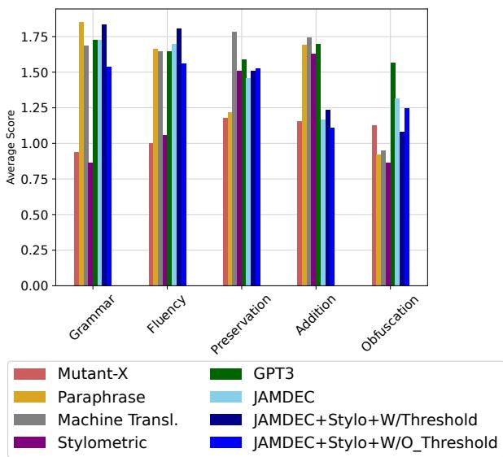  
Figure 5: Human Evaluation on 102 random samples from AMT-3. We include two versions of JAMDEC +Stylo, the original that uses a final CoLA threshold (JAMDEC +Stylo+W/\_Threshold) and one that does not use this threshold (JAMDEC +Stylo+W/O\_Threshold).

## A.3 Comparing Keyword Extractors: Word Embedding Methods vs. Likelihood Methods

In Section 3 we introduced a new framework for keyword extraction which uses likelihoods of next token prediction from language models instead of word embeddings. Using this framework, we developed two keyword extraction methods; one using T5 and infilling (Likelihood-T5), and the other using GPT2 with an autoregressive (left to right) generation (Likelihood-GPT2). We hypothesized that these likelihood-based keyword extraction methods would highlight keywords that would increase the ability of a downstream model to generate text that preserves the original meaning. In Figure 6 we show the results of the automatic evaluations of authorship obfuscation using generations created either with only KeyBERT, only Likelihood-T5, only Likelihood-GPT2, or all three (as we did in our experiments). For AMT-3 and AMT-5, the likelihood-based keyword extraction have higher overall evaluations’ metrics than the embeddingbased (KeyBERT). However, in AMT-10, the Key-BERT performs on average  10% higher than both the likelihood method in Drop Rate (ENS), but is on average 6% lower in NLI. Overall, the combined method (using all three keyword extraction) has the highest Drop Rate overall and lowest number of original sentences used. Examples of keywords selected by each method can be reviewed in Table 4.

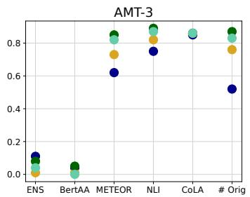

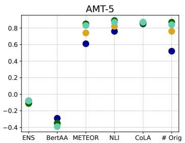

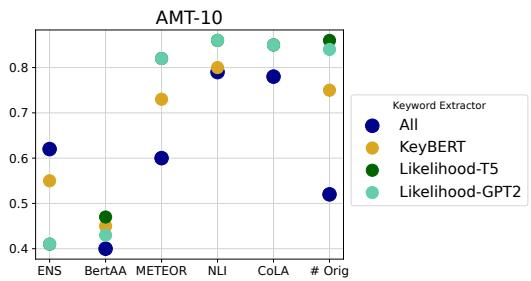  
Figure 6: Comparing the obfuscation (Drop Rate - ENS and BertAA), content preservation (NLI), and language quality (CoLA) using each keyword extraction method individually (KeyBERT, Likelihood-T5, Likelihood-GPT2, and all three together (All) for AMT-3, AMT-5, and AMT-10.

<table><tr><td>Original Sentence</td><td>&quot;I stated that the body needs a specific amount of time to transfer calcium from locations in the body to the fracture.&quot;</td></tr><tr><td>Keyword Extractor</td><td>Keywords</td></tr><tr><td>KeyBERT</td><td>[&quot;stated&quot;, &quot;body&quot;, &quot;needs&quot;, &quot;specific&quot;, &quot;time&quot;, &quot;transfer&quot;, &quot;calcium&quot;]</td></tr><tr><td>Likelihood-T5</td><td>[&quot;that&quot;, &quot;the&quot;, &quot;body&quot;, &quot;of&quot;, &quot;time&quot;, &quot;to&quot;, &quot;from&quot;, &quot;location&quot;]</td></tr><tr><td>Likelihood-GPT2</td><td>[&quot;stated&quot;, &quot;needs&quot;, &quot;of&quot;, &quot;transfer&quot;, &quot;calcium&quot;]</td></tr></table>

Table 4: Examples of keywords extracted by each method; KeyBERT, Likelihood-T5, and Likelihood-GPT2.

## A.4 JAMDEC with Smaller Beam Widths (Less Generations)

We repeated the AMT-3 experiment using a lightweight JAMDEC with a smaller beam width (20) and discovered that it performs slightly better on almost all metrics than JAMDEC with a larger beam width (50) (results in Table 5). This appeared odd at first, until we looked at the quantity of sentences that had generations which passed the NLI and CoLA filter. When we reduce the beam width (and hence the number of overall generations produced), we find a significant decrease in the number of generations that pass the thresholds. For example, in the lightweight version (beam width = 20), only 20% of the generations pass the threshold, implying that 80% of the sentences reverted to the original sentence. Although changing only 20% of the sentences is sufficient to trick the classifiers (seen in the almost matching Drop Rate), it may not be sufficient in human-evaluation.

<table><tr><td>Metric</td><td>JAMDEC</td><td>JAMDEC (Lightweight)</td></tr><tr><td>Drop Rate (ENS)</td><td>0.11</td><td>0.12</td></tr><tr><td>Drop Rate (BertAA)</td><td>0.04</td><td>0.04</td></tr><tr><td>METEOR</td><td>0.62</td><td>0.78</td></tr><tr><td>NLI</td><td>0.81</td><td>0.82</td></tr><tr><td>CoLA</td><td>0.79</td><td>0.83</td></tr><tr><td>Average Gen.</td><td>0.63</td><td>0.42</td></tr><tr><td>Task Score (ENS)</td><td>0.57</td><td>0.59</td></tr><tr><td>Task Score (BertAA)</td><td>0.55</td><td>0.56</td></tr></table>

Table 5: The results of the automatic evaluation scores for AMT-3 using JAMDEC with different beam widths/generations per beam search (50 vs. 20). We also present the average generations that pass the NLI/CoLA threshold ("Average Gen.") for each method.

## A.5 Drop Rate vs. NLI vs. CoLA for All Methods

A successful authorship obfuscation method should score high in Drop Rate, NLI, and CoLA, however we observe that the current methods tend to have a trade-off in their abilities. To further analyze this tradeoff, in Figure 7 we graph the Drop Rate (ENS) versus the NLI and CoLA separately for all datasets. Using our definition of a successful method, we want to have a method that lies in the top right of both graphs. We observe that for both datasets (AMT and BLOG), authors 3 and 10, JAMDEC has both a higher Drop Rate and a high NLI and CoLA compared to all other small model methods. However, we do see it perform a bit worse for the 5 authors datasets, where Machine Translation is a bit higher in Drop Rate and close in NLI.

## A.6 Comparing Drop Rate, NLI, and CoLA for JAMDEC as the NLI/CoLA Thresholds Change

JAMDEC is designed to be user-adaptive, having flexible hyperparameters that can adjust to the needs of the specific task. Two of these hyperparameters are the base NLI and CoLA thresholds used in the filtering stage. We experimented with scaling these hyperparameters from 0.2 to 0.8, using the JAMDEC +Stylo method. For simplicity, we make the NLI and CoLA threshold equal in each experimentation, and use a constant final CoLA threshold of 0.7. Figure 8 shows the results for the AMT datasets. In general, as we increase the NLI and CoLA Thresholds (making it harder for generation candidates to pass) we see an obvious increase in NLI of 15%, a steady score of CoLA, and a mixed result for the Drop Rate depending on the number of authors. In fact, we see a slight increase in both Drop Rates for AMT-3 and a slight decrease in AMT-5 and AMT-10. Since the number of original sentences used increases as the threshold increases (higher thresholds means less generations pass the thresholds), we would expect Drop Rate to decrease (as it did for AMT-3). Therefore, this behavior (especially by ENS) is an indication that it might be relying on an artifact for its classification. This encourages the use of human evaluation as added evaluation for this task.

## A.7 Perplexity of Generations

In our main experimentation we do not use perplexity and instead use the CoLA score. The reason we opted for CoLA over perplexity is that it has a fixed range [0, 1] and can therefore be compared across text length, topic, and style type (formal/informal). Due to the unbounded nature of perplexity, it is an unreliable metric to use by itself (Wang et al., 2023).

However, want to provide these metrics. We have used a Llama2-7B model (Touvron et al., 2023) to calculate perplexity over a text (normalized to the length of text). We choose Llama2-7B since it is from a different family of models used in our experimentation, to reduce any model architecture bias. Then, we calculate the ratio of the perplexity of the obfuscated text to the perplexity of the original (human) text. Again, we use this ratio to have a standard comparison across methods. Results can be seen in Table 6. Similar to CoLA, we see that JAMBDEC outperforms over all other methods on perplexity (ratio closes to 1) on almost all datasets.

## B Style Transfer as Authorship Obfuscation Method

As we mentioned, the task of style transfer mainly differs from the task of authorship obfuscation by its goal of a specific, fixed target style. For this reason, there seems to be many subclasses of style transfer tasks center on a specific aspect of style (specific authors, such as characters from the TV show Friends (Tikhonova et al., 2021), aspect of authors, such as gender (Tokpo and Calders, 2022), formality of style (Chen et al., 2022), etc.). This makes it hard to be a main baseline for authorship obfuscation, as there is not a specific, unbiased method or target style to choose. However, we still were curious how it would compare to JAMDEC. Therefore, we have included an additional experimentation which compares two targeted styles with JAMDEC on the task of authorship obfuscation.

We use the Style Transfer via Paraphrasing or STRAP, a clever method which first employs paraphrasing using one LLM finetuned on a supervised paraphrasing task and then applies a specific style using another LLM finetuned on the specific style (Krishna et al., 2020). We use two types of target styles; Shakespeare and Formal writing. The results are shown in Table 7. Here we observe that JAMDEC consistently achieves a higher Drop Rate while better preserving content and maintaining fluency. Notice that comparing fluency using the style transfer baseline to Shakespearean style might not be entirely fair, as Old English has different grammar rules. This highlights the limitations of using the style transfer method for authorship obfuscation, given the lack of a specific, unbiased target style to select.

## C Threat Model as Evaluation

In our main evaluation, we use simple authorship attribution models, which do not have knowledge of obfuscations. However, current work in authorship attribution has shown that the use of adversarial threat models (models that are trained with obfuscation) can better evade the attacks of authorship obfuscation (Zhai et al., 2022). Therefore, we include evaluation using stronger threat models on the AMT-3 dataset.

<table><tr><td>Dataset</td><td>Method</td><td>Original Perplexity</td><td>Predicted Perplexity</td><td>Ratio</td></tr><tr><td rowspan="11">AMT-3</td><td>Mutant-X (ENS)</td><td>8.25</td><td>29.52</td><td>3.77</td></tr><tr><td>Mutant-X (SVC)</td><td>8.25</td><td>27.6</td><td>3.56</td></tr><tr><td>Paraphrase</td><td>8.25</td><td>9.8</td><td>1.23</td></tr><tr><td>Machine Translation</td><td>8.25</td><td>12.93</td><td>1.64</td></tr><tr><td>Stylometric</td><td>8.25</td><td>24.17</td><td>2.95</td></tr><tr><td>JAMDEC (w/o stylo)</td><td>8.25</td><td>7.29</td><td>0.92</td></tr><tr><td>JAMDEC (w stylo)</td><td>8.25</td><td>8.05</td><td>1.02</td></tr><tr><td>GPT3 (Sentence)</td><td>8.25</td><td>13.3</td><td>1.7</td></tr><tr><td>GPT3 (Paragraph)</td><td>8.25</td><td>9.96</td><td>1.23</td></tr><tr><td>Mutant-X (ENS)</td><td>8.42</td><td>285.92</td><td>34.08</td></tr><tr><td rowspan="6">AMT-5</td><td>Mutant-X (SVC)</td><td>8.42</td><td>923.09</td><td>117.55</td></tr><tr><td>Paraphrase</td><td>8.42</td><td>11.95</td><td>1.49</td></tr><tr><td>Machine Translation</td><td>8.42</td><td>13.41</td><td>1.66</td></tr><tr><td>Stylometric</td><td>8.42</td><td>25.81</td><td>3.09</td></tr><tr><td>JAMDEC (w/o stylo)</td><td>8.42</td><td>7.3</td><td>0.9</td></tr><tr><td>JAMDEC (w stylo)</td><td>8.42</td><td>37.56</td><td>4.44</td></tr><tr><td rowspan="7">AMT-10</td><td>Mutant-X (ENS)</td><td>9.07</td><td>25.96</td><td>3.08</td></tr><tr><td>Mutant-X (SVC)</td><td>9.07</td><td>23.51</td><td>2.77</td></tr><tr><td>Paraphrase</td><td>9.07</td><td>10.02</td><td>1.2</td></tr><tr><td>Machine Translation</td><td>9.07</td><td>15.16</td><td>1.79</td></tr><tr><td>Stylometric</td><td>9.07</td><td>26.24</td><td>2.88</td></tr><tr><td>JAMDEC (w/o stylo)</td><td>9.07</td><td>7.52</td><td>0.9</td></tr><tr><td>JAMDEC (w stylo)</td><td>9.07</td><td>34.65</td><td>3.86</td></tr><tr><td rowspan="7">BLOG-5</td><td>Mutant-X (ENS)</td><td>22.82</td><td>89.53</td><td>5.24</td></tr><tr><td>Mutant-X (SVC)</td><td>22.82</td><td>55.04</td><td>3.73</td></tr><tr><td>Paraphrase</td><td>22.82</td><td>22.27</td><td>1.39</td></tr><tr><td>Machine Translation</td><td>22.82</td><td>42.08</td><td>2.73</td></tr><tr><td>Stylometric</td><td>22.82</td><td>47.18</td><td>2.5</td></tr><tr><td>JAMDEC (w/o stylo)</td><td>22.82</td><td>23.79</td><td>1.7</td></tr><tr><td>JAMDEC (w stylo)</td><td>22.82</td><td>24.44</td><td>1.75</td></tr><tr><td rowspan="7">BLOG-10</td><td>Mutant-X (ENS)</td><td>19.55</td><td>452.56</td><td>32.25</td></tr><tr><td>Mutant-X (SVC)</td><td>19.55</td><td>47.82</td><td>3.58</td></tr><tr><td>Paraphrase</td><td>19.55</td><td>20.82</td><td>1.8</td></tr><tr><td>Machine Translation</td><td>19.55</td><td>42.93</td><td>3.16</td></tr><tr><td>Stylometric</td><td>19.55</td><td>45.63</td><td>2.74</td></tr><tr><td>JAMDEC (w/o stylo)</td><td>19.55</td><td>19.17</td><td>1.4</td></tr><tr><td>JAMDEC (w stylo)</td><td>19.55</td><td>19.72</td><td>1.44</td></tr></table>

Table 6: Perplexity of Experiments in main text. The ratio closes to 1 (better fluency) is bolded and the second best is italized.

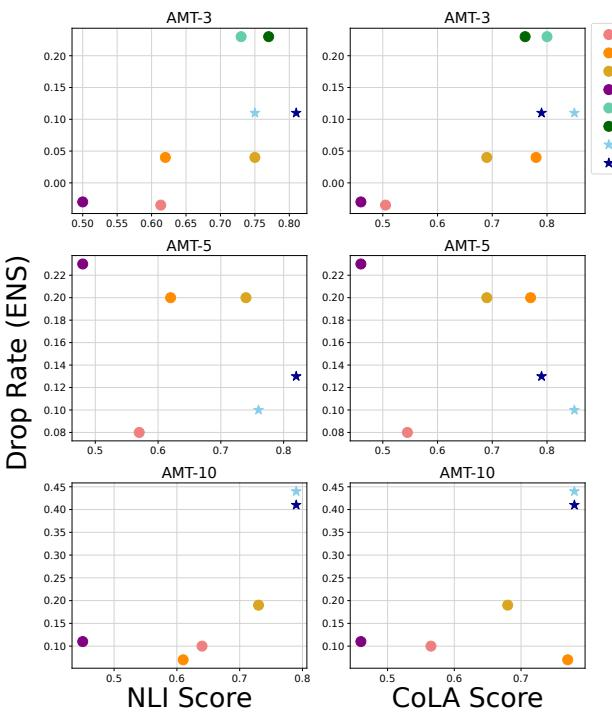  
(a) AMT Datasets

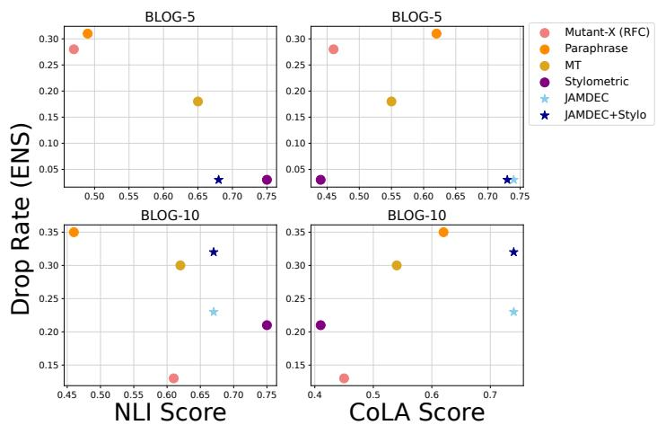  
(b) BLOG Datasets

Figure 7: Highlighting the tradeoff between obfuscation (Drop Rate (ENS)), content preservation (NLI), and language quality (CoLA) of each method for all datasets. The dotted line indicates the trend through all methods.  
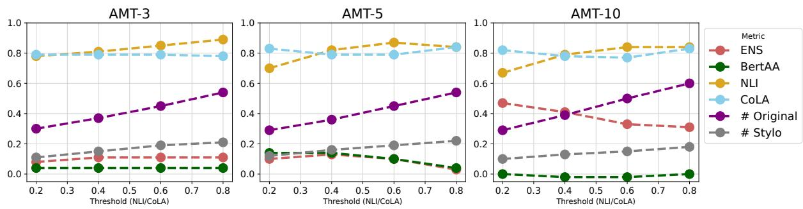  
Figure 8: Highlighting the change in obfuscation (Drop Rate - ENS and BertAA), content preservation (NLI), and language quality (CoLA) for the JAMDEC +Stylo method as we increase the NLI/CoLA threshold for AMT-3.

Table 8 shows results of evaluation of all methods using two threat models. The first, Threat Model (Orig + Obf), is trained using both the original text and the obfuscated text from all methods shown. The second, Threat Model (Obf), is only trained using the same obfuscated text but no original text. It has been shown in previous works that threat models trained only on obfuscated text have higher accuracy (Zhai et al., 2022), which is also seen in the models we train. Using these models, we see that JAMDEC has the highest Drop Rate under the first thread model and third highest under the second thread model. However, as mentioned before, the Drop Rate is only one criterion for the task evaluation of authorship obfuscation. It should be noted, that Mutant-X and Machine Translation (which are the only method which scores much higher than JAMDEC under the second threat model) scores much lower in language quality and content preservation than JAMDEC, as shown in Table 1.

<table><tr><td>Dataset</td><td>Metric</td><td>Shakespeare</td><td>Formal</td><td>JAMDEC</td></tr><tr><td rowspan="4">AMT-3</td><td>Drop Rate (ENS)</td><td>0.0</td><td>0.0</td><td>0.11</td></tr><tr><td>Drop Rate (BertAA)</td><td>0.04</td><td>0.04</td><td>0.04</td></tr><tr><td>NLI</td><td>0.19</td><td>0.25</td><td>0.75</td></tr><tr><td>CoLA</td><td>0.47</td><td>0.69</td><td>0.85</td></tr><tr><td rowspan="4">AMT-5</td><td>Drop Rate (ENS)</td><td>0.20</td><td>0.20</td><td>0.13</td></tr><tr><td>Drop Rate (BertAA)</td><td>-0.06</td><td>-0.06</td><td>0.14</td></tr><tr><td>NLI</td><td>0.23</td><td>0.26</td><td>0.76</td></tr><tr><td>CoLA</td><td>0.49</td><td>0.69</td><td>0.85</td></tr><tr><td rowspan="4">AMT-10</td><td>Drop Rate(ENS)</td><td>0.33</td><td>0.23</td><td>0.41</td></tr><tr><td>Drop Rate (BertAA)</td><td>-0.02</td><td>-.04</td><td>-0.02</td></tr><tr><td>NLI</td><td>0.19</td><td>0.26</td><td>0.79</td></tr><tr><td>CoLA</td><td>0.47</td><td>0.67</td><td>0.78</td></tr></table>

Table 7: Results from the automatic evaluation for JAMDEC and style transfer methods on AMT dataset.

<table><tr><td>Method</td><td>Threat Model (Orig + Obf)</td><td>Threat Model (Obf)</td></tr><tr><td>Mutant-X (ENS)</td><td>0.0</td><td>0.03</td></tr><tr><td>Mutant-X (RFC)</td><td>0.0</td><td>0.00</td></tr><tr><td>Paraphrase</td><td>0.0</td><td>-0.03</td></tr><tr><td>Machine Transl.</td><td>0.4</td><td>0.00</td></tr><tr><td>Stylometric</td><td>0.00</td><td>-0.07</td></tr><tr><td>JAMDEC</td><td>0.04</td><td>-0.03</td></tr><tr><td>Accuracy</td><td></td><td></td></tr><tr><td>Train</td><td>1.0</td><td>1.0</td></tr><tr><td>Test</td><td>0.93</td><td>0.96</td></tr></table>

Table 8: Drop Rate for JAMDEC and other baseline methods on AMT-3 dataset. The threat models are used to assess the Drop Rate (average obfuscated text).

## D Additional Example of Obfusction

In Figure 9 we include a second qualitative comparison of JAMDEC and the other baseline methods. We notice that the obfuscated text produced by baseline methods like Mutant-X, Paraphrase, and Machine Translation has much lower language quality compared to JAMDEC. Such low-quality text might make it easier to deceive an automatic classifier, but it fails to meet the other objectives of authorship obfuscation: preserving the quality and content of the original text. We also observe that Paraphrase and Machine Translation make only minor modifications to the original text. While this aids content preservation, it’s ineffective for authorship concealment.

Also, we provide a few examples of GPT3.5 generation in Table 9, with the first being the same examples from Figure 9 in our paper. From qualitative analysis, we found that most generations from GPT3.5 fell within two techniques: paraphrasing and stylometric (mainly replacing words with synonyms). Either the generation was a short description (lacking some content preservation) or it was minimally changed (only swapping out a few words). There were also a handful of generations which provided incorrect paraphrasing (changed meaning of sentence extremely - see example).

<table><tr><td rowspan=1 colspan=1>Method</td><td rowspan=1 colspan=1>Generation</td></tr><tr><td rowspan=1 colspan=1>Original</td><td rowspan=1 colspan=1>The Ex. An ex holding a grudge can do a lot of damage in ashort amount of time. He knows enough to open accounts inyour name, and he has the motive to hurt you.</td></tr><tr><td rowspan=1 colspan=1>Mutant-X</td><td rowspan=1 colspan=1>The Ex. An ex holding a bitterness able ought a lot ofdamage in a length quantity of time. He knows enough toascend accounts in Your prefix, and he has the justifiable toimpair You.</td></tr><tr><td rowspan=1 colspan=1>Paraphrase</td><td rowspan=1 colspan=1>A lot of damage can be done In a short period of time. Heknows how to open accounts In your name and he wants tohurt you.</td></tr><tr><td rowspan=1 colspan=1>MachineTranslation</td><td rowspan=1 colspan=1>The former. An old man who holds a knife can make a lotof damage in a short time. He knows enough to open accountsin your name, and he has the reason to hurt you.</td></tr><tr><td rowspan=1 colspan=1>Stylometric</td><td rowspan=1 colspan=1>An ex holding, a grudge can do a lot inside damage in abrief amount in time, yet he knows enough to open accountsin your name, and he has the motive to hurt you.</td></tr><tr><td rowspan=1 colspan=1>JAMDEC</td><td rowspan=1 colspan=1>The Ex. When the ex is holding his grudge against theperson who caused him lot of damage to his life, he isshort sighted and will do anything in his power to getback at that person, no matter how much it will hurt theperson he is trying to get revenge against. He knowsenough to open accounts in your name, and he has the motive</td></tr><tr><td rowspan=1 colspan=1>JAMDEC +Stylo</td><td rowspan=1 colspan=1>The Ex. When the ex is holding his grudge against theperson who caused him lot of damage to his life, he isshort sighted and will do anything in his power to getback at that person, no matter how much it will hurt theperson he is trying to get revenge against. He believesenough to open accounts in your name, and he has the reasonto hurt you.</td></tr></table>

Figure 9: Qualitative examples of obfuscated text created by each method. The sentences are taken from the AMT-3 dataset. Changes to the original are outline in blue (correct grammatically and in context) and red (incorrect grammatically or in context).

<table><tr><td>Original Text</td><td>GPT3.5 Generation</td><td>Category of Generation</td></tr><tr><td>Though several attempts were made to found agricultural outposts with tural settlements with white settlers in white settlers in the interior, these were the interior were attempted, yet were largely failures. The oppressive tropi- mostly unsuccessful. Settlers in the op- cal climate and hostile African neigh- pressive tropical climate and with hos- bors made life difficult for settlers, tile African neighbors found life to be a many of whom lacked agricultural ex- challenging experience, especially with perience or expertise.</td><td>Several attempts at establishing agricul- Stylometric many lacking any agricultural knowl- edge.</td><td></td></tr><tr><td>Another issue is the added levels of coordination that occur when work- layers of organization that transpire ing with multiple aid groups to ensure healthcare service coverage.</td><td>An additional problem is the extra when collaborating with numerous re- lief agencies to guarantee health care assistance.</td><td>Stylometric</td></tr><tr><td>The FBI databases contain tens of thou- sands of records from car-rental com- panies, hotels, and national department stores. In Angola however, black Africans</td><td>The databases of the Federal Bureau of Investigation include a plethora of files tent) from car-rental establishments, hotels, and national chain stores.</td><td>Paraphrasing (missing con-</td></tr><tr><td>never made up less than 95% of the als always constituted in excess of 95% population, so the demographic situa- of the populace, thus differentiating tion there (and in the other Portuguese the demographic make-up of the Por- colonies) was never the same as it was tuguese colonies from that of Brazil. in Brazil.</td><td>In Angola, African-descended individu-</td><td>Incorrect Meaning</td></tr></table>

Table 9: Example of generations from GPT3.5 and the category of obfuscation method used.

## E Time Consumption Analysis

We include a comparison of time consumption across the different obfuscation method. However, we recognize that there is a significant trade-off between time consumption and performance. Therefore, we provide, Figure 10 which clearly illustrates this trade-off.

In this analysis we showcase alter aspects of JAMDEC, beam width and generations parameters, which severely affect time consumption. First, we experiment with various beam width of 50, 20, and 10. We observe that when we reduce the beam size, the time consumption decreases significantly, yet the performance remains similar. Second, we experimented with using all parameter combinations versus using only the best parameter to generate candidates for filtering. Surprisingly, by using only the best parameter to generate a small candidate set which cuts the runtime by approximately five times, we achieve performance that’s comparable to or even better than using all parameter combinations to produce a large candidate set. Both ablations showcase the efficiency and effectiveness of JAMDEC. Additionally, when compared to other baselines, the best configuration of JAMDEC achieves significantly better performance with a comparable run-time. This further confirms the effectiveness and practicality of JAMDEC for realworld applications.

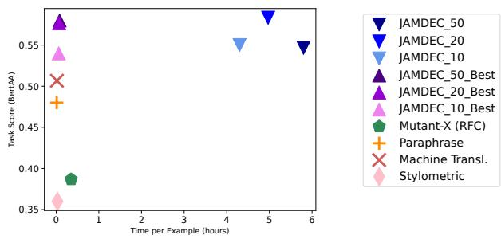  
Figure 10: Comparison of time consumption (hours) and performance (Task Score - BertAA). We compare JAMDEC (using all parameters of generations) and JAMDEC \_Best (using the best combination of generation parameters) to all other baseline methods.

## F Compare Similar Authorship Tasks

Here, we would like to further discuss the critical difference between seemingly similar language tasks: authorship obfuscation, paraphrasing and style transfer. Table 10 provides a visual illustration of the differences in the tasks.

Paraphrasing The main objectives of paraphrasing is to rephrase text to enhance clarity. Hence, paraphrasing can often lead to small edits that stay within the same authorship style, making it ineffective for concealing the author’s identity. We further validate the incompetence of paraphrasing methods for authorship obfuscation empirically through both quantitative and qualitative analysis as shown in Table 1, Figure 3 and Figure 9.

Style Transfer Style transfer assumes a distinct target style whereas authorship obfuscation assumes lack of distinct style. Specifically, while style transfer has a fixed target style as a priori, authorship obfuscation requires a dynamically changing output style depending on the particular input text to obfuscate. This makes it challenging to use style transfer techniques for authorship obfuscation, as it’s hard to assume a specific target corpus representing the proper output style for obfuscation. We further confirm the incompetence of style transfer methods empirically through quantitative and qualitative analysis as shown in Table 7 and Figure 9. In addition, using style transfer techniques for authorship obfuscation raises ethical concerns. The intention of authorship obfuscation is to safeguard the author’s identity, avoiding the imitation or deceptive portrayal of an individual. Using style transfer to mimic another author could unintentionally blur the boundary between preserving anonymity and indulging in deceitful behavior.

## G Experimental Details

In this section we provide full details of the experimentation used in this paper. We start with the dataset in Appendix G.1, method implementations and hyperparameter choices for each method in Appendix G.2, and evaluation methodology in Appendix G.3.

## G.1 Data

AMT- Formal Articles. The dataset, the Extended-Brennan-Greenstadt (Brennan et al., 2012), contains collections of short ( 500-words) scholarly text that were gathered from Amazon Mechanical

Turk (AMT). These articles were collected using very strict guidelines which required the writing to be clear (free of citations, urls, headings, etc.), true to the author’s writing style, relevant to the topic, and the correct length. These qualities were then reviewed by the researchers after submission for quality assurance. More information about the data collection can be reviewed in Brennan et al. (2012). We used the same three test sets as Mahmood et al. (2019a), which were a collection of 3, 5, and 10 authors with 27, 30, and 49 texts respectively (AMT-3, AMT-5, AMT-10). Each author wrote about the same topic throughout the different text. Examples of the author’s topics included identity theft, and Portuguese slavery in Africa. An example of a passage can be seen in Table 11.

BLOG- Informal Articles. The second dataset, the Blog Authorship (Schler et al., 2006), contains a collection of blog entries that were posted to blog.com in 2004. The original dataset contains over 680k post from 19k individual authors, with an average of 7,250 words per author. Each author tends to write about similar topics and styles, ranging from dairy style entries to fan-fiction. Similar to the test sets used by Mahmood et al. (2019a), we created two datasets with a collection of 5, and 10 authors with 72, and 150 texts respectively (BLOG-5, BLOG-10). An example of a passage can be seen in Table 11.

## G.2 Method Implementation

The method implementation and hyperparameters for each method used in our experimentation are detailed below.

## G.2.1 Baselines

Stylometric Obfuscation. We employ the Stylometric Obfuscation method proposed by Karadzhov et al. (Karadzhov et al., 2017) in the PAN-2016 Author Masking Shared Task competition (PAN2016). This method calculates metrics for 12 features that are indicative of style, then modifies the text, so these metrics align with an "average" value. The "averages" were calculated using a combination of training sets including the PAN-2016 Author Obfuscation task (PAN2016) and public domain books from Project Gutenberg (Gutenberg) Examples of the metrics this method uses include the average number of words per sentence, word frequency, and the use of uppercase letters. Changes employed include actions such as sentence splitting and merging, substitution of words with synonyms, and alterations in spelling. For a full list of metrics and proposed changes, see the (Karadzhov et al., 2017). To further enhance the obfuscation process, the method introduces "noise" by modifying words that differ between English and British English and introducing additional functional words. We make no changes to the hyperparameters used in the original method.

<table><tr><td>Task</td><td>Preserve All Content</td><td>Preserve Tone</td><td>Change in Style</td><td>Target Style</td></tr><tr><td>Authorship Obf.</td><td>√</td><td>√</td><td>√</td><td>X</td></tr><tr><td>Paraphrase</td><td>X</td><td>√</td><td>X</td><td>X</td></tr><tr><td>Style Transfer</td><td>√</td><td>√</td><td>√</td><td>√</td></tr></table>

Table 10: Comparison between the task of authorship obfuscation, paraphrasing and style transfer.

Mutant-X. Mutant-X (Mahmood et al., 2019a) is a genetic algorithm guided by an internal authorship classifier, which is trained using a deep learning architecture. This method requires a separate authorship corpus to train the internal classifier. The approach follows an iterative process wherein the text undergoes "mutation" by randomly replacing words based on their semantic similarity. Additionally, at random iterations, it incorporates a "crossover" effect that involves cutting two parent texts at a random position and combining them to create two new child texts.

In order to train the internal classifiers, we adopt the same features and architectures (Random Forest Classifier, Support Vector Classifier and Ensemble Classifier), as suggested in the subsequent work by Haroon et al. (2021). The features come from the Writeprints-Static (Brennan et al., 2012) which is a set of 500+ lexical and syntactic features such as total words, percentage of digits, and special character occurrences taken from the full set Writeprint (Abbasi and Chen, 2008). For the Random Forest (RFC) we used 50 trees in the forest and all features, and for the Support Vector Classifier (SVC) we use a linear kernel with all the features. However, as was explored in Haroon et al. (2021), a single classifier may not be the best indication of authorship classification since it could be relying on artifacts to make its decision. Therefore, they introduced the idea of using an "ensemble" of classifiers (ENS) which are trained on different collections of features and vote on the final classification. We used an ensemble of 10 SVC classifiers which were trained on 30 randomly selected features. A "soft" voting system (averaging probabilities instead of classes) was used to choose the final obfuscation.

However, we only show results with an internal classifier of RFC or ENS for the internal classifiers. The sample size, train accuracy, and test accuracy of these models can be reviewed in Table 12.

Paraphrasing. For the paraphrasing baseline, we employ a state-of-the-art paraphrasing model, PE-GASUS Paraphrase (Zhang et al., 2020; par) a PE-GASUS model fine-tuned on a self-supervised task for paraphrasing.

Machine Translation. Inspired by the work of Keswani et al. (Keswani et al., 2016), we implemented a similar approach using machine translation from English to German, then to French, and finally back to English. Keswani et al. emphasized the importance of using a machine translation model that does not rely on English as an intermediate step. This means that when translating from German to French, the model should go directly from German to French, without translating via English. In their paper, they did not provide the code for this method, so we created our own implementation using the M2M100 translation model (Fan et al., 2020) with 418M parameters.

GPT3.5 We include a comparison with zero-shot prompting using GPT-3 (text-davinci-003, 175B) 3 (Brown et al., 2020) which has  175B parameters. Our comparison involved prompting at both the sentence-level, where each sentence was obfuscated individually, and the paragraph level, where the entire text was obfuscated as a whole. We prompted GPT-3 to generate two obfuscations for each sentence/paragraph. Subsequently, for the sentence-level obfuscation, we randomly combined one generation from the two produced for each sentence to create a single obfuscated paragraph. The evaluations presented here represent the average performance across these two generations. However, due to financial constraints, we limited our GPT-3 obfuscation generation to AMT-3.

Below are the exact prompts used to generate obfuscated text at the sentence and paragraph level.

Sentence-level:

"Provide two re-writes of the following sentence so that the author’s style is obfuscated.

<table><tr><td>Dataset Text Example AMT</td><td>In the 1990s Zaire served as the main supporter of UNITA, as South African and American support</td></tr><tr><td></td><td>for the organization dwindled. In 1997 a coup supported in part by the Angolan government overthrew Mobutu, and Zaire was renamed the Democratic Republic of the Congo. Without the aggressive Mobutu regime as a neighborhood, the situation in Angola stabilized and the MPLA was finally able to crack down on internal dissent without being troubled with foreign intervention, ending the civil war a few years later in 2002. Like most other Third World conflicts of the twentieth century, the wars in Angola were heavily affected by the Cold War. In addition to the competition between the US and the USSR, several other factors motivated the involvement of international powers: the Sino-Soviet split, Third World solidarity against Western exploitation and imperialism, and in the case of the US, Angola&#x27;s large oil reserves. The USSR was involved with the MPLA from its foundation in the late-1950s. Starting in 1958, MPLA founding member Mario de Andrade would travel to Moscow on a regular basis for various conferences and meetings. During these visits the MPLA developed a relationship with the Soviets, securing funding and in 1961 the explicit support of Soviet Premier Nikita Khrushchev, who stated that , &quot;the patriots of Angola can be sure that the sympathies of the peoples of the great Soviet Union are fully on their side.&quot; Many MPLA leaders would go on to be educated in Moscow. The USSR chose to support the MPLA over rival movements in Angola for a number of reasons. As a left-leaning Marxist movement that explicitly condemned the imperial powers, the MPLA followed the same basic ideological principles as the USSR. The UPA/FNLA was more ambiguous on this issue, receiving support from the US and sometimes practicing anti-communist rhetoric. The MPLA was also not as focused on regional or ethnic issues, as the predominately Bakongo UPA based in northern Angola was. The USSR also practiced the policy of recognizing and supporting only one rebel movement within a conflict, a policy not shared by all of its peers. Early Soviet support of the MPLA included food and clothing as well as weapons and increased progressively during the course of the war from goods valued at $25,000 in 1961 to $220,000 in 1973. Large scale Soviet assistance did not come until 1975 though. In this year another foreign power would join the equation, with Cuba, shipment of two shiploads of T-55 tanks and 500 military advisories. Though the Cubans and Soviets would work together closely in Angola, early actions were not coordinated as is widely assumed. Cuba was not simply a Soviet proxy but rather had its own agenda for being in Angola. As a Third World country with a colonial past and communist government, Cuba wanted to sustain the global conflict against the West and imperialism through spreading Marxist-Leninist revolution.</td></tr><tr><td>BLOG</td><td>7:05 a.m. Wednesday. Feeling pretty good today. My last couple hours of sleep were choppy, but I went to bed so early I&#x27;m sure I got at least eight hours. Took half an actifed to counter the red wine, and I didn&#x27;t drink enough water to counteract them both. Other than that, feeling good, and I&#x27;m pleased with the amount I drank for Drinking Night. My new plan is to buy only red wine, and buy only enough for the one drinking night. If I don&#x27;t have it around the house, I won&#x27;t drink it. Because I am far too lazy and too self-conscious to go buy it. Therefore, this way I am not relying on willpower, I&#x27;m setting up an environment where I can&#x27;t drink. I&#x27;m having a glass of water right now, with my coffee. I don&#x27;t usually start until after breakfast, but I feel quite dehydrated. I&#x27;m adjusting my estimates for the coffee with Benefiber, because I&#x27;m not putting an entire tablespoon in. Maybe two-thirds that. Note: remember to buy an exercise ball to sit on while at the computer. 5:00 p.m. Had a nice little lunch with Daisy. Ate a veggie wrap and some fries, which I hope I am estimating reasonably. It was a decent meal, but not entirely filling, so I had a little chicken when I got home. Now I am finishing up my work emailing before vacation, trying to do my timesheet, etc. My hip is still bothering me. I&#x27;m not happy about that, because it hurts when I walk, and I want to do a lot of walking on vacation. I think the bellydancing may have caused the strain, and then the gliding is exacerbating it. So perhaps it&#x27;s a good thing that I&#x27;ll be away from the glider for a couple weeks. I can walk and swim for exercise, and perhaps that will work out the problem, whatever it is.</td></tr></table>

Table 11: Examples of text from both datasets used in the experimentation section; AMT and BLOG.

<table><tr><td rowspan="2">Dataset</td><td rowspan="2">Train Sample Size</td><td rowspan="2">Test Sample Size</td><td colspan="2">ENS</td><td colspan="2">RFC</td><td colspan="2">BertAA</td></tr><tr><td>Train Acc.</td><td>Test Acc.</td><td>Train Acc.</td><td>Test Acc.</td><td>Train Acc.</td><td>Test Acc.</td></tr><tr><td>AMT-3</td><td>36</td><td>27</td><td>1.0</td><td>0.93</td><td>1.0</td><td>0.93</td><td>1.0</td><td>0.93</td></tr><tr><td>AMT-5</td><td>60</td><td>30</td><td>1.0</td><td>0.93</td><td>1.0</td><td>0.87</td><td>1.0</td><td>0.87</td></tr><tr><td>AMT-10</td><td>120</td><td>49</td><td>1.0</td><td>0.82</td><td>1.0</td><td>0.69</td><td>1.0</td><td>0.57</td></tr><tr><td>BLOG-5</td><td>400</td><td>100</td><td>1.0</td><td>0.93</td><td>1.0</td><td>0.91</td><td>1.0</td><td>0.98</td></tr><tr><td>BLOG-10</td><td>800</td><td>150</td><td>0.96</td><td>0.84</td><td>1.0</td><td>0.83</td><td>1.0</td><td>0.95</td></tr></table>

Table 12: Train and test accuracy for the three classifiers used in the experimentation (ENS, RFC, and BertAA) for each dataset (AMT-3, AMT-5, AMT-10, BLOG-5, BLOG-10). We also display the sample size for the training and test set for each dataset.

Original Sentence: {original text}"

Paragraph-level:

"Provide two re-writes of the following paragraph so that the author’s style is obfuscated.

Original Paragraph: {original text}"

## G.2.2 JAMDEC

As described, JAMDEC has three distinct stages (keyword extraction, over-generation, and filtering). We also include a pre-processing step which prepares the raw data for obfuscation. We outline the hyperparameter values used in each section below. Data Pre-Processing. We pre-process the raw text before obfuscating. First, we divide each text into paragraphs. We go through each sentence in each paragraph and add it to a list yorig. We then group all sentences in that same paragraph that appear previously and store it in a new list xl. This results in a list of original sentences yorig and left contexts xl. If the sentences are the first in the paragraph, we use the previous’s paragraphs last sentence as the left context. For the first sentences of the text, we use itself as the left context. Lastly, if a sentence has less then 3 words we did not change it.

Keyword Extraction. We use three kinds of keyword extraction; KeyBERT, Likelihood-T5 and Likelihood-GPT2 as described in Section 4. For KeyBERT we used unigrams and returned n/2 keywords, where n was the length of the original sentence. For Likelihood-T5, we used a T5-base (Raffel et al., 2020) and for Likelihood-GPT2 we used a GPT2-XL (1.5B) (Radford et al., 2019). For both Likelihood-T5 and Likelihood-GPT2, we used a likelihood threshold of 0.5, meaning any original word whose next token probability was below 0.5 was kept as a keyword.

To further support creative and diverse generation, we include disjoint constraints which allow for one of a list of constraints to be met. Using disjoint constraints, we add both "like" words (same root word with different tenses) and "similar" words (synonyms) of the keywords. To do this, we start by creating a static dictionary of word embedding. For our experimentation, we used a list of 20K most common English words (List) and convert each word into the tokens using T5-base pretrained model (Raffel et al., 2020). For more details on this static dictionary see Appendix G.2.3. Then, to find the top "similar" words, we used the cosine similarity between the original keyword and each word in the static dictionary and choose the top 4 with the highest score. To find the top "like" words, we used the Spacy package (Honnibal and Montani, 2017) in Python to find the first 4 words in the static dictionary with the same word lemma as the original keyword. For our experimentation, we used three versions of the keywords as constraints. We used the original keywords, the original keywords with the "like" words, and the original keywords with the "like" and "similar" words.

Generation. For our experimentation, we used Neurologic Constrained Beam Search (Lu et al., 2021) and Diverse Beam Search (Vijayakumar et al., 2016). The base model was GPT2-XL (1.5B) For most of the experimentation (except for the ablation study in Appendix A.4), we used a beam width of 50 and a matching number of return sequences. The maximum length of the generation was set to twice the largest input length in a batch. The batches were grouped by input length, to keep like max lengths. We also set the no repeat length to 3-grams. For decoding within the beam search, we ran each combination twice, once with sampling decoding and another with greedy decoding. We used a likelihood pruning factor of 0.4 and a constraint pruning factor of 0.6. For the constraints, we used both ordered constraints (the constraint must be met in a specific order) and unordered constraints. Lastly, we employed early stopping, which will stop a beam search early if candidates are not better than the current candidates. When diversity was employed, we used a diversity penalty of 5, 000. Hyperparameters were selected based on experimentation on Reuter 50-50 (Liu, 2011), which is a sub-sample of newswire articles produced by Reuters in 1996 - 1997 which have at least one subtopic of class corporate/industrial. This is a common baseline used for authorship verification (Qian et al., 2017).

In summary, we ran generations for each sentence using the following combinations of methods:

• Decoding Method: Sampling, Greedy

• Type of Constraints: Original, Original + Like, Original + Like + Similar

• Ordered Constraint: True, False

• Diversity in Pre-Processing: True, False

Filtering. For our experimentation, we ran two different filtering techniques. Each method starts with a base NLI and CoLA threshold. Due to the lack of an evaluation set, all hyperparameters were selected using a grid search on the smallest dataset of each kind (AMT-3 and BLOG-5). In some cases, we find that none of the generated candidates passes both the NLI and CoLA filter. To process such cases, we consider two variants of our method: (1) JAMDEC, where we simply output the original sentence as output, and (2) JAMDEC + Stylo, where we run a basic stylometric-based obfuscator on the original sentence and then use a second CoLA threshold for this altered sentence. The basic stylometric-based obfuscator is explained in detail below in Appendix G.2.3. If the altered sentence does not pass the filer than the original sentence is used. A full list of hyperparameters for each method can be viwed in Table 13. We also provide the average percentage of sentences that passed the basic NLI/CoLA thresholds and the second CoLA threshold that is used in JAMDEC + Stylo in Table 14.

## G.2.3 Our Stylometric-Based Obfuscator

Set-Up. We consider the original prompt (sentence) x which is composed of words $x _ { 1 } , . . . , x _ { n } .$ Before decoding, we "freeze“ all tokens that correspond to function words. Function words are grammatical words that serve as connectors or structure indicators in a sentence, rather than conveying lexical meaning. Therefore, we only consider changing context words such as nouns, adjective, and verbs.

<table><tr><td>Dataset</td><td>Hyperparameter</td><td>JAMDEC</td><td>JAMDEC + Stylo</td></tr><tr><td rowspan="3">AMT</td><td>Base NLI Thresholds</td><td>0.30</td><td>0.40</td></tr><tr><td>Base CoLA Threshold</td><td>0.30</td><td>0.40</td></tr><tr><td>Second CoLA Threshold</td><td>1</td><td>0.70</td></tr><tr><td rowspan="3">BLOG</td><td>Base NLI Thresholds</td><td>0.10</td><td>0.10</td></tr><tr><td>Base CoLA Threshold</td><td>0.10</td><td>0.10</td></tr><tr><td>Second CoLA Threshold</td><td>=</td><td>0.70</td></tr></table>

Table 13: Hyperparameters for the filtering stage of the experiments using JAMDEC with and without the stylometry decoding (+ Stylo); AMT and BLOG datasets

A difficult aspect of a word-changing method is choosing which words are truly equivalent to the original word. For our method, we consider new words as replacements based on the following:

1. Similarity to the original word $S _ { t }$

2. Grammatical correctness of new sentence $G _ { t }$

Using these two metrics, we created a 3-step method for identifying and changing certain words of a sentence. The pipeline can be viewed in Figure 11 and is described in detail below.

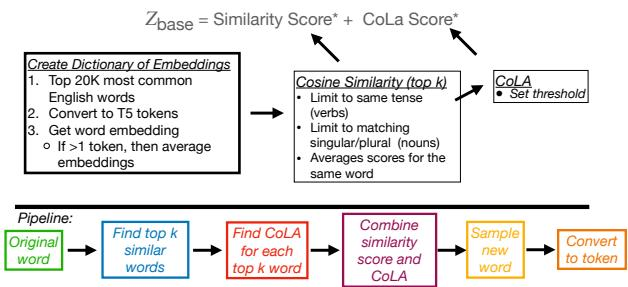  
Figure 11: A visual representation of the pipeline used for the stylometric-based obfuscation method used in JAMDEC +Stylo.

Step1: Word Embeddings Dictionary We start by creating a new static dictionary of word embedding, depending on the base model. For our experimentation, we use a list of 20K most common English words (List) and convert each word into tokens using T5-base (220M) pretrained model (Raffel et al., 2020). Then, using these matched tokens, we extracted their corresponding word embedding vectors (weights in the last attention layer). If a word matched to multiple T5 tokens, then we averaged their corresponding word embedding vectors. This resulted in a static word embedding dictionary D of vectors $d _ { 1 } , . . . , d _ { 2 0 K }$ , where $d _ { i } \in \mathbb { R } ^ { | V | }$ where, V is the length of the T5 vocabulary.

<table><tr><td>Dataset</td><td>JAMDEC</td><td colspan="2">JAMDEC + Stylo</td><td></td></tr><tr><td rowspan="3">AMT-3</td><td>Pass Base Thresholds</td><td>0.52</td><td></td><td>0.63</td></tr><tr><td>Pass Second CoLA Threshold</td><td></td><td></td><td>0.15</td></tr><tr><td>Original Sent. Used</td><td>0.48</td><td></td><td>0.22</td></tr><tr><td rowspan="3">AMT-5</td><td>Pass Base NLI Threshold</td><td>0.52</td><td></td><td>0.64</td></tr><tr><td>Base Pass CoLA Threshold</td><td></td><td></td><td>0.16</td></tr><tr><td>Original Sent. Used</td><td>0.48</td><td></td><td>0.20</td></tr><tr><td rowspan="3">AMT-10</td><td>Pass Base NLI Threshold</td><td>0.53</td><td></td><td>0.60</td></tr><tr><td>Base Pass CoLA Threshold</td><td>–</td><td></td><td>0.13</td></tr><tr><td>Original Sent. Used</td><td>0.47</td><td></td><td>0.27</td></tr><tr><td rowspan="3">BLOG-5</td><td>Pass Base NLI Threshold</td><td>0.57</td><td></td><td>0.64</td></tr><tr><td>Base Pass CoLA Threshold</td><td>一</td><td></td><td>0.07</td></tr><tr><td>Original Sent. Used</td><td>0.43</td><td></td><td>0.29</td></tr><tr><td rowspan="3">BLOG-10</td><td>Pass Base NLI Threshold</td><td>0.60</td><td></td><td>0.67</td></tr><tr><td>Base Pass CoLA Threshold</td><td></td><td></td><td>0.06</td></tr><tr><td>Original Sent. Used</td><td>0.4</td><td></td><td>0.27</td></tr></table>

Table 14: Breakdown of average number of sentences that pass both the base thresholds (NLI and CoLA), the second CoLA threshold (only used for JAMDEC + Stylo), and the average original sentences used for each dataset.

Step 2: Similar Words Next, we find the top k similar words from D to the original word $x _ { t }$ using cosine similarity of the word embeddings. We only consider verbs of the same tense and nouns that match the singular or plural nature of the original token $x _ { t }$ . Let $W$ be the set of words $w _ { 1 } , . . . , w _ { k }$ with the highest similarity scores $s _ { i } .$ . With this set $R$ of top-k similarity scores, $s _ { 1 } , . . . , s _ { k }$ , we create the following similar score distribution $S _ { t }$ for original word $x _ { t }$

$$
S _ { t } = \left\{ \begin{array} { l l } { \frac { s _ { i } - \operatorname* { m i n } ( R ) } { \operatorname* { m a x } ( R ) - \operatorname* { m i n } ( R ) } } & { { \mathrm { i f } } w _ { i } \in W } \\ { 0 } & { { \mathrm { o t h e r w i s e . } } } \end{array} \right.\tag{1}
$$

Step 3: Grammar Scores Using the top k similar words $w _ { i } , . . . , w _ { k }$ from the previous step, we find each grammar score $g _ { i }$ using a Roberta base model (Liu et al., 2019) finetuned on the Corpus of Linguistic Acceptability (CoLA) (Warstadt et al., 2019; Morris et al., 2020), a large corpus which contains 10.5K sentences annotated for grammar acceptability by their original authors. We do this by using the generated text $x _ { 1 } , . . . , x _ { t - 1 }$ before $x _ { t } .$ and using the original text $x _ { t + 1 } , . . . , x _ { n }$ after the generated text. For example, if the original text was "I went to a big lake", and we have generated "I walked to $\mathbf { a } "$ and are currently trying to find the grammar score for "huge", we would use "I walked to a [huge] lake" as input to the CoLa model. We use the probability of the input being grammatically acceptable as $g _ { i }$ . We do this for each similar word, resulting in a set $Q$ of grammar scores $g _ { 1 } , . . . , g _ { k }$ Lastly, we impose a lower threshold $\delta ,$ which we set, so the grammar scores are guaranteed to be high. This can be tuned for specific tasks. Similar to the similarity scores, we construct a grammar score distribution $G _ { t }$ for the original word $x _ { t }$ as

$$
S _ { t } = \left\{ \begin{array} { l l } { \frac { g _ { i } - \operatorname* { m i n } ( Q ) } { \operatorname* { m a x } ( Q ) - \operatorname* { m i n } ( Q ) } } & { { \mathrm { i f } } w _ { i } \in W , g _ { i } > \delta } \\ { 0 } & { { \mathrm { o t h e r w i s e } } . } \end{array} \right.\tag{2}
$$

Step 4: Word Selection Lastly, we combine the similar score distribution $S _ { t }$ and grammar score distribution $G _ { t }$ using the following equation,

$$
F _ { t } = \alpha S _ { t } + \beta G _ { t }\tag{3}
$$

where $\alpha$ and $\beta$ are hyperparameters controlling the importance of similarity or grammatical acceptability. We use sampling from the final distribution, $F _ { t }$ to generate the word replacement. However, we note that the original word is included in the top k similarity and therefore could result in the final generation. This method is repeated for each context word from the original text. An example of this method on text from the Reuter 50-50 dataset (Liu) can be found in Table 15.

## G.3 Evaluation Methodology and Other Details

Automatic Evaluation. We used five automatic evaluations; Drop Rate (ENS and BertAA) (Mahmood et al., 2019a; Fabien et al., 2020), METEOR (Banerjee and Lavie, 2005), NLI (Liu et al., 2022), and CoLA (Warstadt et al., 2019). The Drop rate is the average decrease in number of obfuscated text which a classifier identified as the non-original author compared to the original text. Two classification models were used to calculate the drop rate, an ENS and BertAA model. The training of ENS model is described in Appendix G.2.1 under "Mutant-X" (Mahmood et al., 2019a). The training for BertAA is described in (Fabien et al., 2020). METEOR (Metric for Evaluation of Translation with Explicit ORdering) (Banerjee and Lavie, 2005) is a common baseline used in machine translation. It is calculated using the harmonic mean of precision and recall using unigram matching that ranges from 0 (no overlap) to 1 (exact overlap). Because it relies on exact token matching, it is unideal for measuring paraphrases of text that could have drastically different tokens but the same meaning. We include the reporting of this metric since it is heavily reported in the literature. However, we rather rely on another metric, NLI (Natural Language Inference) as an indicator of content preservation. NLI is a task with aims to predict if two text are "entailed", in other words if one text is true then the other logically follows. We used WANLI model (Liu et al., 2022) as our NLI model and report the average highest NLI scores for each sentence. Meaning, we take each sentence in the obfuscated text and calculate the probability of entailment, according to the WANLI model, with each sentence in the original. We then choose the highest entailment value. What is reported is the average of these maximum values for all text. Lastly, we use a CoLA (Corpus for Linguistic Acceptability) (Warstadt et al., 2019) model as a measure of grammatical correctness. Given a text, the model reports a probability of grammatical acceptance (ranging from 0 to 1), we use the average of these as the CoLA score.

<table><tr><td rowspan=1 colspan=1>Original Text</td><td rowspan=1 colspan=1>Obfuscated Text</td></tr><tr><td rowspan=1 colspan=1>The site does not in-</td><td rowspan=2 colspan=1>The site does not con-tain the states&#x27; realfiles - that mightcome later - but itincludes contacts forobtaining the informa-tion.</td></tr><tr><td rowspan=1 colspan=1>clude the countries&#x27; ac-tual data - that maycome later – but it listscontacts for obtainingthe information.</td></tr><tr><td rowspan=1 colspan=1>The     International</td><td rowspan=4 colspan=1>The     InternationalMonetary       Fundstarted a page on theinternet Thursday de-livering advice aboutthe types of economicrecords offered in 18membership regions.</td></tr><tr><td rowspan=1 colspan=1>Monetary Fund opena site on the Internet</td></tr><tr><td rowspan=1 colspan=1>Thursday providinginformation about thetypes of economic</td></tr><tr><td rowspan=1 colspan=1>data available in 18member countries.</td></tr><tr><td rowspan=1 colspan=1>Senator Bob Kerreyis preparing legislationin an attempt to breakthe deadlock over com-puter encryption ex-port policy, people fa-miliar with the Sena-torś plans said.</td><td rowspan=1 colspan=1>Senator Bob Kerrey ispreparing regulation inan effort to crack thedeadlock over inter-net encryption impor-tation policy, peopleacquainted with theSenator&#x27;s plans said.</td></tr></table>

Table 15: Example of sentences obfuscated using our basic stylometric-based obfuscator. On the left is the original text and on the right is the obfuscated text. The changes are show in bold.

Inter-rater Agreement. We decided to use two different classifier models (ENS and BertAA) to calculate the drop rate. Since these models use different architecture and different sets of features, we wanted to report the inter-rater agreement between them. We use Cohen’s kappa coefficient, which measure the inter-rater reliability using a scale between [0.1], where 0 is completed disagreement and 1 is complete agreement. This is thought to be a more robust measure because it takes the probability of agreement by chance into consideration. See Table 16 for the results.

## G.4 Human Evaluation

All human evaluations were conducted on Amazon Mechanical Turk (AMT) (Mechanical Turk). The data for the human evaluations were randomly selected from the passages in AMT-3. Each passage was separated into shorter sections ranging from one to four sentences. Then n = 32, 35, and 35 of these shorter sections were selected from author "H", "PP", and "QQ" texts respectively (Author "H" has fewer passages overall than "PP" or "QQ" and therefore had slightly less short texts chosen for the human evaluation) for a total of 102 passages. The corresponding obfuscated text was then matched for the following methods; Mutant-X (ENS), Machine Translation, Stylometric, GPT3.5 (Sentence), JAMDEC, and JAMDEC + Stylo. For each passage, the AMT worker was shown the original and obfuscate passage side by side and ask the following five questions.

1. Grammar: How grammatically correct is the

<table><tr><td rowspan="2">Dataset</td><td rowspan="2">Method Classifier</td><td colspan="2">Mutant-X</td><td colspan="2">GPT3</td><td rowspan="2">Paraph</td><td rowspan="2">Machine Transl.</td><td rowspan="2">Stylometric</td><td colspan="2">JAMDEC</td></tr><tr><td>ENS</td><td>RFC</td><td>Sentence</td><td>Paragraph</td><td>W/O Stylo</td><td>W/ Stylo</td></tr><tr><td rowspan="3">AMT-3</td><td>ENS-RFC</td><td>0.19</td><td>0.27</td><td>0.72</td><td>0.59</td><td>0.83</td><td>0.82</td><td>0.77</td><td>0.66</td><td>0.67</td></tr><tr><td>ENS-BertAA</td><td>0.83</td><td>0.39</td><td></td><td></td><td>0.89</td><td>0.65</td><td>0.58</td><td>0.77</td><td>0.77</td></tr><tr><td>BertAA-RFC</td><td>0.30</td><td>0.72</td><td>-</td><td></td><td>0.83</td><td>0.65</td><td>0.78</td><td>0.89</td><td>0.89</td></tr><tr><td rowspan="3">AMT-5</td><td>ENS-RFC</td><td>026</td><td>0.33</td><td>-</td><td></td><td>0.57</td><td>0.60</td><td>0.54</td><td>0.64</td><td>0.69</td></tr><tr><td>ENS-BertAA</td><td>0.09</td><td>0.29</td><td></td><td></td><td>0.54</td><td>0.56</td><td>0.53</td><td>0.47</td><td>0.43</td></tr><tr><td>BertAA-RFC</td><td>0.44</td><td>0.11</td><td>-</td><td></td><td>0.63</td><td>0.47</td><td>0.31</td><td>0.50</td><td>0.54</td></tr><tr><td rowspan="3">AMT-10</td><td>ENS-RFC</td><td>.03</td><td>0.21</td><td>-</td><td></td><td>0.45</td><td>0.39</td><td>0.57</td><td>0.39</td><td>0.35</td></tr><tr><td>ENS-BertAA</td><td>0.10</td><td>0.38</td><td></td><td></td><td>.56</td><td>0.34</td><td>0.48</td><td>0.29</td><td>0.36</td></tr><tr><td>BertAA-RFC</td><td>0.43</td><td>0.11</td><td></td><td></td><td>0.52</td><td>0.34</td><td>0.38</td><td>0.37</td><td>0.35</td></tr></table>

Table 16: Inter-rater reliability score (Cohen kappa coefficient) between each classifier (RFC, ENS, and BertAA) used for the AMT dataset.

rewritten text?

2. Fluency: How fluent (natural sounding) is the rewritten text?

3. Content: How much content is preserved in the rewritten text compared to the original text?

4. Content: Is there new content added in the rewritten text not in the original text?

5. Style: How similar is the style between the rewritten text and the original text?

Each question was answered on a 3-point likert scale (Perfect/Good, Fair, and Bad). Detailed instructions and examples were provided, see Figure 12. We compensate workers with the hourly wage of 15. We used a few credential checks for our Mechanical Turk workers. First, their HIT Approval Rate for all Request had to be greater than 97% and they had to be pre-approved based on work they had done in other unrelated tasks from our lab. Due to financial constraints, each sample was rated by only one worker.

Software. We used Python 3.11.3, Pytorch 2.0.1 and HuggingFace Transformers 4.29.2.

Hardware. All experiments were run on NIVIDIA A100 GPU’s with 80GB memory.

Time to Run Expereiments. Experimentation time for the AMT datasets ranged from 8 72hours, while time for the BLOG experimentation ranged from 48 168 hours.

## H Constrained Diverse Beam Search Algorithm and Extra Information

Algorithm 1 is the algorithms used in Constrained Diverse Beam Search algorithm (CoDi-BS) proposed in our paper. It combines Diverse and Lexically Constrained Beam Search to provide a diverse candidate pool of generations that are also constrained by provided keywords.

Algorithm 1 Constrained-Diverse-Beam-Search   
(CoDi-BS)   
Require: max length $n ,$ number of beams $k ,$ input   
ids $I ,$ model M, constraints   
DPP = Diverse-Preprocessing (algorithm 2)   
CBS = Constrained Beam Search   
Initialize: beams0 = I   
for $t = 0 , . . . , n - 1$ do   
logits = M(beamst)   
processed\_logits = DPP(k, logits)   
beamst+1 = CBS(processed\_logits , con  
straints)   
return beamsn

Diverse Beam Search. Traditional beam search searches for an output sequence that maximizes the conditional probability given the input. However, beam search tends to produce similar or redundant output sequences within a beam, resulting in a lack of diversity. Diverse Beam Search (DBS) (Vijayakumar et al., 2016) is a variation of beam search, that encourages the selection of diverse sequences that are dissimilar to each other within a beam. DBS achieves this by adding a diversity penalty term to the beam search objective function, which penalizes the selection of sequences that are too similar to the ones already in the beam. Its objective function can be represented as:

$$
\underset { w \in W } { \arg \operatorname* { m a x } } P _ { w } ( y | x ) + \lambda D ( y , Y )
$$

where $x$ is the sequence of previous tokens, $D ( y , Y )$ is a diversity term measuring the dissimilarity between the output sequence y and the set of previously selected sequences Y within the beam, λ is a hyperparameter controlling the weight of the diversity term, and $w \in W$ is the parameter vector.

Algorithm 2 Diverse-Preprocessing (DPP)   
Require: number of beams k, logit matrix (#   
beams vocab size) L, diversity penalization   
term $\lambda$   
1: bincount() = vector of frequency counts of vec  
tor   
2: max() = maximum argument in vector along a   
specific dimension (dim)   
3: current\_tokens = []   
4: for $i = 1 , . . . , k$ do   
5: if i = 1 then   
6: processed\_logits = L[i, :]   
7: else   
8: previous\_token\_freq =   
9: bincount(current\_tokens)   
10: processed\_logits $[ i , : ] = { \cal L } [ i , : ] - \lambda$ pre  
vious\_token\_freq   
11: $\mathbf { i f } \ i < k$ then   
12: current\_tokens =   
13: max(processed\_logits[0 : i, :], dim = 1)   
14: return processed\_logits

The diversity penalty term can take many forms, but one common approach is to use a measure of dissimilarity such as Hamming distance or cosine similarity. By promoting diversity, Diverse Beam Search can generate more varied outputs.

Constrained Beam Search. Constrained Beam Search (CBS) (Post and Vilar, 2018) is another variant of beam search used to impose constraints on the output sequences. CBS achieves this by modifying the beam search objective function to penalize candidates that violate the constraints. The objective function for constrained beam search can be represented as:

$$
\arg \operatorname* { m a x } _ { w \in W } P _ { w } ( y | x ) + \lambda C ( y )
$$

where $C ( y )$ is a constraint function quantifying the degree to which the output sequence y satisfies linguistic or stylistic constraints, and λ is a hyperparameter controlling the weight of the constraint function. We specifically use Lexically Constrained Beam Search where constraints are specific words or phrases that must be included in the generated text. Concretely, while choosing candidates to fill in the beam, CBS first sorts candidates into "banks" based on number of satisfied constraints, and then selects the top k candidates by iteratively visiting each bank and choosing those with the highest likelihood until reaching k candidates. In terms of authorship obfuscation, we find that CBS effectively generates text closely resembling the original content by enforcing keyword inclusion, but fails to produce a variety of generations with diverse writing styles.

(a) Instructions  
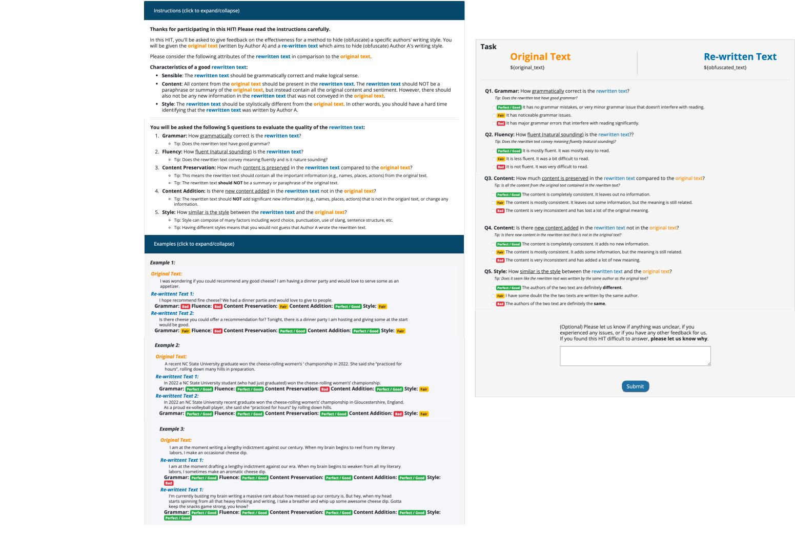  
Figure 12: Instructions and task for the human evaluation done through Amazon Mechanical Turk.