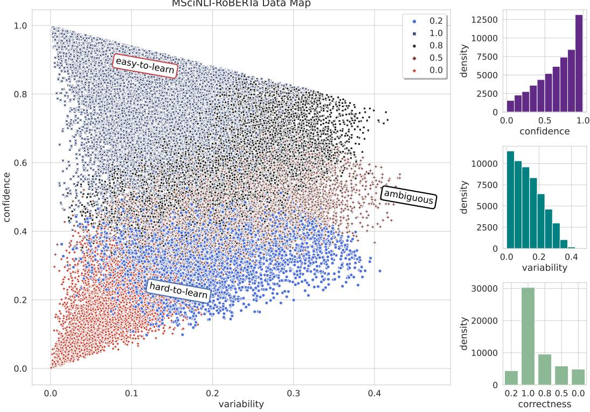

# MSCINLI: A Diverse Benchmark for Scientific Natural Language Inference

Mobashir Sadat Cornelia Caragea

Computer Science University of Illinois Chicago msadat3@uic.edu cornelia@uic.edu

## Abstract

The task of scientific Natural Language Inference (NLI) involves predicting the semantic relation between two sentences extracted from research articles. This task was recently proposed along with a new dataset called SCINLI derived from papers published in the computational linguistics domain. In this paper, we aim to introduce diversity in the scientific NLI task and present MSCINLI, a dataset containing 132, 320 sentence pairs extracted from five new scientific domains. The availability of multiple domains makes it possible to study domain shift for scientific NLI. We establish strong baselines on MSCINLI by fine-tuning Pre-trained Language Models (PLMs) and prompting Large Language Models (LLMs). The highest Macro F1 scores of PLM and LLM baselines are 77.21% and 51.77%, respectively, illustrating that MSCINLI is challenging for both types of models. Furthermore, we show that domain shift degrades the performance of scientific NLI models which demonstrates the diverse characteristics of different domains in our dataset. Finally, we use both scientific NLI datasets in an intermediate task transfer learning setting and show that they can improve the performance of downstream tasks in the scientific domain. We make our dataset and code available on Github.

## 1 Introduction

Natural Language Inference (NLI) (Bowman et al., 2015) or Textual Entailment is the task of recognizing the semantic relation between a pair of sentences where the first sentence is called premise and the second sentence is called hypothesis. Traditional NLI datasets such as SNLI (Bowman et al., 2015), MNLI (Williams et al., 2018a), SICK (Marelli et al., 2014), and ANLI (Nie et al., 2019) classify the premise-hypothesis pairs into one of three classes indicating whether the hypothesis entails, contradicts or is neutral to the premise. These datasets have been used both as a benchmark for Natural Language Understanding (NLU) and to improve downstream tasks such as fact verification (Martín et al., 2022) and fake news detection (Sadeghi et al., 2022). In addition, they have aided in the advancement of representation learning (Conneau et al., 2017), transfer learning (Pruksachatkun et al., 2020), and multi-task learning (Liu et al., 2019a).

However, since the examples in these datasets are derived from non-specialized domains, e.g., image captions, they do not capture the unique linguistic characteristics of different specialized domains such as the scientific domain. More recently, Sadat and Caragea (2022b) introduced the task of scientific NLI along with the first dataset for this task named SCINLI, which contains 107, 412 sentence pairs extracted exclusively from scientific papers related to computational linguistics published in the ACL anthology (Bird et al., 2008; Radev et al., 2009). To capture the inferences that frequently occur in scientific text, Sadat and Caragea (2022b) extended the three classes in traditional NLI to four classes for scientific NLI—ENTAILMENT, REA-SONING, CONTRASTING, and NEUTRAL. Since its introduction, SCINLI has gained great interest in the research community (Wang et al., 2022; Deka et al., 2022; Wu et al., 2023).

Despite introducing a challenging task and enabling the exploration of NLI with scientific text, SCINLI lacks the diversity to serve as a general purpose scientific NLI benchmark because it is limited to a single domain (ACL). Moreover, due to the unavailability of multiple domains, SCINLI is not suitable for studying domain adaptation and transfer learning on scientific NLI.

To this end, in this paper, we propose MSCINLI, a scientific NLI dataset containing 132, 320 sentence pairs extracted from papers published in five different domains: “Hardware”, “Networks”, “Software & its Engineering”, “Security & Privacy”, and “NeurIPS.” Similar to Sadat and Caragea (2022b), we use a distant supervision method that exploits the linking phrases between sentences in scientific papers to construct a large training set and directly use these potentially noisy sentence pairs during training. For the test and development sets, we manually annotate 4, 000 and 1, 000 examples, respectively, to create high quality evaluation data for scientific NLI.

We evaluate the difficulty of MSCINLI by experimenting with a BILSTM based model. We then establish strong baselines on MSCINLI by a) fine-tuning four transformer based Pre-trained Language Models (PLMs): BERT (Devlin et al., 2019), SCIBERT (Beltagy et al., 2019), ROBERTA (Liu et al., 2019b) and XLNET (Yang et al., 2019); and b) prompting two Large Language Models (LLMs) in both zero-shot and few-shot settings: LLAMA-2 (Touvron et al., 2023), and MISTRAL (Jiang et al., 2023). Furthermore, we provide a comprehensive investigation into the robustness of scientific NLI models by evaluating their performance under domain-shift at test time. Finally, we explore both SCINLI and MSCINLI in an intermediate task transfer learning setting (Pruksachatkun et al., 2020) to evaluate their usefulness in improving the performance of other downstream tasks.

Our key findings are: a) MSCINLI is more challenging than SCINLI; b) the best performing PLM baseline, which is based on ROBERTA, shows a Macro F1 of 77.21% on MSCINLI indicating the challenging nature of the task and a substantial headroom for improvement; c) the best performing LLM baseline with LLAMA-2 shows a Macro F1 of only 51.77% indicating that our dataset can be used to benchmark the NLU and complex reasoning capabilities of powerful LLMs; d) domain-shift at test time reduces the performance; and e) diversity in the scientific NLI datasets helps toimprove the performance of downstream tasks.

## 2 Related Work

Since the introduction of the NLI task, many datasets derived from different data sources have been made available. Datasets such as RTE (Dagan et al., 2006) and SICK (Marelli et al., 2014) were instrumental in the progress of NLI research in its earlier days. However, the training set sizes of these datasets are too small for large scale deep learning modeling. SNLI (Bowman et al., 2015) was introduced as a large dataset for NLI. SNLI contains

570K sentence pairs where premises are extracted from image captions and human crowdworkers were employed to write the hypotheses and assign the labels. While SNLI is significantly larger than all other prior datasets, due to the premises being extracted from a single source, it lacks the diversity to serve as a challenging and general purpose NLU benchmark. Consequently, Williams et al. (2018b) introduced MNLI containing 433K sentence pairs where the premises are extracted from a diverse number of sources such as face-to-face conversations, travel guides, and the 9/11 event. Apart from the premise sources, both SNLI and MNLI are constructed in a similar fashion and are the most popular NLI datasets in the recent years.

Other NLI datasets include QNLI (Wang et al., 2018)—derived from the SQuaD (Rajpurkar et al., 2016) question-answering dataset; XNLI (Conneau et al., 2018)—a cross lingual evaluation corpus derived by translating examples from MNLI; ANLI (Nie et al., 2020)—constructed in an iterative adversarial fashion to reduce spurious patterns where human annotators develop examples that can cause the model to make errors in each iteration; SCITAIL (Khot et al., 2018)—derived from a school level science question-answer corpus in which the sentence pairs are classified into two classes: entailment or not-entailment. These datasets have also seen wide applications both as NLU benchmarks and to improve other downstream NLP tasks. However, none of these datasets contains sentences from scientific text that is found in research articles. Moreover, the classes in these datasets are not sufficient to study the intersentence inferences and complexities that occur frequently in scientific text.

Thus, to capture both the particularities in scientific text and provide coverage to the frequently occurring inter-sentence semantic relations, Sadat and Caragea (2022b) introduced SCINLI. The sentence pairs in SCINLI were extracted from papers published in the ACL anthology (Radev et al., 2009) using distant supervision based on different linking phrases. Given that SCINLI was derived from a single data source (ACL), it also lacks the necessary diversity in the data. Therefore, with a similar motivation behind constructing MNLI—to extend SNLI to multiple domains, we propose MSCINLI, the first diverse benchmark for scientific NLI, to extend SCINLI to multiple domains. The availability of multiple domains in MSCINLI enables the evaluation of the models’ generalization ability under domain shift.

<table><tr><td>Domain</td><td>First Sentence</td><td>Second Sentence</td><td>Class</td></tr><tr><td>NEURIPS</td><td>A number of psychological studies have sug- gested that our brains indeed perform causal inference as an ideal observer (e.g., [10, 12–14]).</td><td>However, it has been challenging to come up with a simple and biologically plausible neural implementation for causal inference.</td><td>CONTRASTING</td></tr><tr><td>NETWORKS</td><td>Researchers found out that the inhomogeneity in the spatio-temporal distribution of the data traffic leads to extremely insufficient utiliza- tion of network resources.</td><td>Thus, it is important to fundamentally under- stand this distribution to help us make better resource planning or introduce new manage- ment tools such as time-dependent pricing to reduce the congestion.</td><td>REASONING</td></tr><tr><td>HARDWARE</td><td>Scaling PCM in deep sub-micron regime faces non-negligible inter-cell thermal interference during programming, referred to as write dis- turbance (WD) phenomenon.</td><td>That-is, the heat generated for writing one cell may disseminate beyond this cell and disturb the resistance states of its neighbor- ing cells.</td><td>ENTAILMENT</td></tr><tr><td>SECURITY &amp; PRIVACY</td><td>Following Google&#x27;s best practices for devel- oping secure apps, the password database is saved in the app data folder, which should be</td><td>this defines a hierarchical relationship be- tween domains where the bounded domain cannot have more permissions than its bound-</td><td>NEUTRAL</td></tr><tr><td>SOFTWARE &amp; ITS ENGI- NEERING</td><td>accessible only to the app itself. If the delete operation is complex, then it ad- vances to the discovery mode after which it will advance to the cleanup mode.</td><td>ing domain (the parent). On-the other-hand, if it is simple, then it directly advances to the cleanup mode (and skips the discovery mode).</td><td>CONTRASTING</td></tr></table>

Table 1: Examples of sentence pairs from MSCINLI extracted from different domains. The linking phrases at the beginning of the second sentence (strikethrough text in the table) are deleted after extracting the sentence pairs and assigning the labels.

Recently, LLMs have demonstrated near human performance in many NLP tasks including NLI. For example, Zhong et al. (2023) reported that Chat-$\mathrm { G P T } ^ { 2 }$ shows a zero-shot accuracy of 88% on RTE and 89.3% on the matched test set of MNLI. Thus, developing benchmark tasks and datasets which are challenging for even powerful LLMs is paramount. While the primary goal of our dataset is to introduce diversity in scientific NLI, because of the complex reasoning and inference required to predict the semantic relation between a pair of sentences from scientific text, it can serve as a challenging benchmark even for powerful LLMs.

## 3 MSciNLI: A Multi-Domain Scientific NLI Benchmark

In this section, we describe the data sources for MSCINLI, its construction process and statistics.

## 3.1 Data Sources

We derive MSCINLI from the papers published in four categories of the ACM digital library3 ‘Hardware’, ‘Networks’, ‘Software and its Engineering’, ‘Security and Privacy’ and the papers published in the NeurIPS4 conference. Table 1 shows examples of sentence pairs extracted from our five domains. Further details on our data sources (e.g., publication years of the papers) are available in Appendix A.1.

## 3.2 Data Extraction and Automatic Distant Supervision Labeling

We closely follow the data extraction and automatic labeling procedure based on distant supervision proposed by Sadat and Caragea (2022b). Specifically, we use linking phrases between sentences (e.g., “Therefore”, “Thus”, “In contrast”, etc.) to automatically annotate a large (potentially noisy) training set with the NLI relations. The complete list of linking phrases and their mapping to the NLI relations are presented in Appendix A.2. The procedure is detailed below.

For the ENTAILMENT, CONTRASTING, and REASONING classes, we extract adjacent sentence pairs from the papers collected from our five domains such that the second sentence starts with a linking phrase. For each extracted sentence pair, the relation corresponding to the linking phrase at the beginning of the second sentence is assigned as its class label. For example, if the second sentence starts with ‘Therefore’ or ‘Consequently’, the example is labeled as REASONING. Note that the linking phrase is removed from the second sentence after assigning the label to prevent the models from predicting the label by simply learning a superficial correlation between the linking phrase and the label and without actually learning the semantic relation.

For the NEUTRAL class, we construct the sentence pairs by extracting both sentences in the pair from the same paper using three approaches as follows: a) two random sentences that do not begin with any linking phrase are paired together; b) a random sentence which does not begin with any linking phrase is chosen as the first sentence and is paired with the second sentence of a random pair that belongs to one of the other three classes; c) a random sentence which does not begin with any linking phrase is chosen as the second sentence and is paired with the first sentence of a random pair that belongs to one of the other three classes.

<table><tr><td></td><td colspan="3">#Examples</td><td colspan="2">#Words</td><td colspan="2">‘S’ parser</td><td>Word</td><td></td></tr><tr><td>Domain</td><td>Train</td><td>Dev</td><td>Test</td><td>Prem.</td><td>Hyp.</td><td>Prem.</td><td>Hyp.</td><td>Overlap</td><td>Agrmt.</td></tr><tr><td>SCINLI (ACL)</td><td>101,412</td><td>2,000</td><td>4,000</td><td>27.38</td><td>25.93</td><td>96.8%</td><td>96.7%</td><td>30.06%</td><td>85.8%</td></tr><tr><td>HARDWARE</td><td>25,464</td><td>200</td><td>800</td><td>26.10</td><td>24.59</td><td>94.3%</td><td>94.5%</td><td>30.52%</td><td>84.6%</td></tr><tr><td>NETWORKS</td><td>25,464</td><td>200</td><td>800</td><td>26.37</td><td>25.01</td><td>93.9%</td><td>93.7%</td><td>30.17%</td><td>90.5%</td></tr><tr><td>SOFTWARE &amp; ITS ENGINEERING</td><td>25,464</td><td>200</td><td>800</td><td>25.80</td><td>24.51</td><td>93.9%</td><td>94.1%</td><td>29.83%</td><td>86.5%</td></tr><tr><td>SECURITY &amp; PRIVACY</td><td>25,464</td><td>200</td><td>800</td><td>26.14</td><td>24.50</td><td>94.0%</td><td>94.2%</td><td>29.91%</td><td>90.4%</td></tr><tr><td>NEURIPS</td><td>25,464</td><td>200</td><td>800</td><td>29.80</td><td>29.66</td><td>96.0%</td><td>95.1%</td><td>31.04%</td><td>88.5%</td></tr><tr><td>MScINLI Overall</td><td>127,320</td><td>1,000</td><td>4,000</td><td>26.84</td><td>25.85</td><td>94.4%</td><td>94.3%</td><td>30.29%</td><td>88.0%</td></tr></table>

Table 2: Comparison of key statistics of MSCINLI with SCINLI.

After extracting the sentence pairs for all four classes, we randomly split them at paper level into train, test and development sets (to ensure that the sentence pairs extracted from a certain paper end up in a single set). We directly use the automatically annotated examples for training the models. However, our use of distant supervision during the construction of the training set may introduce label noise when the relation between a pair of sentences is not accurately captured by the linking phrase. Therefore, to ensure a realistic evaluation, we employ human annotators to manually annotate the sentence pairs in the test and dev sets with one of the four scientific NLI relations as described below.

## 3.3 Multi-domain Scientific NLI Test and Development Set Creation

Three expert annotators (see Appendix A.3 for more details about the annotators and the instructions) are employed to annotate the test and dev sets of MSCINLI. Specifically, a random subset (balanced over the classes) of sentence pairs from the test and dev sets are given to the three annotators who are instructed to annotate their labels (the relation between the sentences) based only on the context available in the two sentences in each example. If the annotators are unable to determine the label based on the two sentences of a pair, they mark it as unclear. We assign a gold label to each example based on the majority vote from the annotators. In rare cases ( 3%) where there is no consensus among the annotators for an example, we do not assign a gold label. The examples for which there is a match between the gold label and the automatically assigned label (based on linking phrases) are included in their respective split and the rest are filtered out.

For each domain, we continue sampling random subsets (without replacement) of examples and manually annotate them until we have at least 800 clean examples (200 from each class) in the test set and 200 clean examples (50 from each class) in the dev set. In total, we annotate 6, 992 examples (all domains combined), among which 6, 153 have an agreement between the gold label and the automatically assigned label. That is, the overall agreement rate for MSCINLI is 88.0%. Moreover, we find a Fleiss-k score of 70.51% for MSCINLI indicating substantial agreement among the annotators (Landis and Koch, 1977).

Data Balancing To ensure equal representation, the number of examples per class in each domain are downsampled to a size of 200 and 50 in the test and dev set, respectively. Consequently, we end up with a combined (over the domains) test and dev sets of 4000 and 1000 examples, respectively (balanced over the classes and domains). We balance the training set by using a similar procedure.

## 3.4 Data Statistics

We show a comparison of key statistics of our dataset with the SCINLI dataset in Table 2.

Dataset Size We can see that the total number of examples (<premise, hypothesis> pairs) in MSCINLI is higher than that in SCINLI, the only NLI dataset over scientific text. Moreover, each domain in MSCINLI has a large number of examples in the training set which enables exploration of NLI in-domain as well as across domains.

Sentence Parses Similar to SCINLI, we use the Stanford PCFG Parser (3.5.2) (Klein and Manning, 2003) to parse the sentences in our dataset. We can see in Table 2 that 94% of the sentences in MSCINLI have an ‘S’ root showing that most sentences in our dataset are syntactically complete.

Token Overlap The percentage of word overlap between the premise and hypothesis in each pair in MSCINLI is also low and close to that of SCINLI as shown in Table 2. Thus, like SCINLI, our MSCINLI dataset is also less vulnerable to surface level lexical cues.

## 4 MSCINLI Evaluation

Our main experiments for evaluating MSCINLI consists of three stages. First, we evaluate its difficulty by experimenting with a BiLSTM model (§4.1). Next, we establish strong baselines on MSCINLI with four Pre-trained Language Models (PLMs) and two Large Language Models (LLMs), and compare them with human performance (§4.2). Finally, we analyze our best performing baseline by investigating its performance when it is finetuned on various subsets of the training set and its performance under domain shift (§4.3). Our implementation details are given in Appendix B. Additional experiments on the impact of dataset size and diversity in model training; performance of another LLM; spurious correlations (Gururangan et al., 2018); and class-wise performances of the baselines are shown in Appendix C.

## 4.1 Difficulty Evaluation

BiLSTM Model The architecture of this model (described in Appendix B) is similar to the BiL-STM model adopted by Williams et al. (2018a). We can see a comparison of the performance of this model on MSCINLI and SCINLI in Table 3. We observe the following:

MSCINLI is more challenging than SCINLI. We can see that the Macro F1 of the BiLSTM model for SCINLI is 61.12% whereas it is only 54.40% for MSCINLI (the model is trained on the combined MSCINLI training set). These results indicate that MSCINLI presents a broader range of challenges for the model compared with SCINLI, making the scientific NLI task more difficult.

## 4.2 Baselines

Here, we describe the baseline models for MSCINLI and discuss their performance.

## 4.2.1 PLM Baselines

We fine-tune the base variants of the following PLMs on the combined MSCINLI training set: BERT (Devlin et al., 2019); SCIBERT (Beltagy et al., 2019); (c) ROBERTA (Liu et al., 2019b);

<table><tr><td>Dataset</td><td>F1</td><td>Acc</td></tr><tr><td>SCINLI (ACL)</td><td>61.12</td><td>61.32</td></tr><tr><td>MSCINLI</td><td></td><td></td></tr><tr><td>-Hardware</td><td>53.61</td><td>53.87</td></tr><tr><td>-Networks</td><td>54.78</td><td>54.95</td></tr><tr><td>-Software &amp; its Engineering</td><td>51.96</td><td>52.20</td></tr><tr><td>-Security &amp; Privacy</td><td>52.18</td><td>52.62</td></tr><tr><td>-NeurIPS</td><td>59.19</td><td>59.41</td></tr><tr><td>-Overall</td><td>54.40</td><td>54.61</td></tr></table>

Table 3: The Macro F1 (%) and Accuracy (%) of the BiLSTM model on SCINLI and MSCINLI.

and (d) XLNET (Yang et al., 2019). We run each experiment with the PLM baselines three times with different random seeds and report the average and standard deviation of their domain-wise and overall Macro F1 scores in Table 4. Our findings are described below.

Domain specific pre-training helps improve the performance. We can see that SCIBERT shows a better performance than BERT in all domains. Note that SCIBERT does not address any weaknesses of BERT and is trained using the same procedure as BERT, except SCIBERT exclusively uses scientific text for pre-training whereas BERT is trained on the BookCorpus and Wikipedia. Thus, pre-training on scientific documents helps improve the performance of scientific NLI.

“Robust” pre-training leads to better performance. Both ROBERTA and XLNET are designed to address different weaknesses of BERT. ROBERTA focuses on optimizing the model in a more robust manner during pre-training while XL-NET aims at incorporating auto-regressive nature of natural language without removing bi-directional context. Both of these models substantially outperform BERT in all domains and ROBERTA consistently outperforms XLNET. We can also observe that ROBERTA leads to even better performance compared with SciBERT in most cases.

## 4.2.2 LLM Baselines

We experiment with two LLMs as baselines for our dataset: (a) LLAMA-2 (Touvron et al., 2023) and (b) MISTRAL (Jiang et al., 2023). More specifically, we use the Llama-2-13b-chat-hf and Mistral-7B-Instruct-v0.1 variants of LLAMA-2 and MIS-TRAL, containing 13 billion and 7 billion parameters, respectively. Both of these models are chosen because of their success in many NLP tasks that require complex reasoning and problem solving (e.g., the MMLU benchmark (Hendrycks et al., 2021)).

<table><tr><td>MODEL</td><td>HARDWARE</td><td>NETWORKS</td><td>SWE</td><td>SECURITY</td><td>NEURIPS</td><td>OVERALL</td></tr><tr><td>BERT</td><td> $7 2 . 8 9 \pm 0 . 1$ </td><td> $7 4 . 1 0 \pm 1 . 3$ </td><td> $7 1 . 3 7 \pm 0 . 3$ </td><td> $7 2 . 3 8 \pm 2 . 5$ </td><td> $7 5 . 4 6 \pm 0 . 8$ </td><td> $7 3 . 2 4 \pm 0 . 8$ </td></tr><tr><td>SCIBERT</td><td> ${ \underline { { 7 5 . 9 1 } } } \pm 0 . 1$ </td><td> ${ \bf 7 6 . 5 1 \pm 0 . 5 }$ </td><td> $7 5 . 2 8 \pm 1 . 1$ </td><td> $7 5 . 9 4 \pm 0 . 4$ </td><td> ${ \bf 7 8 . 7 8 \pm 0 . 1 }$ </td><td> $7 6 . 4 8 \pm 0 . 4$ </td></tr><tr><td>XLNET</td><td> $\overline { { 7 5 . 5 9 \pm 0 . 5 } }$ </td><td> $7 5 . 2 5 \pm 0 . 1$ </td><td> $\overline { { 7 3 . 9 8 \pm 0 . 6 } }$ </td><td> $\overline { { 7 5 . 0 9 \pm 0 . 8 } }$ </td><td> $7 7 . 6 4 \pm 1 . 0$ </td><td> $\overline { { 7 5 . 5 1 \pm 0 . 3 } }$ </td></tr><tr><td>ROBERTA</td><td> ${ \bf 7 7 . 7 9 ^ { \mathrm { 8 } } \pm 0 . 2 }$ </td><td> $7 5 . 4 5 \pm 1 . 5$ </td><td> ${ \bf 7 7 . 1 0 ^ { \# } \pm 0 . 7 }$ </td><td> ${ \bf 7 7 . 7 1 ^ { \mathrm { \tiny \ S } } \pm 0 . 2 }$ </td><td> $7 8 . 0 4 \pm 0 . 8$ </td><td> $\mathbf { 7 7 . 2 1 ^ { \# } \pm 0 . 3 }$ </td></tr></table>

Table 4: Macro F1 scores (%) of the PLM baselines on different domains. Here, SWE: Software & its Engineering and SECURITY: Security & Privacy. # and \$ indicate statistically significant improvement by ROBERTA over XLNET and over both SCIBERT and XLNET, respectively according to a paired t-test with $p ^ { - } < 0 . 0 5$ . Best performance is shown in bold, and second best is underlined.

<table><tr><td>MODEL</td><td>PROMPT</td><td>HARDWARE</td><td>NETWORKS</td><td>SWE</td><td>SECURITY</td><td>NEURIPS</td><td>OVERALL</td></tr><tr><td>LLAMA-2</td><td> $\operatorname { P R O M P T } - 1 _ { z s }$ </td><td>20.31</td><td>21.34</td><td>19.77</td><td>21.36</td><td>18.92</td><td>20.41</td></tr><tr><td></td><td> $\operatorname { P R O M P T } - 2 _ { z s }$ </td><td>18.23</td><td>20.60</td><td>21.26</td><td>19.87</td><td>17.62</td><td>19.53</td></tr><tr><td></td><td> $\mathrm { P R O M P T } - 3 _ { z s }$ </td><td>30.27</td><td>32.64</td><td>30.49</td><td>30.16</td><td>27.58</td><td>30.36</td></tr><tr><td></td><td> $\operatorname { P R O M P T } - 1 _ { f s }$ </td><td>24.42</td><td>26.69</td><td>27.75</td><td>28.84</td><td>22.98</td><td>26.21</td></tr><tr><td></td><td> $\operatorname { P R O M P T } - 2 _ { f s }$ </td><td>37.49</td><td>38.27</td><td>34.25</td><td>36.32</td><td>35.26</td><td>36.39</td></tr><tr><td></td><td> $\operatorname { P R O M P T } - 3 _ { f s }$ </td><td>53.41</td><td>51.38</td><td>50.54</td><td>52.75</td><td>50.38</td><td>51.77</td></tr><tr><td>MISTRAL</td><td> $\operatorname { P R O M P T } - 1 _ { z s }$ </td><td>21.72</td><td>21.48</td><td>19.87</td><td>22.77</td><td>21.36</td><td>21.43</td></tr><tr><td></td><td> $\operatorname { P R O M P T } - 2 _ { z s }$ </td><td>34.54</td><td>32.95</td><td>32.5</td><td>33.51</td><td>34.71</td><td>33.66</td></tr><tr><td></td><td> $\mathrm { P R O M P T } - 3 _ { z s }$ </td><td>34.64</td><td>33.68</td><td>34.14</td><td>36.00</td><td>34.78</td><td>35.00</td></tr><tr><td></td><td> $\operatorname { P R O M P T } - 1 _ { f s }$ </td><td>48.21</td><td>42.50</td><td>45.68</td><td>44.40</td><td>45.98</td><td>45.49</td></tr><tr><td></td><td> $\operatorname { P R O M P T } - 2 _ { f s }$ </td><td>39.83</td><td>38.71</td><td>35.45</td><td>36.70</td><td>36.30</td><td>37.55</td></tr><tr><td></td><td> $\operatorname { P R O M P T } - 3 _ { f s }$ </td><td>30.75</td><td>31.17</td><td>31.23</td><td>34.38</td><td>21.92</td><td>30.23</td></tr></table>

Table 5: Macro F1 scores (%) of the LLM baselines on different domains. Here, SWE: Software & its Engineering and SECURITY: Security & Privacy. Best performance is shown in bold, and second best is underlined.

We construct 3 multiple-choice question templates for the scientific NLI task to be used for prompting the LLMs:

• PROMPT - 1: this prompt asks the LLMs to predict the class given a sentence pair with the four class names as the choices.

• PROMPT - 2: to provide further context to the LLMs about the scientific NLI task, this prompt first defines the scientific NLI classes and then poses the question to predict the class with the class names as the choices.

• PROMPT - 3: instead of providing the definitions of the classes first and then asking a question with the class names as the choices, this prompt directly uses the class definitions as the choices.

The three prompt templates can be seen in Appendix D. We evaluate the performance of the LLMs in two settings: a) zero-shot: no input-output exemplars are shown to the model; b) few-shot: four input-human-annotated output exemplars (one for each class) are pre-pended to the prompt to evaluate the LLMs’ in-context learning (Brown et al., 2020) ability for scientific NLI. The zero-shot and few-shot versions of each prompt i is denoted as PROMPT $\mathbf { \nabla } _ { - } \ i _ { z s } .$ , and $\mathrm { P R O M P T } - i _ { f s } ,$ , respectively.

We employ a greedy decoding strategy for all of our LLM based experiments and report the domainwise and the overall Macro F1 scores of each experiment in Table 5. We find the following:

LLAMA-2 performs better than MISTRAL. We can see that LLAMA-2 with PROMPT - $3 _ { f s }$ shows the best performance among all of our LLMs with a Macro F1 of 51.77%. This is 6.28% higher than the best performance shown by MISTRAL with $\operatorname { P R O M P T } - 1 _ { f s }$ . Thus, LLAMA-2 with its 13B parameters has more complex reasoning capability compared to MISTRAL with its 7B parameters.

Using class-definitions as choices in the prompt and the few-shot prompt variants improve the performance. We can see that the performance of both LLMs are generally better when we use PROMPT - 3. This indicates that using the class definitions as the potential choices in the multiplechoice question is more suitable for the models, resulting in better performance. We can also see that the few-shot variants of the prompts generally outperform their zero-shot counterparts. Thus, both LLMs are capable of in-context learning and providing few examples can boost their performance.

Scientific NLI is highly challenging for state-ofthe-art LLMs Despite the promising few-shot performance, based on the results in Table 5, it is evident that the task of scientific NLI is highly challenging even for powerful LLMs. Therefore, our dataset along with SCINLI can serve as a challenging evaluation benchmark for LLMs.

<table><tr><td>Method</td><td>Macro F1</td><td>Accuracy</td></tr><tr><td>ROBERTA</td><td> $7 7 . 2 1 \pm 0 . 3 0$ </td><td> $7 7 . 4 2 \pm 0 . 3 0$ </td></tr><tr><td>LLAMA-2</td><td> $5 1 . 7 7 \pm 0 . 0 0$ </td><td> $5 1 . 1 0 \pm 0 . 0 0$ </td></tr><tr><td> $\bar { \mathrm { H U M A N } } - \bar { \mathrm { E } } \left( \mathrm { E S T . } \right)$ </td><td> $8 9 . 3 3 \pm 1 . 1 8$ </td><td> $8 9 . 1 0 \pm 1 . 1 0$ </td></tr><tr><td>HUMAN - NE (EST.)</td><td> $7 9 . 7 8 \pm 4 . 4 3$ </td><td> $7 9 . 4 9 \pm 4 . 8 4$ </td></tr></table>

Table 6: Comparison of estimated human expert and nonexpert performances with ROBERTA and LLAMA-2 (with PROMPT - 3) on the MSCINLI test set. Here, E: expert, NE: non-expert.

## 4.2.3 Human Performance

We hire three expert annotators (with relevant domain-specific background) and three non-expert annotators (with no background in any of the five domains) to evaluate the human performance on MSCINLI. Note that these expert and non-expert annotators are not involved in our dataset construction process (see Appendix A.3 for more details). Following other popular benchmarks (e.g., SUPER-GLUE (Wang et al., 2019)), we estimate the human performance by re-annotating a small randomly sampled subset of our test set. Each example in the subset is re-annotated by 3 expert and 3 non-expert annotators following the same data annotation procedure described in Section 3.3. We report the average and the standard deviation of the expert and non-expert performances (Macro F1) on this subset, and compare them with the best performing PLM baseline, ROBERTA, and the best performing LLM baseline, LLAMA-2 with PROMPT - $3 _ { f s }$ in Table 6. Our findings are described below:

Experts outperform non-experts, and a substantial gap exists between model performance and human expert performance. As expected, expert annotators with the relevant domain-specific knowledge substantially outperform the non-expert annotators. Despite the lower performance by the non-experts (compared with experts), we can see that they still outperform our baselines. Furthermore, the performance by the experts is significantly higher than both ROBERTA and LLAMA-2. Therefore, there is a substantial headroom for improving the models’ performance which can foster future research on scientific NLI.

## 4.3 Analysis

In this section, first, we diagnose the MSCINLI training set by fine-tuning separate models using different training subsets selected by performing data cartography (Swayamdipta et al., 2020)

<table><tr><td>Data Subset</td><td>Macro F1</td><td>Accuracy</td></tr><tr><td>100%</td><td> $7 7 . 2 1 \pm 0 . 3 0$ </td><td> $7 7 . 4 2 \pm 0 . 3 0$ </td></tr><tr><td>33% easy-to-learn</td><td> $7 3 . 7 1 ^ { \ast } \pm 1 . 4 0$ </td><td> $7 3 . 7 4 ^ { * } \pm 1 . 4 3$ </td></tr><tr><td>33% hard-to-learn</td><td> $3 4 . 1 1 ^ { * } \pm 5 . 6 5$ </td><td> $3 7 . 9 9 ^ { \ast } \pm 1 . 5 3$ </td></tr><tr><td>33% ambiguous</td><td> $7 5 . 6 5 ^ { * } \pm 0 . 2 7$ </td><td> $7 5 . 5 7 ^ { * } \pm 0 . 2 6$ </td></tr><tr><td>100%− top 25% hard</td><td> $7 6 . 6 0 \pm 0 . 6 5$ </td><td> $7 6 . 6 4 \pm 0 . 6 6$ </td></tr><tr><td>100%— top 5% hard</td><td> $7 7 . 4 7 \pm 0 . 2 3$ </td><td> $7 7 . 4 4 \pm 0 . 2 8$ </td></tr></table>

Table 7: The Macro F1 (%) and Accuracy (%) of ROBERTA fine-tuned on different subsets of MSCINLI training set. indicates a statistically significant difference with the performance of the model trained on 100% data according to a paired t-test with $p < 0 . 0 5$

(§4.3.1). Next, we study the model behavior under domain shift at test time (§4.3.2). Finally, we perform cross-dataset experiments where we analyze the performance of models fine-tuned on SCINLI, MSCINLI, and their combination (§4.3.3). We choose our best performing baseline model, ROBERTA for these experiments.

## 4.3.1 Data Cartography Experiments

We perform a data cartography of MSCINLI to characterize each example in the training set using two metrics — confidence and variability. Based on this characterization, inspired by (Swayamdipta et al., 2020), first, we fine-tune three different ROBERTA models using the following subsets of the training set: 1) 33% easy-to-learn — examples with high confidence; 2) 33% hard-to-learn — examples with low confidence; 3) 33% ambiguous — examples with high variability (the detailed method used for selecting these subsets of training examples is available in Appendix E). In addition, to further understand the effect of hard-tolearn examples in model training, we fine-tune two other models using the full training set minus — 1) top 25% hard-to-learn (25% examples with lowest confidence) and 2) top 5% hard-to-learn examples (5% examples with lowest confidence), denoted as ‘100% top 25% hard’, and ‘100% top 5% hard’, respectively. The results are shown in Table 7. We find the following.

Ambiguous examples yield stronger models while the full training set yields better performance. We can see that the model fine-tuned on the 33% ambiguous examples shows the best performance among the 33% subsets. Therefore, ‘ambiguousness’ in the training examples helps train stronger scientific NLI models. Despite the strong performance shown by 33% ambiguous, its Macro F1 is still lower than the 100% of the training set. Furthermore, although 33% hard-to-learn shows a poor performance (34.11% in Macro F1), removing a percentage of them (e.g., 25%, and 5% in the bottom block of Table 7) from the 100% of the training set does not result in any statistically significant difference in performance compared with 100%. Therefore, all examples in the training set are useful for training the most optimal model.

<table><tr><td>Test</td><td rowspan="2">HARDWARE</td><td rowspan="2">NETWORKS</td><td rowspan="2">SWE</td><td rowspan="2">SECURITY</td><td rowspan="2">NEURIPS</td><td rowspan="2">ACL</td></tr><tr><td>Train</td></tr><tr><td>HARDWARE</td><td>I  $7 4 . 9 3 \pm 1 . 4$ </td><td> $7 3 . 1 1 \pm 1 . 2$ </td><td> $7 4 . 2 4 \pm 0 . 2$ </td><td> $7 2 . 9 8 \pm 2 . 3$ </td><td> $7 3 . 9 7 \pm 0 . 7$ </td><td> $7 2 . 4 0 \pm 0 . 8$ </td></tr><tr><td>NETWORKS</td><td> $7 5 . 0 4 \pm 1 . 3$ </td><td> $7 3 . 3 1 \pm 1 . 7$  </td><td> $7 3 . 2 9 \pm 0 . 5$ </td><td> $7 3 . 4 4 \pm 1 . 0$ </td><td> $7 4 . 6 1 \pm 1 . 1$ </td><td> $7 2 . 7 2 \pm 1 . 0$ </td></tr><tr><td>SWE</td><td> $7 3 . 6 0 \pm 1 . 1$ </td><td> $7 1 . 2 5 \pm 0 . 8$ </td><td> $7 4 . 4 4 \pm 0 . 5$ </td><td> $7 3 . 2 4 \pm 1 . 4$ </td><td> $7 5 . 3 1 \pm 1 . 4$ </td><td> $7 3 . 0 6 \pm 1 . 8$ </td></tr><tr><td>SECURITY</td><td> $7 2 . 6 9 \pm 2 . 5$ </td><td> $7 0 . 9 4 \pm 1 . 8$ </td><td> $7 4 . 1 4 \pm 1 . 7$ </td><td> $7 4 . 4 5 \pm 2 . 5$  1</td><td> $7 3 . 1 2 \pm 1 . 6$ </td><td> $7 2 . 8 5 \pm 1 . 3$ </td></tr><tr><td>NEURIPS</td><td> $7 3 . 6 4 \pm 0 . 8$ </td><td> $7 1 . 9 4 \pm 1 . 1$ </td><td> $7 1 . 7 6 \pm 1 . 2$ </td><td> $7 1 . 6 2 \pm 0 . 8$ </td><td> $7 6 . 0 2 \pm 1 . 1$  </td><td> $7 4 . 1 5 \pm 0 . 8$ </td></tr><tr><td> $\mathbf { A C L - S M A L L }$ </td><td> $7 4 . 2 9 \pm 0 . 1$ </td><td> $7 1 . 8 1 \pm 0 . 8$ </td><td> $7 3 . 4 4 \pm 1 . 4$ </td><td> $7 3 . 3 8 \pm 1 . 1$ </td><td> $7 4 . 9 5 \pm 1 . 9$ </td><td> $7 5 . 3 0 \pm 0 . 5$ </td></tr></table>

Table 8: ID and OOD Macro F1 (%) of ROBERTA models trained on different domains. ID performance is shown in gray. Here, SWE: SOFTWARE & ITS ENGINEERING and SECURITY: SECURITY & PRIVACY.

<table><tr><td>Te Tr</td><td>SciNLI</td><td>MSciNLI</td><td>MSciNLI+</td></tr><tr><td>SCINLI</td><td>78.08</td><td>75.19</td><td>76.63</td></tr><tr><td>MSCINLI</td><td>76.74</td><td>77.21</td><td>76.95</td></tr><tr><td>MSCINLI+ (S)</td><td>77.78</td><td>77.37</td><td>77.54</td></tr><tr><td>MSCINLI+</td><td>79.48</td><td>78.07</td><td>78.76</td></tr></table>

Table 9: Macro F1 scores of cross dataset experiments with ROBERTA. Here, Tr: Train, Te: Test.

## 4.3.2 Out-of-domain Experiments

Here, we train ROBERTA on one domain and test it on another domain (out-of-domain) and contrast it with the ROBERTA trained and tested on the same domain (in-domain). In addition to the five domains in MSCINLI, we also experiment with the ACL domain from SCINLI. For a fair comparison with the other domains, we downsample the training set from SCINLI to the same size as that of the other domains and denote it as ACL - SMALL. Both in-domain (ID) and out-of-domain (OOD) results are shown in Table 8. Our findings are described below:

The domain shift reduces the performance. In general, for each domain, the ID model shows a higher performance than their OOD counterparts (see each column in Table 8). For example, the model fine-tuned on the NEURIPS training set shows a Macro F1 of 76.02% when it is tested on NEURIPS as well. The performance sees a decline when the models trained on other domains are tested on NEURIPS (e.g., 74.61% with the NET-WORKS model). This indicates that the sentence pairs in each domain exhibit unique linguistic characteristics which are better captured by a model trained on in-domain data.

## 4.3.3 Cross-dataset Experiments

For the cross-dataset experiments, we train four separate ROBERTA models on: 1) SCINLI, 2) MSCINLI, 3) MSCINLI+ (S) - a combination of MSCINLI and ACL - SMALL, and 4) MSCINLI+ - a combination of MSCINLI and SCINLI. All four models are then evaluated using the separate SCINLI and MSCINLI test sets, and their combination i.e., the MSCINLI+ test set. The results are reported in Table 9. We also evaluate the models on the domain-wise test sets, and general domain NLI datasets, and report the results in Appendix F.

Diverse training data leads to robust models. The performance sees a decline for both SCINLI and MSCINLI under ‘dataset-shift.’ However, the model fine-tuned with SCINLI shows a higher drop in performance compared with the model fine-tuned with MSCINLI in the out-of-dataset setting. Specifically, the out-of-dataset Macro F1 of the model fine-tuned with SCINLI (when it is tested on MSCINLI) drops by 2.02% from the indataset performance of MSCINLI (77.21%). In contrast, the out-of-dataset Macro F1 of the model fine-tuned with MSCINLI (when it is tested on SCINLI) drops by only 1.34% from the in-dataset performance of SCINLI (78.08%). This indicates that the diversity in the data can train more robust scientific NLI models with stronger generalization capabilities.

Combining the datasets yields the best performance. The best performance for both datasets and their combination is seen when the model is fine-tuned on MSCINLI+. Therefore, fine-tuning the model on a larger training set containing diverse examples yields better performance. We can see that the models trained on MSCINLI+ (S) show a lower performance than those trained on MSCINLI+. This is because MSCINLI+ (S) is smaller in size than MSCINLI+. However, due to the additional diversity introduced by the ACL domain, MSCINLI+ (S) consistently outperforms MSCINLI. Thus, the benefit of combining the datasets holds for MSCINLI+ (S) as well.

<table><tr><td rowspan="2">Dataset</td><td colspan="5">Intermediate training data</td></tr><tr><td>None</td><td>MSciNLI+ (MLM)</td><td>MNLI</td><td>SciNLI</td><td>MSciNLI+</td></tr><tr><td>ScIHTC</td><td>52.59</td><td>48.95</td><td>51.83</td><td>51.83</td><td>53.47</td></tr><tr><td>PAPER FIELD</td><td>73.66</td><td>73.46</td><td>73.64</td><td>73.61</td><td>74.09</td></tr><tr><td>ACL-ARC</td><td>69.57</td><td>63.95</td><td>59.73</td><td>68.52</td><td>73.04</td></tr></table>

Table 10: Macro F1 (%) of ROBERTA with intermediate task transfer using different NLI datasets.

## 5 Scientific NLI as an Intermediate Task

Research (Martín et al., 2022; Sadeghi et al., 2022) has shown that traditional NLI datasets (e.g., SNLI, MNLI) can aid in improving the performance of downstream NLP tasks. While the SCINLI dataset has already been used to improve sentence representation (Deka et al., 2022), it was used in conjunction with the traditional NLI datasets. In this section, we investigate whether the scientific NLI datasets by themselves can aid in improving the performance of downstream tasks in an intermediate task transfer setting (Pruksachatkun et al., 2020).

To this end, first, a ROBERTA model (out-of-thebox pre-trained with a dynamic MLM objective) is fine-tuned on the downstream tasks. Next, we perform intermediate training of four separate outof-the-box ROBERTA models with the following approaches before fine-tuning them on the downstream tasks: 1) with a self-supervised dynamic MLM objective (with no information of the NLI classes) on MSCINLI+; 2) with a supervised NLI objective using MNLI; 3) with a supervised scientific NLI objective using SCINLI; 4) with a supervised scientific NLI objective using MSCINLI+.

We experiment with the following downstream tasks: SCIHTC (Sadat and Caragea, 2022a), PA-PER FIELD (Beltagy et al., 2019), and ACL-ARC (Jurgens et al., 2018). SCIHTC and PAPER FIELD are topic classification datasets for scientific papers and ACL-ARC is a citation intent classification dataset. Details on these tasks and their labels are in Appendix G. The results for each downstream task are presented in Table 10. We find that:

Scientific NLI can aid in improving the performance of downstream tasks. As we can see from the table, intermediate training with an unsupervised MLM objective on MSCINLI+ (MSciNLI+ (MLM) in the table) fails to improve the performance of the downstream tasks over the models which are fine-tuned without any intermediate training. In contrast, supervised intermediate training on MSCINLI+ improves the performance of all datasets over all other models. This indicates that training a model further on the scientific NLI task can learn better and more relevant representations for the downstream tasks in the scientific domain. We can also see that supervised intermediate training on MNLI fails to show improvement for any of the downstream tasks. This illustrates the need for NLI datasets capturing the unique linguistic properties of scientific text (e.g., SCINLI and MSCINLI) in order to improve the performance of downstream tasks in this domain. Furthermore, we observe that intermediate training with a scientific NLI objective only using SCINLI fails to improve the performance of the downstream tasks. Therefore, while intermediate training with a scientific NLI objective can aid in improving the performance of downstream tasks, the diversity in the data is essential.

## 6 Conclusion & Future Directions

We introduce a diverse scientific NLI benchmark, MSCINLI derived from five scientific domains. We show that MSCINLI is more difficult to classify than the only other related dataset, SCINLI. We establish strong baselines on MSCINLI and find that our dataset is challenging for both PLMs and powerful LLMs. Furthermore, we provide a comprehensive investigation into the performance of scientific NLI models under domain-shift at test time and their usage in downstream NLP tasks. In the future, we will develop methods to improve the construction of prompts that enable better reasoning and inference capabilities of LLMs.

## Acknowledgements

This research is supported by NSF CAREER award 1802358 and NSF IIS award 2107518. Any opinions, findings, and conclusions expressed here are those of the authors and do not necessarily reflect the views of NSF. We thank our anonymous reviewers for their constructive feedback, which helped improve the quality of our paper.

## Limitations

From our experiments, we can see that the performance of the LLMs is low (best performing Macro F1 is 51.77%) on MSCINLI, which shows a lot of room for future improvement. The design of the prompts have a high impact on the performance as we can see from the results, thus, further exploration of other prompting strategies can potentially improve the performance further. In the future, we will focus on the design of other prompts to boost the performance of LLMs in scientific NLI.

## References

Iz Beltagy, Kyle Lo, and Arman Cohan. 2019. SciB-ERT: A pretrained language model for scientific text. In Proceedings ofthe 2019 Conference on Empirical Methods in Natural Language Processing and the 9th International Joint Conference on Natural Language Processing (EMNLP-IJCNLP), pages 3615– 3620, Hong Kong, China. Association for Computational Linguistics.

Steven Bird, Robert Dale, Bonnie J. Dorr, Bryan Gibson, Mark T. Joseph, Min-Yen Kan, Dongwon Lee, Brett Powley, Dragomir R. Radev, and Yee Fan Tan. 2008. The ACL Anthology Reference Corpus: A Reference Dataset for Bibliographic Research in Computational Linguistics. In Proc. ofthe 6th International Conference on Language Resources and Evaluation Conference (LREC’08), pages 1755–1759.

Samuel R. Bowman, Gabor Angeli, Christopher Potts, and Christopher D. Manning. 2015. A large annotated corpus for learning natural language inference. In Proceedings of the 2015 Conference on Empirical Methods in Natural Language Processing, pages 632–642, Lisbon, Portugal. Association for Computational Linguistics.

Tom Brown, Benjamin Mann, Nick Ryder, Melanie Subbiah, Jared D Kaplan, Prafulla Dhariwal, Arvind Neelakantan, Pranav Shyam, Girish Sastry, Amanda Askell, et al. 2020. Language models are few-shot learners. Advances in neural information processing systems, 33:1877–1901.

Alexis Conneau, Douwe Kiela, Holger Schwenk, Loic Barrault, and Antoine Bordes. 2017. Supervised learning of universal sentence representations from natural language inference data. arXiv preprint arXiv:1705.02364.

Alexis Conneau, Ruty Rinott, Guillaume Lample, Adina Williams, Samuel R. Bowman, Holger Schwenk, and Veselin Stoyanov. 2018. Xnli: Evaluating crosslingual sentence representations. In Proceedings of the 2018 Conference on Empirical Methods in Natural Language Processing. Association for Computational Linguistics.

Ido Dagan, Oren Glickman, and Bernardo Magnini. 2006. The pascal recognising textual entailment challenge. In Machine Learning Challenges. Evaluating Predictive Uncertainty, Visual Object Classification, and Recognising Tectual Entailment, pages 177–190, Berlin, Heidelberg. Springer Berlin Heidelberg.

Pritam Deka, Anna Jurek-Loughrey, et al. 2022. Evidence extraction to validate medical claims in fake news detection. In International Conference on Health Information Science, pages 3–15. Springer.

Jacob Devlin, Ming-Wei Chang, Kenton Lee, and Kristina Toutanova. 2019. BERT: Pre-training of deep bidirectional transformers for language understanding. In Proceedings ofthe 2019 Conference of the North American Chapter of the Association for Computational Linguistics: Human Language Technologies, Volume 1 (Long and Short Papers), pages 4171–4186, Minneapolis, Minnesota. Association for Computational Linguistics.

Suchin Gururangan, Swabha Swayamdipta, Omer Levy, Roy Schwartz, Samuel Bowman, and Noah A. Smith. 2018. Annotation artifacts in natural language inference data. In Proceedings ofthe 2018 Conference of the North American Chapter ofthe Associationfor Computational Linguistics: Human Language Technologies, Volume 2 (Short Papers), pages 107–112, New Orleans, Louisiana. Association for Computational Linguistics.

Dan Hendrycks, Collin Burns, Steven Basart, Andy Zou, Mantas Mazeika, Dawn Song, and Jacob Steinhardt. 2021. Measuring massive multitask language understanding. In International Conference on Learning Representations.

Albert Q Jiang, Alexandre Sablayrolles, Arthur Mensch, Chris Bamford, Devendra Singh Chaplot, Diego de las Casas, Florian Bressand, Gianna Lengyel, Guillaume Lample, Lucile Saulnier, et al. 2023. Mistral 7b. arXiv preprint arXiv:2310.06825.

David Jurgens, Srijan Kumar, Raine Hoover, Dan Mc-Farland, and Dan Jurafsky. 2018. Measuring the evolution of a scientific field through citation frames. Transactions of the Association for Computational Linguistics, 6:391–406.

Tushar Khot, Ashish Sabharwal, and Peter Clark. 2018. Scitail: A textual entailment dataset from science question answering. In AAAI, volume 17, pages 41– 42.

Diederik P Kingma and Jimmy Ba. 2014. Adam: A method for stochastic optimization. arXiv preprint arXiv:1412.6980.

Dan Klein and Christopher D. Manning. 2003. Accurate unlexicalized parsing. In Proceedings of the 41st Annual Meeting of the Association for Computational Linguistics, pages 423–430, Sapporo, Japan. Association for Computational Linguistics.

J Richard Landis and Gary G Koch. 1977. The measurement of observer agreement for categorical data. biometrics, pages 159–174.

Xiaodong Liu, Pengcheng He, Weizhu Chen, and Jianfeng Gao. 2019a. Multi-task deep neural networks for natural language understanding. In Proceedings of the 57th Annual Meeting of the Association for Computational Linguistics, pages 4487–4496, Florence, Italy. Association for Computational Linguistics.

Yinhan Liu, Myle Ott, Naman Goyal, Jingfei Du, Mandar Joshi, Danqi Chen, Omer Levy, Mike Lewis, Luke Zettlemoyer, and Veselin Stoyanov. 2019b. Roberta: A robustly optimized bert pretraining approach. arXiv preprint arXiv:1907.11692.

Marco Marelli, Stefano Menini, Marco Baroni, Luisa Bentivogli, Raffaella Bernardi, and Roberto Zamparelli. 2014. A SICK cure for the evaluation of compositional distributional semantic models. In Proceedings of the Ninth International Conference on Language Resources and Evaluation (LREC’14), pages 216–223, Reykjavik, Iceland. European Language Resources Association (ELRA).

Alejandro Martín, Javier Huertas-Tato, Álvaro Huertas-García, Guillermo Villar-Rodríguez, and David Camacho. 2022. Facter-check: Semi-automated factchecking through semantic similarity and natural language inference. Knowledge-Based Systems, 251:109265.

Yixin Nie, Adina Williams, Emily Dinan, Mohit Bansal, Jason Weston, and Douwe Kiela. 2019. Adversarial nli: A new benchmark for natural language understanding. arXiv preprint arXiv:1910.14599.

Yixin Nie, Adina Williams, Emily Dinan, Mohit Bansal, Jason Weston, and Douwe Kiela. 2020. Adversarial NLI: A new benchmark for natural language understanding. In Proceedings of the 58th Annual Meeting of the Association for Computational Linguistics, pages 4885–4901, Online. Association for Computational Linguistics.

Jeffrey Pennington, Richard Socher, and Christopher D. Manning. 2014. Glove: Global vectors for word representation. In Empirical Methods in Natural Language Processing (EMNLP), pages 1532–1543.

Yada Pruksachatkun, Jason Phang, Haokun Liu, Phu Mon Htut, Xiaoyi Zhang, Richard Yuanzhe Pang, Clara Vania, Katharina Kann, and Samuel R. Bowman. 2020. Intermediate-task transfer learning with pretrained language models: When and why does it work? In Proceedings of the 58th Annual Meeting of the Association for Computational Linguistics, pages 5231–5247, Online. Association for Computational Linguistics.

Dragomir R. Radev, Pradeep Muthukrishnan, and Vahed Qazvinian. 2009. The ACL Anthology network. In Proceedings ofthe 2009 Workshop on Text

and Citation Analysisfor Scholarly Digital Libraries (NLPIR4DL), pages 54–61, Suntec City, Singapore. Association for Computational Linguistics.

Pranav Rajpurkar, Jian Zhang, Konstantin Lopyrev, and Percy Liang. 2016. SQuAD: 100,000+ questions for machine comprehension of text. In Proceedings of the 2016 Conference on Empirical Methods in Natural Language Processing, pages 2383–2392, Austin, Texas. Association for Computational Linguistics.

Mobashir Sadat and Cornelia Caragea. 2022a. Hierarchical multi-label classification of scientific documents. In Proceedings of The 2022 Conference on Empirical Methods in Natural Language Processing (Volume 1: Long Papers), Abu Dhabi, United Arab Emirates. Association for Computational Linguistics.

Mobashir Sadat and Cornelia Caragea. 2022b. SciNLI: A corpus for natural language inference on scientific text. In Proceedings of the 60th Annual Meeting of the Associationfor Computational Linguistics (Volume 1: Long Papers), pages 7399–7409, Dublin, Ireland. Association for Computational Linguistics.

Fariba Sadeghi, Amir Jalaly Bidgoly, and Hossein Amirkhani. 2022. Fake news detection on social media using a natural language inference approach. Multimedia Tools and Applications, pages 1–21.

Swabha Swayamdipta, Roy Schwartz, Nicholas Lourie, Yizhong Wang, Hannaneh Hajishirzi, Noah A. Smith, and Yejin Choi. 2020. Dataset cartography: Mapping and diagnosing datasets with training dynamics. In Proceedings of the 2020 Conference on Empirical Methods in Natural Language Processing (EMNLP), pages 9275–9293, Online. Association for Computational Linguistics.

Hugo Touvron, Louis Martin, Kevin Stone, Peter Albert, Amjad Almahairi, Yasmine Babaei, Nikolay Bashlykov, Soumya Batra, Prajjwal Bhargava, Shruti Bhosale, et al. 2023. Llama 2: Open foundation and fine-tuned chat models. arXiv preprint arXiv:2307.09288.

Alex Wang, Yada Pruksachatkun, Nikita Nangia, Amanpreet Singh, Julian Michael, Felix Hill, Omer Levy, and Samuel Bowman. 2019. Superglue: A stickier benchmark for general-purpose language understanding systems. In Advances in Neural Information Processing Systems, volume 32. Curran Associates, Inc.

Alex Wang, Amanpreet Singh, Julian Michael, Felix Hill, Omer Levy, and Samuel Bowman. 2018. GLUE: A multi-task benchmark and analysis platform for natural language understanding. In Proceedings of the 2018 EMNLP Workshop BlackboxNLP: Analyzing and Interpreting Neural Networks for NLP, pages 353–355, Brussels, Belgium. Association for Computational Linguistics.

Chenglin Wang, Yucheng Zhou, Guodong Long, Xiaodong Wang, and Xiaowei Xu. 2022. Unsu-

pervised knowledge graph construction and eventcentric knowledge infusion for scientific nli. arXiv preprint arXiv:2210.15248.

Adina Williams, Nikita Nangia, and Samuel Bowman. 2018a. A broad-coverage challenge corpus for sentence understanding through inference. In Proceedings ofthe 2018 Conference ofthe North American Chapter of the Association for Computational Linguistics: Human Language Technologies, Volume 1 (Long Papers), pages 1112–1122, New Orleans, Louisiana. Association for Computational Linguistics.

Adina Williams, Nikita Nangia, and Samuel Bowman. 2018b. A broad-coverage challenge corpus for sentence understanding through inference. In Proceedings of the 2018 Conference of the North American Chapter of the Association for Computational Linguistics: Human Language Technologies, Volume 1 (Long Papers), pages 1112–1122. Association for Computational Linguistics.

Jinxuan Wu, Wenhan Chao, Xian Zhou, and Zhunchen Luo. 2023. Characterizing and verifying scientific claims: Qualitative causal structure is all you need. In Proceedings of the 2023 Conference on Empirical Methods in Natural Language Processing, pages 13428–13439, Singapore. Association for Computational Linguistics.

Zhilin Yang, Zihang Dai, Yiming Yang, Jaime Carbonell, Russ R Salakhutdinov, and Quoc V Le. 2019. Xlnet: Generalized autoregressive pretraining for language understanding. In Advances in neural information processing systems, pages 5753–5763.

Qihuang Zhong, Liang Ding, Juhua Liu, Bo Du, and Dacheng Tao. 2023. Can chatgpt understand too? a comparative study on chatgpt and fine-tuned bert. arXiv preprint arXiv:2302.10198.

Yukun Zhu, Ryan Kiros, Rich Zemel, Ruslan Salakhutdinov, Raquel Urtasun, Antonio Torralba, and Sanja Fidler. 2015. Aligning books and movies: Towards story-like visual explanations by watching movies and reading books. In Proceedings of the IEEE international conference on computer vision, pages 19–27.

<table><tr><td>Class</td><td>Linking Phrases</td></tr><tr><td>CONTRASTING</td><td>‘However&#x27;, &#x27;On the other hand&#x27;, &#x27;In contrast&#x27;, ‘On the contrary&#x27;</td></tr><tr><td>REASONING</td><td>‘Therefore&#x27;, ‘Thus&#x27;, ‘Consequently&#x27;, &#x27;As a result&#x27;, ‘As a consequence&#x27;, From here, we can infer&#x27;</td></tr><tr><td>ENTAILMENT</td><td>‘Specifically&#x27;, &#x27;Precisely&#x27;, &#x27;In particu- lar&#x27;, &#x27;Particularly&#x27;, &#x27;That is&#x27;, &#x27;In other words&#x27;</td></tr></table>

Table 11: Linking phrases used to extract sentence pairs and their corresponding classes.

## A Additional Dataset Details

## A.1 More Details about Data Sources

To construct our dataset, for all five domains, we choose papers published after the year 2000. In particular, the sentence pairs for the training set of NEURIPS are extracted from papers published between 2000 and 2018 and the test and development sets are derived from the papers published in 2019. The training sets for the four ACM domains— HARDWARE, NETWORKS, SOFTWARE & ITS EN-GINEERING, and SECURITY & PRIVACY are constructed from the papers published between 2000 and 2014. The sentence pairs extracted from the papers published between 2015 and 2017 are used to create the test and development sets for each domain.

## A.2 List of Linking Phrases

To construct MSCINLI, we use the same list of linking phrases and their corresponding classes as SCINLI. Table 11 shows the linking phrases and their classes.

## A.3 Details about Annotators and Annotation Instructions

In this section, we provide the details about the annotators we hired for constructing the test and development sets of MSCINLI (§A.3.1), and for evaluating the human performance (§A.3.2).

## A.3.1 Annotators for constructing the test and development sets.

For constructing the MSCINLI development and test sets (in Section 3.3), we hired 7 computer science undergraduate students as research interns at our institution who were compensated in an hourly basis by \$15/hour. Each annotator was trained with several pilot iterations before they started the final annotations for constructing the dataset. Moreover, out of the 7 students that we initially hired, only 3 were selected as the final annotators based on their performance during training to ensure a high quality of labels in our dataset.

The training phase of the students consists of 3 iterations. At each iteration, all 7 students were given a pilot batch and were instructed to predict the label based on the two sentences in each sample. We provide feedback to all students at the end of each iteration. In addition to the hired students, an author of this paper also annotated the examples in the third training iteration. 3 students were then selected as the final annotators who have the top three agreement rates with the author (79.3%, 78.6%, 75.8%). Once the annotators are trained, they start the final annotations to create the benchmark evaluation set of MSCINLI.

Note that the annotators are instructed to label each pair of sentences based on the four scientific NLI relations and not based on what could be a possibly good linking phrase between them. This annotation instruction ensures that the scientific NLI task formulation remains the same as the traditional NLI task—predicting the semantic relation between a pair of sentences.

## A.3.2 Annotators for evaluating human performance.

For evaluating the human performance on MSCINLI (in Section 4.2.3), we hire expert as well as non-expert annotators via a crowd-sourcing platform called COGITO.5 We ensured that none of the annotators for evaluating the human performance is involved with the construction of MSCINLI at any capacity. We distinguish between the expert and non-expert annotators based on whether they have the relevant background on the scientific domains in MSCINLI. Both sets of annotators are trained in the same fashion as the annotators who helped construct the test and development sets (described in the previous paragraphs). Both expert and nonexpert annotators are paid at a rate of \$0.6/sample.

## A.4 Class-wise Agreement Rate

The total number of annotated examples while constructing the test and development sets (in Section 3.3) for each class and the agreement rate between the gold label and the automatically assigned label based on linking phrases can be seen in Table 12.

<table><tr><td>Class</td><td>#Annotated</td><td>Agreement</td></tr><tr><td>Contrasting</td><td>1748</td><td>92.9%</td></tr><tr><td>Reasoning</td><td>1748</td><td>83.1%</td></tr><tr><td>Entailment</td><td>1748</td><td>79.2%</td></tr><tr><td>Neutral</td><td>1748</td><td>96.7%</td></tr><tr><td>Overall</td><td>6992</td><td>88.0%</td></tr></table>

Table 12: Number of manually annotated examples and the agreement rate between the gold labels and automatically assigned labels for each class.

## A.5 Difference/Closeness of the Domains

We quantify the differences/closeness of the domains in MSCINLI and the computational linguistic domain from SCINLI as the pairwise cosine similarities of the probability distributions of the RoBERTa-base6 vocabulary over each domain. The cosine similarities are reported in Table 13. We can see that the first four domains in the Table show a high similarity among them. Recall that the sentence pairs for all of these four domains are extracted from papers published in the ACM digital library. The high cosine similarities illustrate that the writing style and the vocabulary used in these domains are similar. In contrast, the cosine similarity of NEURIPS is the lowest with all other four domains in MSCINLI. Therefore, the vocabulary and the writing style in the papers published in NEURIPS differs substantially from the other four domains. Furthermore, it can be seen that the similarity between ACL and the five domains in MSCINLI is low, which illustrates that our dataset indeed diversifies the task of scientific NLI.

## B Implementation Details

All of our experiments are implemented using Py-Torch.7 The details are provided below.

BILSTM baseline Two separate BiLSTM layers are used to get the sentence level representations of the two sentences in each pair. The token embeddings of each sentence are sent through the respective BiLSTM layer and then the output hidden states are averaged to get the sentence level representations. The context vector $S _ { c }$ is derived by concatenating the sentence level representations, their element-wise multiplication and difference. $S _ { c }$ is projected with a weight matrix $\mathbf { W } \in \mathbb { R } ^ { d \times 4 }$ by using a linear layer with softmax to predict the class.

<table><tr><td></td><td>HW</td><td>NW</td><td>SWE</td><td>SEC</td><td>NIPS</td><td>ACL</td></tr><tr><td>HW</td><td>1</td><td></td><td></td><td></td><td></td><td></td></tr><tr><td>NW</td><td>0.94</td><td>1</td><td></td><td></td><td></td><td></td></tr><tr><td>SWE</td><td>0.95</td><td>0.95</td><td>1</td><td></td><td></td><td></td></tr><tr><td>SEC</td><td>0.93</td><td>0.96</td><td>0.97</td><td>1</td><td></td><td></td></tr><tr><td>NIPS</td><td>0.70</td><td>0.63</td><td>0.63</td><td>0.61</td><td>1</td><td></td></tr><tr><td>ACL</td><td>0.76</td><td>0.69</td><td>0.71</td><td>0.68</td><td>0.81</td><td>1</td></tr></table>

Table 13: Pair-wise cosine similarities of the probability distributions of the vocabulary of RoBERTa-base over domainwise training sets. Here, HW:HARDWARE, NW:NETWORKS, SWE: SOFTWARE & ITS ENGINEERING., SEC: SECURITY & PRIVACY, NIPS: NEURIPS, and ACL: data from SCINLI.

Each BiLSTM layer is equipped with 300D Glove (Pennington et al., 2014) embeddings which are allowed to be updated during training. The hidden state size for both BiLSTM layers is set at 300. The models are trained for 30 epochs with early stopping where we set the patience to be 10. The Macro F1 of the development score in every epoch is used as the stopping criteria. We use a cross-entropy loss and Adam optimizer (Kingma and Ba, 2014) to optimize the model parameters. The min-batch size and learning rate are set at 64 and 0.001, respectively.

PLM baselines The details of our pre-trained models are described as follows: (a) BERT (Devlin et al., 2019) - pre-trained by masked language modeling (MLM) and Next Sentence Prediction (NSP) objectives on BookCorpus (Zhu et al., 2015) and Wikipedia; (b) SCIBERT (Beltagy et al., 2019) - pre-trained using the same objectives as BERT but using scientific text exclusively as the pre-training data; (c) ROBERTA (Liu et al., 2019b) - an extension of BERT which uses a variation of MLM where different words are masked in each epoch dynamically (unlike static masking in standard MLM). It is also trained on larger amount of text, larger mini-batch size and larger number of epochs compared to BERT; and (d) XLNET (Yang et al., 2019) - pre-trained with a “Permutation Language Modeling” objective instead of MLM to provide bi-directional context to the model while being auto-regressive.

For these PLM baselines, the two sentences in each example are concatenated with a [SEP] token between them to be used as the input and the hidden representation embedded in the [CLS] token is then projected with a weight matrix $\textbf { W } \in$ $\mathbb { R } ^ { d \times 4 }$ . Finally, we use softmax on the projected representation to get the probability distribution over the four classes. The class with the maximum probability is predicted as the label for each input pair.

<table><tr><td></td><td>HARDWARE</td><td>NETWORKS</td><td>SWE</td><td>SECURITY</td><td>NEURIPS</td><td>OVERALL</td></tr><tr><td>DOMAIN-WISE</td><td></td><td></td><td></td><td></td><td></td><td></td></tr><tr><td>BERT</td><td> $6 8 . 6 3 \pm 1 . 4$ </td><td> $6 7 . 6 9 \pm 1 . 3$ </td><td> $6 5 . 7 5 \pm 0 . 8$ </td><td> $6 7 . 0 4 \pm 2 . 9$ </td><td> $7 0 . 4 8 \pm 1 . 6$ </td><td></td></tr><tr><td>SCIBERT</td><td> $7 2 . 7 6 \pm 0 . 9$ </td><td> $7 2 . 9 7 \pm 1 . 4$ </td><td> $7 2 . 4 3 \pm 0 . 8$ </td><td> $7 2 . 4 5 \pm 1 . 4$ </td><td> $7 6 . 1 4 \pm 0 . 5$ </td><td></td></tr><tr><td>XLNET</td><td> $7 2 . 8 8 \pm 0 . 6$ </td><td> $6 8 . 8 5 \pm 2 . 2$ </td><td> $7 1 . 5 2 \pm 2 . 1$ </td><td> $7 1 . 6 0 \pm 0 . 8$ </td><td> $7 2 . 9 6 \pm 0 . 8$ </td><td></td></tr><tr><td>ROBERTA</td><td> $7 4 . 9 3 \pm 1 . 4$ </td><td> $7 3 . 3 1 \pm 1 . 7$ </td><td> $7 4 . 4 4 ^ { * } \pm 0 . 5$ </td><td> $7 4 . 4 5 \pm 2 . 2$ </td><td> $7 6 . 0 2 ^ { \# } \pm 1 . 1$ </td><td></td></tr><tr><td>MERGED - SMALL</td><td></td><td></td><td></td><td></td><td></td><td></td></tr><tr><td>BERT</td><td> $6 9 . 3 6 \pm 0 . 5$ </td><td> $6 8 . 0 8 \pm 1 . 3$ </td><td> $6 6 . 6 1 \pm 0 . 1$ </td><td> $6 7 . 6 6 \pm 1 . 4$ </td><td> $7 1 . 6 2 \pm 0 . 1$ </td><td> $6 8 . 6 7 \pm 0 . 3$ </td></tr><tr><td>SCIBERT</td><td> $7 2 . 9 5 \pm 0 . 3$ </td><td> $7 2 . 8 8 \pm 1 . 1$ </td><td> $7 2 . 6 6 \pm 0 . 2$ </td><td> $7 2 . 3 7 \pm 1 . 5$ </td><td> $7 4 . 9 6 \pm 1 . 6$ </td><td> $7 3 . 1 7 \pm 0 . 7$ </td></tr><tr><td>XLNET</td><td> $7 2 . 8 7 \pm 1 . 7$ </td><td> $7 1 . 0 3 \pm 1 . 8$ </td><td> $7 2 . 2 1 \pm 1 . 7$ </td><td> $7 0 . 9 0 \pm 0 . 8$ </td><td> $7 3 . 4 5 \pm 0 . 7$ </td><td> $7 1 . 9 6 \pm 1 . 2$ </td></tr><tr><td>ROBERTA</td><td> $7 5 . 0 6 ^ { * } \pm 0 . 7$ </td><td> $7 3 . 2 0 \pm 1 . 1$ </td><td> $7 4 . 4 9 ^ { * } \pm 0 . 4$ </td><td> $7 3 . 7 3 ^ { \# } \pm 1 . 1$ </td><td> $7 5 . 7 5 \pm 1 . 6$ </td><td> $7 4 . 4 7 \pm 0 . 8$ </td></tr><tr><td>MERGED - LARGE</td><td></td><td></td><td></td><td></td><td></td><td></td></tr><tr><td>BERT</td><td> $7 2 . 8 9 \pm 0 . 1$ </td><td> $7 4 . 1 0 \pm 1 . 3$ </td><td> $7 1 . 3 7 \pm 0 . 3$ </td><td> $7 2 . 3 8 \pm 2 . 5$ </td><td> $7 5 . 4 6 \pm 0 . 8$ </td><td> $7 3 . 2 4 \pm 0 . 8$ </td></tr><tr><td>SCIBERT</td><td> $7 5 . 9 1 \pm 0 . 1$ </td><td> $7 6 . 5 1 \pm 0 . 5$ </td><td> $7 5 . 2 8 \pm 1 . 1$ </td><td> $7 5 . 9 4 \pm 0 . 4$ </td><td> $7 8 . 7 8 \pm 0 . 1$ </td><td> $7 6 . 4 8 \pm 0 . 4$ </td></tr><tr><td>XLNET</td><td> $7 5 . 5 9 \pm 0 . 5$ </td><td> $7 5 . 2 5 \pm 0 . 1$ </td><td> $7 3 . 9 8 \pm 0 . 6$ </td><td> $7 5 . 0 9 \pm 0 . 8$ </td><td> $7 7 . 6 4 \pm 1 . 0$ </td><td> $7 5 . 5 1 \pm 0 . 3$ </td></tr><tr><td>ROBERTA</td><td> $7 7 . 7 9 ^ { \mathbb { 9 } } \pm 0 . 2$ </td><td> $7 5 . 4 5 \pm 1 . 5$ </td><td> $7 7 . 1 0 ^ { \# } \pm 0 . 7$ </td><td> $7 7 . 7 1 ^ { \mathbb { S } } \pm 0 . 2$ </td><td> $7 8 . 0 4 \pm 0 . 8$ </td><td> $7 7 . 2 1 ^ { \# } \pm 0 . 3$ </td></tr></table>

Table 14: Macro F1 scores (%) of our PLM baselines on different domains trained in different settings. Here, SWE: Software & its Engineering and SECURITY: Security & Privacy. All MERGED - SMALL scores are statistically indistinguishable from their DOMAIN-WISE counterparts according to a paired t-test with $\begin{array} { r } { p < 0 . 0 5 . } \end{array}$ All MERGED-LARGE scores show statistically significant improvement over MERGED-SMA $\mathrm { . L L . } ^ { \mathrm { ~ \tiny ~ * ~ } } , \# , ^ { \mathrm { ~ \tiny ~ \ S ~ } }$ indicate statistically significant improvement by ROBERTA over SCIBERT, XLNET, and both SCIBERT and XLNET, respectively.

Each PLM baseline is fine-tuned for 10 epochs with early stopping using the huggingface8 library. The patience for early stopping is set at 2. The learning rate and the mini-batch size is set at $2 e - 5 ,$ and 64, respectively. We use a cross-entropy loss and Adam optimizer (Kingma and Ba, 2014) to optimize the model parameters.

LLM baselines We make use of the prompt templates described in Section 4.2.2 to construct the inputs to the LLM baselines. Similar to the PLM baselines, we conduct our experiments for LLM baselines using the huggingface library. We employ a greedy decoding strategy with a maximum generated token count to be 40. Generally, instead of only providing the answer to our multiple-choice question, the LLMs generates a more verbose response with the answer contained in it. We manually examine the responses for each prompt by each LLM and develop scripts to extract the correct answer with rule-based approaches.

RTX A5000 GPUs and it took  3 hours on average for each experiment.

## C Additional Results

Computational Cost The BiLSTM and PLM experiments are conducted on a single NVIDIA RTX A5000 GPU. The BiLSTM model was trained in 30 minutes. The time needed to fine-tune each PLM baseline on the full MSCINLI training set using a single GPU is  2 hours. The inference by the LLM baselines is conducted using two NVIDIA

## C.1 Domain-wise vs Merged

In addition to fine-tuning on the combined MSCINLI training set (127, 320 examples) in Section 4.2.1, we experiment with the PLM baselines in two other settings: DOMAIN-WISE and MERGED-SMALL (see the description of these settings below) and compare their performance with the model fine-tuned on the combined MSCINLI training set denoted as MERGED-LARGE. The motivation behind these experiments is two-fold: a) to understand the impact of diversity of examples in model training (DOMAIN-WISE vs MERGED-SMALL) (when the models are trained on data from a single domain vs data from diverse domains— but all being trained on the same training set size); and b) to understand the impact of training set size (MERGED-SMALL vs MERGED-LARGE). In the DOMAIN-WISE setting, we train and evaluate separate models for each domain using the data from the respective domain. For the MERGED-SMALL setting, we randomly down-sample the training set of each domain to 5092 examples (class-balanced) before combining them to ensure that the total size of the merged set MERGED-SMALL is similar to the DOMAIN-WISE training set size ( 25, 464). We combine the downsampled data from all domains and train a single model using the merged data. This model is then evaluated on the test set of each domain and the combined MSCINLI test set. The MERGED-LARGE setting corresponds to the combined training set of MSciNLI of 127, 320 examples.

<table><tr><td>MODEL</td><td>CONTRASTING</td><td>REASONING</td><td>ENTAILMENT</td><td>NEUTRAL</td><td>MACRO AVE.</td></tr><tr><td>Precision</td><td></td><td></td><td></td><td></td><td></td></tr><tr><td>ROBERTA</td><td>74.24</td><td>74.61</td><td>76.38</td><td>85.46</td><td>77.67</td></tr><tr><td>LLAMA-2</td><td>56.35</td><td>36.19</td><td>49.76</td><td>71.96</td><td>53.57</td></tr><tr><td>Recall</td><td></td><td></td><td></td><td></td><td></td></tr><tr><td>ROBERTA</td><td>87.93</td><td>67.36</td><td>74.63</td><td>79.36</td><td>77.32</td></tr><tr><td>LLAMA-2</td><td>54.50</td><td>50.10</td><td>42.30</td><td>57.50</td><td>51.10</td></tr><tr><td>F1</td><td></td><td></td><td></td><td></td><td></td></tr><tr><td>ROBERTA</td><td>80.43</td><td>70.76</td><td>75.44</td><td>82.22</td><td>77.21</td></tr><tr><td>LLAMA-2</td><td>55.41</td><td>42.03</td><td>45.72</td><td>63.92</td><td>51.77</td></tr></table>

Table 15: Class-wise precision (%), recall (%), F1 (%), and their macro averages (%) of our best performing PLM and LLM baselines on MSCINLI.

We run each experiment three times and report the average and standard deviation of the Macro F1 score of the models in the three settings in Table 14. We find the following:

Training models on diverse data is more optimal. We can see that each model trained in the MERGED - SMALL setting shows similar performance as their DOMAIN-WISE counterparts. Moreover, in some cases (e.g., for BERT for all domains, XLNET for NEURIPS), the MERGED - SMALL models outperform the DOMAIN-WISE models. Recall that the size of the MERGED-SMALL training set is the same as each of the DOMAIN-WISE training sets. Since we train separate models for each domain in the DOMAIN-WISE setting, it is five times computationally more expensive than the MERGED - SMALL setting where a single model is trained for all domains. Therefore, training a single model on diverse data can reduce the computational cost without compromising model performance resulting in a more optimal approach.

More data leads to better performance. Next we compare the performance of the model finetuned on MERGED-SMALL with its MERGED-LARGE counterpart. The results show that MERGED - LARGE models consistently outperform the MERGED - SMALL models by a substantial margin. Therefore, the performance on our dataset improves with the the increase of dataset size.

## C.2 Class-wise Performances

We evaluate the class-wise performance of our best performing PLM baseline—ROBERTA trained on the combined MSCINLI training set, and our best performing LLM baseline—LLAMA-2 with PROMPT - 3 in the few-shot setting. The results are reported in Table 15.

As we can see, both models show a better performance for the CONTRASTING and the NEUTRAL classes, and they struggle more for the REASON-ING, and ENTAILMENT classes. However, even the CONTRASTING and the NEUTRAL classes are still challenging for the models with substantial headroom for improvement.

## C.3 Another LLM Baseline - GPT-NEOX

In addition to the LLMs that we explore in Section 4.2, we also experiment with the GPT-NEOXT-CHAT-BASE-20B9 variant of the GPT-NEOX model. However, despite being much larger in size than the LLAMA-2 and MISTRAL baselines (20 billion parameters vs 13B and 7B, respectively), GPT-NEOX failed to show any promising performance (for the same three prompts used in the paper). We report the performance of these baselines in Table 16. We can see that the best performance for GPT-NEOX is shown by PROMPT - $1 _ { z s }$ with an overall Macro F1 of only 22.14%. Moreover, none of the few-shot versions of the prompts shows any meaningful performance for this model (10.00% in Macro F1 with four labels in total means that the model always predicts the same label). In our future work, we will focus on the designing of other prompts that can improve the performance of the LLMs.

## C.4 Only-Second-Sentence Baseline

To evaluate the degree of spurious correlations (Gururangan et al., 2018) that may exist in MSCINLI, we experiment with only-second-sentence models. Specifically, we fine-tune both ROBERTA and SCIBERT where only the second sentence is used as the input. A comparison between the onlysecond-sentence models and the models using both sentences can be seen in Table 17. The results show that the performance decreases by a large margin when only the second sentence is used as the input. Therefore, the amount of spurious correlation in MSCINLI is smaller compared with other existing NLI datasets (e.g., SNLI (Bowman et al., 2015)) and the models need to learn the semantic relation between the sentences in each pair in order to perform well.

<table><tr><td></td><td>HARDWARE</td><td>NETWORKS</td><td>SWE</td><td>SECURITY</td><td>NEURIPS</td><td>OVERALL</td></tr><tr><td>GPT-NEOXT-CHAT</td><td></td><td></td><td></td><td></td><td></td><td></td></tr><tr><td> $\operatorname { P R O M P T } - 1 _ { z s }$ </td><td>17.84</td><td>19.17</td><td>20.19</td><td>18.04</td><td>16.99</td><td>18.49</td></tr><tr><td> $\operatorname { P R O M P T } - 2 _ { z s }$ </td><td>20.48</td><td>18.28</td><td>20.67</td><td>21.62</td><td>27.56</td><td>22.14</td></tr><tr><td> $\mathrm { P R O M P T } - 3 _ { z s }$ </td><td>12.69</td><td>15.30</td><td>13.63</td><td>13.90</td><td>14.66</td><td>14.12</td></tr><tr><td> $\operatorname { P R O M P T } - 1 _ { f s }$ </td><td>10.00</td><td>10.00</td><td>10.00</td><td>10.00</td><td>10.00</td><td>10.00</td></tr><tr><td> $\operatorname { P R O M P T } - 2 _ { f s }$ </td><td>10.00</td><td>10.00</td><td>10.00</td><td>10.00</td><td>10.00</td><td>10.00</td></tr><tr><td> $\operatorname { P R O M P T } - 3 _ { f s }$ </td><td>10.00</td><td>10.00</td><td>10.00</td><td>10.00</td><td>10.00</td><td>10.00</td></tr></table>

Table 16: Macro F1 scores (%) of our GPT-NEOX baseline on different domains. Here, SWE: Software & its Engineering and SECURITY: Security & Privacy.

<table><tr><td rowspan="2">Model</td><td colspan="3">SCINLI</td></tr><tr><td></td><td>F1</td><td>Acc</td></tr><tr><td rowspan="2">RoBERTa</td><td>BOTH SENTENCES</td><td>77.21</td><td>77.20</td></tr><tr><td>ONLY  $2 ^ { n d }$  SENTENCE</td><td>52.55</td><td>53.55</td></tr><tr><td rowspan="2">SciBERT</td><td>BOTH SENTENCES</td><td>76.48</td><td>76.46</td></tr><tr><td>ONLY  $2 ^ { n d }$  SENTENCE</td><td>53.14</td><td>53.65</td></tr></table>

Table 17: Performance comparison on MSCINLI when both sentences are concatenated vs. when only second sentence is used as the input.

However, given that the performance of the only-second-sentence models are much higher than chance (25%), we believe there are still some degree of spurious patterns in MSCINLI. In our future work, we will explore methods to identify and reduce the degree of spurious patterns in scientific NLI.

## D Prompts for LLMs

The zero-shot versions of the three prompt templates that we construct for LLMs can be seen in Table 18. For the few-shot versions of the prompts, we pre-pend four input-human annotated output exemplars (one for each class) to each prompt. Note that the <human> and <bot> tags in the prompts in the Table are replaced with the relevant tags for each LLM (e.g., [INST]).

## E Training Dynamics Based Data Selection

The easy/hard/ambiguous subsets of the training data are selected based on their training dynamics (Swayamdipta et al., 2020). Specifically, the training dynamics of each example is defined in the form of three metrics—confidence, variability, and correctness during training a classifier. These metrics are used to plot the examples in a data map to perform a visual analysis. The aforementioned three subsets of the training set are then selected based on confidence and variability. In this section, we define these metrics, perform a data cartography of MSCINLI, and describe the method to select the subsets used in Section 4.3.1.

## E.1 Metrics Definitions

The confidence of each example is defined as the average of the probability predicted by a classifier for its label over the training epochs. That is, for a training example $X _ { i }$ and its label $y _ { i }$ , the confidence $c _ { i }$ is calculated as follows:

$$
c _ { i } = \frac { 1 } { E } \sum _ { e = 1 } ^ { E } p ( y _ { i } | X _ { i } , \theta ^ { e } )\tag{1}
$$

Here, $E$ is the number of training epochs, $\theta _ { e }$ is the model at epoch e and $p$ is the probability of the label given $X _ { i }$ and $\theta _ { e }$ . The variability of each example is defined as the standard deviation of the predicted probability for its label over the training epochs. More formally, the variability, $v _ { i }$ of an example $X _ { i }$ is calculated as:

$$
v _ { i } = \sqrt { \frac { \sum _ { e = 1 } ^ { E } ( p ( y _ { i } | X _ { i } , \theta ^ { e } ) - c _ { i } ) ^ { 2 } } { E } }\tag{2}
$$

Finally, the fraction of the training epochs where the classifier predicts the label of an example correctly is defined as its correctness.

<table><tr><td rowspan=1 colspan=5>PROMPT - 1  &lt;human&gt;: Consider the following two sentences:Sentence1: &lt;sentence1&gt;Sentence2: &lt;sentence2&gt;What is the semantic relation between Sentence1 and Sentence2? Choose from the following options:1. Entailment, 2. Reasoning, 3. Contrasting, 4. Neutral.&lt;bot&gt;:</td></tr><tr><td rowspan=4 colspan=5>PROMPT - 2  &lt;human&gt;: Consider the following class definitions of four semantic relations between a pair ofsentences.Entailment: &lt;definition of entailment&gt;Contrasting: &lt;definition of contrasting&gt;Reasoning: &lt;definition of reasoning&gt;Neutral: &lt;definition of neutral&gt;Now consider the following two sentences:Sentence1: &lt;sentence1&gt;Sentence2: &lt;sentence2&gt;Based on only the information available in these two sentences and the class definitions, answerthe following: What is the semantic relation between Sentence1 and Sentence2? Choose from thefollowing options: 1. Entailment, 2. Reasoning, 3. Contrasting, 4. Neutral.&lt;bot&gt;:</td></tr><tr><td rowspan=2 colspan=1></td></tr><tr><td rowspan=1 colspan=2>Contrasting: <deh</td></tr><tr><td rowspan=1 colspan=1>oning:</td><td rowspan=1 colspan=1>ng: <defin</td></tr><tr><td rowspan=1 colspan=5>PROMPT - 3  &lt;human&gt;: Consider the following two sentences:Sentence1: &lt;sentence1&gt;Sentence2: &lt;sentence2&gt;Based on only the information available in these two sentences, which of the following options istrue?a. Sentence1 generalizes, specifies or has an equivalent meaning with Sentence2.b. Sentence1 presents the reason, cause, or condition for the result or conclusion made Sentence2.c. Sentence2 mentions a comparison, criticism, juxtaposition, or a limitation of something said inSentence1.d. Sentence1 and Sentence2 are independent.&lt;bot&gt;:</td></tr></table>

Table 18: Prompt templates used for our experiments with LLMs. Here, <X> indicates a placeholder X which is replaced in the actual prompts.

## E.2 Data Plot

For creating the data plot, we fine-tune a ROBERTA classifier on the combined MSCINLI training set. While training, we record the probability distributions predicted by the classifier for the training examples over the four labels in each epoch. We then calculate the confidence, variability, and correctness of each example using the recorded probability distributions and plot them in the data map based on these calculated values. The data plot can be seen in Figure 1.

We can see that the model shows a high correctness for the examples in the high confidence region. Therefore, the examples in this region are easy-to-learn for the model. On the other hand, the plot shows that the correctness of the model’s predictions is very low in the low confidence region of the map. Thus, the examples in this region are hard-to-learn for the model. Since, by definition, the probability predicted by the model shows a high fluctuation for the examples in the high variability region, they can be denoted as ambiguous examples.

Based on these observations from the data map, we select the various subsets from the full training set as follows.

## E.3 Data Subset Selection

We rank the full training set based on confidence in a descending order and then select the top 33% examples as the 33% easy-to-learn subset. Similarly, we rank the full training set based on confidence in an ascending order and then select the top 33% examples as the 33% hard-to-learn subset. The top 33% examples from a ranking based on the variability in a descending order is chosen as the top 33% ambiguous subset. For the ‘100% top 25% hard’ and ‘100% top 5% hard’ subsets, we remove top 5% and 25% examples from the ranking based on confidence in an ascending order, respectively from the full training set.

## F Additional Cross-dataset Experiments

## F.1 Domain-wise Performance by Cross-dataset Models

We can see the domain-wise performance of the cross-dataset models described in Section 4.3.3 in

Figure 1: Data cartography of MSCINLI. The colors and shapes indicate the correctness of each example.
<table><tr><td>Test</td><td rowspan="2">HARDWARE</td><td rowspan="2">NETWORKS</td><td rowspan="2">SWE</td><td rowspan="2">SECURITY</td><td rowspan="2">NEURIPS</td><td rowspan="2">ACL</td></tr><tr><td>Train</td></tr><tr><td>SCINLI</td><td> $7 5 . 6 0 \pm 0 . 8$ </td><td> $7 2 . 7 1 \pm 0 . 5$ </td><td> $7 4 . 3 6 \pm 0 . 3$ </td><td> $7 5 . 0 0 \pm 0 . 3$ </td><td> $7 8 . 3 6 \pm 1 . 0$ </td><td> $7 8 . 0 8 \pm 0 . 4$ </td></tr><tr><td>MSCINLI</td><td> $7 7 . 7 9 \pm 0 . 2$ </td><td> $7 5 . 4 5 \pm 1 . 5$ </td><td> ${ \bf 7 7 . 1 0 \pm 0 . 7 }$ </td><td> $7 7 . 7 1 \pm 0 . 2$ </td><td> $7 8 . 0 4 \pm 0 . 8$ </td><td> $7 6 . 7 4 \pm 0 . 5$ </td></tr><tr><td>MSCINLI+</td><td> $7 7 . 9 9 \pm { \bf 0 . 4 }$ </td><td> $7 7 . 4 8 \pm { \bf 0 . 4 }$ </td><td> $7 6 . 7 8 \pm 1 . 1$ </td><td> ${ \bf 7 8 . 0 8 \pm 1 . 4 }$ </td><td> ${ \bf 8 0 . 0 2 \pm 1 . 4 }$ </td><td> ${ \bf 7 9 . 4 8 \pm 0 . 4 }$ </td></tr></table>

Table 19: Macro F1 scores (%) of the cross-dataset models based on ROBERTA on different domains. Here, SWE: Software & its Engineering and SECURITY: Security & Privacy. Best scores are in bold.

<table><tr><td> $\overset { \mathrm { ~ \tiny ~ \hat { ~ } { ~ T ~ e ~ } ~ } } { \mathrm { ~ \tiny ~ \hat { ~ } { ~ T ~ r ~ } ~ } } \overset { \mathrm { ~ \tiny ~ \hat { ~ } { ~ T ~ e ~ } ~ } } { \mathrm { ~ \tiny ~ \hat { ~ } { ~ \Lambda ~ } ~ } }$ </td><td rowspan="3">SciNLI</td><td rowspan="3">MSciNLI</td><td rowspan="3">SciTail</td><td rowspan="3">MNLI</td></tr><tr><td></td><td></td></tr><tr><td>SCINLI</td><td>81.43</td></tr><tr><td>MSCINLI</td><td>86.03 83.18</td><td>82.56</td><td>51.62 55.66</td><td>53.63 58.72</td></tr><tr><td>SCITAIL</td><td>48.64</td><td>48.86</td><td>91.19</td><td>73.42</td></tr><tr><td>MNLI</td><td>45.40</td><td>47.57</td><td>78.18</td><td>91.31</td></tr><tr><td></td><td></td><td></td><td></td><td></td></tr></table>

Table 20: Cross dataset performances (Macro F1 (%)) of ROBERTA on different datasets in a 2-class setting.

Table 19. The results show that MSCINLI+ shows a better performance on domain-level as well.

## F.2 Out-of-dataset Performance on Regular NLI datasets

To understand the effect of data diversity in the performance of scientific NLI models on regular NLI datasets, we perform a set of experiments with RoBERTa where we train models on SciNLI, MSciNLI, SciTail (Khot et al., 2018), and MNLI (Williams et al., 2018a) and evaluate them on each of the test sets of these datasets. Note that since the test set of MNLI is not publicly available, we use the development set as the test set and a randomly sampled set of size 10, 000 as the development set. Given that the NLI classes differ in these datasets, we convert SCINLI, MSCINLI and MNLI into 2-class datasets. Specifically, we update the labels of all non-entailment classes, i.e., contradiction and neutral for MNLI and contrasting, reasoning, neutral for SCINLI and MSCINLI to a class named NOT-ENTAILMENT. We do not change any labels in SCITAIL because it is already in a 2-class setting using ENTAILMENT and NOT-ENTAILMENT as the classes. The Macro F1 from these experiments are in Table 20.

We can see that the model trained on MSCINLI shows a substantially higher performance on both MNLI, and SCITAIL compared to the model trained with SCINLI. Therefore, training the models on diverse examples improves their reasoning capabilities which results in a better performance even for traditional NLI datasets. In our future work, we will investigate how the models trained on scientific NLI datasets behave when they are tested on easy, ambiguous and hard-to-learn examples of the traditional NLI datasets.

<table><tr><td>Dataset</td><td>Classes</td></tr><tr><td>SCIHTC</td><td>‘General and reference&#x27;, &#x27;Hardware&#x27;, ‘Computer systems organization&#x27;, &#x27;Networks&#x27;, &#x27;Software and its engineering&#x27;, ‘Theory of computation&#x27;, &#x27;Mathematics of computing&#x27;, &#x27;Information systems&#x27;, &#x27;Security and privacy&#x27;, &#x27;Human-centered computing&#x27;, &#x27;Computing methodologies&#x27;, ‘Applied computing&#x27;, &#x27;Social</td></tr><tr><td>PAPER FIELD</td><td>and professional topics &#x27;Geography&#x27;, &#x27;Politics&#x27;, &#x27;Economics&#x27;, &#x27;Business&#x27;, &#x27;Sociology&#x27;, &#x27;Medicine&#x27;, &#x27;Psychology</td></tr><tr><td>ACL-ARC</td><td>&#x27;Background&#x27;, Extends&#x27;, &#x27;Uses&#x27;, &#x27;Motivation&#x27;, &#x27;Compare/Contrast&#x27;, &#x27;Future work&#x27;</td></tr></table>

Table 21: Downstream task datasets and their classes.

<table><tr><td>Dataset</td><td>#Train</td><td>#Test</td><td>#Dev</td></tr><tr><td>SciHTC</td><td>148,928</td><td>18,616</td><td>18,616</td></tr><tr><td>PAPER FIELD</td><td>84,000</td><td>22,399</td><td>5,599</td></tr><tr><td>ACL-ARC</td><td>1,688</td><td>139</td><td>114</td></tr></table>

Table 22: Number of examples in downstream tasks.

## G Details on Intermediate Task Transfer

## G.1 Downstream Tasks - Dataset Details

The categories/class labels and the number of examples in each dataset for the downstream tasks in our intermediate task transfer experiments can be seen in Tables 21 and 22, respectively.

The details of each the downstream tasks that we experiment with are as follows.

SciHTC (Sadat and Caragea, 2022a) A hierarchical multi-label scientific topic classification dataset containing 186K papers. While each paper in SCIHTC is assigned multiple labels from different levels of the hierarchy tree), we only consider the level 1 flat categories which are 13 in total (see Table 21) and train the model in a multi-class (single label for each paper) setting.

Paper Field (Beltagy et al., 2019) A paper classification dataset containing 112K papers where each paper is classified to different scientific fields. The total number of paper classes in this dataset is 7 (see Table 21).

ACL-ARC (Jurgens et al., 2018) A citation intent classification dataset where the intent behind a citation made in a sentence in a scientific paper needs to be predicted. The 6 classes in this dataset can be seen in Table 21.

## G.2 Experimental Details of Intermediate Task Transfer Learning

In the intermediate task transfer setting, the ROBERTA model is trained on the NLI datasets for a single epoch (unlike the baselines). For the unsupervised intermediate training with MLM, 15% tokens are randomly masked and the model is also trained for a single epoch. During the fine-tuning step, only the RoBERTa layer is initialized from the model from the intermediate training step. The parameters for the output linear layer with softmax activation is randomly initialized. The model is then fine-tuned for the downstream tasks for multiple epochs. Specifically, the models for SCIHTC, and PAPER-FIELD are trained for 10 epochs. The models for ACL-ARC are fine-tuned for a maximum of 20 epochs due to its small size. Similar to our baselines, we employ early stopping with patience 2 and Macro F1 score of the development set as the stopping criteria.