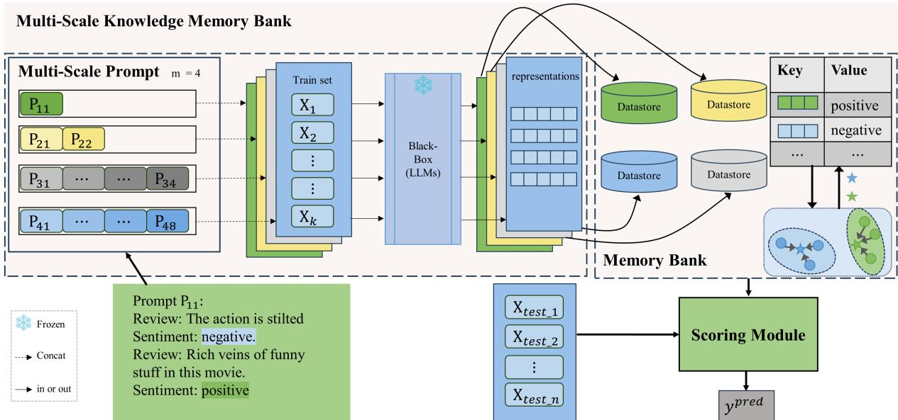
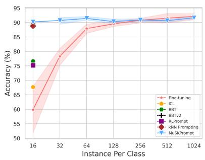
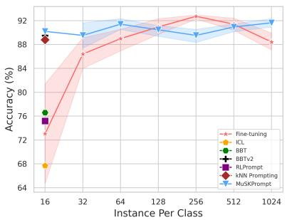
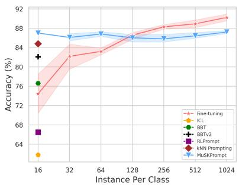
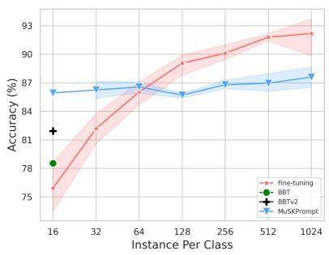
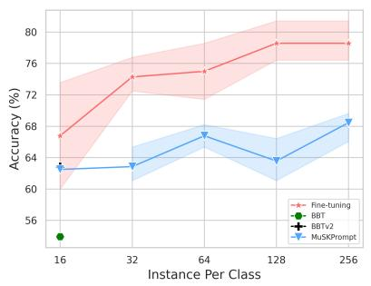
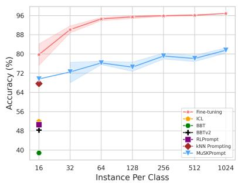
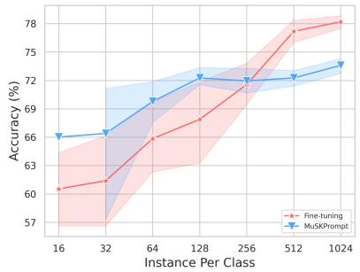
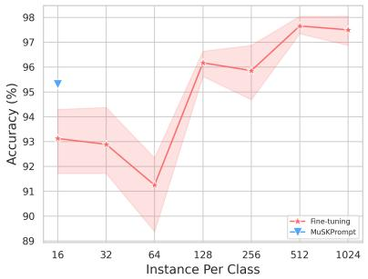

# Multi-Scale Prompt Memory-Augmented Model for Black-Box Scenarios

Xiaojun Kuang C. L. Philip Chen Shuzhen Li Tong Zhang∗ School of Computer Science & Engineering, South China University of Technology qingyucute77@gmail.com, {philipchen,tony}@scut.edu.cn

## Abstract

Black-box few-shot text classification handles text classification in limited data without accessing the parameters and gradients of language models (LMs). Existing black-box optimization methods have demonstrated strong few-shot learning capabilities. However, they still require numerous LMs’ calls to search optimal prompts, thus resulting in overfitting performance and increasing computational cost. To address this issue, we present MuSKPrompt (Multi-scale Knowledge Prompt for Memory Model), an efficient multi-scale knowledge prompt-based memory model in black-box fewshot text classification task. MuSKPrompt extracts instance-level and class-level knowledge at different scales and stores them in memory banks during training. Then, it references multi-scale memory banks to perform quick inference on new samples via a novel scoring module. MuSKPrompt achieves competitive performance in limited data through multiscale instance-level and class-level knowledge. Moreover, it realizes gradient-free optimization with zero training parameters in the blackbox scenario. Experiments on different benchmarks and parameter analysis demonstrate the effectiveness and efficiency of MuSKPrompt in black-box few-shot text classification tasks.

## 1 Introduction

Over the past few years, large language models (LLMs) have achieved significant success (Radford et al., 2019; Brown et al., 2020; Touvron et al., 2023). Brown et al. (2020) propose in-context learning (ICL), which aids LMs in adapting to downstream tasks by providing a few context examples before the input. Due to its demonstrated good performance, prompt-based learning has become a popular method for low-resource adaptation of LLMs to downstream tasks. However, ICL exhibits significant instability, and its performance depends on the selection of context examples (Liu et al., 2022b). To that end, numerous studies have focused on optimizing continuous prompts (Liu et al., 2022c; Gu et al., 2022), ensuring that most parameters of LLMs remain unchanged. However, they are ineffective in certain situations where access to internal parameters and gradients of LLMs is restricted, a.k.a. the black-box scenario. Many existing LLMs provide only APIs, thus making gradient-based prompt learning challenging (Sun et al., 2022b). Furthermore, deploying LLMs in the black-box manner across various industries has become a trending topic (Lu et al., 2023; Na et al., 2023; Li et al., 2023).

<table><tr><td>Method</td><td>Number of API calls</td><td>Interpretable</td><td>Non- Parametric</td></tr><tr><td>BBT</td><td>8000</td><td>X</td><td>X</td></tr><tr><td>BBTv2</td><td>8000</td><td>X</td><td>X</td></tr><tr><td>RLPrompt</td><td>1200</td><td>X</td><td>X</td></tr><tr><td>kNN Prompting</td><td>1</td><td>V</td><td>L</td></tr><tr><td>Ours</td><td>&lt;10</td><td>L</td><td>L</td></tr></table>

Table 1: Comparison of BBT, BBTv2, RLPrompt, kNN Prompting and MuSKPrompt Number of API calls, Interpretable and non-parametric. The calculation of API call counts references BBT(Sun et al., 2022b).

Existing approaches (Sun et al., 2022b,a) employ gradient-free optimization methods to search for optimal continuous prompts. RLPrompt (Deng et al., 2022) and TEMPERA (Zhang et al., 2022a) use reinforcement learning to find optimal discrete prompts. However, these methods require many queries to LMs, resulting in low computational efficiency. PromptBoosting (Hou et al., 2023) constructs numerous weak learners by pairing the prompt pool generated by T5 with the output distribution of the LMs and then integrates these weak learners using the AdaBoost algorithm. It requires a larger LMs to generate the prompt pool. To this end, kNN Prompting (Xu et al., 2022a) introduces a non-parametric memory module and achieves excellent performance in text classification tasks. The memory module, storing knowledge from downstream tasks, has demonstrated excellent performance in text classification tasks. In Natural Language Processing (NLP), memory models have been applied to various tasks such as named entity recognition and machine translation (Zhong et al., 2022; Fang et al., 2023). However, the application of memory models to few-shot classification in the black-box scenario remains unexplored.

The term "multi-scale" in this paper is referenced from previous works (Huang et al., 2023a; Lei et al., 2023). Moreover, previous works (Liu et al., 2022b; Min et al., 2022c) have demonstrated that prompts composed of more examples can assist LMs in learning deeper knowledge. Wang et al. (2023) demonstrate that in shallow layers, label words accumulate information from demonstrations to form semantic representations, while deep layers integrate information from these label words. Based on these insights, we propose MuSKPrompt, a novel non-parametric memoryaugmentation method. Multi-scale prompts allow LMs to extract deep and shallow instance-level and class-level knowledge. We store this knowledge in a memory bank and accomplish text classification tasks through a scoring module. Experimental results demonstrate that MuSKPrompt achieves competitive performance in few-shot text classification tasks in the black-box scenario. Importantly, because it doesn’t require training to find optimal prompts, it simply stores instance-level knowledge obtained through fewer than 10 API calls for each instance, as shown in Table 1. Compared to RL-Prompt, BBT, and BBTv2, our prompts are interpretable, meaning prompts can be understood by humans(Zhang et al., 2022a).

The contributions of this paper can be summarized as follows:

• We propose a non-parametric memory model structure with multiple scales, achieving competitive performance with fewer than ten calls to LMs.

• We introduce multi-scale prompts that capture deep and shallow knowledge from LMs.

• We design a memory bank that stores instancelevel and class-level knowledge at different scales.

• We propose an effective scoring module synthesizing knowledge from different scales and levels.

## 2 Related Work

Prompt-Based learning With the scaling of language models(Radford et al., 2019; Brown et al., 2020), there are emergent capabilities for language modeling in various tasks. GPT-3 demonstrates remarkable few-shot learning capabilities, efficiently performing downstream tasks through a few in-context demonstrations (Brown et al., 2020; Liu et al., 2022b; Dong et al., 2022). Subsequently, other forms of prompt-based learning have emerged as new approaches to adapting pre-trained language models for downstream tasks, becoming a new paradigm in NLP (Liu et al., 2023). Optimization methods for continuous prompts treat prompts as embeddings that can be optimized efficiently (Liu et al., 2022a). Prefix-tuning (Li and Liang, 2021) inserts continuous prompt embeddings into each layer of LMs. P-tuning (Liu et al., 2022c) utilizes a BiLSTM network to output continuous prompts embedding. PPT (Gu et al., 2022) found that prompt-based fine-tuning is less effective in a few-shot learning setting, and initializing the prompt with pre-trained prompts can achieve superior performance.

Despite the effectiveness of the above methods in achieving competitive performance with minimal parameter updates, they need access to the gradient information inside LMs. Calculating gradients requires significant computational overhead and is not allowed in the black-box scenario. Therefore, BBT (Sun et al., 2022b) and BBTv2 (Sun et al., 2022a) employ the gradient-free CMA evolution algorithm to optimize continuous prompts. Clip-Tuning (Chai et al., 2022) adopts diverse subnetworks to obtain a mixed reward and thus optimize continuous prompts. Moreover, recent developments include optimization algorithms for discrete prompts in the black-box scenario. BDPL (Diao et al., 2022) adopts a variance-reduced policy gradient algorithm to estimate LMs gradients in the categorical distribution of each discrete prompt, achieving prompt tuning through reinforcement learning. RLPrompt (Deng et al., 2022) optimizes prompt tokens through reinforcement learning, using downstream task performance as a reward. TEMPERA (Zhang et al., 2022a) employs reinforcement learning at the testing phase to optimize various prompt components such as contextual examples and instructions. GrIPS (Prasad et al., 2023)

performs discrete prompt editing at the phrase level for prompt tuning. TreePrompt(Singh et al., 2023) constructs a decision tree of prompts to adapt to downstream tasks.

In-Context Learning With the success of ICL (Dong et al., 2022; Chen et al., 2023; Zhang et al., 2022b), investigating why ICL is suitable for LLMs across various tasks has become a prominent research topic. Recent work (Xu et al., 2022b; Liu et al., 2022b; Yoo et al., 2022; Min et al., 2022c) found that in-context demonstrations with different numbers and permutations can influence the model’s performance on downstream tasks exhibiting significant instability and vulnerability. To address this issue, Vote-k (Hongjin et al., 2022) proposes to select diverse and representative contextual examples to achieve more robust and superior performance. Self-adaptive ICL (Wu et al., 2023) employs a TopK (Gao et al., 2021; Liu et al., 2022b) selection module and a Minimal Description Length ranking module, aiming to select highquality contextual examples. Furthermore, to exploit the capabilities of LLMs in ICL, Min et al. (2022b) and Chen et al. (2023) introduce metalearning, which enables LLMs to better adapt to ICL settings. Zhao et al. (2021), Han et al. (2022) and Min et al. (2022a) found significant label bias in ICL, propose to calibrate the bias via either probing the bias or reversing the conditional prediction formulation. Our work adopts contextual examples as prompts to enhance the few-shot learning capability of LMs.

Memory Models Similar methods for constructing memory modules have been proposed in the fields of computer vision (Wu et al., 2018) and NLP (Khandelwal et al., 2019; He et al., 2021; Shi et al., 2022; Huang et al., 2023b; Fang et al., 2023). RETROPROMPT (Chen et al., 2022) constructs an open knowledge base, enabling the model to retrieve relevant examples from the training corpus as enhanced prompts. kNN prompting (Xu et al., 2022a) introduces a retrieval mechanism in ICL, addressing issues related to label bias and context length limitations. Our approach falls into the category of memory models. The main difference is the use of a memory bank that stores class-level and instance-level knowledge at multi-scale to guide LMs during reasoning.

## 3 Problem Formulation

For notation, we define the training set in few-shot learning as $\mathcal { D } _ { \mathrm { t r a i n } } = \{ x _ { i } , y _ { i } \} _ { i = 1 } ^ { K \times | \mathcal { V } | }$ , where K represents the number of samples in the k-shot setting, and denotes the number of classes in the task. Context examples are sampled from $\mathcal { D } _ { \mathrm { t r a i n } }$

Given a test sample $\{ x _ { \mathrm { t e s t } } , y _ { \mathrm { t e s t } } \}$ and context example prompts, the probability produced by LMs $\mathcal { L }$ over the vocabulary set can be represented as:

$$
p ( v \mid x _ { \mathrm { t e s t } } ) = \mathcal { L } ( v | \mathcal { P } , \pi ( x _ { \mathrm { t e s t } } , * ) )\tag{1}
$$

where $\pi ( \cdot )$ denotes template-based transformations (see Table 10 in Appendix §B for details), and v represents the probability distribution over the vocabulary set. The output distribution in this paper represents logits generated by the model on placeholders, so $p \in \bar { \mathbb { R } ^ { | \mathcal { V } | \times 1 } } \mathrm { i s } \mathrm { a } | \mathcal { V } |$ -dimensional vector, where $| \nu |$ denotes the vocabulary size. We set $\mathcal { P } _ { i }$ to construct prompts containing $i \times | y |$ context examples:

$$
\begin{array} { r l } & { \mathcal { P } _ { i } = \pi ( x _ { 1 } ^ { 1 } , y _ { 1 } ^ { 1 } ) \oplus . . . \oplus \pi ( x _ { i } ^ { 1 } , y _ { i } ^ { 1 } ) \oplus . . . \oplus } \\ & { \quad \quad \pi ( x _ { 1 } ^ { | \mathcal { V } | } , y _ { 1 } ^ { | \mathcal { V } | } ) . . . \oplus \pi ( x _ { i } ^ { | \mathcal { V } | } , y _ { i } ^ { | \mathcal { V } | } ) } \end{array}\tag{2}
$$

where $\bigoplus$ denotes the concatenation operation, and these context examples are selected from $\mathcal { D } _ { \mathrm { t r a i n } }$

## 4 Method

In this section, we introduce MuSKPrompt, a framework that employs multi-scale prompts to encapsulate knowledge, thereby guiding LMs to excel in various few-shot text classification tasks within the black-box scenario. The primary objective of MuSKPrompt is to extract knowledge at both the class and instance levels from context examples across multiple scales. The non-parametric memory bank stores this knowledge at multiple scales and varying levels to enhance the diversity of the knowledge base. Finally, the scoring module utilizes this enriched few-shot knowledge to complete classification tasks. As shown in Figure 1, MuSKPrompt consists of the following modules.

## 4.1 Memory Bank for a Single Scale

We primarily discuss the construction process of the memory bank at a single scale. This memory bank is designed to store the output distributions of LMs for all samples in the training set $\mathcal { D } _ { \mathrm { t r a i n } } \left( \mathrm { i } . \mathrm { e } . \right.$ instance-level knowledge). For each sample $x _ { i }$ $( \{ x _ { i } , y _ { i } \} \subset \mathcal { D } _ { \operatorname { t r a i n } } )$ , we concatenate it to the prompt $\mathcal { P } _ { c } .$ , where c indicates the number of context examples connected for each category. The prompt $\mathcal { P } _ { c }$ aids LMs in extracting instance-level knowledge $p ( v \mid x _ { i } )$ for downstream tasks. Specifically, we denote the memory bank as $\mathcal { M } ,$ which contains keyvalue pairs corresponding to the output representation $k _ { i }$ and labels $y _ { i }$ of each sample i.e., $\{ k _ { i } , y _ { i } \}$ The memory bank stores instance-level knowledge, with the value corresponding to the sample’s label $y _ { i }$ and the key representing instance-level knowledge (Xu et al., 2022a):

  
Figure 1: Overview of MuSKPromt. LLMs are frozen and inaccessible to internal parameters and gradient information. Knowledge is extracted using prompts of four different scales (m = 4), and stored in various datastores constituting the memory bank. $P _ { i c }$ represents the prompt at the i-th scale, where c denotes the number of examples selected from each class. The bottom-left illustrates an example of a prompt with a scale size of 1.

$$
\pmb { k } _ { i } = p ( v \mid \mathcal { P } _ { c } , x _ { i } )\tag{3}
$$

The memory bank should not only store instancelevel knowledge but also class-level knowledge. Instance-level knowledge contributes to understanding unique aspects of each example, such as specific content and tone. Class-level knowledge aids in comprehending common features within the same category, such as overall themes and concepts. Combining both facilitates more accurate classification. Therefore, we introduce class-level knowledge to the memory bank:

$$
k _ { j } ^ { \mathrm { c l s } } = \frac { \sum _ { i } ^ { | \mathcal { M } | } k _ { i } \mathbb { 1 } ( y _ { i } = j ) } { \sum _ { i } ^ { | \mathcal { M } | } \mathbb { 1 } ( y _ { i } = j ) }\tag{4}
$$

where $j$ denotes the category, and $| { \mathcal { M } } |$ represents the number of instance-level representations in the memory bank at a single scale.

## 4.2 Multi-Scale Knowledge Memory Bank

The memory bank includes instance-level knowledge and class-level knowledge through equations (3) and (4). However, in few-shot settings, the memory bank can store only limited knowledge due to the scarcity of training samples. Additionally, Cífka and Liutkus (2023) perceive that Prompts with longer contexts are more likely to reveal information about the target text that is not captured by prompts with shorter contexts. Liu et al. (2022b) and Min et al. (2022c) found that the prompt composed of more examples can learn deeper knowledge.

Inspired by this, we design multi-scale prompts to aid LMs in extracting knowledge at deep and shallow levels for constructing the memory bank. We stratify and select as diverse examples as possible from each category to form the prompt at different scales. We define $\mathcal { M } _ { m , i }$ to represent the ith key-value pairs storing knowledge in the case of prompt scale c for $c \in \{ 2 ^ { 0 } , 2 ^ { 1 } , . . . , 2 ^ { m - 1 } \}$ (where m denotes the scale dimension). The corresponding key is defined as follows:

$$
\pmb { k } _ { m , i } = p ( v \mid \mathcal { P } _ { c } , x _ { i } ) , \quad \mathrm { s . t . } \quad c = 2 ^ { m - 1 }\tag{5}
$$

Our approach increases the amount of knowledge stored in the memory bank by a factor of m. Further details are shown in Algorithm 1, as shown in Appendix §6. Intuitively, it can be seen as a bank that enhances multi-scale diversity knowledge under few-shot learning conditions. Context examples are arranged, making the computation efficient. It is worth noting that the above method can also be applicable to other memory models (Xu et al., 2022a). We conduct a preliminary exploration in Section §5.

## 4.3 Non-Parametric Scoring Module

We introduce a completely non-parametric scoring module. It guides LMs to calculate the score matrix S for each category based on the different levels of knowledge stored in the memory bank. For simplicity, we first calculate S under a single-scale prompt $\mathcal { P } _ { 1 }$ , corresponding to the memory bank denoted as $\mathcal { M } _ { 1 }$ . Firstly, during the inference phase, for each test sample $x _ { \mathrm { t e s t } }$ , we compute the output distribution $p _ { \mathrm { t e s t } }$ using equation (3). $p _ { \mathrm { t e s t } }$ and $k _ { i }$ represent output probabilities over the entire vocabulary, potentially containing numerous other uninterpretable pieces of information. For this reason, we propose using the Kullback-Leibler (KL) divergence to measure the information difference between the two to generate the corresponding scores. We utilize the instance-level knowledge stored in $\mathcal { M } _ { 1 }$ to compute instance-level scores for $x _ { \mathrm { t e s t } }$

$$
\begin{array} { l } { \displaystyle D _ { i } ^ { i n s } = D _ { K L } \big ( p _ { \mathrm { t e s t } } | | k _ { i } \big ) } \\ { \displaystyle \ = \sum _ { v = 0 } ^ { | \mathcal { V } | } p _ { \mathrm { t e s t } } \big ( v | \mathcal { P } _ { 1 } , { x _ { \mathrm { t e s t } } } \big ) \log \frac { p _ { \mathrm { t e s t } } \big ( v | \mathcal { P } _ { 1 } , { x _ { \mathrm { t e s t } } } \big ) } { p ( v | \mathcal { P } _ { 1 } , { x _ { i } } ) } } \end{array}
$$

$$
\begin{array} { r l } { \mathrm { s . t . } \ } & { { } D ^ { i n s } \in \mathbb { R } ^ { | \mathcal { M } _ { 1 } | \times 1 } , \forall i \in [ | \mathcal { M } _ { 1 } | ] } \end{array}\tag{6}
$$

$$
S _ { j } ^ { i n s } = \frac { \sum _ { i \in \mathrm { T o p } ^ { k } ( D ^ { i n s } ) } 1 } { \sum _ { i \in \mathrm { T o p } ^ { k } ( D ^ { i n s } ) } D _ { i } ^ { i n s } } \mathrm { s . t . } y _ { i } = j\tag{7}
$$

where ${ \mathrm { T o p } } ^ { k } ( D ^ { i n s } )$ denotes the set of the top k values in $D ^ { i n s }$ , and $\bar { S } ^ { i n s } \in \mathbb { R } ^ { | \mathcal { V } | \times 1 }$ represents scores in different categories. Here, the score corresponds to the reciprocal of the KL divergence.

Similarly, the formula for class-level scores for the test sample is as equation:

$$
S _ { j } ^ { c l s } = \frac { 1 } { D _ { K L } ( p _ { \mathrm { t e s t } } | | k _ { j } ^ { \mathrm { c l s } } ) }\tag{8}
$$

Next, we combine the scores at both instance and class levels with the following formula:

$$
S = ( 1 - \lambda ) \frac { S ^ { i n s } } { | | S ^ { i n s } | | _ { 1 } } + \lambda \frac { S ^ { c l s } } { | | S ^ { c l s } | | _ { 1 } }\tag{9}
$$

where λ denotes the weight of class-level knowledge, and $\| S \| _ { 1 }$ denotes the corresponding L1 norm. Adjusting the value of λ determines the degree of attention given to class-level knowledge. Finally, we perform a weighted average of the scores at different scales:

$$
S = \sum _ { i = 0 } ^ { m } d _ { i } \cdot S _ { i }\tag{10}
$$

where m indicates the number of different scales. After obtaining the final score matrix S, we determine the predicted category of the test sample as the category with the highest score:

$$
y _ { \mathrm { p r e d } } = \arg \operatorname* { m a x } _ { y _ { i } \in [ | y | ] } S\tag{11}
$$

## 5 Experiments

## 5.1 Datasets and Tasks

For comparability, we follow the same settings as kNN Prompting (Xu et al., 2022a), including five different random seeds and dataset splits. GPT-2 (Radford et al., 2019) model is our primary language model in this study. Our main experiments focus on few-shot learning across seven established text classification datasets. These datasets include SST-2 (Socher et al., 2013), MPQA (Wiebe et al., 2005), CR (Hu and Liu, 2004), MR (Pang and Lee, 2005), TREC (Voorhees and Tice, 2000), RTE (Dagan et al., 2006), and SUBJ (Pang and Lee, 2004). Additionally, other experiments involve four text classification datasets: AGNews (Zhang et al., 2015), CB (Marneffe et al., 2019), MRPC (Dolan and Brockett, 2005), and DBPedia (Zhang et al., 2015). The statistical details of datasets can be found in Table 8 in Appendix §6. For each dataset, we design intuitive prompt templates (see Table 10 in Appendix §6).

Our goal is to evaluate the performance of MuSKPrompt in a few-shot setting within the black-box scenario. We randomly extract k examples from each class of the original training set to construct the k-shot training set $\mathcal { D } _ { \mathrm { t r a i n } }$ . For BBT (Sun et al., 2022b), BBTv2 (Sun et al., 2022a) and RLPrompt (Deng et al., 2022), prompts are selected based on the best performance on the validation set. Unlike them, our method does not require a validation set as it does not involve parameter optimization.

Backbone Models In our main experiments, we choose the GPT2-XL as our backbone model for two reasons: (1) Previous memory models (Xu et al., 2022a) have used GPT2-XL as the backbone model, and knowledge-guided methods are more effective on larger models. (2) Currently, LLMs available in the black-box manner are mainly autoregressive.

## 5.2 Baselines

To comprehensively evaluate our method, we select various types of baselines. We select the best blackbox optimization algorithms, such as BBT, BBTv2, and RLPrompt as baselines. Furthermore, we include parameter-free ICL, calibration-enhanced ICL, and the memory model kNN Prompting as baselines. Baselines also include gradient-based fine-tuning methods and recent tree-based prompting methods like TreePrompt. Implementation de tails of these baselines can be found in Appendix §C. The overview of these methods is as follows: (1) Fine-tuning represents standard fine-tuning of GPT2-XL under few-shot settings. (2) BBT utilizes the CMA evolution algorithm to optimize contin uous prompts. (3) BBTv2 improves the performance of BBT by inserting continuous prompts in front of each layer of LMs. (4) RLPrompt (Deng et al., 2022) utilizes a smaller generative model, distilGPT2, as the policy network. Subsequently, it optimizes the policy network to discover the best prompts through soft Q-learning (Guo et al., 2021). (5) ICL uses a simple combination of examples as prompts to guide model classification. (6) Noisy Channel (Min et al., 2022a) represents ICL formulated as the probability of computing inputs given the condition of labels. (7) TreePrompt(Singh et al., 2023) employs decision trees as a method to adapt LMs to specific tasks without fine-tuning the model. (8) kNN Prompting (Xu et al., 2022a) infers by storing representations of few-shot samples and using a nearest neighbor algorithm. We reproduce all baseline methods using official experimental settings and hyper-parameters or adopt published results. Some baselines (Zhang et al., 2022a; Hou et al., 2023) are not included as their official implementations are unavailable, and the selected baselines above are competitive.

## 5.3 Implementation Details

Experiments are conducted on a single NVIDIA RTX A6000 GPU using PyTorch (Paszke et al., 2019). This section provides a brief overview of the main hyper-parameters for our method. For our approach, we set the weight for class-level scores as λ = 0.5 and for instance-level scores as (1 λ). We choose the number of scales as four by default, considering that GPT-2 XL can handle a maximum text sequence length of 1024 tokens (on RTE and TREC datasets, we set the number of scales as 3). To emphasize the effectiveness of multi-scale knowledge, we do not learn weights for different scale knowledge but simply average them.

## 5.4 Results

Overall Comparison We present the results of few-shot text classification in Table 2. Our method outperforms all baselines on average performance across seven datasets. Moreover, we achieve the best performance on five datasets, except for the RTE dataset and the TREC dataset. Notably, our method achieves these results without training any parameters, demonstrating its high computational efficiency. Additionally, our method makes fewer than ten calls to LMs in Table 1. This further highlights our approach’s robust few-shot learning capability in the black-box scenario. Compared to BBT, BBTv2, and RLPrompt, our prompts are interpretable. kNN Prompting also requires no parameter training and achieves competitive performance. Our method outperforms kNN Prompting by 5 points on average performance across seven datasets. Our method also exhibits better robustness. This suggests that, in the black-box scenario, our method achieves better performance and demonstrates more stability. Moreover, our method does not rely on validation set tuning to select the best results.

To further evaluate the effectiveness of our approach, we also include GPT2-XL fine-tuning as a comparison. Our method performs less than finetuning on the SUBJ, RTE, and TREC datasets. Our method primarily guides LMs in text classification tasks through the memory of downstream task knowledge, and the intrinsic capabilities of LMs determine its upper limit. Because the memory model without parameter optimization lacks indepth exploration of the deep capabilities of LMs, or the intrinsic capabilities of GPT2-XL are still insufficient. Our method may be relatively disadvantaged in challenging NLI tasks, such as RTE. However, the average performance of our method outperforms fine-tuning by 8.9 points in few-shot classification tasks. Moreover, our method shows greater robustness on all seven datasets than finetuning. Interestingly, on some seeds of the SST-2 and CR datasets, our method’s performance on a 16-shot training set is close to or even higher than the final performance of fine-tuning on the entire training dataset.

<table><tr><td>Method</td><td>Trainable Params</td><td>SST2 acc</td><td>MPQA acc</td><td>CR acc</td><td>SUBJ acc</td><td>MR acc</td><td>RTE acc</td><td>TREC acc</td><td>AVG acc</td></tr><tr><td>Fine-tuning</td><td>1.5B</td><td>59.9(10.8)</td><td>65.4(2.9)</td><td>73.0(10.7)</td><td>88.9(2.5)</td><td>74.5(5.2)</td><td>52.6(3.0)</td><td>79.8(5.9)</td><td>70.6</td></tr><tr><td>BBT</td><td>25K</td><td>76.6(4.5)</td><td>78.5(1.6)</td><td>82.7(1.4)</td><td>72.9(3.6)</td><td>76.6(4.3)</td><td>51.6(2.2)</td><td>38.8(8.8)</td><td>68.2</td></tr><tr><td>BBTv2</td><td>1.2M</td><td>89.5(1.3)</td><td>84.1(1.4)</td><td>85.8(1.9)</td><td>80.1(1.9)</td><td>82.1(3.1)</td><td>51.0(4.6)</td><td>48.3(4.9)</td><td>74.4</td></tr><tr><td>RLPrompt</td><td>3M</td><td>75.2(3.3)</td><td>62.3(5.6)</td><td>72.5(7.4)</td><td>75.6(4.1)</td><td>66.5(14.0)</td><td>50.9(2.6)</td><td>50.6(3.0)</td><td>64.8</td></tr><tr><td>ICL</td><td>0</td><td>67.7(10.8)</td><td>77.6(7.6)</td><td>73.3(11.9)</td><td>75.5(11.4)</td><td>61.8(5.6)</td><td>53.0(1.7)</td><td>52.0(5.1)</td><td>65.8</td></tr><tr><td>Noisy Channel</td><td>0</td><td>84.4(10.8)</td><td>70.4(6.2)</td><td>83.7(3.3)</td><td>62.4(7.2)</td><td>79.6(2.7)</td><td>52.5(4.8)</td><td>54.2(7.8)</td><td>69.6</td></tr><tr><td>TreePrompt</td><td>■</td><td>83.6</td><td>83.9</td><td>80.6</td><td>76.2</td><td>78.8</td><td>54.9</td><td>72.8</td><td>75.8</td></tr><tr><td>kNN Prompting</td><td>0</td><td>88.8(2.1)</td><td>68.2(7.6)</td><td>80.1(4.7)</td><td>80.9(4.0)</td><td>84.8(2.7)</td><td>51.2(5.4)</td><td>67.7(4.9)</td><td>74.5</td></tr><tr><td>Ours</td><td>0</td><td>90.2(0.8)</td><td>84.4(1.9)</td><td>89.4(1.1)</td><td>83.6(1.2)</td><td>87.0(1.5)</td><td>52.3(1.9)</td><td>69.6(4.1)</td><td>79.5</td></tr></table>

Table 2: Overall comparison on various 16-shot text classification tasks. All methods use GPT2-XL as the backbone model for a fair comparison. We report the average performance and standard deviation across five random seeds(Xu et al., 2022a). In each track, the best results are highlighted in bold, and the second-best results are marked with underlines.

Data Efficiency for MuSKPrompt To illustrate the data efficiency of our method, we compare the performance of MuSKPrompt with fine-tuning across different-sized training sets. Additionally, we include the performance of other baselines under a 16-shot setting. As shown in Figure 2, it is evident that our method achieves competitive performance on the SST-2 dataset while utilizing merely one thirty-two percent of the data required for finetuning. Similarly, on the MR dataset, our method demonstrates an eightfold increase in data utilization efficiency compared to fine-tuning. On the CR dataset, we approach the best performance of fine-tuning using only (64 ) training samples. Furthermore, we notice an abnormal performance drop in the fine-tuning method when the training set size reaches 512-shot for the CR dataset. The CR dataset has a maximum of 368 samples for one category, and we attribute this anomaly to the class imbalance in the CR dataset. Class imbalance leads to fine-tuning overfitting on the majority class, resulting in decreased performance. It is worth noting that our method not only eliminates the need for parameter optimization but also alleviates the issue of class imbalance. For more detailed results, refer to Figure 3 in Appendix §D.

Effect of Model Scale It has been demonstrated that LMs with larger parameter sizes possess stronger capabilities (Kaplan et al., 2020; Wei et al., 2022). The performance of our method is positively correlated with the intrinsic capabilities of the backbone model. To validate this, we conduct experiments using GPT-2 models of different sizes, i.e., GPT2-SMALL, GPT-MEDIUM, GPT2- LARGE, and GPT2-XL, corresponding to 124M, 335M, 744M, and 1.5B parameters. As shown in Table 3, in few-shot text classification tasks, MuSKPrompt performs better with larger LMs than smaller ones. Additionally, MuSKPrompt gains more benefits on larger LMs when the parameter size is relatively small.

<table><tr><td>GPT2 Params</td><td>SST-2</td><td>CR</td><td>MRPC</td><td>TREC</td></tr><tr><td>124M</td><td>59.1</td><td>70.6</td><td>48.0</td><td>56.6</td></tr><tr><td>355M</td><td>72.3</td><td>83.4</td><td>51.7</td><td>62.5</td></tr><tr><td>744M</td><td>85.8</td><td>88.1</td><td>59.5</td><td>69.2</td></tr><tr><td>1.5B</td><td>90.2</td><td>89.4</td><td>66.0</td><td>69.6</td></tr></table>

Table 3: Results of MuSKPrompt in the 16-shot setting across different scales of GPT-2.

Effect of Multi-Scale Prompt It has demonstrated that prompts with more examples can help LMs learn deeper knowledge, and vice versa (Liu et al., 2022b; Min et al., 2022c). To validate that prompts of different scales enable the model to learn knowledge at different depth levels, we compare our method with multiple prompts of the same scale. Table 4 shows a clear advantage of multiscale prompts. It confirms that LMs learn complementary deep and shallow knowledge based on prompts of different scales. As our method’s performance depends on stored knowledge, multilevel class-level and instance-level knowledge contributes to guiding LMs for better classification.

To further investigate the role of the multi-scale knowledge bank, we incorporate it into the previous kNN Prompting method. The results are shown in

  
(a) Performance on SST-2

  
(b) Performance on CR

  
(c) Performance on MR

Figure 2: Data efficiency for MuSKPrompt. We compare the data efficiency of MuSKPrompt with fine-tuning in few-shot learning, and report the performance of MuSKPrompt and fine-tuning in different training set sizes.
<table><tr><td>Method</td><td>SST-2</td><td>CR</td><td>TREC</td><td>MRPC</td></tr><tr><td>Multi-prompt-2</td><td>88.2(1.3)</td><td>88.4(1.4)</td><td>69.0(3.6)</td><td>56.9(13.8)</td></tr><tr><td>Multi-prompt-3</td><td>89.1(1.7)</td><td>89.1(2.0)</td><td>65.5(4.3)</td><td>49.4(10.7)</td></tr><tr><td>Multi-prompt-4</td><td>89.1(3.2)</td><td>89.0(2.2)</td><td>66.0(4.0)</td><td>59.6(4.7)</td></tr><tr><td>MuSKPrompt</td><td>90.2(0.8)</td><td>89.4(1.1)</td><td>69.6(4.1)</td><td>66.0(7.3)</td></tr></table>

Table 4: Performance of multi-scale prompts and multiple prompts of the same scale in the 16-shot setting. Multi-prompt-m indicates that the number of examples under each prompt is $( | \mathcal { V } | \times m )$ .

Table 5, demonstrating that the multi-scale knowledge bank not only enhances the effectiveness of our method but also improves the performance of other memory models such as kNN Prompting.
<table><tr><td>Method</td><td>SST-2</td><td>MPQA</td><td>CR</td><td>RTE</td></tr><tr><td>kNN Prompting</td><td>88.8</td><td>68.2</td><td>80.1</td><td>51.2</td></tr><tr><td>w/MSP</td><td>89.8</td><td>82.4</td><td>88.8</td><td>52.3</td></tr><tr><td>MuSKPrompt(w/o MSP)</td><td>89.5</td><td>80.6</td><td>87.5</td><td>50.8</td></tr><tr><td>MuSKPrompt</td><td>90.2</td><td>84.4</td><td>89.4</td><td>52.3</td></tr></table>

Table 5: Performance in the 16-shot setting. "w/ MSP" denotes the inclusion of multi-scale prompts, while "w/o MSP" denotes the removal of multi-scale prompts.

Effect of the Scale Dimension In our main experiments, we default the scale dimension to 4, without learning different weights for each scale. Intuitively, a greater number of different scales bring more complementary deep and shallow knowledge. However, considering the limitations of the maximum sequence length for GPT-2XL input and the few-shot learning setting, the maximum value for the scale dimension m is set to 4. As shown in Table 6, a larger scale dimension achieves more significant performance improvements. Moreover, the benefits of increasing the scale dimension are more significant when the task is more challenging such as on the MRPC task.

<table><tr><td>Method</td><td>SST-2</td><td>MR</td><td>CR</td><td>MRPC</td></tr><tr><td>MuSKPrompt-2</td><td>87.1</td><td>84.0</td><td>84.7</td><td>46.7</td></tr><tr><td>MuSKPrompt-3</td><td>89.4</td><td>86.4</td><td>88.3</td><td>52.0</td></tr><tr><td>MuSKPrompt-4</td><td>90.2</td><td>87.0</td><td>89.4</td><td>66.0</td></tr></table>

Table 6: Performance of MuSKPrompt with different scale dimensions in the 16-shot setting. MuSKPromptm indicates the scale dimension is m.

Effect of Class-Level Knowledge We consistently employ a fixed value of 0.5 for the class-level weight, denoted as λ, without any tuning. Our experiments aim to explore the impact of class-level knowledge on performance. Class-level knowledge demonstrates its significant impact in the few-shot text classification tasks illustrated in Table 7.

<table><tr><td>Method</td><td>SST-2</td><td>MR</td><td>CR</td><td>MPQA</td></tr><tr><td>MuSKPrompt(w/o cls)</td><td>89.8</td><td>86.4</td><td>89.1</td><td>82.0</td></tr><tr><td>MuSKPrompt</td><td>90.2</td><td>87.0</td><td>89.4</td><td>84.4</td></tr></table>

Table 7: Performance of the model on SST-2, MR, CR, and MPQA datasets. "w/o cls" indicates without incorporating class-level knowledge.

## 6 Conclusion

In this paper, we present MuSKPrompt, a novel memory-augmented framework. It does not require access to the internal information of LMs and achieves remarkable performance with few-shot training samples. MuSKPrompt acquires instancelevel and class-level knowledge of various depths through multi-scale prompts. This knowledge is then stored in a memory bank. The scoring module efficiently performs classification tasks using the stored knowledge, without training any parameters. The significant improvements brought solely by memory knowledge will encourage future memory model solutions for few-shot classification in the black-box scenario.

## Limitations

The limitations of this work are summarized as follows: (1) We conducted experiments on 11 language understanding tasks (including sentiment analysis, natural language inference, and topic classification) using the GPT-2 backbone model. Although MuSKPrompt achieved commendable results in the majority of these tasks, it did not show a distinct advantage over full-model fine-tuning, especially in challenging tasks like natural language inference. This could be due to the lack of parameter optimization in MuSKPrompt or the inherent limitations in GPT-2 XL’s reasoning capabilities. Enhancing performance by efficiently learning weight parameters might address this issue. We leave the optimization of parameters in the scoring module as future work. Furthermore, exploring MuSKPrompt’s effectiveness in chain-ofthought, generation tasks and Named Entity Recognition remains an area to be investigated. (2) Experiments demonstrate that relying solely on memory knowledge can yield competitive performance. We hypothesize that improvements in knowledge extraction prompts, such as hierarchical prompts, could lead to further enhancements. This aspect is reserved for future work.

## Acknowledgements

This work was funded in part by the National Key Research and Development Program of China under number 2019YFA0706200, in part by the National Natural Science Foundation of China grant under number 62222603, 62076102, and 92267203, in part by the STI2030-Major Projects grant from the Ministry of Science and Technology of the People’s Republic of China under number 2021ZD0200700, in part by the Key-Area Research and Development Program of Guangdong Province under number 2023B0303030001, in part by the Guangdong Natural Science Funds for Distinguished Young Scholar under number 2020B1515020041, in part by the Program for Guangdong Introducing Innovative and Entrepreneurial Teams (2019ZT08X214) and in part by the Key-Area Research and Development Program of Guangdong Province under number 2023B0303030001.

## References

Tom Brown, Benjamin Mann, Nick Ryder, Melanie Subbiah, Jared D Kaplan, Prafulla Dhariwal, Arvind Neelakantan, Pranav Shyam, Girish Sastry, Amanda Askell, et al. 2020. Language models are few-shot learners. Advances in neural information processing systems, 33:1877–1901.

Yekun Chai, Shuohuan Wang, Yu Sun, Hao Tian, Hua Wu, and Haifeng Wang. 2022. Clip-tuning: Towards derivative-free prompt learning with a mixture of rewards. In Findings ofthe Associationfor Computational Linguistics: EMNLP 2022, pages 108–117, Abu Dhabi, United Arab Emirates. Association for Computational Linguistics.

Jiawei Chen, Yaojie Lu, Hongyu Lin, Jie Lou, Wei Jia, Dai Dai, Hua Wu, Boxi Cao, Xianpei Han, and Le Sun. 2023. Learning in-context learning for named entity recognition. In Proceedings ofthe 61st Annual Meeting ofthe Associationfor Computational Linguistics (Volume 1: Long Papers), pages 13661– 13675, Toronto, Canada. Association for Computational Linguistics.

Xiang Chen, Lei Li, Ningyu Zhang, Xiaozhuan Liang, Shumin Deng, Chuanqi Tan, Fei Huang, Luo Si, and Huajun Chen. 2022. Decoupling knowledge from memorization: Retrieval-augmented prompt learning. Advances in Neural Information Processing Systems, 35:23908–23922.

Ondˇrej Cífka and Antoine Liutkus. 2023. Black-box language model explanation by context length probing. In Proceedings ofthe 61st Annual Meeting ofthe Associationfor Computational Linguistics (Volume 2: Short Papers), pages 1067–1079, Toronto, Canada. Association for Computational Linguistics.

Ido Dagan, Oren Glickman, and Bernardo Magnini. 2006. The pascal recognising textual entailment challenge. Lecture Notes in Computer Science,Lecture Notes in Computer Science.

Mingkai Deng, Jianyu Wang, Cheng-Ping Hsieh, Yihan Wang, Han Guo, Tianmin Shu, Meng Song, Eric Xing, and Zhiting Hu. 2022. Rlprompt: Optimizing discrete text prompts with reinforcement learning. In Proceedings of the 2022 Conference on Empirical Methods in Natural Language Processing, pages 3369–3391.

Shizhe Diao, Zhichao Huang, Ruijia Xu, Xuechun Li, Yong Lin, Xiao Zhou, and Tong Zhang. 2022. Blackbox prompt learning for pre-trained language models. arXiv preprint arXiv:2201.08531.

William B. Dolan and Chris Brockett. 2005. Automatically constructing a corpus of sentential paraphrases. In Proceedings of the Third International Workshop on Paraphrasing (IWP2005).

Qingxiu Dong, Lei Li, Damai Dai, Ce Zheng, Zhiyong Wu, Baobao Chang, Xu Sun, Jingjing Xu, and Zhifang Sui. 2022. A survey for in-context learning. arXiv preprint arXiv:2301.00234.

Jinyuan Fang, Xiaobin Wang, Zaiqiao Meng, Pengjun Xie, Fei Huang, and Yong Jiang. 2023. MANNER: A variational memory-augmented model for cross domain few-shot named entity recognition. In Proceedings ofthe 61st Annual Meeting ofthe Associationfor Computational Linguistics (Volume 1: Long Papers), pages 4261–4276, Toronto, Canada. Association for Computational Linguistics.

Tianyu Gao, Adam Fisch, and Danqi Chen. 2021. Making pre-trained language models better few-shot learners. In Joint Conference of the 59th Annual Meeting of the Association for Computational Linguistics and the 11th International Joint Conference on Natural Language Processing, ACL-IJCNLP 2021, pages 3816–3830. Association for Computational Linguistics (ACL).

Yuxian Gu, Xu Han, Zhiyuan Liu, and Minlie Huang. 2022. Ppt: Pre-trained prompt tuning for few-shot learning. In Proceedings of the 60th Annual Meeting of the Association for Computational Linguistics (Volume 1: Long Papers), pages 8410–8423.

Han Guo, Bowen Tan, Zhengzhong Liu, EricP. Xing, and Zhiting Hu. 2021. Text generation with efficient (soft) q-learning. Cornell University - arXiv,Cornell University - arXiv.

Zhixiong Han, Yaru Hao, Li Dong, Yutao Sun, and Furu Wei. 2022. Prototypical calibration for fewshot learning of language models. In The Eleventh International Conference on Learning Representations.

Junxian He, Graham Neubig, and Taylor Berg-Kirkpatrick. 2021. Efficient nearest neighbor language models. In Proceedings of the 2021 Conference on Empirical Methods in Natural Language Processing, pages 5703–5714.

SU Hongjin, Jungo Kasai, Chen Henry Wu, Weijia Shi, Tianlu Wang, Jiayi Xin, Rui Zhang, Mari Ostendorf, Luke Zettlemoyer, Noah A Smith, et al. 2022. Selective annotation makes language models better fewshot learners. In The Eleventh International Conference on Learning Representations.

Bairu Hou, Joe O’connor, Jacob Andreas, Shiyu Chang, and Yang Zhang. 2023. Promptboosting: Black-box text classification with ten forward passes. In International Conference on Machine Learning, pages 13309–13324. PMLR.

Minqing Hu and Bing Liu. 2004. Mining and summarizing customer reviews. In Proceedings of the tenth ACM SIGKDD international conference on Knowledge discovery and data mining, pages 168–177.

Chaoqin Huang, Aofan Jiang, Ya Zhang, and Yanfeng Wang. 2023a. Multi-scale memory comparison for zero-/few-shot anomaly detection. arXiv preprint arXiv:2308.04789.

Yongfeng Huang, Yanyang Li, Yichong Xu, Lin Zhang, Ruyi Gan, Jiaxing Zhang, and Liwei Wang. 2023b. Mvp-tuning: Multi-view knowledge retrieval with prompt tuning for commonsense reasoning. In Proceedings ofthe 61st Annual Meeting ofthe Association for Computational Linguistics (Volume 1: Long Papers), pages 13417–13432.

Jared Kaplan, Sam McCandlish, Tom Henighan, Tom B Brown, Benjamin Chess, Rewon Child, Scott Gray, Alec Radford, Jeffrey Wu, and Dario Amodei. 2020. Scaling laws for neural language models. arXiv preprint arXiv:2001.08361.

Urvashi Khandelwal, Omer Levy, Dan Jurafsky, Luke Zettlemoyer, and Mike Lewis. 2019. Generalization through memorization: Nearest neighbor language models. arXiv preprint arXiv:1911.00172.

Shun Lei, Yixuan Zhou, Liyang Chen, Zhiyong Wu, Xixin Wu, Shiyin Kang, and Helen Meng. 2023. Msstyletts: Multi-scale style modeling with hierarchical context information for expressive speech synthesis. IEEE/ACM Transactions on Audio, Speech, and Language Processing, 31:3290–3303.

Hao Li, Yuping Wu, Viktor Schlegel, Riza Batista-Navarro, Thanh-Tung Nguyen, Abhinav Ramesh Kashyap, Xiao-Jun Zeng, Daniel Beck, Stefan Winkler, and Goran Nenadic. 2023. Team:PULSAR at ProbSum 2023:PULSAR: Pre-training with extracted healthcare terms for summarising patients’ problems and data augmentation with black-box large language models. In The 22nd Workshop on Biomedical Natural Language Processing and BioNLP Shared Tasks, pages 503–509, Toronto, Canada. Association for Computational Linguistics.

Xiang Lisa Li and Percy Liang. 2021. Prefix-tuning: Optimizing continuous prompts for generation. In Proceedings of the 59th Annual Meeting of the Associationfor Computational Linguistics and the 11th International Joint Conference on Natural Language Processing (Volume 1: Long Papers), pages 4582– 4597, Online. Association for Computational Linguistics.

Haokun Liu, Derek Tam, Mohammed Muqeeth, Jay Mohta, Tenghao Huang, Mohit Bansal, and Colin A Raffel. 2022a. Few-shot parameter-efficient fine-tuning is better and cheaper than in-context learning. Advances in Neural Information Processing Systems, 35:1950–1965.

Jiachang Liu, Dinghan Shen, Yizhe Zhang, William B Dolan, Lawrence Carin, and Weizhu Chen. 2022b. What makes good in-context examples for gpt-3? In Proceedings of Deep Learning Inside Out (Dee-LIO 2022): The 3rd Workshop on Knowledge Extraction and Integration for Deep Learning Architectures, pages 100–114.

Pengfei Liu, Weizhe Yuan, Jinlan Fu, Zhengbao Jiang, Hiroaki Hayashi, and Graham Neubig. 2023. Pretrain, prompt, and predict: A systematic survey of

prompting methods in natural language processing. ACM Computing Surveys, 55(9):1–35.

Xiao Liu, Kaixuan Ji, Yicheng Fu, Weng Tam, Zhengxiao Du, Zhilin Yang, and Jie Tang. 2022c. P-tuning: Prompt tuning can be comparable to fine-tuning across scales and tasks. In Proceedings of the 60th Annual Meeting ofthe Associationfor Computational Linguistics (Volume 2: Short Papers), pages 61–68.

Yao Lu, Max Bartolo, Alastair Moore, Sebastian Riedel, and Pontus Stenetorp. 2022. Fantastically ordered prompts and where to find them: Overcoming fewshot prompt order sensitivity. In Proceedings of the 60th Annual Meeting of the Association for Computational Linguistics (Volume 1: Long Papers), pages 8086–8098.

Yuxing Lu, Xukai Zhao, and Jinzhuo Wang. 2023. Medical knowledge-enhanced prompt learning for diagnosis classification from clinical text. In Proceedings of the 5th Clinical Natural Language Processing Workshop, pages 278–288, Toronto, Canada. Association for Computational Linguistics.

Marie-Catherinede Marneffe, Mandy Simons, and Judith Tonhauser. 2019. The commitmentbank: Investigating projection in naturally occurring discourse. Proceedings ofSinn und Bedeutung,Proceedings of Sinn und Bedeutung.

Sewon Min, Mike Lewis, Hannaneh Hajishirzi, and Luke Zettlemoyer. 2022a. Noisy channel language model prompting for few-shot text classification. In Proceedings of the 60th Annual Meeting of the Associationfor Computational Linguistics (Volume 1: Long Papers), pages 5316–5330.

Sewon Min, Mike Lewis, Luke Zettlemoyer, and Hannaneh Hajishirzi. 2022b. MetaICL: Learning to learn in context. In Proceedings ofthe 2022 Conference of the North American Chapter ofthe Associationfor Computational Linguistics: Human Language Technologies, pages 2791–2809, Seattle, United States. Association for Computational Linguistics.

Sewon Min, Xinxi Lyu, Ari Holtzman, Mikel Artetxe, Mike Lewis, Hannaneh Hajishirzi, and Luke Zettlemoyer. 2022c. Rethinking the role of demonstrations: What makes in-context learning work? In Proceedings of the 2022 Conference on Empirical Methods in Natural Language Processing, pages 11048–11064.

CheolWon Na, YunSeok Choi, and Jee-Hyong Lee. 2023. DIP: Dead code insertion based black-box attack for programming language model. In Proceedings ofthe 61st Annual Meeting ofthe Associationfor Computational Linguistics (Volume 1: Long Papers), pages 7777–7791, Toronto, Canada. Association for Computational Linguistics.

Bo Pang and Lillian Lee. 2004. A sentimental education. In Proceedings of the 42nd Annual Meeting on Associationfor Computational Linguistics - ACL ’04.

Bo Pang and Lillian Lee. 2005. Seeing stars: Exploiting class relationships for sentiment categorization with respect to rating scales. In Proceedings of the 43rd Annual Meeting of the Association for Computational Linguistics (ACL’05), pages 115–124, Ann Arbor, Michigan. Association for Computational Linguistics.

Adam Paszke, Sam Gross, Francisco Massa, Adam Lerer, James Bradbury, Gregory Chanan, Trevor Killeen, Zeming Lin, Natalia Gimelshein, Luca Antiga, et al. 2019. Pytorch: An imperative style, high-performance deep learning library. Advances in neural information processing systems, 32.

Archiki Prasad, Peter Hase, Xiang Zhou, and Mohit Bansal. 2023. Grips: Gradient-free, edit-based instruction search for prompting large language models. In Proceedings ofthe 17th Conference ofthe European Chapter of the Association for Computational Linguistics, pages 3827–3846.

Alec Radford, Jeffrey Wu, Rewon Child, David Luan, Dario Amodei, Ilya Sutskever, et al. 2019. Language models are unsupervised multitask learners. OpenAI blog, 1(8):9.

Weijia Shi, Julian Michael, Suchin Gururangan, and Luke Zettlemoyer. 2022. Nearest neighbor zero-shot inference. In Proceedings ofthe 2022 Conference on Empirical Methods in Natural Language Processing, pages 3254–3265.

Chandan Singh, John Morris, Alexander Rush, Jianfeng Gao, and Yuntian Deng. 2023. Tree prompting: Efficient task adaptation without fine-tuning. In Proceedings ofthe 2023 Conference on Empirical Methods in Natural Language Processing, pages 6253–6267, Singapore. Association for Computational Linguistics.

Richard Socher, Alex Perelygin, Jean Wu, Jason Chuang, Christopher D. Manning, Andrew Ng, and Christopher Potts. 2013. Recursive deep models for semantic compositionality over a sentiment treebank. In Proceedings of the 2013 Conference on Empirical Methods in Natural Language Processing, pages 1631–1642, Seattle, Washington, USA. Association for Computational Linguistics.

Tianxiang Sun, Zhengfu He, Hong Qian, Yunhua Zhou, Xuan-Jing Huang, and Xipeng Qiu. 2022a. Bbtv2: towards a gradient-free future with large language models. In Proceedings of the 2022 Conference on Empirical Methods in Natural Language Processing, pages 3916–3930.

Tianxiang Sun, Yunfan Shao, Hong Qian, Xuanjing Huang, and Xipeng Qiu. 2022b. Black-box tuning for language-model-as-a-service. In International Conference on Machine Learning, pages 20841–20855. PMLR.

Hugo Touvron, Thibaut Lavril, Gautier Izacard, Xavier Martinet, Marie-Anne Lachaux, Timothée Lacroix,

Baptiste Rozière, Naman Goyal, Eric Hambro, Faisal Azhar, et al. 2023. Llama: Open and efficient foundation language models. arXiv preprint arXiv:2302.13971.

Ellen M. Voorhees and Dawn M. Tice. 2000. Building a question answering test collection. In Proceedings ofthe 23rd annual international ACM SIGIR conference on Research and development in information retrieval.

Lean Wang, Lei Li, Damai Dai, Deli Chen, Hao Zhou, Fandong Meng, Jie Zhou, and Xu Sun. 2023. Label words are anchors: An information flow perspective for understanding in-context learning. In Proceedings ofthe 2023 Conference on Empirical Methods in Natural Language Processing, pages 9840–9855, Singapore. Association for Computational Linguistics.

Jason Wei, Yi Tay, Rishi Bommasani, Colin Raffel, Barret Zoph, Sebastian Borgeaud, Dani Yogatama, Maarten Bosma, Denny Zhou, Donald Metzler, et al. 2022. Emergent abilities of large language models. Transactions on Machine Learning Research.

Janyce Wiebe, Theresa Wilson, and Claire Cardie. 2005. Annotating expressions of opinions and emotions in language. Language Resources and Evaluation, page 165–210.

Thomas Wolf, Lysandre Debut, Victor Sanh, Julien Chaumond, Clement Delangue, Anthony Moi, Pierric Cistac, Tim Rault, Rémi Louf, Morgan Funtowicz, and Jamie Brew. 2019. Huggingface’s transformers: State-of-the-art natural language processing. Cornell University - arXiv,Cornell University - arXiv.

Zhirong Wu, Yuanjun Xiong, Stella X Yu, and Dahua Lin. 2018. Unsupervised feature learning via nonparametric instance discrimination. In Proceedings of the IEEE conference on computer vision and pattern recognition, pages 3733–3742.

Zhiyong Wu, Yaoxiang Wang, Jiacheng Ye, and Lingpeng Kong. 2023. Self-adaptive in-context learning: An information compression perspective for incontext example selection and ordering. In Proceedings ofthe 61st Annual Meeting ofthe Associationfor Computational Linguistics (Volume 1: Long Papers), pages 1423–1436, Toronto, Canada. Association for Computational Linguistics.

Benfeng Xu, Quan Wang, Zhendong Mao, Yajuan Lyu, Qiaoqiao She, and Yongdong Zhang. 2022a. k nn prompting: Beyond-context learning with calibrationfree nearest neighbor inference. In The Eleventh International Conference on Learning Representations.

Lei Xu, Yangyi Chen, Ganqu Cui, Hongcheng Gao, and Zhiyuan Liu. 2022b. Exploring the universal vulnerability of prompt-based learning paradigm. In Findings of the Association for Computational Linguistics: NAACL 2022, pages 1799–1810.

Kang Min Yoo, Junyeob Kim, Hyuhng Joon Kim, Hyunsoo Cho, Hwiyeol Jo, Sang-Woo Lee, Sang-goo Lee, and Taeuk Kim. 2022. Ground-truth labels matter: A deeper look into input-label demonstrations. In Proceedings ofthe 2022 Conference on Empirical Methods in Natural Language Processing, pages 2422– 2437.

Tianjun Zhang, Xuezhi Wang, Denny Zhou, Dale Schuurmans, and Joseph E Gonzalez. 2022a. Tempera: Test-time prompt editing via reinforcement learning. In The Eleventh International Conference on Learning Representations.

Xiang Zhang, Junbo Zhao, and Yann LeCun. 2015. Character-level convolutional networks for text classification. Advances in neural information processing systems, 28.

Zhuosheng Zhang, Aston Zhang, Mu Li, and Alex Smola. 2022b. Automatic chain of thought prompting in large language models. In The Eleventh International Conference on Learning Representations.

Zihao Zhao, Eric Wallace, Shi Feng, Dan Klein, and Sameer Singh. 2021. Calibrate before use: Improving few-shot performance of language models. In International Conference on Machine Learning, pages 12697–12706. PMLR.

Zexuan Zhong, Tao Lei, and Danqi Chen. 2022. Training language models with memory augmentation. In Proceedings of the 2022 Conference on Empirical Methods in Natural Language Processing, pages 5657–5673.

## A Datasets

Dataset information is detailed in Table 8. For fair comparison, the main experiments in this paper adopt a 16-shot setting, where 16 samples are drawn from each class.

## B Templates

Regarding the use of templates, please refer to Table 10 (adapted from Xu et al. (2022a) and (Lu et al., 2022)). They are intuitively designed, and the proposed methods should exhibit robustness with respect to the template chosen.

## C Implementation Details

For full model fine-tuning, the GPT-2 XL backbone model is loaded using the Huggingface transformers library (Wolf et al., 2019). The hyperparameters set follow previous work (Xu et al., 2022a), with a learning rate of 1e-5, batch size of 16, and a training step of 125. For the RTE dataset, we set the batch size to 8 to prevent out-ofmemory (OOM) issues. For RLPrompt (Deng et al.,

<table><tr><td>Dataset</td><td>IDI</td><td>Data split</td><td>Task</td></tr><tr><td>SST-2</td><td>2</td><td>67k/256</td><td>sentiment</td></tr><tr><td>MPQA</td><td>2</td><td>8.6k/256</td><td>sentiment</td></tr><tr><td>CR</td><td>2</td><td>1.7k/256</td><td>sentiment</td></tr><tr><td>MR</td><td>2</td><td>8.6k/256</td><td>sentiment</td></tr><tr><td>TREC</td><td>6</td><td>5.5k/256</td><td>topic</td></tr><tr><td>RTE</td><td>2</td><td>2.5k/256</td><td>NLI</td></tr><tr><td>SUBJ</td><td>2</td><td>8k/256</td><td>subjectivity</td></tr><tr><td>AGNews</td><td>4</td><td>120k/256</td><td>topic</td></tr><tr><td>CB</td><td>3</td><td>250/56</td><td>NLI</td></tr><tr><td>MRPC</td><td>2</td><td>3.7k/256</td><td>paraphrase</td></tr><tr><td>DBPedia</td><td>14</td><td>500k/256</td><td>topic</td></tr></table>

Table 8: Details of datasets. The dataset split is adapted from Lu et al. (2022) and Xu et al. (2022a).

2022), BBT (Sun et al., 2022b), and BBTv2 (Sun et al., 2022a), we use their official implementations with their default hyper-parameters. Notably, for RLPrompt, due to its lower efficiency, we set its training epochs to 1200 instead of 12000, as suggested in (Hou et al., 2023). For other baselines, we refer to the results reported in the papers on kNN prompting(Xu et al., 2022a) and TreePrompt(Singh et al., 2023).

## D Additional Results

Data Efficiency for MuSKPrompt We compare the performance of MuSKPrompt with GPT-2 XL fine-tuning on larger data scales. The hyperparameters for model fine-tuning are set in accordance with previous work (Xu et al., 2022a). We set a learning rate of 1e 5, with a batch size of 16, and training steps of 125, 250, or 500, respectively for $k \in \{ 3 2 , 6 4 \}$ , 128, 256 , 512, 1024 (k denotes the number of samples selected from each class.). To prevent OOM issues, the batch size is adjusted to 8 for the AGNews, RTE, and MRPC datasets. For the CB and SNLI datasets, the batch size is adjusted to 4, and for the DBPedia dataset, it is adjusted to 2. In the AGNews and CB datasets, we also include baselines from BBT and BBTv2. For the TREC dataset, all baselines except Noisy Channel are included. As shown in Figure 3, our method exhibits higher data efficiency in few-shot settings on the AGNews, MRPC, and DB-Pedia datasets compared to full model fine-tuning. Furthermore, the performance of our method improves with increasing data scale across all datasets.

On the TREC and CB datasets, our results are relatively weaker, as full model fine-tuning represents the theoretical upper limit of our approach.

Effect of Model Scale To further demonstrate the effectiveness of our method, we applied it to a larger language model, OPT. As shown in Table 9, results indicate that larger language models yield better performance for our method. Furthermore, our method outperforms the baseline method kNN Prompting(Xu et al., 2022a) even in larger language models.

```latex
Algorithm 1 Multi-Scale Knowledge Memory
Bank
Input: Language Model ${ \mathcal { L } } ,$
Training set $\mathcal { D } _ { \mathrm { t r a i n } } .$
The scale dimension m
Output: Memory bank $\{ \mathcal { M } \} _ { i = 1 } ^ { m }$
1: Set up template-based transformation $\pi ( \cdot )$
2: for $t = 1$ to m do
3: Get number of context examples $c = 2 ^ { t - 1 }$
4: Stratified select diverse samples $\begin{array} { r l } { B } & { { } = } \end{array}$
$\{ x _ { i } , y _ { i } \} ^ { | \mathcal { V } | \times c } \sim \mathcal { D } _ { \mathrm { t r a i n } }$
5: Get prompt $\mathcal { P } _ { c } \overset { \mathrm { E q . } ( 2 ) } { \longleftarrow }$ B
6: for each $\{ x _ { i } , y _ { i } \}$ in $\mathcal { D } _ { \mathrm { t r a i n } }$ do
7: Get instance-level representation $k _ { i } ~ =$
$\mathcal { L } ( \mathcal { P } _ { c } , x _ { i } )$
8: Update: $\mathcal { M } _ { t } \gets \{ k _ { i } , y _ { i } \}$
9: end for
10: Update: ${ \mathcal M } _ { t } \stackrel { \mathrm { E q . } ( 4 ) } { \longleftarrow } \left\{ { k } ^ { \mathrm { c l s } } , { \mathrm { c l s } } \right\}$
11: end for
12: return Memory bank $\{ \mathcal { M } \} _ { i = 1 } ^ { m }$
```

  
(a) Performance on AGNews

  
(b) Performance on CB

  
(c) Performance on TREC

  
(d) Performance on MRPC

  
(e) Performance on DBPedia  
Figure 3: Data efficiency for MuSKPrompt on AGNews, CB, TREC, MRPC and DBPedia datasets.

<table><tr><td>Model</td><td>Method</td><td>SST2</td><td>CR</td><td>MR</td><td>AGNews</td><td>RTE</td><td>TREC</td></tr><tr><td>OPT-2.7B</td><td>kNN Prompting</td><td>87.7</td><td>89.9</td><td>91.2</td><td>84.4</td><td>52.8</td><td>75.1</td></tr><tr><td>OPT-2.7B</td><td>MuSKPrompt</td><td>93.4</td><td>91.8</td><td>91.7</td><td>86.3</td><td>53.5</td><td>75.4</td></tr><tr><td>OPT-6.7B</td><td>kNN Prompting</td><td>92.7</td><td>91.0</td><td>91.8</td><td>83.0</td><td>55.2</td><td>71.2</td></tr><tr><td>OPT-6.7B</td><td>MuSKPrompt</td><td>94.1</td><td>91.4</td><td>91.8</td><td>86.3</td><td>55.9</td><td>76.2</td></tr></table>

Table 9: Results of MuSKPrompt and kNN Prompting in the 16-shot setting across different scales of OPT.

<table><tr><td>Dataset</td><td>Template</td><td>Label words</td></tr><tr><td>SST-2</td><td>Review: finds amusing juxtapositions that justify his exercise . Sentiment: positive Review: the story and structure are well-honed . Sentiment:</td><td>negative, positive</td></tr><tr><td>MPQA</td><td>Review: with the help of the almighty god Sentiment: positive Review: elevates its image in international society Sentiment:</td><td>negative, positive</td></tr><tr><td>CR</td><td>Review: 5 stars all the way! . Sentiment: positive Review: new cds almost always began skipping after a few plays . Sentiment:</td><td>negative, positive</td></tr><tr><td>MR</td><td>Review: dismally dull sci-fi comedy . Sentiment: negative Review: enjoy it for what it is ; you can hate yourself later . Sentiment:</td><td>negative, positive</td></tr><tr><td>TREC</td><td>Question: What type of currency is used in China ? Type: entity Question: What French province is cognac produced in ? Type:</td><td>description, entity, expression, human, location, number</td></tr><tr><td>RTE</td><td>premise: The death penalty is not a deterrent. hypothesis: Capital punishment is a deterrent to crime. prediction: false premise: Capital punishment acts as a deterrent. hypothesis: Capital punishment is a deterrent to crime. prediction:</td><td>fasle, true</td></tr><tr><td>SUBJ</td><td>Input: a counterfeit 1000 tomin bank note is passed in a bazaar . Type: objective Input: the film is to be produced by jules , melina&#x27;s husband . Type: Input: SI.com. ST. LOUIS (Ticker) – The Cincinnati Reds continue to</td><td>subjective, objective</td></tr><tr><td>AGNews</td><td>find new ways to lose to the St. Louis Cardinals. Type: sports Input: IBM Chips May Someday Heal Themselves. New technology applies electrical fuses to help identify and repair faults. Type:</td><td>world, sports, business, technology</td></tr><tr><td>CB</td><td>premise: Clever. Klug means clever. Would you say that Abie was clever? hypothesis: Abie was clever prediction: neither premise: A: Your turn. B: Okay. Uh, I don&#x27;t think they should abolish it. hypothesis: they should abolish it prediction:</td><td>false, true, neither</td></tr><tr><td>MRPC</td><td>premise: The notification was first reported Friday by MSNBC hypothesis: MSNBC.com first reported the CIA request on Friday . prediction: yes premise: Columbia broke up over Texas upon re-entry on Feb. 1 . hypothesis: Columbia broke apart in the skies above Texas on Feb. 1 .</td><td>no, yes</td></tr><tr><td>DBPedia</td><td>prediction: Input: Geoffrey D.Falksen (born July 31 1982) is an American steampunk writer. Type: artist Input: Arbach (Wildebach) is a river of North Rhine-Westphalia Germany Type:</td><td>company, school, artist, athlete, politics, transportation, building, nature, village, animal, plant, album, film, book</td></tr></table>

Table 10: The template for ICL. These represent the minimum conditions, with only one demonstration example for illustration.