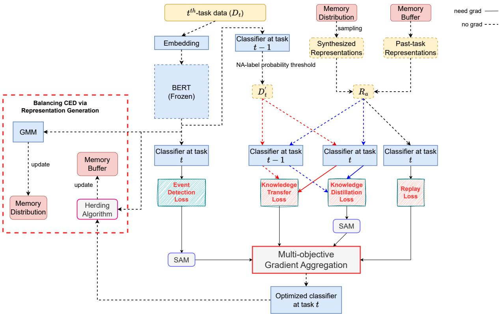

# SharpSeq: Empowering Continual Event Detection through Sharpness-Aware Sequential-task Learning

Thanh-Thien Le1∗, Viet Dao2∗, Linh Van Nguyen2∗, Thi-Nhung Nguyen1,

Linh Ngo Van2† and Thien Huu Nguyen1,3

1VinAI Research 2Hanoi University of Science and Technology 3University of Oregon {v.thienlt3, v.nhungnt89}@vinai.io,

{vietdt200661@sis, linhnv194093@sis, linhnv@soict}@hust.edu.vn, thien@cs.oregon.edu

## Abstract

Continual event detection is a cornerstone in uncovering valuable patterns in many dynamic practical applications, where novel events emerge daily. Existing state-of-the-art approaches with replay buffers still suffer from catastrophic forgetting, partially due to overly simplistic objective aggregation. This oversight disregards complex trade-offs and leads to sub-optimal gradient updates, resulting in performance deterioration across objectives. While there are successful, widely cited multiobjective optimization frameworks for multitask learning, they lack mechanisms to address data imbalance and evaluate whether a Pareto-optimal solution can effectively mitigate catastrophic forgetting, rendering them unsuitable for direct application to continual learning. To address these challenges, we propose SharpSeq, a novel continual learning paradigm leveraging sharpness-aware minimization combined with a generative model to balance training data distribution. Through extensive experiments on multiple real-world datasets, we demonstrate the superior performance of SharpSeq in continual event detection, proving the importance of our approach in mitigating catastrophic forgetting in continual event detection.

## 1 Introduction

Event Detection (ED) is one of the fundamental topics in NLP (Nguyen et al., 2023a; Man et al., 2022) and aims to classify an event trigger into a predefined event type in an established ontology. Continual event detection (CED), however, introduces a distinct challenge as it deals with a continuously evolving ontology that accommodates previously unseen event types as new data emerges. An effective CED system requires robust mechanisms that not only enable the identification of novel events but also mitigate the phenomenon of catastrophic forgetting, where the detection performance on previously encountered events deteriorates when new events are introduced.

Most state-of-the-art methodologies for effective continual event detection (Cao et al., 2020a; Yu et al., 2021; Liu et al., 2022) are built upon memory-based techniques from continual learning (Castro et al., 2018; Aljundi et al., 2018; Chaudhry et al., 2018). These techniques store a fraction of previously learned data in a replay buffer, allowing the model to reinforce its performance on past tasks while acquiring new knowledge. However, when employing memory-based techniques in continual learning, the management of multiple objectives associated with previous and current tasks becomes crucial. Naively aggregating these objectives by simple summation overlooks the inherent, complicated trade-offs involved. Thus, a more sophisticated strategy is imperative to address the challenge of multiple-objective optimization (MOO) for memory-based mechanisms. In this context, gradient-based frameworks for MOO, aiming to find a solution on the Paretofront (Sener and Koltun, 2018; Navon et al., 2022), have emerged as some of the most successful approaches. Despite their achievements, the effective application of such methods to continual NLP remains largely unexplored. Our empirical observations have shown that directly applying these frameworks for continual event detection leads to degraded performance, as evident in Table 4. This performance degradation can be attributed to two key factors.

The first conundrum of utilizing MOO for continual event detection is the highly imbalanced distribution of training data in later tasks, where current-task classes are significantly more prevalent. Failing to adequately address this problem can make the model susceptible to poor generalization (Johnson and Khoshgoftaar, 2019). Second, the existing MOO methods lack a clear criterion to determine whether a solution on the Pareto front would be ideal for mitigating catastrophic forgetting, as well as a systematic approach to reach such a solution. In the context of continual learning, where tasks are not simultaneously presented at the beginning, an efficient solution must surpass the Pareto-optimality criteria; it should also exhibit remarkable robustness in learning new tasks and minimize performance decline in previously encountered tasks.

Regarding the above criterion, several studies (Mirzadeh et al., 2020) have proposed a relationship between solutions found at flat minima in the loss landscape and their effectiveness in alleviating catastrophic forgetting. "Flat minima" refers to regions where the loss function demonstrates a relatively wide and flat basin, fostering more robust models with reduced overfitting risks. Recently, a study (Phan et al., 2022a) has proposed the use of sharpness-aware minimization (SAM) (Foret et al., 2021) for finding Pareto-optimal solutions in flatter regions of the loss landscape to improve MOO. However, in the context of continual learning, the utilization of sharpness-aware minimization necessitates a nuanced approach to fully harness its potential. Specifically, it is crucial to overcome the inherent instability associated with SAM’s adversarial nature and prevent it from negatively impacting the performance of the model.

Contribution. To address the above challenges, in this paper, (i) we propose SharpSeq, a novel approach that enables effective utilizations of multitask learning frameworks with sharpness-aware minimization (SAM) for continual event detection. It is a meticulously devised adaptation of SAM, tailored for the context of sequential task emergence in continual learning. Our method entails strategically applying SAM exclusively to the objectives affiliated with the current task, while excluding its application to the objectives of previously encountered tasks. This selective integration introduces a layer of objective filter, effectively addressing the unique challenges posed by continual learning. To the best of our knowledge, our work is the first to propose a strategic adaptation of SAM and MOO for enhancing continual learning. (ii) To address data imbalance, we propose using a generative model to learn the underlying distribution of event triggers representations from each event type, and thereby synthesize data to alleviate the imbalance between past-task and current-task data during replay.

Our extensive experiments on multiple datasets show that our method outperforms state-of-the-art baselines by significant margins.

## 2 Background

## 2.1 Continual Learning

Continual event detection (CED) is a continual learning (i.e., lifelong learning) problem, which is often categorized into three scenarios: taskincremental learning, domain-incremental learning, and class-incremental learning (Ke and Liu, 2022; Van de Ven and Tolias, 2019). CED involves the classification of events in a continuous data stream that encompasses both new data and novel event types (Cao et al., 2020a; Liu et al., 2022). As such, it can be perceived as a class-incremental learning (CIL) problem, where the model learns to adapt and classify new events without forgetting previously learned ones. In CIL, the mention of "tasks" only refers to different stages in training, not distinct prediction tasks. Therefore, during testing, the model has to predict using the accumulated set of encountered labels, without explicit task identity.

There are three prominent approaches to alleviate catastrophic forgetting in continual learning: regularization-based methods (Phan et al., 2022b; Van et al., 2022; Hai et al., 2024), architecturebased methods (Hung et al., 2019; Liu et al., 2021c; Mallya and Lazebnik, 2018), and replay-based methods (Farajtabar et al., 2020; Hou et al., 2019; Nguyen et al., 2023b; Le et al., 2024). Among the trio, replay-based methods, which store a small number of previously learned data in a replay buffer to facilitate rehearsal learning on old tasks while the model learns new tasks, have been the most effective ones in lifelong NLP learning (de Masson d'Autume et al., 2019).

## 2.2 Event Detection

In conventional event detection (ED) (Wadden et al., 2019), a typical training dataset D often consists of m pairs of input-label, ${ \cal D } = \{ ( x _ { i } , y _ { i } ) \} _ { 1 } ^ { M }$ An input x includes a context $w _ { 1 : L }$ , which is a sentence of length L, and its event trigger span $( s , e )$ The task of event detection is to classify each of these triggers into one of the defined event types y.

One common approach to ED involves utilizing a pretrained language model such as BERT (Devlin et al., 2019). This model encodes the context tokens $w _ { 1 : L }$ to obtain the contextual representations $w _ { 1 : L } ^ { \prime }$ . For each event trigger span (s, e), the contextual representations $w _ { s } ^ { \prime }$ and $w _ { e } ^ { \prime }$ of the beginning and ending trigger tokens are concatenated to obtain the trigger representation $z _ { i }$ . Subsequently, the trigger representation $z _ { i }$ is passed through a multilayer perceptron (MLP) to derive a feature vector $h .$ This feature vector h is then fed into a linear layer followed by a softmax layer, resulting in a probability distribution $p$ over the predefined event types. The entire process can be described using the following equations:

$$
p = S o f t m a x ( L i n e a r ( h ) ) ,\tag{1}
$$

where $h = M L P ( z )$ and $z = [ w _ { s } ^ { \prime } , w _ { e } ^ { \prime } ]$ . Let $D ,$ m denote the training dataset and the number of instances, respectively. We have the training loss as the cross-entropy loss. However, it is important to note that there is an imbalance between the data of the "unknown" (i.e., Not-Any or NA) type and other event types. To avoid the phenomenon that NA-label instances will dominate the total gradient, we regularize the loss with the introduction of hyperparameter coefficient $\nu { : }$

$$
\begin{array} { l } { { \displaystyle { \cal L } _ { e d } = - \frac { \nu } { m _ { \mathrm { N A } } } \sum _ { ( w , y ) \in { \cal D } _ { \mathrm { N A } } } \log p } } \\ { { \displaystyle ~ - \frac { 1 - \nu } { m _ { \mathrm { n o n } \mathrm { - } \mathrm { N A } } } \sum _ { ( w , y ) \in { \cal D } _ { \mathrm { n o n } \mathrm { - } \mathrm { N A } } } \log p . } } \end{array}\tag{2}
$$

In which, $D _ { \mathrm { N A } }$ denote the set of all NA-label instances in D; $D _ { \mathrm { n o n - N A } }$ denote the set of all non-NA-label instances in $D ;$ mNA and $m _ { \mathrm { n o n - N A } }$ denote their respective sizes.

## 2.3 Continual Event Detection

The continual event detection problem is formulated as (Yu et al., 2021): a model is trained sequentially on $T$ tasks, each of which has a dataset $D _ { t }$ corresponding to event types set $C _ { t } \mathrm { { : } }$ ; and $\{ C _ { i } \} _ { 1 } ^ { T }$ are disjoint. As a result, the set of all learned types at arbitrary timestep t is $O _ { t } = C _ { 1 } \bigcup C _ { 2 } \bigcup . . . \bigcup C _ { t }$ The Not-Any (NA) label is understood as a currently undefined label; it is included in every task.

Several papers (Wu et al., 2019; Liu et al., 2022; Yu et al., 2021) have demonstrated the effectiveness of replay-based methods (section 2.1) in addressing catastrophic forgetting in both continual learning and continual event detection. In these methods, the selection of data for the replay buffer often employs the herding algorithm, as proposed by Welling (2009). In the context of CED, where the Not-Any (NA) label is present in all tasks, instances labeled as NA are not selected for inclusion in the replay buffer.

There are two techniques often employed in rehearsal when training a CED model: knowledge distillation and knowledge transfer. The descriptions of these two techniques are as follows, with R denoting the replay buffer.

Knowledge distillation is a well-known method to transfer knowledge from a model to another. We denote the models we have before and after training on the t-th task as $\pmb { \theta } ^ { t - 1 }$ and $\pmb { \theta } ^ { t }$ , respectively. Forwarding an instance z stored in the memory buffer R through these two models, using the process described in Equation (1), we obtain the probability distributions over learned event types $\hat { p ^ { t - 1 } }$ and $p ^ { t }$ From there, we have the distillation loss:

$$
L _ { d } = - \sum _ { z \in R } p ^ { t - 1 } \mathrm { l o g } ( p ^ { t } ) .\tag{3}
$$

As for knowledge transfer (Yu et al., 2021), it makes the prediction probability of the current model $p ^ { t }$ close to the prediction probability of the old model scaled by temperature τ, $q \sim ( p ^ { \dot { t } - 1 } ) ^ { 1 / \tau }$ To achieve that, it uses the knowledge transfer loss:

$$
L _ { k t } = - \frac { 1 } { m ^ { \prime } } \sum _ { z \in D _ { t } ^ { \prime } } q ^ { t - 1 } \mathrm { l o g } ( p ^ { t } ) ,\tag{4}
$$

where $D _ { t } ^ { \prime }$ denotes the modified training set for the t-th task, and $m ^ { \prime }$ denotes its size. Yu et al. (2021) mentioned that the instances that have a high probability of NA label given by the old model should not be used in knowledge transfer since these instances have less similarity to the old event types. That is the reason we opt for constructing $D _ { t } ^ { \prime }$ from $D _ { t }$ , instead of directly using $D _ { t }$ , within the scope of the knowledge transfer loss.

## 2.4 Gradient-based Multi-Objective Optimization

Multi-task learning (MTL) can be conceptualized as a multi-objective optimization problem. We denote $\pmb \theta$ as all model parameters within the feasible set $\Theta , L _ { i }$ as the training loss associated with task $i ,$ and K as the total number of tasks. We aim to minimize, simultaneously, all $K$ losses:

$$
\operatorname* { m i n } _ { \pmb { \theta } } \left[ L _ { 1 } ( \pmb { \theta } ) , L _ { 2 } ( \pmb { \theta } ) , . . . , L _ { K } ( \pmb { \theta } ) \right] .\tag{5}
$$

Given $\pmb { \theta } ^ { 1 }$ and $\pmb { \theta } ^ { 2 }$ as two feasible solutions to problem (5), we state that $\pmb { \theta } ^ { 1 }$ dominates $\pmb { \theta } ^ { 2 }$ if and only if $L _ { i } ( \pmb \theta ^ { 1 } ) \ \le \ L _ { i } ( \pmb \theta ^ { 2 } ) \ \forall i \ \in \ \{ 1 , . . . , K \}$ and $\exists j \in \{ 1 , . . . , K \}$ s.t. $L _ { j } ( \theta ^ { 1 } ) \ < \ L _ { j } ( \theta ^ { 2 } )$ . A feasible solution is deemed Pareto-optimal if it is not dominated by any other solutions. The set of Pareto-optimal solutions is called the Pareto front.

PCGrad (Yu et al., 2020), CAGrad (Liu et al., 2021a), IMTL (Liu et al., 2021b), and Nash-MTL (Navon et al., 2022) are some of the most highlighted papers that propose gradient-based MTL frameworks, aiming to find a solution on the Pareto front. Their common principal idea is to determine the vector updating direction as a linear combination of the individual task gradients, $\begin{array} { r } { \Delta \pmb { \theta } = \sum _ { i = 1 } ^ { K } \alpha _ { i } \pmb { g } _ { i } } \end{array}$ . α can be perceived as a dynamic version of weighted loss summation since it can change, suitably to the current state of the model, at each descending step. Their differences lie in their strategies of choosing α.

While these methods possess a strong theoretical foundation, their empirical efficiency in the context of continual learning has been subpar. In continual learning, an effective solution must fulfill more than just the Pareto-optimal requirement; it should also demonstrate robustness in learning newer, unseen tasks without experiencing a drastic performance drop in previously encountered tasks.

## 3 Proposed Method

To improve the common continual event detection workflow, which we describe in subsections 2.2 and 2.3, we propose the following method. In our proposed method, we use BERT, which is frozen during training, as the pretrained language model. The overview workflow of our proposed method is illustrated in Appendix A.1.

## 3.1 Balancing Continual Event Detection via Representation Generation

A notable challenge in continual event detection is that the replay buffer size is constrained while the dataset continuously expands throughout the model’s lifespan. This scenario poses a dual conundrum: the risk of the model overfitting to the memorized data and the data imbalance when implementing multi-task replay strategy, both of which can diminish the effectiveness of rehearsal over time. To address this issue and enhance the diversity within the memory buffer, we utilize a generative model, such as Variational Autoencoder (VAE) (Kingma and Welling, 2013) or Conditional Variational Autoencoder (cVAE) (Sohn et al., 2015), to synthesize representations for each event type.

It is crucial to note that: generating highquality natural language samples for event detection presents a more intricate challenge due to the discrete nature of our data. Therefore, we propose to leverage the frozen BERT model to instead learn the distribution of latent trigger representations to capture class-level features. This strategy is not only more feasible than generating explicit text data, where concerns about grammar, structures, and other linguistic factors arise, but it also offers significant benefits for the task of classifying these representations.

After training on task $t ,$ for each event type c in $C _ { t } .$ , we learn a generative model (GM) to the latent representations of the data of that label and store it for subsequent sampling.

In the next task (t + 1), for each event type $c \in$ $D _ { t }$ , we use its corresponding GM in the memory to sample n˜ synthetic trigger representations. We denote the generated set as ${ \tilde { R } } .$ . The event features of instances in replay buffer $R$ are merged with $\tilde { R }$ to get a new set called the augmented set $R _ { a } . \ R _ { a }$ will replace R in experience replay and distillation tasks. Following that, we can write the replay loss $( L _ { r } )$ which is the cross-entropy loss on the augmented replay set $R _ { a } ,$ and rewrite the distillation loss $( L _ { d } ) \colon$

$$
L _ { r } = - \frac { 1 } { m _ { R _ { a } } } \sum _ { z _ { a } \in R _ { a } } \log { ( p _ { z _ { a } } ) } ,\tag{6}
$$

$$
L _ { d } = - \frac { 1 } { m _ { R _ { a } } } \sum _ { z _ { a } \in R _ { a } } p _ { z _ { a } } ^ { t - 1 } \log \vert ( p _ { z _ { a } } ^ { t } ) .\tag{7}
$$

In the above equations, $m _ { R _ { a } }$ denotes the number of trigger representations in $R _ { a } , h _ { z _ { a } } = M L P ( z _ { a } )$ and $p _ { z _ { a } } = S o f t m a x ( L i n e a r ( h _ { a } ) )$ .

## 3.2 Sharpness-Aware Sequential-Task Learning

The training process of our model can be viewed as a multi-objective optimization (MOO), aiming to minimize four objectives simultaneously: $L _ { r } , L _ { d } .$ $L _ { e d }$ , and $L _ { k t }$ , as represented by equations $( 6 ) , ( 7 )$ (2), and (3) respectively. Multi-task learning (MTL) frameworks, such as those discussed in section 2.4, can be employed to address this problem.

Nevertheless, the empirical performance of current multi-task learning frameworks, as noted by Phan et al. (2022a), has been limited, partly due to their tendency to disregard the geometric properties of the loss landscape while solely focusing on minimizing empirical error during optimization. They propose an approach to enhance the robustness of a multi-task model by seeking the task-based flat regions, via sharpness-aware minimization. However, we should keep in mind the unique nature of continual event detection, and continual learning problems in general, that distinguishes them from traditional multi-task learning problems. Unlike in multi-task learning, not all tasks are available simultaneously in continual event detection. Consequently, naively applying Phan et al.’s (2022a) method to this scenario is ill-advised and might results in declined performance (see Table 4).

Let us assume that after completing task t, we have obtained a solution that satisfies the flatminima requirement. Therefore, when moving on to $t + 1$ , the solution already lies within the flat regions of the loss landscapes of the loss associated with task t, namely the replay loss $( L _ { r } )$ and distillation loss $( L _ { d } )$ . Based on this observation, to reduce the chance of disturbing the model on old tasks with more noise from SAM, we propose to apply the sharpness-aware multi-task learning approach exclusively to the event detection loss $( L _ { e d } )$ and knowledge transfer loss $( L _ { k t } )$ . Specifically, to achieve a flat minima optimizer for these two losses, we modify each objective $L _ { i }$ with the worst-case loss perturbation in a neighborhood of the model parameter:

$$
\operatorname* { m i n } _ { \pmb { \theta } } \operatorname* { m a x } _ { \| \epsilon ^ { i } \| _ { 2 } \leq \rho } L _ { i } ( \pmb { \theta } + \epsilon ^ { i } ) ,\tag{8}
$$

where $| | \cdot | | _ { 2 }$ represents the $l _ { 2 }$ norm; $\rho$ denotes the neighborhood radius; and $L _ { i }$ is either $L _ { e d }$ and $L _ { k t }$ It is assumed that the function $L _ { i }$ is differentiable up to the first order with respect to the model parameter $\pmb \theta .$ The optimization problem described by equation (8) is known as sharpness-aware minimization (SAM) (Foret et al., 2021). The gradient of the modified loss function with respect to the model parameter, ${ \pmb g } _ { i }$ , is computed as:

$$
\begin{array} { r } { \epsilon ^ { * i } = \rho \frac { \nabla _ { \theta } L _ { i } ( \theta ) } { | | \nabla _ { \theta } L _ { i } ( \theta ) | | _ { 2 } } , } \\ { g _ { i } = \nabla _ { \theta } L _ { i } ( \theta + \epsilon ^ { * i } ) . } \end{array}\tag{9}
$$

More details regarding SAM can be found in $\mathsf { A p - }$ pendix A.2.

Once we have obtained the task-specific gradients $\{ \mathbf { } g i \} _ { i = 1 } ^ { K }$ , we can subsequently apply one of the gradient-based multi-task learning frameworks (Sener and Koltun, 2018; Yu et al., 2020; Liu et al., 2021a,b) to solve our modified MOO problem. In our approach, we specifically leverage the Nash-

Algorithm 1 Sequential Sharpness Minimization   
for Continual Event Detection   
Input: Model parameters θ, pertubation radius $\rho ,$   
learning rate η and differentiable loss functions   
$L _ { r } , L _ { d } , L _ { e d } ,$ and $L _ { k t }$   
Output: Updated parameter $\pmb { \theta } ^ { * }$   
1: for each $i \in [ r , d , e d , k t ]$ do   
2: Compute gradient $\pmb { g } _ { i } ^ { \mathrm { l o s s } } = \nabla _ { \pmb { \theta } } L _ { i } ( \pmb { \theta } )$   
3: if $\mathrm { \Phi } _ { i } \in \{ e d , k t \}$ then   
4: Worst-case perturbation direction:   
$\epsilon ^ { * i } = \rho \cdot g _ { i } ^ { \mathrm { l o s s } } / \vert \vert g _ { i } ^ { \mathrm { l o s s } } \vert \vert$   
5: Approximate SAM’s gradient:   
$\pmb { g } _ { i } = \nabla _ { \pmb { \theta } } L _ { i } ( \pmb { \theta } + \epsilon ^ { * i } )$   
6: else $g _ { i } \gets g _ { i } ^ { \mathrm { l o s s } }$   
7: end if   
8: end for   
9: Calculate α:   
$\alpha = \mathrm { M O O \_ a l g o r i t h m } ( g _ { r } , g _ { d } , g _ { e d } , g _ { k t } )$   
10: Update model parameter:   
$\pmb { \theta } ^ { * } = \pmb { \theta } - \eta \sum _ { i \in \{ r , d , e d , k t \} } \alpha _ { i } \pmb { g } _ { i }$

MTL framework (Navon et al., 2022) to ensure balanced improvements across all tasks. As we have discussed in section 2.4, Nash-MTL models the parameter updating direction at each descending step as a linear combination of the task-specific gradients, i.e., $\begin{array} { r } { \Delta \pmb { \theta } = \sum _ { i } ^ { K } \alpha _ { i } \pmb { g } _ { i } } \end{array}$ . According to Navon et al. (2022), the optimal direction for the gradient $\Delta \pmb { \theta } ^ { * }$ , which guarantees a balanced improvement across all objectives, is obtained by solving the following equation with respect to α:

$$
\mathbf { G } ^ { T } \mathbf { G } \boldsymbol { \alpha } = [ 1 / \alpha _ { 1 } , . . . , 1 / \alpha _ { k } ] ^ { T } ;\tag{10}
$$

G denotes the matrix whose columns are the task gradients ${ \pmb g } _ { i }$ . In summary, the essential steps of our proposed paradigm is outlined in Algorithm 1.

## 4 Experiments

In this section, we present empirical results and analysis to demonstrate the effectiveness of our contributions in improving continual event detection, in comparison against several state-of-the-art baselines.

## 4.1 Datasets and Experimental Settings

Datasets Our methods is evaluated on two datasets: ACE 2005 (Walker et al., 2006) and MAVEN (Wang et al., 2020); both are preprocessed as in Yu et al. (2021). However, the preprocessing of dataset ACE is affected by random factors, leading to differences when splitting documents. Therefore, to ensure fairness, we rerun all baselines on the same preprocessed datasets. Results of the baselines as reported in their original papers are kept to compare directly with our methods. The detailed statistics of these two datasets can be found in Table 1.

Experimental Settings We use the Oracle negative setting (Yu et al., 2021) to assess all methods in continual learning scenario. In this setting, the learned types of previous tasks are excluded from the training set of the new task except for the NA type. Labels of future tasks are considered as NA type. We use the task permutations in (Yu et al., 2021) and report the average F1 on each task of 5 permutations.

Baselines Besides the aforementioned works in continual event detection – KCN (Cao et al., 2020a), KT (Yu et al., 2021), and EMP (Liu et al., 2022) – the following continual learning methods are applied to event detection tasks and used as baselines. First, the model is finetuned sequentially, task by task. In this case, the learned model suffers from catastrophic forgetting. iCaRL (Rebuffi et al., 2017) uses an exemplar set to perform classification, combined with knowledge distillation. EEIL (Castro et al., 2018) utilizes representative memory to retain the old knowledge; the most representative samples of new labels are chosen to train with the old data to mitigate imbalanced data. BIC (Wu et al., 2019) alleviates the model’s bias towards new labels by using an affine transformation. KCN (Cao et al., 2020b) uses a limited set to store data for replay; then, knowledge distillation and prototype-enhanced retrospection are used to mitigate catastrophic forgetting. KT (Yu et al., 2021) follows a memory-based approach; it combines knowledge distillation with knowledge transfer. New-label samples are used to remind the model of old knowledge, and old-label samples are used to initialize representations for new-label data in the classification layer. More details are presented in section 2.3. EMP (Liu et al., 2022) also uses knowledge distillation but adds straight prompts into the input text to retain the old knowledge. Nash-MTL (Navon et al., 2022) refers to directly applying this MTL framework to simultaneously optimize the four losses mentioned in section 3.2. Finally, Upperbound is the case that the model is trained on all tasks at the same time. We derive the implementations of iCaRL, EEIL, BIC, and KCN from the source code published by Yu et al. (2021).

Regarding our proposed method, we experiment with the following versions: SharpSeq, SharpSeq-G, and SharpSeq-G-A. Nash-MTL is the default MOO algorithm for SharpSeq unless we explicitly discuss otherwise. SharpSeq is described in section 3.2. SharpSeq-G is SharpSeq without Representation Generation (RG). SharpSeq-G-A is a version of SharpSeq-G when we use both losses of the current task and the old tasks for sharpnessaware minimization as in (Phan et al., 2022a). The implementation details are shown in Appendix A.5.

## 4.2 Experimental Results

We can observe from Table 2 that SharpSeq-G-A achieved significant improvements in F1 scores across most tasks on both datasets, outperforming other baselines. Notably, compared to EMP, the final F1 score of SharpSeq-G-A increased by 4.15% in MAVEN and 4.56% in ACE. This observation demonstrates the effectiveness of finding a flat minimum in continual learning. Moreover, the consistent performance superiority of SharpSeq-G over SharpSeq-G-A highlights the efficiency and necessity of our sharpness-aware continual learning paradigm. Furthermore, Representation Generation (RG) enhanced the F1 scores of SharpSeq-G from 59.11% to 60.27% at the fifth task of MAVEN, and from 56.85% to 62.60% at the fifth task of ACE. These findings are concrete evidence of the effectiveness of our methods. RG synthesizes oldlabel data to improve balance in the training set, benefiting multi-objective optimization algorithms. Our optimization framework, specifically tailored for continual learning, achieves a minimizer at flat regions while effectively alleviating noise due to Sharpness-Aware Minimization’s (SAM) adversarial nature. These are the foundations that enable our methods to outperform current state-of-the-art approaches in continual event detection.

## 4.3 Ablation Study

In this section, we explore the impact of the generative model and multi-objective optimization method choices. Additional ablation studies on the number of GMM components and the ratio of synthesized representations are provided in Appendices A.4 and A.3.

<table><tr><td rowspan="2"></td><td colspan="5">MAVEN</td><td colspan="3">ACE</td></tr><tr><td>#Doc</td><td>#Sentence</td><td>#Mention</td><td>#Negative</td><td>#Doc</td><td>#Sentence</td><td>#Mention</td><td>#Negative</td></tr><tr><td>Train</td><td>2522</td><td>27983</td><td>67637</td><td>280151</td><td>501</td><td>18246</td><td>4088</td><td>261027</td></tr><tr><td>Dev</td><td>414</td><td>4432</td><td>10880</td><td>46318</td><td>41</td><td>1846</td><td>433</td><td>53620</td></tr><tr><td>Test</td><td>710</td><td>8038</td><td>18904</td><td>79699</td><td>55</td><td>689</td><td>790</td><td>93159</td></tr></table>

Table 1: Statistics of two datasets. #Doc stands for the total number of documents.

<table><tr><td rowspan="2">Task</td><td colspan="5">MAVEN</td><td colspan="5">ACE</td></tr><tr><td>1</td><td>2</td><td>3</td><td>4</td><td>5</td><td>1</td><td>2</td><td>3</td><td>4</td><td>5</td></tr><tr><td>finetune</td><td>63.16</td><td>40.30</td><td>33.00</td><td>23.86</td><td>22.34</td><td>55.88</td><td>40.25</td><td>37.04</td><td>20.71</td><td>25.01</td></tr><tr><td>iCaRL</td><td>18.08</td><td>27.03</td><td>30.78</td><td>31.26</td><td>29.77</td><td>5.05</td><td>6.42</td><td>7.05</td><td>6.93</td><td>9.44</td></tr><tr><td>EEIL</td><td>63.16</td><td>48.17</td><td>44.17</td><td>40.35</td><td>37.75</td><td>55.88</td><td>48.63</td><td>57.14</td><td>50.45</td><td>52.68</td></tr><tr><td>BIC</td><td>63.16</td><td>55.51</td><td>53.96</td><td>50.13</td><td>49.07</td><td>55.88</td><td>58.16</td><td>61.23</td><td>59.72</td><td>59.02</td></tr><tr><td>KCN</td><td>63.16</td><td>55.73</td><td>53.69</td><td>48.86</td><td>47.44</td><td>55.88</td><td>58.55</td><td>61.40</td><td>59.48</td><td>58.64</td></tr><tr><td>KT</td><td>62.76</td><td>58.49</td><td>57.46</td><td>55.38</td><td>54.87</td><td>55.88</td><td>57.29</td><td>61.42</td><td>60.78</td><td>59.82</td></tr><tr><td>EMP</td><td>66.82</td><td>58.02</td><td>58.19</td><td>55.07</td><td>54.52</td><td>59.05</td><td>57.14</td><td>55.80</td><td>53.42</td><td>52.97</td></tr><tr><td>Nash-MTL</td><td>62.76</td><td>60.39</td><td>59.47</td><td>56.09</td><td>52.84</td><td>55.88</td><td>57.92</td><td>62.08</td><td>59.11</td><td>58.17</td></tr><tr><td>SharpSeq-G-A</td><td>62.28</td><td>61.52</td><td>62.55</td><td>60.52</td><td>58.67</td><td>56.47</td><td>59.08</td><td>63.46</td><td>59.23</td><td>57.53</td></tr><tr><td>SharpSeq-G</td><td>62.28</td><td>61.57</td><td>62.48</td><td>60.54</td><td>59.11</td><td>56.47</td><td>58.51</td><td>63.37</td><td>59.54</td><td>56.85</td></tr><tr><td>SharpSeq</td><td>62.28</td><td>61.85</td><td>62.92</td><td>61.31</td><td>60.27</td><td>56.47</td><td>56.99</td><td>64.44</td><td>62.47</td><td>62.60</td></tr><tr><td>Upperbound</td><td>1</td><td>1</td><td>1</td><td>1</td><td>63.46</td><td>1</td><td>1</td><td>1</td><td>1</td><td>67.95</td></tr></table>

Table 2: Classification F1-scores (%) on 2 datasets MAVEN and ACE.

<table><tr><td></td><td colspan="5">MAVEN</td><td colspan="5">ACE</td></tr><tr><td>Task</td><td>1</td><td>2</td><td>3</td><td>4</td><td>5</td><td>1</td><td>2</td><td>3</td><td>4</td><td>5</td></tr><tr><td>KT</td><td>62.76</td><td>58.49</td><td>57.46</td><td>55.38</td><td>54.87</td><td>55.88</td><td>57.29</td><td>61.42</td><td>60.78</td><td>59.82</td></tr><tr><td>GMMs</td><td>62.76</td><td>59.30</td><td>59.55</td><td>58.25</td><td>57.70</td><td>55.88</td><td>56.97</td><td>62.48</td><td>60.88</td><td>62.01</td></tr><tr><td>GMMs+SS</td><td>62.28</td><td>61.85</td><td>62.92</td><td>61.31</td><td>60.27</td><td>56.47</td><td>56.99</td><td>64.44</td><td>62.47</td><td>62.60</td></tr><tr><td>VAE</td><td>62.76</td><td>60.06</td><td>59.82</td><td>57.14</td><td>55.68</td><td>55.88</td><td>57.37</td><td>61.52</td><td>59.38</td><td>59.51</td></tr><tr><td>VAE+SS</td><td>62.28</td><td>61.63</td><td>62.63</td><td>60.62</td><td>59.30</td><td>56.47</td><td>59.61</td><td>63.16</td><td>60.3</td><td>61.56</td></tr><tr><td>CVAE</td><td>62.76</td><td>59.62</td><td>59.60</td><td>56.56</td><td>54.88</td><td>55.88</td><td>57.97</td><td>64.24</td><td>60.46</td><td>61.81</td></tr><tr><td>CVAE+SS</td><td>62.28</td><td>61.68</td><td>62.38</td><td>60.33</td><td>58.77</td><td>56.47</td><td>57.47</td><td>63.77</td><td>60.60</td><td>61.87</td></tr></table>

Table 3: Ablation results of generation methods. "SS" is the abbreviation of SharpSeq.

<table><tr><td rowspan="2">Task</td><td colspan="4">MAVEN</td><td colspan="5">ACE</td></tr><tr><td>1</td><td>2</td><td>3</td><td>4</td><td>5</td><td>1</td><td>2 3</td><td>4</td><td>5</td></tr><tr><td>KT</td><td>62.76</td><td>58.49</td><td>57.46</td><td>55.38</td><td>54.87 55.88</td><td>57.29</td><td>61.42</td><td>60.78</td><td>59.82</td></tr><tr><td>Nash-MTL</td><td>63.69</td><td>60.56 59.12</td><td>55.56</td><td>52.40</td><td>55.19</td><td>58.12</td><td>62.77</td><td>58.46</td><td>55.69</td></tr><tr><td>Nash-MTL + SS</td><td>62.28</td><td>61.85 62.92</td><td>61.31</td><td>60.27</td><td>56.47</td><td>56.99</td><td>64.44</td><td>62.47</td><td>62.60</td></tr><tr><td>PCGrad</td><td>63.69</td><td>58.91 54.71</td><td></td><td>48.70</td><td>45.58 55.19</td><td>57.99</td><td>62.47</td><td>58.40</td><td>55.56</td></tr><tr><td>PCGrad + SS</td><td>62.28</td><td>61.45 61.52</td><td>57.78</td><td></td><td>55.48 56.47</td><td>58.36</td><td>63.62</td><td>61.53</td><td>61.58</td></tr><tr><td>IMTL</td><td>63.69</td><td>53.02 51.92</td><td></td><td>50.33</td><td>48.06 55.19</td><td>56.96</td><td>58.62</td><td>59.72</td><td>56.23</td></tr><tr><td>IMTL + SS</td><td>62.28</td><td>58.43 58.47</td><td></td><td>56.40</td><td>55.93 56.47</td><td>54.76</td><td>59.20</td><td>56.70</td><td>56.98</td></tr></table>

Table 4: Ablation result on MOO methods. "SS" is the abbreviation of SharpSeq.

Generative model We examine three generative methods to synthesize samples for old labels: GMMs, VAE (Kingma and Welling, 2013), and cVAE (Sohn et al., 2015); the results are presented in Table 3. We can see that all generation meth ods result in better performance compared to the baseline model KT. Considering the generation method in isolation, GMMs achieved the best per formance, substantially improving KT by 3.83% and 3.19% on MAVEN and ACE, respectively, af ter the fifth task. This outcome proves the effec tiveness of employing generative models to relieve the imbalance problem. Especially, when com bined with SharpSeq, all of them gained significant additional enhancements across most tasks. On MAVEN, GMMs+SS was the best method with the F1-Score of 60.27% after the fifth task, bet ter than standalone GMMs by 1.57%. GMMs+SS were also the best method on ACE with a score of 62.60%. From these findings, we can see that the choice of the generation method for SharpSeq is consequential and needs to be selected carefully: GMMs’ learning process can be perceived as a soft-clustering process, which makes them excel in preserving the inherent separability within the la tent trigger representations of different labels. Con versely, VAEs are trained such that their encoders can map the data into a continuous, latent proba bilistic space, which allows smooth interpolations during reconstruction. This is a strength of VAEs in generating continuous-in-nature data types such as images and sound. However, in the context of our work, additional mapping of the latent trig ger representations to a different latent space can result in unnecessary information loss. As such, the expected benefit of VAEs, which is to achieve smooth interpolation between two latent spaces, is not significant for the replay process of our Con tinual Event Detection model. Moreover, GMMs offer advantages in training and storage efficiency compared to VAE or cVAE. While VAE requires the creation and training of a new network for ev ery event type, and cVAE requires that for every task, GMMs eliminate the need for excessive net work proliferation, resulting in shorter training and inference times.

Multi-objective optimization algorithm The results in table 4 show the performances of different MOO methods, with and without SharpSeq. When we used MOO methods in isolation, Nash-MTL achieved the best performance at most tasks on both datasets. Although PCGrad and Nash-MTL’s results on the ACE datasets were comparable, Nash-MTL outperformed PCGrad by a significant margin of 6.82% after five tasks on MAVEN.

However, directly applying MOO methods to KT without any adjustments can even cause a downgrade in performance. For instance, Nash-MTL worsened KT’s performance by 2.47% and 4.13% on MAVEN and ACE, respectively. The main reasons for these decreases are the oversight of training data imbalance and the inherent differences between multi-task learning and continual learning. When the MOO methods were combined SharpSeq, their performances improved clearly. Considering these methods when combined with SharpSeq (SS), Nash-MTL still had the best F1 score at most tasks, on both datasets. Particularly, on MAVEN, Nash-MTL+SS achieved 60.27% F1 score, better than Nash-MTL (52.4%), and better than PCGrad+SS (55.48%). On the ACE dataset, the results have the same pattern: Nash-MTL+SS yielded the best outcome, eclipsing the performance of KT by 2.78%. The effectiveness of Nash-MTL comes from its ability to mitigate the detrimental effects originating from the disparity in magnitudes between objectives in MOO.

## 5 Conclusion

In this work, we introduce SharpSeq, a novel framework that enables the seamless integration of state-of-the-art gradient-based multi-objective optimization methods into continual event detection systems. By addressing the challenges of imbalanced training data and the unique nature of continual learning, our method significantly enhances the performance of continual event detection. Through rigorous empirical benchmarks, we demonstrate the effectiveness and versatility of our contributions, extending beyond the realm of continual event detection and showcasing the potential for leveraging multi-objective optimization in solving various continual learning problems across various domains. This work sets a solid foundation and paves the way for future research in this exciting and rapidly evolving field.

## Limitations

While our proposed methods have brought a great improvement to continual event detection, it is necessary to point out certain limitations of this research. One notable limitation of SharpSeq is that it is still susceptible to some degree of catastrophic forgetting. Although Representation Generation alleviates the imbalance problem, this method might introduces some level of noise. However, this limitation can be managed through further study to control the quality of generated data. Additionally, at each task, SharpSeq has to compute backpropagation four times, one for each objective, to compute α, resulting in higher training cost. In conclusion, our proposed methods are not a definitive solution for continual event detection, and future research can focus on improving multi-objective optimization and data balancing to further enhance the method’s effectiveness.

## Acknowledgements

In this research, Linh Ngo Van is supported by NAVER Corporation within the framework of collaboration with the International Research Center for Artificial Intelligence (BKAI), School of Information and Communication Technology, HUST under project NAVER.2024.DA03. Thien Huu Nguyen is supported by the Army Research Office (ARO) grant W911NF-21-1-0112, the NSF grant CNS-1747798 to the IUCRC Center for Big Learning, and the NSF grant # 2239570.

## References

Rahaf Aljundi, Francesca Babiloni, Mohamed Elhoseiny, Marcus Rohrbach, and Tinne Tuytelaars. 2018. Memory aware synapses: Learning what (not) to forget. In Proceedings of the European conference on computer vision (ECCV), pages 139–154.

Pengfei Cao, Yubo Chen, Jun Zhao, and Taifeng Wang. 2020a. Incremental event detection via knowledge consolidation networks. In Proceedings ofthe 2020 Conference on Empirical Methods in Natural Language Processing (EMNLP), pages 707–717, Online. Association for Computational Linguistics.

Pengfei Cao, Yubo Chen, Jun Zhao, and Taifeng Wang. 2020b. Incremental event detection via knowledge consolidation networks. In Proceedings ofthe 2020 Conference on Empirical Methods in Natural Language Processing (EMNLP), pages 707–717.

Francisco M Castro, Manuel J Marín-Jiménez, Nicolás Guil, Cordelia Schmid, and Karteek Alahari. 2018.

End-to-end incremental learning. In Proceedings of the European conference on computer vision (ECCV), pages 233–248.

Arslan Chaudhry, Marc’Aurelio Ranzato, Marcus Rohrbach, and Mohamed Elhoseiny. 2018. Efficient lifelong learning with a-gem. arXiv preprint arXiv:1812.00420.

Cyprien de Masson d'Autume, Sebastian Ruder, Lingpeng Kong, and Dani Yogatama. 2019. Episodic memory in lifelong language learning. In Advances in Neural Information Processing Systems, volume 32. Curran Associates, Inc.

Jacob Devlin, Ming-Wei Chang, Kenton Lee, and Kristina Toutanova. 2019. BERT: Pre-training of deep bidirectional transformers for language understanding. In Proceedings ofthe 2019 Conference of the North American Chapter ofthe Associationfor Computational Linguistics: Human Language Technologies, Volume 1 (Long and Short Papers), pages 4171–4186, Minneapolis, Minnesota. Association for Computational Linguistics.

Mehrdad Farajtabar, Navid Azizan, Alex Mott, and Ang Li. 2020. Orthogonal gradient descent for continual learning. In International Conference on Artificial Intelligence and Statistics, pages 3762–3773. PMLR.

Pierre Foret, Ariel Kleiner, Hossein Mobahi, and Behnam Neyshabur. 2021. Sharpness-aware minimization for efficiently improving generalization. In International Conference on Learning Representations.

Nam Le Hai, Trang Nguyen, Linh Ngo Van, Thien Huu Nguyen, and Khoat Than. 2024. Continual variational dropout: a view of auxiliary local variables in continual learning. Machine Learning, 113(1):281– 323.

Saihui Hou, Xinyu Pan, Chen Change Loy, Zilei Wang, and Dahua Lin. 2019. Learning a unified classifier incrementally via rebalancing. In 2019 IEEE/CVF Conference on Computer Vision and Pattern Recognition (CVPR), pages 831–839.

Ching-Yi Hung, Cheng-Hao Tu, Cheng-En Wu, Chien-Hung Chen, Yi-Ming Chan, and Chu-Song Chen. 2019. Compacting, picking and growing for unforgetting continual learning. In Advances in Neural Information Processing Systems, pages 13647–13657.

Justin M Johnson and Taghi M Khoshgoftaar. 2019. Survey on deep learning with class imbalance. Journal ofBig Data, 6(1):1–54.

Zixuan Ke and Bing Liu. 2022. Continual learning of natural language processing tasks: A survey. arXiv preprint arXiv:2211.12701.

Diederik P Kingma and Max Welling. 2013. Autoencoding variational bayes. arXiv preprint arXiv:1312.6114.

Thanh-Thien Le, Manh Nguyen, Tung Thanh Nguyen, Linh Ngo Van, and Thien Huu Nguyen. 2024. Continual relation extraction via sequential multi-task learning. In Proceedings of the AAAI Conference on Artificial Intelligence, volume 38, pages 18444– 18452.

Bo Liu, Xingchao Liu, Xiaojie Jin, Peter Stone, and Qiang Liu. 2021a. Conflict-averse gradient descent for multi-task learning. Advances in Neural Information Processing Systems, 34:18878–18890.

Liyang Liu, Yi Li, Zhanghui Kuang, Jing-Hao Xue, Yimin Chen, Wenming Yang, Qingmin Liao, and Wayne Zhang. 2021b. Towards impartial multi-task learning. In International Conference on Learning Representations.

Minqian Liu, Shiyu Chang, and Lifu Huang. 2022. Incremental prompting: Episodic memory prompt for lifelong event detection. In Proceedings ofthe 29th International Conference on Computational Linguistics, pages 2157–2165, Gyeongju, Republic of Korea. International Committee on Computational Linguistics.

Yaoyao Liu, Bernt Schiele, and Qianru Sun. 2021c. Adaptive aggregation networks for class-incremental learning. In Proceedings of the IEEE/CVF conference on Computer Vision and Pattern Recognition, pages 2544–2553.

Ilya Loshchilov and Frank Hutter. 2017. Decoupled weight decay regularization. arXiv preprint arXiv:1711.05101.

Arun Mallya and Svetlana Lazebnik. 2018. Packnet: Adding multiple tasks to a single network by iterative pruning. In 2018 IEEE Conference on Computer Vision and Pattern Recognition, CVPR 2018, Salt Lake City, UT, USA, June 18-22, 2018, pages 7765– 7773. Computer Vision Foundation / IEEE Computer Society.

Hieu Man, Nghia Trung Ngo, Linh Ngo Van, and Thien Huu Nguyen. 2022. Selecting optimal context sentences for event-event relation extraction. In Proceedings ofthe AAAI conference on artificial intelligence, volume 36, pages 11058–11066.

Seyed Iman Mirzadeh, Mehrdad Farajtabar, Razvan Pascanu, and Hassan Ghasemzadeh. 2020. Understanding the role of training regimes in continual learning. Advances in Neural Information Processing Systems, 33:7308–7320.

Aviv Navon, Aviv Shamsian, Idan Achituve, Haggai Maron, Kenji Kawaguchi, Gal Chechik, and Ethan Fetaya. 2022. Multi-task learning as a bargaining game. arXiv preprint arXiv:2202.01017.

Chien Nguyen, Linh Ngo, and Thien Nguyen. 2023a. Retrieving relevant context to align representations for cross-lingual event detection. In Findings of the Association for Computational Linguistics: ACL 2023, pages 2157–2170.

Huy Nguyen, Chien Nguyen, Linh Ngo, Anh Luu, and Thien Nguyen. 2023b. A spectral viewpoint on continual relation extraction. In Findings ofthe Association for Computational Linguistics: EMNLP 2023, pages 9621–9629.

Hoang Phan, Lam Tran, Ngoc N Tran, Nhat Ho, Dinh Phung, and Trung Le. 2022a. Improving multi-task learning via seeking task-based flat regions. arXiv preprint arXiv:2211.13723.

Hoang Phan, Anh Phan Tuan, Son Nguyen, Ngo Van Linh, and Khoat Than. 2022b. Reducing catastrophic forgetting in neural networks via gaussian mixture approximation. In Advances in Knowledge Discovery and Data Mining: 26th Pacific-Asia Conference, PAKDD 2022, Chengdu, China, May 16–19, 2022, Proceedings, Part I, pages 106–117. Springer.

Sylvestre-Alvise Rebuffi, Alexander Kolesnikov, Georg Sperl, and Christoph H Lampert. 2017. icarl: Incremental classifier and representation learning. In Proceedings of the IEEE conference on Computer Vision and Pattern Recognition, pages 2001–2010.

Ozan Sener and Vladlen Koltun. 2018. Multi-task learning as multi-objective optimization. Advances in neural information processing systems, 31.

Kihyuk Sohn, Xinchen Yan, and Honglak Lee. 2015. Learning structured output representation using deep conditional generative models. In Proceedings ofthe 28th International Conference on Neural Information Processing Systems - Volume 2, NIPS’15, page 3483–3491, Cambridge, MA, USA. MIT Press.

Linh Ngo Van, Nam Le Hai, Hoang Pham, and Khoat Than. 2022. Auxiliary local variables for improving regularization/prior approach in continual learning. In Advances in Knowledge Discovery and Data Mining: 26th Pacific-Asia Conference, PAKDD 2022, Chengdu, China, May 16–19, 2022, Proceedings, Part I, pages 16–28. Springer.

Gido M Van de Ven and Andreas S Tolias. 2019. Three scenarios for continual learning. arXiv preprint arXiv:1904.07734.

David Wadden, Ulme Wennberg, Yi Luan, and Hannaneh Hajishirzi. 2019. Entity, relation, and event extraction with contextualized span representations. In Proceedings ofthe 2019 Conference on Empirical Methods in Natural Language Processing and the 9th International Joint Conference on Natural Language Processing (EMNLP-IJCNLP), pages 5784– 5789, Hong Kong, China. Association for Computational Linguistics.

Christopher Walker, Stephanie Strassel, Julie Medero, and Kazuaki Maeda. 2006. ACE 2005 multilingual training corpus LDC2006T06. Web Download. Philadelphia: Linguistic Data Consortium.

Xiaozhi Wang, Ziqi Wang, Xu Han, Wangyi Jiang, Rong Han, Zhiyuan Liu, Juanzi Li, Peng Li, Yankai

Lin, and Jie Zhou. 2020. Maven: A massive general domain event detection dataset. arXiv preprint arXiv:2004.13590.

Max Welling. 2009. Herding dynamical weights to learn. In Proceedings of the 26th Annual International Conference on Machine Learning, ICML ’09, page 1121–1128, New York, NY, USA. Association for Computing Machinery.

Thomas Wolf, Lysandre Debut, Victor Sanh, Julien Chaumond, Clement Delangue, Anthony Moi, Pierric Cistac, Tim Rault, Rémi Louf, Morgan Funtowicz, et al. 2019. Huggingface’s transformers: State-ofthe-art natural language processing. arXiv preprint arXiv:1910.03771.

Yue Wu, Yinpeng Chen, Lijuan Wang, Yuancheng Ye, Zicheng Liu, Yandong Guo, and Yun Fu. 2019. Large scale incremental learning. In Proceedings of the IEEE/CVF Conference on Computer Vision and Pattern Recognition, pages 374–382.

Pengfei Yu, Heng Ji, and Prem Natarajan. 2021. Lifelong event detection with knowledge transfer. In Proceedings ofthe 2021 Conference on Empirical Methods in Natural Language Processing, pages 5278– 5290, Online and Punta Cana, Dominican Republic. Association for Computational Linguistics.

Tianhe Yu, Saurabh Kumar, Abhishek Gupta, Sergey Levine, Karol Hausman, and Chelsea Finn. 2020. Gradient surgery for multi-task learning. Advances in Neural Information Processing Systems, 33:5824– 5836.

## A Appendix

## A.1 Workflow of Proposed Methods

The overview workflow of our proposed method is illustrated in Figure 1.

## A.2 Sharpness-Aware Minimization

The traditional training process concentrates only to minimize the empirical loss, thus lead to overfitting problems where the model can not generalize the training data well and failed on the unseen data. Foret et al. (2021) introduce a procedure to mitigate this problem by minimizing the worst-case loss instead of directly optimizing the training losses. The new optimization problem is as the following:

$$
\operatorname* { m i n } _ { \pmb { \theta } } \operatorname* { m a x } _ { | | \pmb { \epsilon } | | _ { 2 } \leq \rho } L ( \pmb { \theta } + \pmb { \epsilon } ) ,\tag{11}
$$

where $| | . | | _ { 2 }$ is the $l _ { 2 }$ norm and $\rho$ is the radius of the neighborhood; $\pmb \theta$ denotes the model’s parameters. To solve the inner maximization in problem 11,

Foret et al. (2021) first estimate ϵ by using the firstorder Taylor expansion to estimate $L ( \theta + \epsilon )$

$$
\begin{array} { r } { \epsilon ^ { * } \in \underset { | | \epsilon | | _ { 2 } \leq \rho } { \mathrm { a r g m a x } } L ( \theta + \epsilon ) \approx \underset { | | \epsilon | | _ { 2 } \leq \rho } { \mathrm { a r g m a x } } \epsilon ^ { T } \nabla _ { \theta } L ( \theta ) } \\ { \approx \rho \frac { \nabla _ { \theta } L ( \theta ) } { | | \nabla _ { \theta } L ( \theta ) | | _ { 2 } } } \end{array}
$$

Once ϵ is approximated, the gradient of worst-case loss will be used to update the parameter θ:

$$
\pmb { g } ^ { S A M } : = \nabla _ { \pmb { \theta } } \operatorname* { m a x } _ { | | \epsilon | | _ { 2 } \leq \rho } L ( \pmb { \theta } + \epsilon ) \approx \nabla _ { \pmb { \theta } } L ( \pmb { \theta } + \epsilon ) | _ { \pmb { \theta } + \epsilon ^ { * } }
$$

## A.3 The effects of the quantity of generated samples

As shown in table 2, Representation Generation pushes the performance of SharpSeq by synthesizing data for old labels. To further inspect how it affects SharpSeq, we experiment SharpSeq with different ratios r between the number of generated samples and the replay set. The results of four values of r are presented in table 5. For MAVEN, r = 10 gains the highest performance with 60.27% F1 score in the fifth task. while for the fifth task of ACE, the best value of r is 20 with 62.08% score. The effect of r on the early tasks is relatively low but it is significant in the late tasks. We can observe that increasing the value of r does not guarantee a better performance of SharpSeq. The problem with Representation Generation is that the synthesized samples contain noise from random processes. The noise can affect the value of ϵ in SharpSeq and navigate the MOO algorithm to optimize the model with wrong labels. Thus, when we generate more samples, we need to take into consideration how to remove noise from generated samples to avoid the bad effect.

## A.4 Number of GMMs components

Since we use GMMs to synthesize new samples for old labels, it is important to understand how the number of Gaussian components affects the eventual continual event detection ability. Table 6 shows experimental results on hyperparameter $g .$ For MAVEN, the differences in performance between values of $g$ were very small, the best value of $g$ in MAVEN was $^ { 6 , }$ but it was lower than $g = 4$ by 0.04% on the fifth task. In contrast, the F1- scores of SharpSeq on the ACE dataset varied a lot when $g$ changes. The best value of $g$ on ACE was $8$ with an F1-score of 60.60% after the fifth task. However, the increase of $g$ does not guarantee an increase in performance: when g = 4, the F1- score after the fifth task was 62.34%, which was better than the results corresponding to g = 6 and was worse than $g = 8$ by only 0.26%. Thus, the number of components g should be tuned carefully to avoid the detrimental effect of noise and get the best result in the continual learning setting.

  
Figure 1: Overview of SharpSeq’s workflow.

<table><tr><td rowspan="2">Task</td><td colspan="5">MAVEN</td><td colspan="5">ACE</td></tr><tr><td>1</td><td>2</td><td>3</td><td>4</td><td>5</td><td>1</td><td>2</td><td>3</td><td>4</td><td>5</td></tr><tr><td>r = 20</td><td>62.28</td><td>61.78</td><td>62.79</td><td>61.25</td><td>60.02</td><td>56.47</td><td>57.62</td><td>62.40</td><td>62.55</td><td>62.08</td></tr><tr><td>r = 10</td><td>62.28</td><td>61.85</td><td>62.92</td><td>61.31</td><td>60.27</td><td>56.47</td><td>57.76</td><td>64.03</td><td>61.34</td><td>60.78</td></tr><tr><td>r = 5</td><td>62.28</td><td>61.73</td><td>62.78</td><td>61.03</td><td>60.03</td><td>56.47</td><td>58.95</td><td>65.38</td><td>62.64</td><td>61.16</td></tr><tr><td>r = 2</td><td>62.28</td><td>61.86</td><td>62.73</td><td>60.78</td><td>59.38</td><td>56.47</td><td>58.78</td><td>64.68</td><td>61.75</td><td>60.11</td></tr></table>

Table 5: Ablation results for the number of generated representations in the SharpSeq method.

<table><tr><td rowspan="2">Task</td><td colspan="5">MAVEN</td><td colspan="5">ACE</td></tr><tr><td>1</td><td>2</td><td>3</td><td>4</td><td>5</td><td>1</td><td>2</td><td>3</td><td>4</td><td>5</td></tr><tr><td>g = 2</td><td>62.28</td><td>61.69</td><td>62.66</td><td>60.98</td><td>59.78</td><td>56.47</td><td>57.09</td><td>64.42</td><td>62.02</td><td>60.54</td></tr><tr><td>g=4</td><td>62.28</td><td>61.80</td><td>62.56</td><td>61.20</td><td>60.24</td><td>56.47</td><td>57.12</td><td>64.18</td><td>61.63</td><td>62.34</td></tr><tr><td>g= 6</td><td>62.28</td><td>61.83</td><td>62.92</td><td>61.28</td><td>60.20</td><td>56.47</td><td>56.31</td><td>64.37</td><td>62.84</td><td>61.54</td></tr><tr><td>g=8</td><td>62.28</td><td>61.82</td><td>62.75</td><td>61.20</td><td>60.20</td><td>56.47</td><td>56.99</td><td>64.44</td><td>62.47</td><td>62.60</td></tr></table>

Table 6: Ablation results on the number of GMMs components in SharpSeq.

## A.5 Implementation details

In the training phase, we use AdamW optimizer (Loshchilov and Hutter, 2017) with a learning rate of 1e  4 and weight decay of 1e  2. For both datasets, we set the batch size to 128 and the training process will stop after 5 epochs if the performance on the development set does not improve. The setting for KT (Yu et al., 2021) is kept with the number of instances per label in the replay set q to be 20 and the number of instances for initialization of new label h to be 20. For each method, the best results are reported by using grid search. The search ranges of each hyperparameter are as follows:

• the generation ratio r is in [2, 5, 10, 20]

• the number of epochs is in [15, 30]

• the balancing coefficient ν to balance NA label and valid labels is in [ 45 , 1011 , 2021 , 3031 , 4041 ]

• the number of component of GMMs g is in [2, 4, 6, 8]. In our experiments, we double the value of g with labels that have more than 600 instances.

All implementations are written using PyTorch; all experiments were conducted on an NVIDIA A100 and an NVIDIA V100. The source code will be published as soon as this paper is accepted.

## A.6 Reproducibility Checklist

• Source code with the specification of all dependencies, including external libraries: The source code and the necessary documentation for reproducibility is submitted together with this paper via ACL Rolling Review submission system.

• Description of computing infrastructure used: In this work, since the number of experiments is very large, we use a Tesla V100- SXM2 GPU with 32GB memory operated by Ubuntu Server 18.04.3 LTS and a Tesla

A100-SXM GPU with 40GB memory operated by Ubuntu 20.04. PyTorch 1.9.1 and Huggingface-Transformer 4.23.1 (Apache License 2.0) (Wolf et al., 2019) are used to implement the models.

• Average runtime for each approach: Each epoch of the proposed model on average takes 20 minutes for MAVEN dataset and 12 minutes for ACE dataset. We train the model for maximum 30 epochs. The best epoch is chosen based on F1 score over development data.

• Number of parameters in the model: The total number of parameters of our model is 335M parameters. Since we freeze the BERT model; the number of trainable parameters is thus only 1.4M.

• Explanation of evaluation metrics used, with links to code: We use the same performance measures (average F1-scores on 5 permutations of task orders) as in previous work (Yu et al., 2021) for fair comparisons.

• Bounds for each hyper-parameter: Please refer to Section A.5

• The method of choosing hyper-parameter values and the criterion used to select among them: The hyperparameters are tuned using random search. Hyper-parameters are chosen based on F1 scores on the development set.