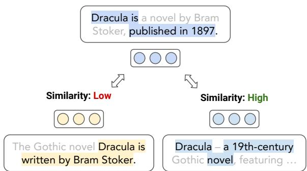
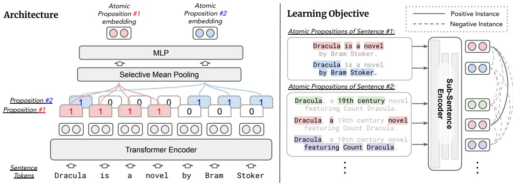
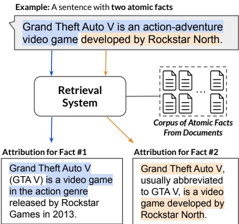
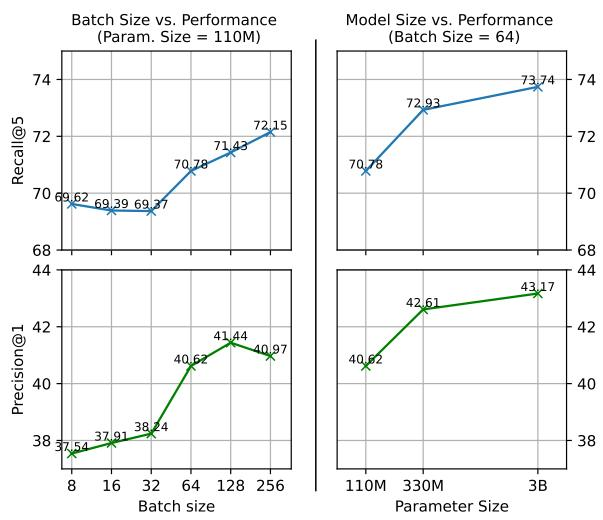

# Sub-Sentence Encoder: Contrastive Learning of Propositional Semantic Representations

Sihao Chen♣∗ Hongming Zhang♢ Tong Chen♡ Ben Zhou♣ Wenhao Yu♢ Dian Yu♢ Baolin Peng♢ Hongwei Wang♢ Dan Roth♣ Dong Yu♢

♣University of Pennsylvania ♡University of Washington ♢Tencent AI Lab sihaoc@cis.upenn.edu

## Abstract

We introduce sub-sentence encoder, a contrastively learned contextual embedding model for fine-grained semantic representation of text. In contrast to the standard practice with sentence embeddings, where the meaning of an entire sequence of text is encoded into a fixedlength vector, the sub-sentence encoder learns to produce distinct contextual embeddings corresponding to different atomic propositions, i.e. distinct units of meaning expressed within a text sequence. The sub-sentence embeddings are contrastively learned to recognize (inferred) semantic equivalence between propositions across different text sequences. Our experiments show the effectiveness of sub-sentence encoders in applications, such as retrieving supporting facts for fine-grained text attribution or recognizing the conditional semantic similarity between texts. In practice, we demonstrate that sub-sentence encoders keep the same level of inference cost and space complexity compared to sentence encoders.

§ https://github.com/schen149/ sub-sentence-encoder

## 1 Introduction

Sentence embeddings are a class of techniques that represent text semantics as dense vector embedding(s), which are widely used in zero-shot or transfer learning settings on information retrieval and text classification tasks (Conneau et al., 2017; Cer et al., 2018; Reimers and Gurevych, 2019; Karpukhin et al., 2020; Gao et al., 2021). Sentence embeddings are typically learned to recognize the semantic relation between two text inputs. The common practice is to encode each text input as one fixed-length vector, where the semantic relation with the other input is modeled by a similarity function (Bromley et al., 1993).

  
Figure 1: Given a proposition in a sentence (represented by a highlighted subset of tokens), the sub-sentence encoder produces a contextual embedding for the meaning of the proposition. The cosine similarity between the sub-sentence embeddings captures the (inferred) semantic similarity between the propositions.

While sentence embeddings provide a unified and compact representation for text semantics, it is difficult to query for the semantics on the subsentence level. For example, consider the two sentences with blue highlights in Figure 1 about the novel Dracula. Because the two sentences as a whole convey different meanings, they would have a low similarity between their sentence embeddings. However, the two sentences in-part share similar meanings on the level of propositions, i.e., distinct units of meaning in each sentence.

Being able to (efficiently) index textual information and model semantic similarity on a more granular level potentially have a profound impact on applications like long-form text evaluation (Amplayo et al., 2022), attribution (Rashkin et al., 2023) or factuality estimation (Min et al., 2023). With long-form generated text, multiple propositions in the same text might have different truthfulness values. The prerequisites for verifying or attributing such long-form text involve (1) representing text on a more granular level of propositions and (2) being able to retrieve evidence for different propositions within text. (Kamoi et al., 2023).

Motivated by such, we introduce sub-sentence encoder, a contrastively-learned contextual embedding model for representing sub-sentence-level semantics. As shown in Figure 2, the sub-sentence encoder takes a proposition within a text sequence as input. It outputs an embedding that represents the meaning of the proposition. Each proposition takes the format of a binary token mask sequence over the text, which denotes the tokens included in each proposition (Chen et al., 2023). We train the subsentence encoder model to recognize the semantic equivalence between pairs of propositions via inbatch supervised contrastive learning (Khosla et al., 2020). We sample and create training examples from a large corpus of unlabeled sentence pair data with proposition extraction and natural language inference (NLI) models (§3.3).

  
Figure 2: Overview of the sub-sentence encoder architecture and learning objective: The model takes a sentence and its propositions (represented as binary token masks) as input and outputs an embedding for each proposition. Given a minibatch of sentences, the model learns to identify pairs of propositions that express the same meaning. All others (including other propositions within the same sentence) are taken as negative examples (§3).

We evaluate sub-sentence encoders on two types of downstream tasks that involve semantic representation on the sub-sentence level. First, we demonstrate that sub-sentence encoders can be used for fine-grained retrieval, e.g., for text attribution, where a model is expected to retrieve supporting evidence for different parts of a sentence. Second, we show that sub-sentence encoders can be used to infer the conditional semantic similarity between a pair of text (Deshpande et al., 2023).

We discuss the design choices and challenges in applying sub-sentence encoders in large-scale indexing of a knowledge source, e.g. Wikipedia, on the proposition level. As encoding an entire corpus on the proposition level might result in a prohibitively large index, we reduce the output dimension of the sub-sentence encoder model during training (Wang et al., 2023). This simple yet effective trick yields 12 to 16 compression in index size with minimal performance drop.

The main contributions of the paper are:

• We propose sub-sentence encoder, a contextual embedding model for fine-grained text semantics.

• We introduce an automatic model-assisted process for sampling semantically similar propositions for sub-sentence encoder training.

• We demonstrate the utility of sub-sentence encoders in the downstream applications of atomic fact/attirbution retrieval and conditional semantic textual similarity.

## 2 Preliminaries

## 2.1 Motivation: Text Attribution

Our design of the sub-sentence encoder is largely motivated by the downstream application of text attribution (Rashkin et al., 2023), i.e., identify supporting information from known sources to attribute a given text. With the widespread adoption of text generation models, evaluating and attributing generated text has become an emerging research topic in need (Gao et al., 2023a,b; Liu et al., 2023; Malaviya et al., 2023). A key challenge in such tasks lies in the granularity of attributed information, i.e., one piece of generated text usually makes more than one claim, each of which might have different veracity. For instance, as Figure 1 shows, there could exist multiple claims even within one generated sentence in the form of propositions. Each claim or proposition needs to be contextualized (Choi et al., 2021) and individually verified against potentially different information sources (Kamoi et al., 2023; Min et al., 2023). This process inevitably requires an efficient model representing the semantics of different sentence parts in context, which describes the key design principle for the sub-sentence encoder.

## 2.2 Limitations of Sentence Embeddings

From the perspective of downstream applications such as text attribution, our sub-sentence encoder seeks to address the following two shortcomings of current sentence encoder models.

Granularity. Although sentence embeddings usually capture the meaning of the entire text sequence (Morris et al., 2023), it is difficult in practice to query sentence embeddings for semantic information on a more granular level (Wang and Yu, 2023). Motivated by such, previous studies have attempted to develop embedding functions that work for finer-grained semantic units. For instance, Skip-Prop (Rudinger et al., 2017) is a counter-part of Skip-Thought (Kiros et al., 2015), where an LSTM encoder-decoder model learns to produce one embedding per proposition, as opposed to per sentence. Qin and Van Durme (2023) introduce Nugget, a transformer encoder-decoder language model, where the model learns to select k contextualized token embedding as the intermediate segment embedding for an input sequence. In the context of information retrieval, our work in-part echoes the motivation with multi-vector retrieval (Seo et al., 2019; Khattab and Zaharia, 2020; Luan et al., 2021; Lee et al., 2021a; Zhang et al., 2022), where each retrieval text unit is represented by multiple embeddings. Compared to these models, our sub-sentence encoder instead opts for a simpler input/output protocol, where the each proposition in an input text is encoded independently of others.

Contextualization. A typical assumption for sentence encoder models and training/evaluation task setup is that the sentence is encoded independently without context. This becomes a limiting factor in scenarios where similarities and discrepancies between text pairs depend on the context they appear in (Chen et al., 2019; Schuster et al., 2022; Milbauer et al., 2023a,b; Deshpande et al., 2023).

## 3 Sub-Sentence Encoder

We introduce sub-sentence encoders. Contrary to sentence encoders, sub-sentence encoders are de-

signed to produce contextual embeddings for each atomic proposition in a sentence.

## 3.1 Architecture

The sub-sentence encoder architecture is instantiated similarly to transformer-based sentence biencoders (Reimers and Gurevych, 2019), as shown in Figure 2. The key difference is the sub-sentence encoder takes one or more binary token masks as extra inputs, which indicate the target proposition(s) of a sentence that it should produce embeddings for. The input sentence is first forwarded through a transformer encoder, which can be initialized from any pre-trained encoder model. Then, for each of the proposition token masks, the token embeddings with mask values of 1 are mean pooled and forwarded through a projection MLP layer. The model outputs k fixed length embedding corresponding to the k input propositions.

Note that the k token masks are only applied during pooling, and the encoder still gets full attention to the entire sentence. This allows the proposition embeddings to have the contextual information of the entire input sentence/paragraph, potentially alleviating the need for decontextualizing the propositions (Choi et al., 2021). In addition, since there is no cross-attention between the proposition embeddings, each proposition is encoded independently of others, and its representation is inherently invariant to the input ordering of the propositions.

Compared to sentence encoders, the subsentence encoder adds a small amount of parameters with the MLP layer on top. As the sentence can be forwarded only once, the extra inference cost of encoding multiple propositions in a sentence is minimal in practice, as we discuss in §4.

## 3.2 Contrastive Learning

With two propositions from different sentences, the goal is to make them have similar embedding representations if they express similar meanings, and have dissimilar representations otherwise. Within a minibatch of N propositions from M sentences. Let $v _ { i } = \in \mathbb { R } ^ { d }$ be the encoded representation of the $i ^ { t h }$ proposition in the batch. Let $I = \{ 1 . . N \}$ denote the index of all propositions. We formulate the learning objective as minimizing the in-batch supervised contrastive loss (Khosla et al., 2020):

$$
{ \mathcal { L } } = \sum _ { i \in I } { \frac { - 1 } { | P ( i ) | } } \sum _ { p \in P ( i ) } \log { \frac { \exp ( v _ { i } \cdot v _ { p } / \tau ) } { \sum _ { j \in I \backslash \{ i \} } \exp ( v _ { i } \cdot v _ { j } / \tau ) } }
$$

where $P ( i )$ is the set of indices of all positive propositions to the $i ^ { t h }$ proposition within the minibatch, and $| P ( i ) |$ denotes its cardinality. τ controls the softmax temperature. The learning objective encourages the model to produce embeddings with higher cosine similarity with positive pairs of propositions, while all other propositions in the same batch are considered negatives. Note that if all propositions from the same sentence are packaged in the same minibatch, under the assumption that they cannot be positive examples of each other, the learning objective would inherently encourage the model to assign different representations for different parts of a sentence.

The supervised contrastive loss is a generalized form of other commonly used loss functions for bior dual-encoder training, e.g., N-pairs loss (Sohn, 2016) or in-batch softmax (Karpukhin et al., 2020). We opt for this formulation mostly due to its ability to generalize to an arbitrary number of positive examples in the same batch. In our case, this is important, as each proposition may have zero or more positive instances in the same minibatch.

## 3.3 Sampling Proposition Pairs for Training

Here, we describe how we automatically sample positive proposition pairs from a collection of unlabeled sentence pairs as training data for the subsentence encoder. We start from a collection of 2.5M sentence pairs from topically related news articles (Zhou et al., 2022). The data is sampled from RealNews (Zellers et al., 2019), which contains sentence pairs that generally describe the same event with slightly different angles and focuses. These instances serve as great starting points for us, as they typically share proposition pairs with both similarities and differences.

Step 1: Segment Sentences Propositions. Given an unlabeled sentence pair, we first parse each sentence into propositions in natural language forms. First, we prompt GPT-3.5-turbo to generate propositions for 1% of all sentence pairs as the seed set of training data. We find that GPT-3.5-turbo with few shot in-context demonstrations gives reasonable performance on the task, which echos with the observations from Min et al. (2023) and Kamoi et al. (2023).

Next, we finetune T5-large (Raffel et al., 2020) on the seed training set and use the model to generate propositions for the rest of the dataset. We include more details about the prompt and training

process in Appendix A.

Step 2: Identify Positive Pairs with NLI models. Given the two sets of propositions (in natural language form) in each sentence pair, we infer and label the positive proposition pairs with an offthe-shelf NLI model (Nie et al., 2020) 1. We forward each pair of propositions across two sentences through the NLI model two times, with flipped orders between hypothesis and premise. We label a proposition pair positive if the NLI model classifies their relation as entailment in both directions. We only keep sentence pairs with at least one pair of positive propositions. This leaves us with 240k sentence pairs, with 3.32 propositions per sentence and 1.21 positive propositions on average.

Step 3: Convert Propositions Token Masks. We convert the propositions in natural language form to the token mask format used for subsentence encoder input by aligning the tokens in each proposition to the sentence. We use NLTK (Bird et al., 2009) to lemmatize each token in a proposition and its sentence and construct an affinity matrix between the two, where tokens with identical lemmas are assigned a similarity score of 1. To break ties between multiple token matches, we apply a 2D-convolution filter on the affinity matrix, which adds a small score offset for other token matches in a context window of three tokens. We find the optimal matches between the proposition and sentence with max bipartite matching on the affinity matrix with the Hungarian algorithm (Kuhn, 1955). We include a more detailed process description in Appendix A.

## 4 Experimental Setup

## 4.1 Model Configurations

We initialize the transformer encoder layers with pre-trained weights from three types of sentence encoders: SimCSE (Gao et al., 2021), Sentence-T5 (Ni et al., 2022a), and GTR (Ni et al., 2022b). With Sentence-T5 and GTR, we experiment with the base, large, and xl-sized variants of the models. For the MLP layer, we keep the output dimension the same as the transformer encoder. We discuss the impact of varying output dimensions in §5.4.

We finetune the sub-sentence encoder with different variants of backbone sentence encoders on the

<table><tr><td>System</td><td>Param. Size</td><td>PRECISION@1</td><td>RECALL@5</td><td>RECALL @10</td><td>RECALL@20</td></tr><tr><td>MiniLM-L6-v2</td><td>23M</td><td>18.36</td><td>37.28</td><td>44.87</td><td>51.62</td></tr><tr><td>DistilRoberta</td><td>82M</td><td>16.59</td><td>33.65</td><td>40.82</td><td>46.79</td></tr><tr><td>SimCSE (unsupervised)</td><td>110M</td><td>8.90</td><td>45.13</td><td>69.47</td><td>84.29</td></tr><tr><td>SimCSE (supervised)</td><td>110M</td><td>16.53</td><td>57.83</td><td>77.28</td><td>87.89</td></tr><tr><td> ${ \mathrm { G T R } } _ { b a s e }$ </td><td>110M</td><td>21.90</td><td>52.50</td><td>65.54</td><td>75.69</td></tr><tr><td> $\mathrm { S T } 5 _ { b a s e }$ </td><td>110M</td><td>26.16</td><td>57.65</td><td>69.00</td><td>78.58</td></tr><tr><td>SUBENCODER (SimCSE)</td><td>110M (+0.5M)</td><td>41.64</td><td>71.48</td><td>78.22</td><td>83.34</td></tr><tr><td>SUBENCODER  $( \mathrm { S T } 5 _ { b a s e } )$ </td><td>110M (+0.5M)</td><td>40.97</td><td>72.15</td><td>79.30</td><td>84.33</td></tr><tr><td>SUBENCODER  $( \mathrm { G T R } _ { b a s e } )$ </td><td>110M (+0.5M)</td><td>40.77</td><td>72.90</td><td>80.45</td><td>85.81</td></tr></table>

Table 1: Zero-shot evaluation results on the Atomic Fact Retrieval task in PROPSEGMENT (Chen et al., 2023).

  
Figure 3: In the Atomic Fact Retrieval task (Chen et al., 2023), given an atomic proposition in the query, a system is expected to retrieve the set of supporting atomic propositions from the corpus. The dataset features 8.8k query propositions and 45k candidate evidence propositions from 1.5k documents.

240k sentence pairs with at least one pair of positive propositions. We denote the resulting model as SUBENCODER. Details for our distributed training setup and hyperparameters are in Appendix B.

## 4.2 Evaluation

To assess the utility of the sub-sentence encoders, we evaluate our models on two types of downstream tasks in zero-shot settings.

## 4.2.1 Atomic Fact Retrieval for Fine-Grained Text Attribution

We first evaluate the sub-sentence encoders in retrieving fine-grained attributions (Rashkin et al., 2023) for text. We conduct the evaluations with the PROPSEGMENT dataset (Chen et al., 2023). An overview of the task setup is shown in Figure 3. Given a proposition in the sentence, a system is expected to identify and retrieve supporting evidence from a corpus of˜45k human-labeled atomic propositions from 1.5k News or Wikipedia documents in total. The task setup emulates the setting where each part of a sentence might have different veracity, and so each proposition in a sentence might be attributed to different supporting evidence from different source documents. On average, each query has 1.13 ground truth supporting propositions.

Metrics. Given a system’s output rankings of the 45k candidate evidence propositions to a query proposition, we measure the precision@1 plus recall@ 5, 10, 20 of the ranking against the ground truth set of evidence propositions.

Baselines. We compare pre-trained sentence encoders as baselines. We first evaluate variants of unsupervised and supervised SimCSE, Sentence-T5, and GTR on similar model parameter sizes. In addition, we compare two popular compact models, i.e., all-MiniLM-L6-v2 and all-distilroberta-v1 from sentence-transformers (Reimers and Gurevych, 2019). We discuss the setup for sentence encoders for the tasks in Appendix C.

Results. Table 1 shows our evaluation results with sentence and sub-sentence encoders compared on the similar scale of model parameter sizes. With proposition-level contrastive learning, We observe that the SUBENCODER with different backbone encoders generally improve over their sentence encoder counterparts. We see the most visible improvements of SUBENCODER in terms of Precision@1 and Recall@5, while the performance gap becomes smaller in terms of Recall@10 and 20. As the task involves retrieving different results for different query propositions in a sentence, the evaluation results suggest that sub-sentence contrastive learning gives the model better capabilities at recognizing the nuanced semantic differences between propositions appearing in the same context.

Across different variants of SUBENCODER with different backbone sentence encoders, we observe similar performance levels overall, with the $\mathrm { G T R } _ { b a s e }$ variant having a slight edge. In Table 1, we mostly compare models with the same backbone encoder size and configurations. Our SUBEN-CODER only introduces 0.5% extra parameters with the MLP layer on top. We discuss the model size, efficiency, and performance trade-off in §5.

## 4.2.2 Conditional Semantic Text Similarity

To assess SUBENCODER’s ability to produce contextual representations for fine-grained subsentence level semantics of text, we conduct experiments on the Condition Semantic Text Similarity (C-STS) task (Deshpande et al., 2023). Compared to STS (Agirre et al., 2012), C-STS introduces a condition notion of similarity between text pairs, where an additional natural language condition is provided along with the text pair as input. A system is expected to output a similarity score between the pair from the perspective of the given condition. Table 2 shows some examples of the task.

Method. Given the condition, we first prompt an LLM to identify a set of words in each sentence that best corresponds to the condition. Here, the LLM only sees one sentence at a time, so the condition words in each sentence are identified independently. We use the sub-sentence encoder to encode the set of words in the context of each sentence as the conditional representation. We take the cosine similarity between two encoded sets of words from the text pair as their conditional similarity.

Metrics. We compare the Spearman correlation coefficient between predicted similarity from a system against human ratings.

Baselines. We compare to a list of zero- and fewshot baselines provided by Deshpande et al. (2023). This includes two bi-encoder models, Robertabase and $\mathrm { S i m C S E } _ { b a s e }$ that do not make use of the condition as input, as well as zero- and few-shot prompting results with FlanT5large, GPT-3.5-turbo and $\mathsf { G P T } \mathfrak { - } 4 .$ , where each LLM provided detailed instructions of the task, and is prompted to generate a similarity score from 1 to 5 given the text pair and condition with/without in-context demonstrations.

Results. Table 3 shows the evaluation results. By having SUBENCODER comparing the contextual similarity between the set of words selected by $\mathtt { g p t } { - } 3 . 5 { \mathrm { - } } \mathtt { t u r b o }$ , we see an improvement in zeroshot setting from Spearman’s $r = 1 4 . 1  3 3 . 0$ compared to directly prompt LLM to output the similarity. However, the performance gap when using $\tt g p t { - } 4$ becomes much smaller $( r = 3 6 . 9 $ 37.2). This is reasonable considering the fact that direct $\tt g p t { - } 4$ prompting demonstrates on-par performance with supervised systems on C-STS, as reported in Deshpande et al. (2023). We show examples of typical mistakes made by our model in Table 2. We observe that our method typically fails when (1) the LLM fails to identify a good set of condition words, or when no such corresponding words explicitly exist in the sentence, or (2) SUBENCODER fails to correctly infer the similarity between the two sets of condition words. For instance, with the third example in Table 2, the inference is particularly challenging for the model, considering the relation is modeled only via a cosine similarity with no learned parameters.

  
Figure 4: The effect of varying batch size and model parameter size on the atomic fact retrieval performance, tested with the Sentence-T5 variant of SUBENCODER.

## 5 Analysis and Discussions

## 5.1 Scaling SUBENCODER

In Figure 4, we show an analysis of the effect of scaling model sizes and batch sizes during training. For our analysis, we use the Sentence-T5 variant of SUBENCODER, and evaluate the performance on the atomic fact retrieval task.

Scaling Batch Size. As our contrastive learning objective leverages in-batch negative sampling, scaling up the batch sizes during training could bring performance gains. To illustrate this, we initialize SUBENCODER with Sentence-T5 base encoder parameters and finetune with a varying batch size of 8, 16, 32, 64, 128, 256 . We observe that increasing the batch size generally increases performance, which suggests that batch size scaling could yield better model generalizability. We observe a significant performance gain when increasing batch size from 32  64 while seeing diminishing gains with further increase. This echoes the empirical findings with in-batch contrastive learning in general (Khosla et al., 2020). The phenomena can be attributed to the model-predicted labels in our training dataset, which can be noisy.

<table><tr><td>Type</td><td>Sentence 1</td><td>Sentence 2</td><td>Condition</td><td>Label</td><td>Pred.</td></tr><tr><td>Correct.</td><td>A group of people gosleddingon a snowy hill, and a dog chases one as heslides.</td><td>A person, dressed in black, skipping down a snow covered road andplaying with a black dog.</td><td>The physical activ- ity.</td><td>4</td><td>3.44</td></tr><tr><td>Mistake: fails to find a good set of words.</td><td>A man being thrown into the air while being trampled by a bull.</td><td>The cowboyholds onto the bull who is desperately trying to throw him off.</td><td>The person&#x27;s eleva- tion.</td><td>4</td><td>1</td></tr><tr><td>Mistake: correct set of words; failed inference.</td><td>Aman wearing a white tank top and a white hard hatis holding two pieces of pipe at aconstruction site</td><td>A construction workerin a lime-green safety vest and orange hard hat is looking closely at something held in his hands.</td><td>The occupation of the man.</td><td>5</td><td>2.47</td></tr></table>

Table 2: Example outputs and typical mistakes of SUBENCODER on C-STS. The set of words identified by gpt-3.5 is highlighted yellow. For display purposes here, the model predicted cosine similarity is normalized to match the human labels’ scale of 1 - 5, where 1 = Least similar, and 5 = Most similar

<table><tr><td>Model</td><td>Setting</td><td>Spearman r ↑</td></tr><tr><td>Robertabase  $\mathrm { S i m C S E } _ { b a s e }$ </td><td>O-shot (No. Cond.) O-shot (No. Cond.)</td><td>-0.43* 1.66*</td></tr><tr><td></td><td>0-shot</td><td>-3.0*</td></tr><tr><td> $\mathsf { F } 1 a \mathsf { n } \mathsf { T } 5 _ { l a r g e }$ </td><td>2-shot</td><td>11.7*</td></tr><tr><td rowspan="2">GPT-3.5</td><td>0-shot</td><td>14.1</td></tr><tr><td>2-shot</td><td>15.4</td></tr><tr><td>GPT-4</td><td>0-shot</td><td>36.9</td></tr><tr><td rowspan="2">GPT-3.5</td><td>2-shot</td><td>40.7</td></tr><tr><td> $( \mathrm { S i m C S E } _ { b a s e } )$ </td><td>27.5</td></tr><tr><td>+ SUBENCODER (0-shot)</td><td> $( \mathrm { G T R } _ { b a s e } )$ </td><td>31.9</td></tr><tr><td></td><td> $( \mathrm { S T } 5 _ { b a s e } )$ </td><td>33.0</td></tr><tr><td>GPT-4</td><td> $( \mathrm { S i m C S E } _ { b a s e } )$ </td><td>34.5</td></tr><tr><td>+ SUBENCODER</td><td> $( \mathrm { G T R } _ { b a s e } )$ </td><td>36.9</td></tr><tr><td>(0-shot)</td><td> $( \mathrm { S T } 5 _ { b a s e } )$ </td><td>37.2</td></tr></table>

Table 3: Spearman correlation coefficient ( 100) of model predictions evaluated in zero- or few-shot settings on the Conditional Semantic Textual Similarity (C-STS) task. \* denotes results from Deshpande et al. (2023).

Scaling Model Size. We initialize the encoder with different sizes of Sentence-T5 from 110M to 3B parameters and finetune with a fixed batch size of 64. We observe that starting from a larger pretrained encoder brings better performance. We see a bigger gain when increasing the model size from 110M to 330M, while the gain becomes smaller when we increase from 330M to 3B.

## 5.2 Using SUBENCODER for Sentence or Document Retrieval

In §4, we compare SUBENCODER’s performance on the atomic fact retrieval task against the baseline sentence encoders. In reality, a more likely application scenario is when the system is expected to retrieve supporting evidence on the sentence or document level. To evaluate this, we cast the atomic fact retrieval task as a sentence or document retrieval task, where given a query proposition, a system is expected to retrieve the set of sentences or documents that contain the target proposition(s).

From the intuition that finer-grained retrieval, e.g., with propositions, entails the more coarse sentence- or document-level retrieval, we follow Lee et al. (2021b) and use a simple strategy with SUBENCODER for sentence- and document-level retrieval. Given each query, we retrieve a slightly larger number of propositions. From the set of sentences and documents where the propositions belong, we use the highest score among the set of propositions as the score for each sentence or document. The top k unique sentences or documents are then returned as results.

Table 4 shows the the evaluation result. Compared to $\mathrm { G T R } _ { b a s e }$ and $\mathrm { S e n t e n c e - T } 5 _ { b a s e }$ , which are trained for document-level and sentence-level retrieval, respectively, we observe a similar level of performance with retrieving by propositions with SUBENCODER. Overall, we see lower top-1 accuracy compared to the baselines. This is possibly due to the more complex nature of the proposition retrieval task. However, we generally see an improvement in terms of recall @ 5. The findings indicate the potential of using SUBENCODER for multi-vector retrieval across different granularities.

<table><tr><td>Model</td><td>Sentence-Level P@1</td><td>R@5</td><td>Document-Level P@1</td><td>R@5</td></tr><tr><td> $\mathrm { G T R } _ { b a s e }$ </td><td>49.35</td><td>77.01</td><td>51.93</td><td>81.97</td></tr><tr><td> $\mathrm { S e n t e n c e - T } 5 _ { b a s e }$ </td><td>50.59</td><td>79.37</td><td>45.27</td><td>77.10</td></tr><tr><td>SUBENCODER (GTR)</td><td>42.94</td><td>82.27</td><td>45.04</td><td>90.13</td></tr><tr><td>SUBENCODER (ST5)</td><td>43.49</td><td>81.44</td><td>45.93</td><td>89.19</td></tr></table>

Table 4: Sentence and document retrieval performance of the atomic fact retrieval task. We evaluate GTRbase and Sentence- $. \mathrm { T } 5 _ { b a s e }$ variants of SUBENCODER.
<table><tr><td>Model</td><td>Dim.</td><td>Precision@1</td><td>Recall@5</td></tr><tr><td>SUBENCODER (ST5-Large)</td><td>1024 64</td><td>42.61  $4 2 . 1 0 \ ( - 0 . 5 1 )$ </td><td>72.93 70.17 (-2.76)</td></tr><tr><td>SUBENCODER (ST5-Base)</td><td>768 64</td><td>40.97  $4 0 . 4 5 \ ( - 0 . 5 2 )$ </td><td>72.15 71.62 (-0.53)</td></tr></table>

Table 5: The performance difference on the atomic fact retrieval task with vs. without reducing the output dimensionality of SUBENCODER.

## 5.3 Robustness to Input Formats/Boundaries

Although SUBENCODER is fine-tuned with data formatted as propositions specifically, we observe from the C-STS evaluations that the model generalizes to not necessarily proposition-shaped inputs, as shown in Table 2. In downstream applications, we would expect the model to generalize to input token masks with imperfect boundaries, e.g., propositions generated by a model instead of labeled by humans. Alongside the C-STS evaluation results, which indirectly support our hypothesis, we conduct a simple evaluation with the atomic fact retrieval task. Instead of human-annotated queries, we use queries generated by gpt-3.5-turbo. The evaluation results of the proposition segmentation performance of gpt-3.5-turbo and the distilled T5-Large model can be found in Appendix A. When we test the atomic fact retrieval performance on the set of model-generated propositions that can be fuzzy-matched under Jaccard similarity of > 0.8 with the human-annotated ones, we only see a small drop in performance, e.g., with the GTRbase variant of SUBENCODER, precision@1 drops from 40.77 39.56, recall@5 drops from 73.14 72.23. This indicates that our model is robust to imperfect proposition boundaries.

## 5.4 Offline Indexing and Compression

With the promising performance gain from SUBEN-CODER in the atomic fact retrieval task, we discuss and assess the possibility of applying SUBEN-

<table><tr><td>Index</td><td>Num. Entries</td><td>Dim.</td><td>Index Size</td></tr><tr><td>Propositions</td><td>270M</td><td>64</td><td>62GB</td></tr><tr><td>dpr-100w</td><td>21M</td><td>768</td><td>61GB</td></tr></table>

Table 6: The resulting index size with proposition-level indexing with compressed dimension, compared to a DPR index of 100-word blocks (Karpukhin et al., 2020).

CODER for fine-grained retrieval on larger-scale corpora, which involves offline indexing and caching the encoded corpora. In our case, the indexing happens on the level of propositions, where we need to store one embedding for every proposition in the corpora. Compared to document-level indexing, indexing on the proposition level would result in a prohibitively large index size. In previous works (Lee et al., 2021b), this is commonly addressed with techniques such as product quantization (Jegou et al., 2010) to compress index size or approximate nearest neighbor search (Malkov and Yashunin, 2018) for faster inference.

Orthogonal to the two techniques above, we study a simpler yet effective compression strategy by reducing the output dimension of SUBEN-CODER. In the context of sentence encoders, Wang et al. (2023) discover that reducing the output dimensionality during training generally incurs minimal downstream performance loss. Following this idea, we finetune the Sentence T5 base and large variants of SUBENCODER with a bottlenecked output dimension of 64 instead of the original output dimensions of 1024 and 768, respectively. Table 5 shows the performance comparison when evaluated on the atomic fact retrieval task. Overall, we observe a very small performance drop while gaining 12 to 16 reduction in output embedding size.

To demonstrate the implication of this in practice, we use the Sentence T5 large variant of SUBENCODER to encode an English Wikipedia dump from 2021/10/13, as used by Bohnet et al. (2022). We segment all sentences in Wikipedia into propositions with the T5-large model (§3.3). This results in˜270M propositions from 5.3M Wikipedia pages. Table 6 shows the resulting index. The resulting size of 62GB is close to a prebuilt (uncompressed) dense passage retrieval (DPR) index on the level of 100-word blocks (Karpukhin et al., 2020). We see that decreasing the output dimension of the embeddings helps in reducing the cached idnex size. It is worth noting that compared to the document-level index, we still expect the query speed of the index to increase slightly due to the increase in the number of entries. However, in practice, we observe a reasonable overall time and space complexity involved in offline indexing and online similarity querying on the proposition-level.

## 6 Conclusion

We introduce sub-sentence encoders, a contrastive learning framework for learning contextual embeddings for semantic units on the sub-sentence level. Beyond the use cases covered in the paper, the sub-sentence encoder architecture could potentially serve as the backbone for any cross-document information linking tasks in context, and the learning objectives could potentially apply to a broader range of tasks with various granularity of information, e.g., linking sentences or spans within different documents (Ma et al., 2023). We hope that the findings in this paper will facilitate further exploration along these directions.

## Limitations

The goal of this work is to validate the idea behind sub-sentence encoder architecture and learning objectives. We acknowledge the limited scale of our experiments, specifically (1) Number of tasks or applications evaluated: This is mostly due to the limited number of human-labeled benchmark datasets suitable for our case. (2) Language covered: In our experiments, we explore the idea of sub-sentence encoder with English text only. However, the techniques described in the paper for sampling training data and training the sub-sentence encoder can be applied to other languages as well. We leave the exploration on multilingual sub-sentence encoder for future work.

## Acknowledgements

The authors would like to thank Alex Fabrikant, Jianmo Ni, and Tal Schuster for the discussions leading to the development of this idea. The authors thank Ruixin Hong, Xinran Zhao, Kaixin Ma, Vivek Gupta, and Xiaodong Yu for valuable feedback on the project and the paper presentation.

## References

Eneko Agirre, Daniel Cer, Mona Diab, and Aitor Gonzalez-Agirre. 2012. SemEval-2012 task 6: A pilot on semantic textual similarity. In \*SEM 2012: The First Joint Conference on Lexical and Computational Semantics – Volume 1: Proceedings of the main conference and the shared task, and Volume

2: Proceedings ofthe Sixth International Workshop on Semantic Evaluation (SemEval 2012), pages 385– 393, Montréal, Canada. Association for Computational Linguistics.

Reinald Kim Amplayo, Peter J Liu, Yao Zhao, and Shashi Narayan. 2022. Smart: Sentences as basic units for text evaluation. In The Eleventh International Conference on Learning Representations.

Steven Bird, Ewan Klein, and Edward Loper. 2009. Natural language processing with Python: analyzing text with the natural language toolkit. " O’Reilly Media, Inc.".

Bernd Bohnet, Vinh Q Tran, Pat Verga, Roee Aharoni, Daniel Andor, Livio Baldini Soares, Jacob Eisenstein, Kuzman Ganchev, Jonathan Herzig, Kai Hui, et al. 2022. Attributed question answering: Evaluation and modeling for attributed large language models. arXiv preprint arXiv:2212.08037.

Jane Bromley, Isabelle Guyon, Yann LeCun, Eduard Säckinger, and Roopak Shah. 1993. Signature verification using a" siamese" time delay neural network. Advances in neural information processing systems, 6.

Daniel Cer, Yinfei Yang, Sheng-yi Kong, Nan Hua, Nicole Limtiaco, Rhomni St. John, Noah Constant, Mario Guajardo-Cespedes, Steve Yuan, Chris Tar, Brian Strope, and Ray Kurzweil. 2018. Universal sentence encoder for English. In Proceedings of the 2018 Conference on Empirical Methods in Natural Language Processing: System Demonstrations, pages 169–174, Brussels, Belgium. Association for Computational Linguistics.

Sihao Chen, Senaka Buthpitiya, Alex Fabrikant, Dan Roth, and Tal Schuster. 2023. PropSegmEnt: A largescale corpus for proposition-level segmentation and entailment recognition. In Findings of the Association for Computational Linguistics: ACL 2023, pages 8874–8893, Toronto, Canada. Association for Computational Linguistics.

Sihao Chen, Daniel Khashabi, Wenpeng Yin, Chris Callison-Burch, and Dan Roth. 2019. Seeing things from a different angle:discovering diverse perspectives about claims. In Proceedings ofthe 2019 Conference ofthe North American Chapter ofthe Associationfor Computational Linguistics: Human Language Technologies, Volume 1 (Long and Short Papers), pages 542–557, Minneapolis, Minnesota. Association for Computational Linguistics.

Eunsol Choi, Jennimaria Palomaki, Matthew Lamm, Tom Kwiatkowski, Dipanjan Das, and Michael Collins. 2021. Decontextualization: Making sentences stand-alone. Transactions ofthe Association for Computational Linguistics, 9:447–461.

Alexis Conneau, Douwe Kiela, Holger Schwenk, Loïc Barrault, and Antoine Bordes. 2017. Supervised learning of universal sentence representations from

natural language inference data. In Proceedings of the 2017 Conference on Empirical Methods in Natural Language Processing, pages 670–680, Copenhagen, Denmark. Association for Computational Linguistics.

Ameet Deshpande, Carlos E Jimenez, Howard Chen, Vishvak Murahari, Victoria Graf, Tanmay Rajpurohit, Ashwin Kalyan, Danqi Chen, and Karthik Narasimhan. 2023. CSTS: Conditional Semantic Textual Similarity. In Proceedings ofthe 2023 Conference on Empirical Methods in Natural Language Processing.

William Falcon and The PyTorch Lightning team. 2019. PyTorch Lightning.

Luyu Gao, Zhuyun Dai, Panupong Pasupat, Anthony Chen, Arun Tejasvi Chaganty, Yicheng Fan, Vincent Zhao, Ni Lao, Hongrae Lee, Da-Cheng Juan, and Kelvin Guu. 2023a. RARR: Researching and revising what language models say, using language models. In Proceedings ofthe 61st Annual Meeting ofthe Associationfor Computational Linguistics (Volume 1: Long Papers), pages 16477–16508, Toronto, Canada. Association for Computational Linguistics.

Tianyu Gao, Xingcheng Yao, and Danqi Chen. 2021. SimCSE: Simple contrastive learning of sentence embeddings. In Proceedings of the 2021 Conference on Empirical Methods in Natural Language Processing, pages 6894–6910, Online and Punta Cana, Dominican Republic. Association for Computational Linguistics.

Tianyu Gao, Howard Yen, Jiatong Yu, and Danqi Chen. 2023b. Enabling large language models to generate text with citations. arXiv preprint arXiv:2305.14627.

Herve Jegou, Matthijs Douze, and Cordelia Schmid. 2010. Product quantization for nearest neighbor search. IEEE transactions on pattern analysis and machine intelligence, 33(1):117–128.

Ryo Kamoi, Tanya Goyal, Juan Diego Rodriguez, and Greg Durrett. 2023. Wice: Real-world entailment for claims in wikipedia. In Proceedings of the 2023 Conference on Empirical Methods in Natural Language Processing.

Vladimir Karpukhin, Barlas Oguz, Sewon Min, Patrick Lewis, Ledell Wu, Sergey Edunov, Danqi Chen, and Wen-tau Yih. 2020. Dense passage retrieval for opendomain question answering. In Proceedings of the 2020 Conference on Empirical Methods in Natural Language Processing (EMNLP), pages 6769–6781, Online. Association for Computational Linguistics.

Omar Khattab and Matei Zaharia. 2020. Colbert: Efficient and effective passage search via contextualized late interaction over bert. In Proceedings ofthe 43rd International ACM SIGIR conference on research and development in Information Retrieval, pages 39– 48.

Prannay Khosla, Piotr Teterwak, Chen Wang, Aaron Sarna, Yonglong Tian, Phillip Isola, Aaron Maschinot, Ce Liu, and Dilip Krishnan. 2020. Supervised Contrastive Learning. Advances in neural information processing systems, 33:18661–18673.

Ryan Kiros, Yukun Zhu, Russ R Salakhutdinov, Richard Zemel, Raquel Urtasun, Antonio Torralba, and Sanja Fidler. 2015. Skip-thought vectors. Advances in neural information processing systems, 28.

Harold W Kuhn. 1955. The Hungarian method for the assignment problem. Naval research logistics quarterly, 2(1-2):83–97.

Jaewoong Lee, Heejoon Lee, Hwanhee Lee, and Kyomin Jung. 2021a. Learning to select questionrelevant relations for visual question answering. In Proceedings of the Third Workshop on Multimodal Artificial Intelligence, pages 87–96, Mexico City, Mexico. Association for Computational Linguistics.

Jinhyuk Lee, Alexander Wettig, and Danqi Chen. 2021b. Phrase retrieval learns passage retrieval, too. In Proceedings ofthe 2021 Conference on Empirical Methods in Natural Language Processing, pages 3661– 3672, Online and Punta Cana, Dominican Republic. Association for Computational Linguistics.

Nelson F Liu, Tianyi Zhang, and Percy Liang. 2023. Evaluating verifiability in generative search engines. arXiv preprint arXiv:2304.09848.

Yi Luan, Jacob Eisenstein, Kristina Toutanova, and Michael Collins. 2021. Sparse, dense, and attentional representations for text retrieval. Transactions ofthe Association for Computational Linguistics, 9:329– 345.

Kaixin Ma, Hao Cheng, Yu Zhang, Xiaodong Liu, Eric Nyberg, and Jianfeng Gao. 2023. Chain-of-skills: A configurable model for open-domain question answering. In Proceedings of the 61st Annual Meeting ofthe Associationfor Computational Linguistics (Volume 1: Long Papers), pages 1599–1618, Toronto, Canada. Association for Computational Linguistics.

Chaitanya Malaviya, Subin Lee, Sihao Chen, Elizabeth Sieber, Mark Yatskar, and Dan Roth. 2023. Expertqa: Expert-curated questions and attributed answers. arXiv preprint arXiv:2309.07852.

Yu A Malkov and Dmitry A Yashunin. 2018. Efficient and robust approximate nearest neighbor search using hierarchical navigable small world graphs. IEEE transactions on pattern analysis and machine intelligence, 42(4):824–836.

Jeremiah Milbauer, Ziqi Ding, Zhijin Wu, and Tongshuang Wu. 2023a. From nuisance to news sense: Augmenting the news with cross-document evidence and context. arXiv preprint arXiv:2310.04592.

Jeremiah Milbauer, Annie Louis, Mohammad Javad Hosseini, Alex Fabrikant, Donald Metzler, and Tal

Schuster. 2023b. LAIT: Efficient multi-segment encoding in transformers with layer-adjustable interaction. In Proceedings of the 61st Annual Meeting of the Association for Computational Linguistics (Volume 1: Long Papers), pages 10251–10269, Toronto, Canada. Association for Computational Linguistics.

Sewon Min, Kalpesh Krishna, Xinxi Lyu, Mike Lewis, Wen-tau Yih, Pang Wei Koh, Mohit Iyyer, Luke Zettlemoyer, and Hannaneh Hajishirzi. 2023. FActScore: Fine-grained atomic evaluation of factual precision in long form text generation. In Proceedings ofthe 2023 Conference on Empirical Methods in Natural Language Processing.

John X Morris, Volodymyr Kuleshov, Vitaly Shmatikov, and Alexander M Rush. 2023. Text embeddings reveal (almost) as much as text. arXiv preprint arXiv:2310.06816.

Jianmo Ni, Gustavo Hernandez Abrego, Noah Constant, Ji Ma, Keith Hall, Daniel Cer, and Yinfei Yang. 2022a. Sentence-t5: Scalable sentence encoders from pre-trained text-to-text models. In Findings of the Associationfor Computational Linguistics: ACL 2022, pages 1864–1874, Dublin, Ireland. Association for Computational Linguistics.

Jianmo Ni, Chen Qu, Jing Lu, Zhuyun Dai, Gustavo Hernandez Abrego, Ji Ma, Vincent Zhao, Yi Luan, Keith Hall, Ming-Wei Chang, and Yinfei Yang. 2022b. Large dual encoders are generalizable retrievers. In Proceedings of the 2022 Conference on Empirical Methods in Natural Language Processing, pages 9844–9855, Abu Dhabi, United Arab Emirates. Association for Computational Linguistics.

Yixin Nie, Adina Williams, Emily Dinan, Mohit Bansal, Jason Weston, and Douwe Kiela. 2020. Adversarial NLI: A new benchmark for natural language understanding. In Proceedings of the 58th Annual Meeting ofthe Associationfor Computational Linguistics, pages 4885–4901, Online. Association for Computational Linguistics.

Adam Paszke, Sam Gross, Francisco Massa, Adam Lerer, James Bradbury, Gregory Chanan, Trevor Killeen, Zeming Lin, Natalia Gimelshein, Luca Antiga, et al. 2019. Pytorch: An imperative style, high-performance deep learning library. Advances in neural information processing systems, 32.

Guanghui Qin and Benjamin Van Durme. 2023. Nugget: Neural agglomerative embeddings of text. In Proceedings of the 40th International Conference on Machine Learning, ICML’23. JMLR.org.

Colin Raffel, Noam Shazeer, Adam Roberts, Katherine Lee, Sharan Narang, Michael Matena, Yanqi Zhou, Wei Li, and Peter J. Liu. 2020. Exploring the limits of transfer learning with a unified text-to-text transformer. Journal ofMachine Learning Research, 21(140):1–67.

Hannah Rashkin, Vitaly Nikolaev, Matthew Lamm, Lora Aroyo, Michael Collins, Dipanjan Das, Slav Petrov, Gaurav Singh Tomar, Iulia Turc, and David Reitter. 2023. Measuring attribution in natural language generation models. Computational Linguistics, pages 1–64.

Nils Reimers and Iryna Gurevych. 2019. Sentence-BERT: Sentence embeddings using Siamese BERTnetworks. In Proceedings ofthe 2019 Conference on Empirical Methods in Natural Language Processing and the 9th International Joint Conference on Natural Language Processing (EMNLP-IJCNLP), pages 3982–3992, Hong Kong, China. Association for Computational Linguistics.

Rachel Rudinger, Kevin Duh, and Benjamin Van Durme. 2017. Skip-prop: Representing sentences with one vector per proposition. In IWCS 2017 — 12th International Conference on Computational Semantics — Short papers.

Tal Schuster, Sihao Chen, Senaka Buthpitiya, Alex Fabrikant, and Donald Metzler. 2022. Stretching sentence-pair nli models to reason over long documents and clusters. In Findings of the Association for Computational Linguistics: EMNLP 2022, pages 394–412.

Minjoon Seo, Jinhyuk Lee, Tom Kwiatkowski, Ankur Parikh, Ali Farhadi, and Hannaneh Hajishirzi. 2019. Real-time open-domain question answering with dense-sparse phrase index. In Proceedings of the 57th Annual Meeting of the Association for Computational Linguistics, pages 4430–4441, Florence, Italy. Association for Computational Linguistics.

Kihyuk Sohn. 2016. Improved deep metric learning with multi-class n-pair loss objective. Advances in neural information processing systems, 29.

Hongwei Wang and Dong Yu. 2023. Going beyond sentence embeddings: A token-level matching algorithm for calculating semantic textual similarity. In Proceedings of the 61st Annual Meeting of the Association for Computational Linguistics (Volume 2: Short Papers), pages 563–570.

Hongwei Wang, Hongming Zhang, and Dong Yu. 2023. On the dimensionality of sentence embeddings. arXiv preprint arXiv:2310.15285.

Rowan Zellers, Ari Holtzman, Hannah Rashkin, Yonatan Bisk, Ali Farhadi, Franziska Roesner, and Yejin Choi. 2019. Defending against neural fake news. NeurIPS.

Shunyu Zhang, Yaobo Liang, Ming Gong, Daxin Jiang, and Nan Duan. 2022. Multi-view document representation learning for open-domain dense retrieval. In Proceedings of the 60th Annual Meeting of the Association for Computational Linguistics (Volume 1: Long Papers), pages 5990–6000, Dublin, Ireland. Association for Computational Linguistics.

Ben Zhou, Kyle Richardson, Xiaodong Yu, and Dan Roth. 2022. Learning to decompose: Hypothetical question decomposition based on comparable texts. In Proceedings of the 2022 Conference on Empirical Methods in Natural Language Processing, pages 2223–2235, Abu Dhabi, United Arab Emirates. Association for Computational Linguistics.

## A Proposition Segmentation

In this section, we provide details on the few-shot prompt and distilled T5-large model we use for segmenting sentences into propositions. We provide evaluations the two methods against PROPSEG-MENT (Chen et al., 2023).

## A.1 Prompt for Proposition Segmentation

We use the following prompt with gpt-3.5-turbo to generate the initial set of seed training data for segmenting sentences into propositions. We provide one example from PROPSEGMENT for in-context learning demonstration. We process ˜23, 000 sentence pairs with the prompt, which generates a total of 44,970 sentences with propositions, after filtering out malformed and empty generations.

Prompt for sentence propositions   
Given the following sentence, tell me what claims   
they are making. Please split the sentence as much as   
possible, but do not include information not in the   
sentence.   
Sentence: The Andy Warhol Museum in his   
hometown, Pittsburgh, Pennsylvania, contains an   
extensive permanent collection of art.   
Claims:   
1. The Andy Warhol Museum is in Pittsburgh.   
2. Andy Warhol’s hometown is in Pittsburgh.   
3. Pittsburgh is in Pennsylvania.   
4. The Andy Warhol Museum contains an exten  
sive permanent collection of art.   
Sentence: (input sentence)   
Claims:

## A.2 Training detail of T5 for proposition segmentation

We finetune a T5-large (Raffel et al., 2020) model on a seed set of training data generated via GPT-3.5-turbo. We use an AdamW optimizer with a constant learning rate of $1 e ^ { - 4 }$ , with a batch size of 128. We train the model for 3 epochs on 8x Nvidia A6000s, which takes 2 hours to finish.

## A.3 Converting propositions from natural language to token masks

Given a proposition of a sentence in the natural language form, we convert and align it to a subset of tokens from the original sentence with the following steps. We first tokenize and lemmatize each of the tokens in the proposition using NLTK (Bird et al., 2009). Next, we construct an affinity matrix between the set of lemmatized tokens from the proposition and the sentence. With the matrix, we assign tokens with identical lemmas are assigned a similarity score of 1. To break ties between multiple token matches, we apply a 2Dconvolution filter on the affinity matrix, which adds a small score offset for other token matches in a context window of three tokens. With the affinity matrix, we find the optimal alignment between the proposition and sentence tokens with max bipartite matching on the affinity matrix with the Hungarian algorithm (Kuhn, 1955).

<table><tr><td rowspan="2">Model</td><td colspan="3">Jaccard  $\theta = 0 . 8$ </td><td colspan="3">Jaccard  $\theta = 0 . 5$ </td></tr><tr><td>Precision</td><td>Recall</td><td>F1</td><td>Precision</td><td>Recall</td><td>F1</td></tr><tr><td colspan="7">Systems used in this paper</td></tr><tr><td>GPT-3.5-turbo</td><td>35.79</td><td>31.65</td><td>33.60</td><td>71.52</td><td>63.87</td><td>67.48</td></tr><tr><td>T5-Large (w/ GPT3.5 training data)</td><td>35.91</td><td>31.70</td><td>33.68</td><td>70.27</td><td>63.39</td><td>66.65</td></tr><tr><td colspan="7">Systems fine-tuned on PROPSEGMENT (Chen et al., 2023)</td></tr><tr><td>BERT-Large</td><td>34.97</td><td>33.42</td><td>34.17</td><td>67.42</td><td>64.17</td><td>65.75</td></tr><tr><td>T5-Large</td><td>55.95</td><td>55.05</td><td>55.50</td><td>78.03</td><td>76.74</td><td>77.38</td></tr></table>

Table 7: Sentence segmentation performance of systems used in this paper when evaluated in zero-shot settings on PROPSEGMENT. We include the performance of models trained on PROPSEGMENT reported by Chen et al. (2023) as a reference.

## A.4 Proposition Segmentation Evaluation on PROPSEGMENT

To evaluate the quality of propositions extracted via our pipeline, we evaluate the proposition segmentation performance on PROPSEGMENT. The results are shown in Table 7. For details of the Jaccard similarity based evaluation metrics for proposition segmentation, please refer to Chen et al. (2023).

## B Training and Hyperparameters

We implement the sub-sentence encoder architecture with pytorch (Paszke et al., 2019) and pytorch-lightning (Falcon and The PyTorch Lightning team, 2019). All of our sub-encoder model variants are trained on 8 Nvidia A6000 GPUs with 48GB VRAM.

Distributed Training Since we adopt in-batch contrastive loss, we scale up the number of negative examples by increasing the batch size with distributed training across GPUs. We distribute training processes across GPU nodes via Distributed Data Parallel (DDP) in PyTorch. Specifically, given a minibatch of $N _ { g p u } \times M$ sentences, each GPU gets M sentences, which get forwarded through model parameters on the GPU. Next, we gather and copy all the encoded propositions along with gradients to each of the GPUs, so that each GPU has the full minibatch for loss computation. Each GPU process backpropagates the loss independently on its copy of the model parameters.

Hyperparameters For all experiments, we use the temperature parameter $\tau = 0 . 0 1$ for the supervised contrastive loss, with AdamW optimizer. For Sentence-T5 and GTR variants of the model, we use a learning rate of $1 e ^ { - 4 }$ . For SimCSE, we use a learning rate of $5 e ^ { - 5 }$ . We train the models for 10 epochs, and a linear decay is applied at the end of each epoch, which decreases the learning to 0 after 10 epochs. We select the best checkpoint based on validation loss after each epoch.

## C Evaluation Setup

## C.1 Representing Atomic Propostion with Sentence Encoder

With the atomic fact retrieval evaluation on PROPSEGMENT, since the ground truth query and target propositions are both represented in the format of token masks, we experiment with a few different strategies of formatting the input for sentence encoders. Specifically, with respect to the input sentence and the token masks denoting the proposition, here are the different strategies in consideration.

1. Mask pooling only. Encoder has full attention, apply proposition mask during pooling. Note that this is the same method we use for the sub-sentence encoder.

2. Full mask. Apply proposition mask as attention mask during both encoding and pooling.

3. Token subset only. Take the subset of tokens and discard the rest. Feed only the subset of tokens as a sequence to the encoder and pooling layer.

When tested on a small validation set for the atomic fact retrieval task, we generally observe that mask pooling only yields the best result across most models, except for the two compact models, i.e. MiniL $\mathbf { \tau } _ { \mathbf { M - L } 6 - \mathbf { v } 2 }$ and DistilRoberta. On the two compact models, we see full mask outperforming the mask pooling only strategy by a small margin. We observe that with the third strategy token subset only, the validation performance trails behind the other two across all models.

## C.2 Robustness to Input Boundaries

<table><tr><td>Base Model |</td><td>P@1</td><td>R@5</td></tr><tr><td> ${ \mathrm { G T R } } _ { b a s e }$ </td><td> $4 0 . 7 7  3 8 . 3 9$ </td><td> $7 2 . 9 0  7 1 . 4 7$ </td></tr><tr><td> $\mathrm { S T } 5 _ { b a s e }$ </td><td> $4 0 . 9 7  3 8 . 1 4$ </td><td> $7 2 . 1 5  7 0 . 9 4$ </td></tr><tr><td> $\mathrm { S T } 5 _ { b a s e }$ </td><td> $4 1 . 6 4  3 7 . 2 8$ </td><td> $7 1 . 4 8  6 9 . 3 2$ </td></tr></table>

Table 8: The retrieval performance of SUBENCODER with model predicted propositions instead of ground truth in input. We only consider propositions with Jaccard similarity > 0.8 in the evaluation.