# Toward Informal Language Processing: Knowledge of Slang in Large Language Models

Zhewei Sun1, Qian Hu2, Rahul Gupta2, Richard Zemel2,3, Yang Xu1

1University of Toronto, 2Amazon Alexa AI, 3Columbia University {zheweisun, yangxu}@cs.toronto.edu, {huqia, gupra}@amazon.com zemel@cs.columbia.edu

## Abstract

Recent advancement in large language models (LLMs) has offered a strong potential for natural language systems to process informal language. A representative form of informal language is slang, used commonly in daily conversations and online social media. To date, slang has not been comprehensively evaluated in LLMs due partly to the absence of a carefully designed and publicly accessible benchmark. Using movie subtitles, we construct a dataset that supports evaluation on a diverse set of tasks pertaining to automatic processing of slang. For both evaluation and finetuning, we show the effectiveness of our dataset on two core applications: 1) slang detection, and 2) identification of regional and histori cal sources of slang from natural sentences. We also show how our dataset can be used to probe the output distributions of LLMs for interpretive insights. We find that while LLMs such as GPT-4 achieve good performance in a zero-shot setting, smaller BERT-like models finetuned on our dataset achieve comparable performance. Furthermore, we show that our dataset enables finetuning of LLMs such as GPT-3.5 that achieve substantially better performance than strong zero-shot baselines. Our work offers a comprehensive evaluation and a high-quality benchmark on English slang based on the OpenSubtitles corpus, serving both as a publicly accessible resource and a platform for applying tools for informal language processing.1

## 1 Introduction

Large language models (LLM) are the core engines of widely used applications such as Chat-GPT. While the technology is becoming increasingly pervasive, it is important to understand its abilities and limitations with input from diverse forms of language use. Here, we focus on the case of slang - a common type of informal language that is ubiquitous across day-to-day conversations (Mattiello, 2005; Eble, 2012). Figure 1 illustrates the relevance of slang in natural language processing (NLP). When describing a good jacket, one can make different word choices such as excellent and blazing. Even though the intended meaning is the same across both word choices, we might expect a significant difference in performance caused by an LLM’s lack of knowledge about slang. Recent work in computational modeling of slang has suggested that pre-trained LLMs assign much lower probabilities to slang compared to their literal equivalents (Sun et al., 2021, 2022), suggesting that models such as BERT (Devlin et al., 2019) lack knowledge of slang.

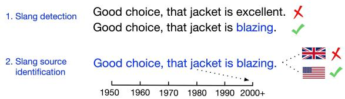  
Figure 1: Overview of tasks used to probe knowledge of slang in LLMs.

Knowledge of slang in LLMs has important implications beyond automated processing of informal language. This is the case because the use of slang explicitly reflects one’s social identity (Labov, 1972, 2006; Eble, 2012). For example, the use of blazing to express ‘Something excellent emerges from the US whereas it expresses ‘Anger in the UK (Green, 2010). Previous work has shown that the performance of NLP systems can substantially differ across language generated by different demographic groups stratified by age, gender, region, or ethnicity (Hovy and Søgaard, 2015; Hovy and Spruit, 2016; Blodgett and O’Connor, 2017; Tatman, 2017; Buolamwini and Gebru, 2018; Koenecke et al., 2020) and can potentially introduce representational harm (Blodgett et al., 2020). Given slang’s close ties with social identity, a competent language model may also accurately reveal a slang user’s identity. While such information can be used to improve NLP performance (Volkova et al., 2013; Hovy, 2015), the use of slang may also lead to an increased risk of personal information exposure.

Despite these important implications, LLMs have not been rigorously evaluated across a wide range of models on tasks pertaining to slang. The main challenge lies in the lack of high-quality datasets that are publically accessible. Furthermore, existing dictionary-based data sources (e.g., Green, 2010) do not include useful meta-data such as the literal paraphrase of a slang usage. For example, having a pair of sentences as illustrated in Figure 1 where the only difference lies in the slang and its paraphrase (blazing and excellent respectively) allows us to probe the LLMs in a controlled setting. To address these challenges, we collect a new publically accessible dataset of slang usages based on the OpenSubtitles corpus (Lison and Tiedemann, 2016). Using this dataset, we systematically evaluate the LLMs’ knowledge of slang, with a particular focus on the widely adopted GPT models (Brown et al., 2020; OpenAI, 2023).2 We show that while the LLMs contain considerable knowledge about slang, task-specific finetuning is still essential in achieving state-of-the-art performance.

We focus on two core tasks for informal language processing, illustrated in Figure 1. First, we evaluate the extent to which LLMs can reliably detect slang usages in natural sentences. Second, we assess whether LLMs can be used to identify regional-historical sources3 of slang via a text classification task. Finally, we examine the semantic knowledge of slang in LLMs to understand the differences in their representation of slang versus conventional language use. Throughout our evaluation, we also draw close attention to performance discrepancies based on different demographic variables and discuss their implications toward fairness and privacy.

We make the following contributions in this paper: 1) A dataset containing thousands of human annotated English slang usages in movie subtitles, contributing a novel publically available benchmark of slang for evaluation and finetuning; 2) A rigorous evaluation of large language models’ knowledge of slang, including important tasks such as slang detection; 3) A discussion of the implications of such knowledge and how it may affect fairness and privacy in NLP.

## 2 Related Work

## 2.1 Deep learning for slang

Previous work on automatic processing of slang has successfully applied deep learning based techniques to address tasks such as detection (Pei et al., 2019), generation (Sun et al., 2019, 2021), interpretation (Ni and Wang, 2017; Sun et al., 2022), as well as predicting word formations (Kulkarni and Wang, 2018; Wibowo et al., 2021) of slang. These tasks are difficult partly due to slang’s low resource nature. Our work investigates whether the large scale training of LLMs such as GPT-4 can alleviate this difficulty, and if so, whether GPT’s representations reflect semantic knowledge of slang that has been injected in previous methods. We also re-evaluate the slang detection task using modern architectures and contribute the first publically accessible benchmark for slang detection.

Recently, mechanisms underlie both language variation (Lucy and Bamman, 2021; Sun and Xu, 2022) and semantic change (Keidar et al., 2022) in slang have been extensively studied, with many important features attributed to demographic variables such as age and community membership. We extend this line of work by probing recent large language models for knowledge of slang’s demographic source.

## 2.2 Probing knowledge in LLMs

The popularity of deep learning methods in NLP has prompted much work on analyzing the linguistic knowledge learned by neural networks (Belinkov and Glass, 2019; Rogers et al., 2020; Belinkov, 2022). More recent work has probed LLMs on their knowledge of non-standard language such as metaphors (Aghazadeh et al., 2022; Liu et al., 2022; Wicke, 2023) and linguistic anomalies (Li et al., 2021).

Two prominent frameworks have been introduced to operationalize probing. First, the behavioral probing method that assesses differences in behavior of a language model given two similar inputs, where a few tokens of interest differ (e.g.,

<table><tr><td rowspan="2">Dataset</td><td colspan="3">Slang detection and probing</td><td colspan="2">Slang source identification</td><td rowspan="2">Publically accessible</td></tr><tr><td>Slang-containing sentences</td><td>Non-slang sentences</td><td>Word-level paraphases</td><td>Community of emergence</td><td>Time of emergence</td></tr><tr><td>Urban Dictionary</td><td></td><td>X</td><td>X</td><td>X</td><td>X</td><td></td></tr><tr><td>The Online Slang Dictionary (OSD)</td><td></td><td>X</td><td>V</td><td>X</td><td>X</td><td>X</td></tr><tr><td>Green&#x27;s Dictionary of Slang (GDoS)</td><td></td><td>X</td><td>X</td><td></td><td></td><td>X</td></tr><tr><td>Reddit Glossaries</td><td>X</td><td>X</td><td>X</td><td>L</td><td>X</td><td></td></tr><tr><td>(Lucy and Bamman, 2021) Indonesian Colloquialism</td><td>X</td><td>X</td><td>J</td><td>X</td><td>X</td><td></td></tr><tr><td>(Wibowo et al., 2021) OpenSubtitles-Slang (ÓpenSub-Slang)</td><td>L</td><td>L</td><td>L</td><td>J</td><td>L</td><td></td></tr></table>

Table 1: Summary of datasets for slang in NLP and the availability of important features for a comprehensive benchmark. We contribute a new resource (OpenSub-Slang) that captures all desirable features.

Linzen et al., 2016). For example, one can measure the differences in LM scores between alternative words excellent and blazing given the same context “Good choice, that jacket is excellent/blazing”. Another widely adopted probing framework involves the training of probing classifiers (Belinkov, 2022) that append a fine-tuned classification layer to the LM. Instead of finetuning the entire model and strive for the highest accuracy, the probing classifiers evaluate knowledge in a model’s representations by freezing all pre-trained weights. One such popular probing method is edge probing (Tenney et al., 2019), in which representations over all tokens in appropriate spans of text are aggregated to predict a label. The resulting accuracy of classification indicates the level of knowledge a model has acquired with respect to the probing task.

We apply behavioral probing to examine an LLM’s confidence in predicting slang usage by comparing LM probabilities of corresponding slang and literal tokens in the same usage context. We apply edge probing in slang detection and slang source identification to analyze an LLM’s knowledge of slang’s usage and demographic identity.

## 3 Data

## 3.1 Limitations of existing resources of slang

Recent interest in NLP for slang has resulted in a good collection of large-scale datasets for slang. Although resources such as the Urban Dictionary are large in scale, the quality of data can be quite poor (Swerdfeger, 2012). Meanwhile, authoritative sources such as the Green’s Dictionary of Slang (Green, 2010) cannot be publically distributed due to copyright restrictions.

The existing datasets are often specified in dictionary format where each entry corresponds to a pair of word and definition sentence. Many datasets include additional features (summarized in Table 1) such as the usage context of a slang term (e.g., the sentence ‘Good choice, that jacket is blazing’ is a usage context containing the slang blazing), demographic sources such as the community and time of emergence, and word-level literal paraphrases of the slang (e.g., excellent is a literal paraphrase of blazing). These additional features are often desirable in model evaluation: The usage contexts are important because they allow the slang usages to be embedded in natural sentences; the demographic sources allow us to analyze how regional-historical variation affects performance; finally, literal paraphrases of the slang allow us to test our models against comparable literal baselines.

Previously, Ni and Wang (2017) released a subset of Urban Dictionary data that contains 982,281 entries with associated context sentences. While sentence-level paraphrases of informal language have been collected in previous work (Xu et al., 2013; Dey et al., 2016; Wibowo et al., 2020; Aji et al., 2021), few exists at word-level. Wibowo et al. (2021) collected a set of word-level literal-to-slang paraphrases in Indonesian but no usage context sentences were provided. Sun et al. (2022) manually annotated a small subset of 102 sentences from the Online Slang Dictionary (OSD) with literal paraphrases of the slang word that fit into the context sentence. The existing datasets offer a large pool of examples for training but none captures all desirable features at a sufficient scale. To address this limitation, we contribute a new benchmark dataset of slang usages from movie subtitles that capture

all useful features.

## 3.2 OpenSub-Slang dataset

We contribute a new dataset based on movie subtitles from the OpenSubtitles4 corpus (Lison and Tiedemann, 2016) that captures all of usage context sentences, demographic information including the region (US or UK) and the year to which the corresponding movie was produced, and word-level literal paraphrases for all slang terms. We choose to construct a dataset based on OpenSubtitles because movie subtitles contain utterances that better reflect natural conversations, diversifying existing dictionary-based resources containing example usage sentences that are specifically selected to convey the meaning of a slang. Also, metadata associated with the movies allow us to easily obtain demographic information about the slang usages. Finally, the multilingual nature of OpenSubtitles offers potential for multilingual extension in the future, where current NLP research on slang focuses primarily on English.

We sample 100 English movies from the Open-Subtitles corpus partitioned evenly across the regions of US and UK. We annotate randomly sampled sentences on Amazon Mechanical Turk with three annotators per sentence. This results in 7,488 sentences containing slang (3,583 unique terms), of which 2,256 sentences have at least 2/3 annotators agreeing on the exact slang term. Out of the 2,256 sentences, we further annotate them to include definition sentences and literal paraphrases. After manual inspection followed by the removal of nonsensical annotations, we obtain 836 sentences with definitions and paraphrases. Detailed annotation procedures can be found in Appendix A.

Alongside the slang containing sentences, we also contribute a set of 17,512 movie subtitle sentences that have been agreed by all annotators to not contain slang. This allows us to build a robust evaluation benchmark for slang detection. Previous evaluations such as Pei et al. (2019) combine slang containing sentences from slang dictionaries with negative samples heuristically drawn from news corpora. This approach, however, may jeopardize sentence-level detection evaluation as the model can rely on dataset-specific features instead of detecting slang. By having annotated negative sentences from the same data source, we can evaluate slang detection in a more controlled setting where the models can no longer rely on dataset-specific features to make predictions.

## 4 Experiments

## 4.1 Models

We perform all experiments on three BERTlike models: BERT (Devlin et al., 2019), RoBERTa (Liu et al., 2019), and XLNet (Yang et al., 2019) using the pre-trained bert-large-cased, roberta-large, and xlnet-large-cased models respectively from the transformers library (Wolf et al., 2020). We also evaluate a series of GPT models accessed via the OpenAI API, including GPT-3 (textdavinci-002), GPT-3.5 (gpt-3.5-turbo-0613), and the latest version of GPT-4 (gpt-4-1106-preview). Whenever applicable, we also apply finetuning on the same GPT-3.5 model, the newest model to which the authors have finetuning access for.5 For model interpretation, we obtain GPT-3 embeddings using text-similarity-davinci-001.

## 4.2 Slang detection

We first ask whether large language models can be used to detect slang’s presence in natural sentences. Previous work has found that slang usages have salient features such as Part-of-Speech shifts that are uncommon in literal word usage (Pei et al., 2019). A model that encodes knowledge about such characteristics should thus be able to detect slang usages in natural sentences. To evaluate this, we perform edge probing on two slang detection tasks for three BERT-like masked language models: BERT, RoBERTa, and XLNet. In addition, we evaluate the GPT models in both zero-shot and fine-tuned settings. We probe GPT in both a zeroshot setting to evaluate its inherent knowledge and also a fine-tuned variant that has seen the same training examples as the BERT-like models.

Task. Given a set of sentences, we evaluate slang detection at both sentence-level and word-level:

(S1) Good choice, that jacket is blazing.

(S2) Good choice, that jacket is excellent.

In the sentences above, S1 contains a slang usage from the word blazing and no slang is used in S2.

(a) Sentence-Level detection
<table><tr><td>Model</td><td>P R</td><td>F1</td></tr><tr><td>BERT</td><td>80.1 83.3</td><td>81.6</td></tr><tr><td>RoBERTa</td><td>81.3 87.5</td><td>84.2</td></tr><tr><td>XL-Net</td><td>67.5 64.3</td><td>64.6</td></tr><tr><td>GPT-3 zero-shot</td><td>90.0</td><td>74.4 81.4</td></tr><tr><td>GPT-3.5 zero-shot</td><td>87.5 80.8</td><td>84.0</td></tr><tr><td>GPT-4 zero-shot</td><td>88.2 80.9</td><td>84.4</td></tr><tr><td>GPT-3.5 finetuned</td><td>84.3 96.8</td><td>90.1</td></tr></table>

(b) Word-Level detection
<table><tr><td>Model</td><td>P</td><td>R</td><td>F1</td></tr><tr><td>BERT</td><td>75.5</td><td>62.5</td><td>68.3</td></tr><tr><td>RoBERTa</td><td>74.9</td><td>68.2</td><td>71.4</td></tr><tr><td>XL-Net</td><td>62.4</td><td>43.3</td><td>51.0</td></tr><tr><td>GPT-3 zero-shot</td><td>49.2</td><td>59.9</td><td>54.0</td></tr><tr><td>GPT-3.5 zero-shot</td><td>57.6</td><td>73.2</td><td>64.5</td></tr><tr><td>GPT-4 zero-shot</td><td>60.4</td><td>68.2</td><td>64.1</td></tr><tr><td>GPT-3.5 finetuned</td><td>74.5</td><td>81.3</td><td>77.8</td></tr></table>

Table 2: Slang detection results of LLMs shown in precision (P), recall (R), and F1 Scores (F1).

For sentence-level detection, binary classification will be performed to determine whether a slang usage exists within the sentence. For example, S1 containing blazing will be a positive example while S2 with excellent will be a negative example. In word-level detection, we perform a sequence tagging task to identify the specific words that are slang. In the example above, the word blazing in S1 should be labeled as slang while all other words in both sentences should have the null label. Detailed experiment setup can be found in Appendix B.2

Results. We evaluate slang detection on sentences from the OpenSubtitles-Slang dataset. Table 2 shows the results of both sentence-level and word-level slang detection. We observe that for both tasks, BERT and RoBERTa have much better performance than XLNet on slang detection. While the fine-tuned version of GPT-3.5 performs substantially better than the BERT-like models, the fine-tuned BERT and RoBERTa models can still perform comparably or better than the zero-shot GPT models although having much less parameters. For word-level detection, we observe that the GPT models often have difficulty conforming to sequence labeling instructions without finetuning, resulting in low precision. Overall, we find that GPT models to encode more relevant knowledge that allows the detection of slang’s presence but finetuning is nevertheless essential in achieving good performance.

We also partition the test set by region, which yields 234 sentences from the US and 340 sentences from the UK. Figure 2 shows model performance discrepancies between these two regions. We find a consistent trend that slang usages from the UK are being detected more frequently than those from the US, except for the zero-shot GPT-3 models on word-level detection. To account for the small sample size, we perform permutation tests (permuting the region labels) to evaluate the significance of the observed discrepancies. Figure 3 shows the statistical significance of our findings after 20,000 randomized permutation trials for each condition. Overall, we observe that the performance discrepancy in stronger GPT models to be more prominent but not much more than those in smaller BERT-like models.

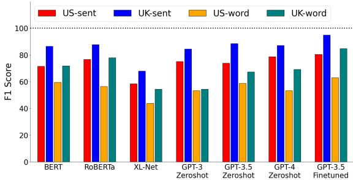  
Figure 2: Slang detection performance by region.

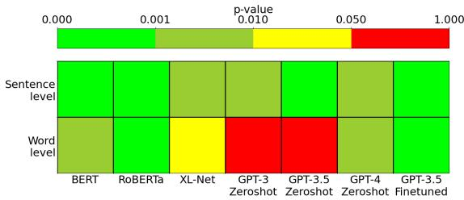  
Figure 3: Significance level of the regional discrepancies in slang detection performance at both the wordlevel and the sentence-level. We perform a one-sided test to evaluate whether detection performance on UK slang is indeed significantly better than that of US slang.

## 4.3 Slang source identification

We directly probe large language models’ knowledge in identifying a slang’s demographic identity. Given that slang is highly reflective of a user’s social identity (Labov, 1972, 2006; Eble, 2012), we expect better-performing models to gain such knowledge. We evaluate the extent of such knowledge by probing a text classification task.

Task. Given a sentence containing a slang usage, we ask the model to classify its source (e.g. region and age). For example, the following sentences should be classified into US as supposed to UK:

(a) OpenSubtitles-Slang - Region  
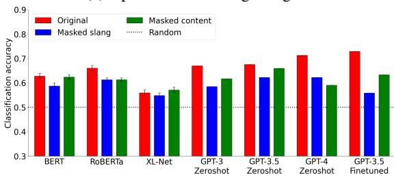

(b) Green’s Dictionary of Slang - Region  
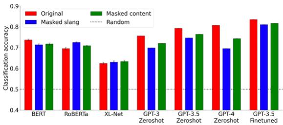

(c) Green’s Dictionary of Slang - Age  
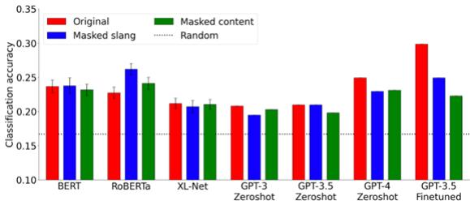  
Figure 4: Classification performance on slang source identification tasks.

(S1) Good choice, that jacket is blazing.

(S2) Good choice, that jacket is [MASK].

(S3) Good [MASK], that jacket is blazing.

We compare the classification performance with sentences containing slang (S1) and corresponding sentences with the slang term masked out (S2). We also include another control task by masking out a random content word in the sentence other than the slang word (S3). For models that use slang as a salient feature to identify demographics, we expect masking out the slang to result in much inferior performance but the performance should not deteriorate as much when masking out a random word.

Results. Figure 4 shows the source identification results on both OpenSubtitles-Slang and Green’s Dictionary of Slang for region and age. Overall, we observe that the zero-shot GPT-3 model perform comparably with the BERT-like models and the GPT-4 model is consistently better at predicting demographics compared to earlier models. Although the finetuned GPT-3.5 model achieves the best accuracies across all experiments, the performance is not much better compared to zero-shot GPT-4 when predicting region, whereas finetuning drastically improves the accuracy in age prediction. Furthermore, we observe that GPT-3 shows a consistent trend in using slang as a salient feature in predicting demographic identity, indicated by much lower classification accuracies when the slang terms are removed, while the accuracy loss is often not as pronounced when masking out a random word. We also observe this trend in newer generations of GPT models, though it is less pronounced compared to GPT-3. This behavior is generally not observed in the BERT-like models.

In the BERT-like models, we make two observations suggesting that these models lack the ability to link slang usages to user demographics. First, the source identification performance decreases when a slang term is masked out, and it experiences a similar decrease when a random word is masked out. This observation suggests that decrease in model performance is tied to removal of words but not specifically to slang usages. Second, the source identification performance improves after a slang term is removed. Here, it is plausible that the BERT-like models do not faithfully capture slang meaning. With slang terms removed, the models may become more certain about the underlying meaning conveyed by a sentence. In both cases, we do not find conclusive evidence that the BERT-like models are able to make connections between slang and the source of a sentence.

## 4.4 Model interpretation

We perform interpretive analysis to examine whether large language models have gained structural semantic knowledge about slang through large scale training. We do so by first comparing the usage probabilities of slang and their corresponding literal paraphrase tokens. Here, high model probabilities on slang tokens reflect a model’s confidence in predicting the slang term to be used within the specified linguistic context, thus having good distributional semantic knowledge of a slang’s meaning. We also analyze sentence embeddings generated by the LLMs on conventional and slang dictionary senses to examine whether geometry of the underlying representation space reflects structural semantic knowledge of slang.

Task. Given a sentence containing slang, we examine a model’s predictive confidence in a slang usage by measuring the LM probability associated with the slang word. If a literal paraphrase of the word is available, we compare the probability of the slang word with its literal counterpart:

(S1) Good choice, that jacket is blazing.

(S2) Good choice, that jacket is excellent.

For the example sentences above, we measure language model probabilities assigned to both the slang word blazing and the literal word excellent given the exact preceding context. Detailed experiment setup can be found in Appendix B.4

Metrics. We report two metrics to compare an LLM’s predictive confidence in slang usages relative to their literal counterparts. Let $s _ { i }$ denote the language model probability assigned to the slang word in the i’th sentence and similarly $\mathcal { L } _ { i }$ for the literal word’s probability. The mean ratio compares the aggregate probability mass assigned to each word type over a sample of sentences:

$$
r _ { m e a n } = \frac { \sum _ { i } \mathcal { S } _ { i } } { \sum _ { i } \mathcal { L } _ { i } }\tag{1}
$$

Here, we aggregate over probabilities for each type instead of individual ratios to avoid overemphasizing outlier slang that the model is either very confident or very impoverished on. For individual ratios between two word types, we report the median ratio to downplay the effect of outliers. A value above 1 means that more slang words have higher probabilities than their literal paraphrases:

$$
r _ { m e d i a n } = \mathrm { m e d i a n } _ { i } \frac { S _ { i } } { \mathcal { L } _ { i } }\tag{2}
$$

Results. Figure 5 summarizes the results for sentences from OpenSubtitles-Slang. We observe that for all of BERT, RoBERTa, and GPT-3,6 the models have much higher median ratio than mean ratios, suggesting that these models are confident on many of the slang terms in the dataset but impoverished on a select subset with much higher probabilities assigned to the paraphrases. In absolute terms, GPT-3 also assigns much higher probability scores to slang terms compared to the BERT-like models.

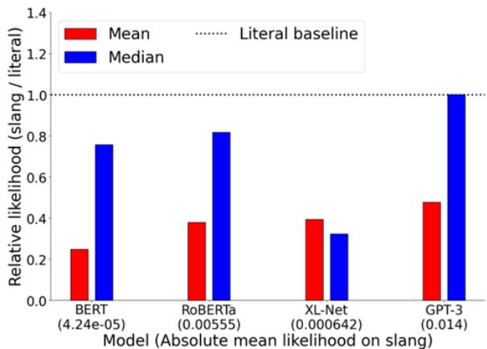  
Figure 5: Likelihood ratios between samples of corresponding slang and literal tokens.

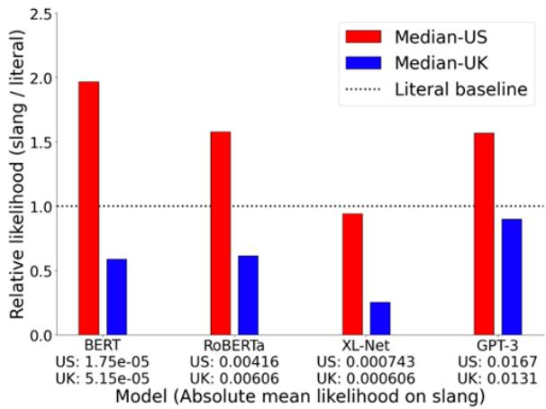

Figure 6: Median ratios across sentences from different regions.
<table><tr><td>Model</td><td>OSD</td><td>GDoS</td><td>UD</td></tr><tr><td>fastText</td><td> $0 . 3 5 \pm 0 . 0 3 3$ </td><td> $0 . 3 0 \pm 0 . 0 1 0$ </td><td> $0 . 3 1 \pm 0 . 0 3 7$ </td></tr><tr><td>SBERT</td><td> $0 . 3 2 \pm 0 . 0 3 3$ </td><td> $0 . 3 2 \pm 0 . 0 1 0$ </td><td> $0 . 2 8 \pm 0 . 0 3 4$ </td></tr><tr><td>GPT-3</td><td> $0 . 3 1 \pm 0 . 0 3 2$ </td><td> $0 . 3 1 \pm 0 . 0 1 1$ </td><td> $0 . 3 0 \pm 0 . 0 3 5$ </td></tr></table>

Table 3: Normalized ranks (between 0 and 1, lower is better) of a word’s slang definition embedding towards its conventional definition embedding over entries in The Online Slang Dictionary (OSD), Green’s Dictionary of Slang (GDoS) and Urban Dictionary (UD). We compare the embeddings produced by GPT-3 against those computed in Sun et al. (2021) using fastText (Bojanowski et al., 2017) and Sentence-BERT (SBERT; Reimers and Gurevych, 2019).

Next, we examine performance discrepancy by partitioning the data based on its region. This results in 59 sentence pairs from the US and 161 sentence pairs from the UK. Results from Figure 6 show that all models evaluated are much more confident in generating US slang compared to UK slang. GPT-3, however, has substantially less discrepancy in performance between the two regions due to it being more confident in UK slang. We also measure absolute probabilities assigned to slang tokens in context sentences extracted from Green’s Dictionary of Slang entries. By stratifying across different age groups and regions, we observe that the systems are much less confident on contemporary slang and only within this group that UK slang tends to receive much lower scores than US slang. Details results can be found in Appendix C.

<table><tr><td>Example 1</td><td colspan="2"></td><td colspan="3">Example 2</td></tr><tr><td>Sentences</td><td colspan="3">* We can&#x27;t keep doing this sh*t, Charlie. * Look, I don&#x27;t know what I said to you in there that got you so pissed off but I&#x27;m sorry, Charlie, all right?</td><td colspan="2">* Knock it off. * You&#x27;d kill to be in his place.</td></tr><tr><td></td><td colspan="3">* All right. *</td><td colspan="2">* - Okay b*tch, I&#x27;m ready. *</td></tr><tr><td>Slang Literal paraphrase</td><td colspan="3">pissed</td><td colspan="2">kill</td></tr><tr><td>Definition sentence</td><td colspan="3">angry Annoyed; anger.</td><td colspan="2">agree To agree with someone or about something.</td></tr><tr><td>Region</td><td colspan="3">US</td><td colspan="2">US</td></tr><tr><td>Model scores</td><td>BERT RoBERTa</td><td>GPT-3</td><td>BERT</td><td>RoBERTa</td><td>GPT-3</td></tr><tr><td>Detection</td><td>0.697</td><td>0.811 0.393</td><td></td><td>0.644</td><td>0.134 0.621</td></tr><tr><td>Source identification</td><td>0.491</td><td>0.436 0.762</td><td></td><td>0.710</td><td>0.879</td></tr><tr><td>Model confidence</td><td>0.035</td><td>0.057 1.567</td><td></td><td>0.873 9.654</td><td>0.170 3.120</td></tr></table>

Table 4: Example entries and their corresponding model scores from BERT, RoBERTa, and zero-shot GPT-3 respectively. Asterisks indicate extra context sentences not seen by the model.

Interestingly, we observe a reverse trend in discrepancy compared to the case in slang detection. Specifically, being less confident, in terms of probability, on UK slang terms makes it easier for the models to detect them. Indeed, we observe that US slang terms are often assigned higher probability scores than their literal counterparts, suggesting that slang usages from the US have been seen more frequently in the training data and the models use frequency as a salient feature to characterize slang.

Analysis. We look at text embeddings produced by GPT-3 to examine whether they encode semantic knowledge of slang. We adopt the benchmark proposed by Sun et al. (2021) that compares sentence embeddings of definition sentences. In this evaluation, the embedding of a slang definition is taken as an anchor and its semantic distances toward conventional definitions of words are computed. The distances are then ranked among all words in the lexicon and we expect the groundtruth word to receive a good rank. As an example, for blazing that can be used as slang to express ‘something excellent’, we expect the slang definition to be semantically close to the conventional definition of blazing - ‘burning brightly’ compared to definitions of other words in the lexicon. Sun et al. (2021, 2022) showed that this metric reflects the semantic knowledge of slang encoded in a model and is directly tied to performance in slang generation and interpretation. Table 3 shows the results of this evaluation. While GPT-3 shows better performance on slang than the BERT-like models on extrinsic tasks, we do not observe any significant difference in the underlying geometry of the representations. This gives further evidence that GPT-3’s source of knowledge comes from frequent instances of slang usage seen during training and simply treats them as additional “conventional” senses. It has yet been able to (or decided not to) encode any structural knowledge of slang into its representations.

Examples. We find two entries with definition and paraphrase annotation that appear in the test set for both slang detection and source identification. For each example, we show the respective model performances in Table 4. We show results for the best performing BERT-like model BERT and RoBERTA, as well as the zero-shot version of GPT-3 where probability scores are available. For the classification based tasks, we report each model’s confidence on the true label (i.e. P(True label)). For model confidence, we report the ratio between the LM scores of the slang word and its literal paraphrase $\left( \mathrm { i . e . } \ S _ { i } / \mathcal { L } _ { i } \right)$ . For BERT-likes, we report the normalized probabilities from the final classification layer. For GPT-3, we use the top-5 probabilities assigned to the response token by the OpenAI API. We then sum and normalize all token probabilities that correspond to one of the classes.

We observe that although GPT-3 reliably identifies and assigns high probabilities to both slang usages, it still failed to detect the slang pissed in Example 1. We find this trend to be consistent for slang detection test examples that have paraphrase annotations (32 examples) where negative correlations exist between model confidence scores and detection probability for all of BERT (r = 0.433), RoBERTa (r = 0.458), and GPT-3 $\mathfrak { d } ( r = - 0 . 2 2 0 )$ . This is consistent with our earlier finding where all models tend to consider less frequent usages as slang. We perform a similar experiment on source identification examples (21 examples) and find the correlations to be much weaker (BERT: $r = 0 . 0 2 0$ , RoBERTa: $r = - 0 . 1 2 1$ , GPT-3: $r = 0 . 2 7 6 )$ , although GPT-3 tend to better identify a slang’s region when it has high confidence.

## 5 Conclusion

We offered a comprehensive investigation of slang knowledge in large language models. We show that larger GPT models are more knowledgeable about slang compared to BERT-like models in 1) better detecting slang in natural sentences, 2) more accurately identifying the regional source and time period of slang usages, and 3) better predicting slang usages relative to their literal counterparts. Despite the superiority of GPT in these slang processing tasks, we did not find evidence that it represents or encodes slang as a special form of language. It is conceivable that GPT has learned to process slang by treating slang usages as rare meanings of words expressed in appropriate linguistic contexts.

In the identification of region and age of slang usages, we observed that all models tend to perform poorly on slang from the UK (compared to US slang) and more contemporary slang (compared to historical slang), likely due to impoverished training data. However, we found that GPT models are no more biased compared to earlier BERT-based models and that it shows comparable discrepancy in processing slang across regions. Additionally, we observed that GPT models contain good knowledge about the demographic identities of a slang usage in context. This capability may have implications for privacy in many scenarios (e.g., automatic data annotation), and users should be aware of the increased risk of identity exposure when using slang in LLM-based applications.

We have provided the first comprehensive probing analysis of large language models on knowledge of slang and have contributed an open benchmark dataset to facilitate future efforts in evaluating and improving large language models on informal language processing.

## Limitations

In our work, the sets of comparable experiments we can perform have been limited by lack of direct access to GPT models. Finetuning of GPT-3.5, for example, is completed using a blackbox API provided by OpenAI while newer models such as GPT-4 are not available for finetuning. Although it is commonly believed that OpenAI does not perturb all model weights during finetuning, the authors do not have direct access to GPT-3.5 to verify the exact training scheme being used. This may cause inconsistency in the experiment setup involving finetuned models. Also, the lack of access to internal layers of GPT hinders the comparison of intermediate representations in LLMs. For example, we can only analyze probability values from GPT-3 as OpenAI no longer provides access to those values in newer generation models like GPT-3.5 and GPT-4. Finally, the auto-regressive nature of GPT necessitates the comparison with the BERTlike masked language models in an auto-regressive setup. Although approaches such as Donahue et al. (2020) have been proposed to enhance GPT-2 to consider bidirectional context, we cannot apply such methods to GPT given the limited access.

We also acknowledge that our work is limited to studying slang in English and is restricted to specific demographic stratum (region and age). We hope that the evaluation framework proposed in this work would enable future work to extend the evaluation towards more varied demographics and languages. We selected OpenSubtitles to build our dataset because of its potential in extending the existing evaluation into a multilingual benchmark.

## Ethics Statement

We acknowledge that many slang-containing sentences annotated contain profanity, sexual references, and/or stereotypical views towards specific groups of our community. Discretion is advised when using the collected datasets. During annotation, we begin our HIT with a disclaimer informing annotators that “this HIT contains language use that may be offensive or upsetting.”. If the annotator does not provide consent in annotating such language, they may exit the HIT without penalty. All potentially offensive sentences shown in the example sections of this paper were taken verbatim from the original data source and do not reflect opinions of the authors and their affiliated organizations. The manuscript has been reviewed and approved by an internal ethics committee before submission.

We compensate all human annotators via Amazon Mechnical Turk, regardless of whether the annotated entries were kept after quality control. We compensate all annotators \$0.10 USD for identifying slang in up to 10 sentences and \$0.40 USD for defining and paraphrasing slang in up to 10 sentences. We run all experiments for BERT-like models (BERT, RoBERTa, and XLNet) using an in-house GPU server with 1 Nvidia Titan V GPU and 12 GB of VRAM available to the authors. All GPT model experiments are executed via OpenAI’s official API and cost \$77.22 USD in API credits.

We have written permissions to use both The Online Slang Dictionary and Green’s Dictionary of Slang for personal research use from the respective authors. We obtained OpenSubtitles data from the Open Parallel Corpus (OPUS; Tiedemann, 2012) containing user generated movie subtitles. We are not aware of any existing license posted for this dataset but follow all citation requests outlined by its authors.

## Acknowledgements

We thank the anonymous ARR reviewers and chairs for their constructive comments and suggestions. We thank Jwala Dhamala for feedback on the data annotation process. This work was supported by a QEII-GSST award to ZS and an Amazon Research Award to YX.

## References

Ehsan Aghazadeh, Mohsen Fayyaz, and Yadollah Yaghoobzadeh. 2022. Metaphors in pre-trained language models: Probing and generalization across datasets and languages. In Proceedings of the 60th Annual Meeting ofthe Associationfor Computational Linguistics (Volume 1: Long Papers), pages 2037– 2050, Dublin, Ireland. Association for Computational Linguistics.

Alham Fikri Aji, Radityo Eko Prasojo Tirana Noor Fatyanosa, Philip Arthur, Suci Fitriany, Salma Qonitah, Nadhifa Zulfa, Tomi Santoso, and Mahendra Data. 2021. ParaCotta: Synthetic multilingual paraphrase corpora from the most diverse translation sample pair. In Proceedings ofthe 35th Pacific Asia Conference on Language, Information and Computation, pages 533–542, Shanghai, China. Association for Computational Lingustics.

Yonatan Belinkov. 2022. Probing classifiers: Promises, shortcomings, and advances. Computational Linguistics, 48(1):207–219.

Yonatan Belinkov and James Glass. 2019. Analysis methods in neural language processing: A survey. Transactions of the Association for Computational Linguistics, 7:49–72.

Steven Bird and Edward Loper. 2004. NLTK: The natural language toolkit. In Proceedings of the ACL Interactive Poster and Demonstration Sessions, pages 214–217, Barcelona, Spain. Association for Computational Linguistics.

Su Lin Blodgett, Solon Barocas, Hal Daumé III, and Hanna Wallach. 2020. Language (technology) is power: A critical survey of “bias” in NLP. In Proceedings of the 58th Annual Meeting of the Association for Computational Linguistics, pages 5454– 5476, Online. Association for Computational Linguistics.

Su Lin Blodgett and Brendan O’Connor. 2017. Racial disparity in natural language processing: A case study of social media african-american english. In Proceedings of the Workshop on Fairness, Accountability, and Transparency in Machine Learning (FAT/ML), Halifax, Canada.

Piotr Bojanowski, Edouard Grave, Armand Joulin, and Tomas Mikolov. 2017. Enriching word vectors with subword information. Transactions of the Associationfor Computational Linguistics, 5:135–146.

Tom Brown, Benjamin Mann, Nick Ryder, Melanie Subbiah, Jared D Kaplan, Prafulla Dhariwal, Arvind Neelakantan, Pranav Shyam, Girish Sastry, Amanda Askell, Sandhini Agarwal, Ariel Herbert-Voss, Gretchen Krueger, Tom Henighan, Rewon Child, Aditya Ramesh, Daniel Ziegler, Jeffrey Wu, Clemens Winter, Chris Hesse, Mark Chen, Eric Sigler, Mateusz Litwin, Scott Gray, Benjamin Chess, Jack Clark, Christopher Berner, Sam McCandlish, Alec Radford, Ilya Sutskever, and Dario Amodei. 2020. Language models are few-shot learners. In Advances in Neural Information Processing Systems, volume 33, pages 1877–1901. Curran Associates, Inc.

Joy Buolamwini and Timnit Gebru. 2018. Gender shades: Intersectional accuracy disparities in commercial gender classification. In Proceedings of the 1st Conference on Fairness, Accountability and Transparency, volume 81 of Proceedings ofMachine Learning Research, pages 77–91. PMLR.

Jacob Devlin, Ming-Wei Chang, Kenton Lee, and Kristina Toutanova. 2019. BERT: Pre-training of deep bidirectional transformers for language understanding. In Proceedings ofthe 2019 Conference of the North American Chapter of the Association for Computational Linguistics: Human Language Technologies, Volume 1 (Long and Short Papers), pages 4171–4186, Minneapolis, Minnesota. Association for Computational Linguistics.

Kuntal Dey, Ritvik Shrivastava, and Saroj Kaushik. 2016. A paraphrase and semantic similarity detection system for user generated short-text content on microblogs. In Proceedings of COLING 2016, the 26th International Conference on Computational Linguistics: Technical Papers, pages 2880–2890, Osaka, Japan. The COLING 2016 Organizing Committee.

Chris Donahue, Mina Lee, and Percy Liang. 2020. Enabling language models to fill in the blanks. In Proceedings of the 58th Annual Meeting of the Association for Computational Linguistics, pages 2492– 2501, Online. Association for Computational Linguistics.

Connie C Eble. 2012. Slang & Sociability: In-group Language among College Students. University of North Carolina Press, Chapel Hill, NC.

Jonathan Green. 2010. Green’s Dictionary of Slang. Chambers, London.

Dirk Hovy. 2015. Demographic factors improve classification performance. In Proceedings of the 53rd Annual Meeting ofthe Associationfor Computational Linguistics and the 7th International Joint Conference on Natural Language Processing (Volume 1: Long Papers), pages 752–762, Beijing, China. Association for Computational Linguistics.

Dirk Hovy and Anders Søgaard. 2015. Tagging performance correlates with author age. In Proceedings of the 53rd Annual Meeting of the Association for Computational Linguistics and the 7th International Joint Conference on Natural Language Processing (Volume 2: Short Papers), pages 483–488, Beijing, China. Association for Computational Linguistics.

Dirk Hovy and Shannon L. Spruit. 2016. The social impact of natural language processing. In Proceedings of the 54th Annual Meeting of the Association for Computational Linguistics (Volume 2: Short Papers), pages 591–598, Berlin, Germany. Association for Computational Linguistics.

Daphna Keidar, Andreas Opedal, Zhijing Jin, and Mrinmaya Sachan. 2022. Slangvolution: A causal analysis of semantic change and frequency dynamics in slang. In Proceedings of the 60th Annual Meeting of the Associationfor Computational Linguistics (Volume 1: Long Papers), pages 1422–1442, Dublin, Ireland. Association for Computational Linguistics.

Diederik P. Kingma and Jimmy Ba. 2015. Adam: A method for stochastic optimization. In 3rd International Conference on Learning Representations, ICLR 2015, San Diego, CA, USA, May 7-9, 2015, Conference Track Proceedings.

Allison Koenecke, Andrew Nam, Emily Lake, Joe Nudell, Minnie Quartey, Zion Mengesha, Connor Toups, John R. Rickford, Dan Jurafsky, and Sharad Goel. 2020. Racial disparities in automated speech recognition. Proceedings ofthe National Academy ofSciences, 117(14):7684–7689.

Vivek Kulkarni and William Yang Wang. 2018. Simple models for word formation in slang. In Proceedings of the 2018 Conference of the North American Chapter ofthe Associationfor Computational Linguistics: Human Language Technologies, Volume 1 (Long Papers), pages 1424–1434, New Orleans, Louisiana. Association for Computational Linguistics.

William Labov. 1972. Language in the inner city: Studies in the Black English vernacular. University of Pennsylvania Press.

William Labov. 2006. The social stratification of English in New York City. Cambridge University Press.

Bai Li, Zining Zhu, Guillaume Thomas, Yang Xu, and Frank Rudzicz. 2021. How is BERT surprised? layerwise detection of linguistic anomalies. In Proceedings ofthe 59th Annual Meeting ofthe Associationfor Computational Linguistics and the 11th International Joint Conference on Natural Language Processing (Volume 1: Long Papers), pages 4215–4228, Online. Association for Computational Linguistics.

Tal Linzen, Emmanuel Dupoux, and Yoav Goldberg. 2016. Assessing the ability of LSTMs to learn syntaxsensitive dependencies. Transactions ofthe Associationfor Computational Linguistics, 4:521–535.

Pierre Lison and Jörg Tiedemann. 2016. OpenSubtitles2016: Extracting large parallel corpora from movie and TV subtitles. In Proceedings of the Tenth International Conference on Language Resources and Evaluation (LREC’16), pages 923–929, Portorož, Slovenia. European Language Resources Association (ELRA).

Emmy Liu, Chenxuan Cui, Kenneth Zheng, and Graham Neubig. 2022. Testing the ability of language models to interpret figurative language. In Proceedings of the 2022 Conference of the North American Chapter ofthe Associationfor Computational Linguistics: Human Language Technologies, pages 4437–4452, Seattle, United States. Association for Computational Linguistics.

Yinhan Liu, Myle Ott, Naman Goyal, Jingfei Du, Mandar Joshi, Danqi Chen, Omer Levy, Mike Lewis, Luke Zettlemoyer, and Veselin Stoyanov. 2019. Roberta: A robustly optimized bert pretraining approach. arXiv.

Li Lucy and David Bamman. 2021. Characterizing English variation across social media communities with BERT. Transactions ofthe Associationfor Computational Linguistics, 9:538–556.

Elisa Mattiello. 2005. The pervasiveness of slang in standard and non-standard english. Mots Palabras Words, 6:7–41.

Ke Ni and William Yang Wang. 2017. Learning to explain non-standard English words and phrases. In Proceedings of the Eighth International Joint Conference on Natural Language Processing (Volume 2: Short Papers), pages 413–417, Taipei, Taiwan. Asian Federation of Natural Language Processing.

OpenAI. 2023. GPT-4 technical report. arXiv.

Zhengqi Pei, Zhewei Sun, and Yang Xu. 2019. Slang detection and identification. In Proceedings of the 23rd Conference on Computational Natural Language Learning (CoNLL), pages 881–889, Hong

Kong, China. Association for Computational Lin guistics.

Nils Reimers and Iryna Gurevych. 2019. Sentence-BERT: Sentence embeddings using Siamese BERTnetworks. In Proceedings ofthe 2019 Conference on Empirical Methods in Natural Language Processing and the 9th International Joint Conference on Natural Language Processing (EMNLP-IJCNLP), pages 3982–3992, Hong Kong, China. Association for Computational Linguistics.

Anna Rogers, Olga Kovaleva, and Anna Rumshisky. 2020. A primer in BERTology: What we know about how BERT works. Transactions of the Association for Computational Linguistics, 8:842–866.

Zhewei Sun and Yang Xu. 2022. Tracing semantic variation in slang. In Proceedings ofthe 2022 Conference on Empirical Methods in Natural Language Processing, pages 1299–1313, Abu Dhabi, United Arab Emirates. Association for Computational Linguistics.

Zhewei Sun, Richard Zemel, and Yang Xu. 2019. Slang generation as categorization. In Proceedings ofthe 41st Annual Conference ofthe Cognitive Science Society, pages 2898–2904. Cognitive Science Society.

Zhewei Sun, Richard Zemel, and Yang Xu. 2021. A computational framework for slang generation. Transactions of the Association for Computational Linguistics, 9:462–478.

Zhewei Sun, Richard Zemel, and Yang Xu. 2022. Semantically informed slang interpretation. In Proceedings ofthe 2022 Conference ofthe North American Chapter ofthe Associationfor Computational Linguistics: Human Language Technologies, pages 5213–5231, Seattle, United States. Association for Computational Linguistics.

Bradley A. Swerdfeger. 2012. Assessing the viability of the urban dictionary as a resource for slang.

Rachael Tatman. 2017. Gender and dialect bias in YouTube’s automatic captions. In Proceedings of the First ACL Workshop on Ethics in Natural Language Processing, pages 53–59, Valencia, Spain. Association for Computational Linguistics.

Ian Tenney, Patrick Xia, Berlin Chen, Alex Wang, Adam Poliak, R. Thomas McCoy, Najoung Kim, Benjamin Van Durme, Samuel R. Bowman, Dipanjan Das, and Ellie Pavlick. 2019. What do you learn from context? probing for sentence structure in contextualized word representations. In Proceedings of 7th International Conference on Learning Representations, ICLR 2019.

Jörg Tiedemann. 2012. Parallel data, tools and interfaces in OPUS. In Proceedings of the Eighth International Conference on Language Resources and Evaluation (LREC’12), pages 2214–2218, Istanbul, Turkey. European Language Resources Association (ELRA).

Svitlana Volkova, Theresa Wilson, and David Yarowsky. 2013. Exploring demographic language variations to improve multilingual sentiment analysis in social media. In Proceedings of the 2013 Conference on Empirical Methods in Natural Language Processing, pages 1815–1827, Seattle, Washington, USA. Association for Computational Linguistics.

Haryo Akbarianto Wibowo, Made Nindyatama Nityasya, Afra Feyza Akyürek, Suci Fitriany, Alham Fikri Aji, Radityo Eko Prasojo, and Derry Tanti Wijaya. 2021. IndoCollex: A testbed for morphological transformation of Indonesian colloquial words. In Findings of the Association for Computational Linguistics: ACL-IJCNLP 2021, pages 3170–3183, Online. Association for Computational Linguistics.

Haryo Akbarianto Wibowo, Tatag Aziz Prawiro, Muhammad Ihsan, Alham Fikri Aji, Radityo Eko Prasojo, Rahmad Mahendra, and Suci Fitriany. 2020. Semi-supervised low-resource style transfer of Indonesian informal to formal language with iterative forward-translation. In 2020 International Conference on Asian Language Processing (IALP), pages 310–315. IEEE.

Philipp Wicke. 2023. LMs stand their ground: Investigating the effect of embodiment in figurative language interpretation by language models.

Thomas Wolf, Lysandre Debut, Victor Sanh, Julien Chaumond, Clement Delangue, Anthony Moi, Pierric Cistac, Tim Rault, Remi Louf, Morgan Funtowicz, Joe Davison, Sam Shleifer, Patrick von Platen, Clara Ma, Yacine Jernite, Julien Plu, Canwen Xu, Teven Le Scao, Sylvain Gugger, Mariama Drame, Quentin Lhoest, and Alexander Rush. 2020. Transformers: State-of-the-art natural language processing. In Proceedings ofthe 2020 Conference on Empirical Methods in Natural Language Processing: System Demonstrations, pages 38–45, Online. Association for Computational Linguistics.

Wei Xu, Alan Ritter, and Ralph Grishman. 2013. Gathering and generating paraphrases from Twitter with application to normalization. In Proceedings of the Sixth Workshop on Building and Using Comparable Corpora, pages 121–128, Sofia, Bulgaria. Association for Computational Linguistics.

Zhilin Yang, Zihang Dai, Yiming Yang, Jaime Carbonell, Russ R Salakhutdinov, and Quoc V Le. 2019. XLNet: Generalized autoregressive pretraining for language understanding. In Advances in Neural Information Processing Systems, volume 32. Curran Associates, Inc.

## A Data Collection Procedures

We sample 100 English movies from the Open-Subtitles corpus for an even distribution across the regions of US and UK, where we identify the region by querying a movie’s region of production on IMDb7. For each region, we randomly shuffle the list of corresponding movies represented in the OpenSubtitles corpus that are produced after the year 2000 and iterate through the list until we have 50 movies. For each movie, the authors manually inspect the corresponding IMDb meta-data to ensure that the movie has a realistic setting in the appropriate region (i.e. US or UK) and that the plot is set after year 1980 to avoid antiquated slang. In addition, we ensure that each selected movie would have sufficient sentences by filtering out all movies with less than 500 subtitle lines. As a result, the most common genre tags are drama, comedy, crime and romance. A complete list of movie meta-data can be found in Table 5 and Table 6.

For each movie, we randomly sample 250 sentences for annotation on Amazon Mechanical Turk8. We restrict the set of annotators to native English speakers who live in the corresponding region of the movie (i.e. US or UK). We first ask annotators to detect sentences containing slang usage and identify the exact slang terms. To define what is considered slang, we provide all annotators with 5 positive examples containing slang and 5 negative examples that closely resemble slang usage. Table 7 shows these examples. We obtain these examples from a small scale pilot study and manually verify that all positive examples have exact definition matches in Green’s Dictionary of Slang while all slang-like words in the negative sentences do not have corresponding entries in the dictionary. For each annotation, the preceding and succeeding sentences in the movie scripts are also shown to the annotators for contextual awareness but they are only asked to find slang in the main sentence. For each sentence, we ask 3 annotators to perform the same task. Overall, 7,488 sentences are flagged by at least one annotator as containing slang (3,583 unique terms), with 1,844 and 412 sentences flagged by two or all three annotators respectively. We adopt a majority vote scheme and only consider sentences with at least 2 annotators agreeing but include all sentences and annotator confidence scores in the dataset for future users.

For the 885 sentences with at least 2/3 annotator agreement, we further annotate these sentences by asking one additional annotator to give a definition sentence and a literal paraphrase of the slang. The annotators were directed to both Green’s Dictionary of Slang and Urban Dictionary for reference, in this order of preference, and asked to cite a URL for the definition if possible. We manually inspect the annotator responses and remove all that are nonsensical (e.g. writing down the same definition sentence for all slang in a batch). After removing such responses, we obtain 836 sentences with 366 unique slang terms that have both a definition sentence and a literal paraphrase.

During annotation, the annotators were not told about the specific year of release and were asked to annotate the slang solely based on its usage and the corresponding references from slang dictionaries. We do not specify the year during annotation because annotators will likely not have the necessary expertise to differentiate multiple meanings of slang across several time periods.

## B Experiment Setup

## B.1 Probing classifiers

We implement BERT, RoBERTa, and XLNet classifiers using the transformers library (Wolf et al., 2020) released by Huggingface. For each model, we use the corresponding sequence classification classes for sentence-level detection and source identification, and token classification classes for wordlevel detection. For all models, we only train weights for the classification layers that are not part of pre-training, except for BERT where we retrain weights for the final pooling layer. We do this to ensure consistency across all models because only BERT has a pre-trained pooling layer used for its next-sentence prediction objective while such a layer does not exist in pre-trained RoBERTa and XLNet. we train each model for 10 epochs and repeat the experiment 20 times with different random initializations. We use Adam (Kingma and Ba, 2015) with a learning rate of 0.001. Parameters from the training epoch with the highest validation performance is saved for testing.

For GPT-3.5 finetuning, We train each model once using the same set of training and validation data used to train the BERT-like models and train the model for four epochs using OpenAI’s API interface using default parameters with a batch size of 20.

<table><tr><td>OpenSubtitles ID</td><td>Year</td><td>Region</td><td>Genres</td></tr><tr><td>54446</td><td>2000</td><td>USA</td><td>Adventure, Comedy, Drama</td></tr><tr><td>135737</td><td>2000</td><td>USA</td><td>Action, Crime, Thriller</td></tr><tr><td>145382</td><td>2000</td><td>USA</td><td>Drama, Romance</td></tr><tr><td>185218</td><td>2001</td><td>USA</td><td>Crime, Drama, Romance</td></tr><tr><td>186160</td><td>2004</td><td>USA</td><td>Comedy, Sport</td></tr><tr><td>241730</td><td>2005</td><td>USA</td><td>Comedy, Drama</td></tr><tr><td>3151540</td><td>2007</td><td>USA</td><td>Drama</td></tr><tr><td>3279503</td><td>2008</td><td>USA</td><td>Crime, Mystery, Thriller</td></tr><tr><td>3372842</td><td>2000</td><td>USA</td><td>Action, Adventure, Drama</td></tr><tr><td>3468388</td><td>2007</td><td>USA</td><td>Crime, Drama</td></tr><tr><td>3546395</td><td>2009</td><td>USA</td><td>Drama</td></tr><tr><td>3558591</td><td>2005</td><td>USA</td><td>Comedy, Romance</td></tr><tr><td>3562517</td><td>2009</td><td>USA</td><td>Comedy, Fantasy, Romance</td></tr><tr><td>3618044</td><td>2009</td><td>USA</td><td>Comedy, Drama</td></tr><tr><td>3692182</td><td>2009</td><td>USA</td><td>Crime, Drama, Thriller</td></tr><tr><td>3877824</td><td>2009</td><td>USA</td><td>Horror, Thriller</td></tr><tr><td>3967329</td><td>2010</td><td>USA</td><td>Drama</td></tr><tr><td>4109374</td><td>2010</td><td>USA</td><td>Comedy, Drama, Romance</td></tr><tr><td>4185464</td><td>2011</td><td>USA</td><td>Crime, Drama</td></tr><tr><td>4218973</td><td>2011</td><td>USA</td><td>Crime, Drama, Horror</td></tr><tr><td>4473014</td><td>2011</td><td>USA</td><td>Drama, Mystery, Romance</td></tr><tr><td>4574956</td><td>2011</td><td>USA</td><td>Comedy</td></tr><tr><td>4728198</td><td>2001</td><td>USA</td><td>Drama</td></tr><tr><td>4744540</td><td>2012</td><td>USA</td><td>Drama, Sport</td></tr><tr><td>4953583</td><td>2013</td><td>USA</td><td>Action, Crime, Thriller</td></tr><tr><td>5036434</td><td>2012</td><td>USA</td><td>Drama</td></tr><tr><td>5166024</td><td>2013</td><td>USA</td><td>Adventure, Comedy, Drama</td></tr><tr><td>5178727</td><td>2010</td><td>USA</td><td>Comedy, Drama</td></tr><tr><td>5340423</td><td>2013</td><td>USA</td><td>Comedy, Drama, Romance</td></tr><tr><td>5450161</td><td>2013</td><td>USA</td><td>Comedy, Drama, Romance</td></tr><tr><td>5536320</td><td>2014</td><td>USA</td><td>Biography, Crime, Drama</td></tr><tr><td>5653079</td><td>2012</td><td>USA</td><td>Comedy, Drama, Romance</td></tr><tr><td>5697912</td><td>2012</td><td>USA</td><td>Comedy, Drama, Romance</td></tr><tr><td>5791518</td><td>2014</td><td>USA</td><td>Comedy, Romance</td></tr><tr><td>5836657</td><td>2014</td><td>USA</td><td>Comedy, Romance</td></tr><tr><td>5838045</td><td>2014</td><td>USA</td><td>Sci-Fi, Thriller</td></tr><tr><td>5860680</td><td>2014</td><td>USA</td><td>Drama, Romance, Sci-Fi</td></tr><tr><td>5891414</td><td>2014</td><td>USA</td><td>Action, Crime, Thriller</td></tr><tr><td>5905224</td><td>2012</td><td>USA</td><td>Comedy, Romance</td></tr><tr><td>5922900</td><td>2012</td><td>USA</td><td>Comedy, Horror, Sci-Fi</td></tr><tr><td>5974299</td><td>2014</td><td>USA</td><td>Comedy, Drama, Romance</td></tr><tr><td>5987878</td><td>2006</td><td>USA</td><td>Comedy, Romance</td></tr><tr><td>6173232</td><td>2014</td><td>USA</td><td>Documentary, Music, Sport</td></tr><tr><td>6185084</td><td>2015</td><td>USA</td><td>Comedy</td></tr><tr><td>6249260</td><td>2014</td><td>USA</td><td>Comedy, Musical</td></tr><tr><td>6377252</td><td>2009</td><td>USA</td><td>Action, Crime, Thriller</td></tr><tr><td>6406429</td><td>2001</td><td>USA</td><td>Drama, Music</td></tr><tr><td>6441036</td><td>2013</td><td>USA</td><td>Drama, Family, Fantasy</td></tr><tr><td>6692456</td><td>2016</td><td>USA</td><td>Crime, Drama, Mystery</td></tr><tr><td>6801883</td><td>2014</td><td>USA</td><td>Crime, Drama, Mystery</td></tr></table>

Table 5: Meta-data for all US movies used in constructing OpenSubtitles-Slang.

## B.2 Slang detection

We use entries from the OpenSub-Slang dataset with an annotator confidence score of 2 or above for positive examples. We use all sentences in which exact one copy of the exact slang identified by the annotators can be found. After filtering, we have 1,913 slang containing sentences. From the set of 17,512 movie subtitle sentences where all 3 annotators labeled as not containing slang, we randomly sample 1,913 sentences to construct a balanced sample. We split the data into 80, 5, 15 percent partitions for training, validation and testing respectively.

We evaluate three finetuned BERT-like models: BERT, RoBERTa, XLNet along with GPT-3, GPT-3.5, and GPT-4. We evaluate each GPT model’s zero-shot performance with prompting alone. For GPT-3.5, we also consider a finetuned variant trained with the same data as the BERT-like models.

<table><tr><td>OpenSubtitles ID</td><td>Year</td><td>Region</td><td>Genres</td></tr><tr><td>3120452</td><td>2006</td><td>UK</td><td>Comedy, Drama, Romance</td></tr><tr><td>3121411</td><td>2006</td><td>UK</td><td>Crime, Drama, Thriller</td></tr><tr><td>3179568</td><td>2006</td><td>UK</td><td>Crime, Drama</td></tr><tr><td>3320486</td><td>2008</td><td>UK</td><td>Comedy, Drama, Romance</td></tr><tr><td>3345059</td><td>2008</td><td>UK</td><td>Crime, Drama</td></tr><tr><td>3357285</td><td>2007</td><td>UK</td><td>Drama, Romance</td></tr><tr><td>3472293</td><td>2009</td><td>UK</td><td>Crime, Drama, Mystery</td></tr><tr><td>3552835</td><td>2008</td><td>UK</td><td>Crime, Drama, Horror</td></tr><tr><td>3564173</td><td>2008</td><td>UK</td><td>Drama</td></tr><tr><td>3666051</td><td>2009</td><td>UK</td><td>Action, Crime, Drama</td></tr><tr><td>3670999</td><td>2010</td><td>UK</td><td>Biography, Drama, Music</td></tr><tr><td>3807079</td><td>2005</td><td>UK</td><td>Comedy, Crime</td></tr><tr><td>4030209 4107485</td><td>2003</td><td>UK</td><td>Documentary, Music</td></tr><tr><td>4136037</td><td>2010</td><td>UK</td><td>Comedy, Thriller</td></tr><tr><td>4177060</td><td>2010</td><td>UK</td><td>Biography, Documentary, Drama</td></tr><tr><td>4204063</td><td>2009</td><td>UK</td><td>Action, Crime, Drama</td></tr><tr><td>4259257</td><td>2009</td><td>UK</td><td>Comedy, Drama, Romance</td></tr><tr><td>4398890</td><td>2010</td><td>UK</td><td>Comedy, Drama</td></tr><tr><td>4471635</td><td>2011</td><td>UK</td><td>Action, Thriller</td></tr><tr><td>4527521</td><td>2010 2012</td><td>UK</td><td>Crime, Drama, Thriller</td></tr><tr><td>4629499</td><td></td><td>UK</td><td>Crime, Thriller</td></tr><tr><td>4640913</td><td>2012</td><td>UK</td><td>Crime</td></tr><tr><td>4683078</td><td>2011</td><td>UK</td><td>Comedy, Drama, Music</td></tr><tr><td>4864547</td><td>2012</td><td>UK</td><td>Drama, Sport</td></tr><tr><td>4938516</td><td>2012</td><td>UK</td><td>Crime, Drama, Mystery</td></tr><tr><td>4987950</td><td>2009</td><td>UK</td><td>Mystery, Thriller Drama</td></tr><tr><td>5052284</td><td>2011</td><td>UK</td><td></td></tr><tr><td>5145968</td><td>2002</td><td>UK</td><td>Crime, Drama, Mystery</td></tr><tr><td>5151994</td><td>2012</td><td>UK</td><td>Horror, Mystery</td></tr><tr><td>5167828</td><td>2008 2001</td><td>UK</td><td>Action, Biography, Crime</td></tr><tr><td>5204705</td><td></td><td>UK</td><td>Drama, Mystery, Thriller</td></tr><tr><td>5461631</td><td>2012</td><td>UK</td><td>Crime, Drama, Thriller</td></tr><tr><td>5510712</td><td>2003 2013</td><td>UK</td><td>Comedy, Drama, Romance</td></tr><tr><td>5623414</td><td>2013</td><td>UK</td><td>Action</td></tr><tr><td>5681039</td><td></td><td>UK</td><td>Comedy, Music</td></tr><tr><td>5742017</td><td>2004 2010</td><td>UK</td><td>Comedy, Crime, Drama</td></tr><tr><td>5778643</td><td></td><td>UK</td><td>Action, Crime, Drama</td></tr><tr><td>5814259</td><td>2013 2014</td><td>UK</td><td>Documentary, Sport</td></tr><tr><td>5837569</td><td>2002</td><td>UK UK</td><td>Drama, Musical, Romance Horror, Thriller</td></tr><tr><td>6010762</td><td>2012</td><td>UK</td><td>Crime, Drama</td></tr><tr><td>6107374</td><td>2010</td><td>UK</td><td>Comedy, Drama</td></tr><tr><td>6224678</td><td>2014</td><td>UK</td><td>Thriller</td></tr><tr><td>6237485</td><td>2014</td><td></td><td>Drama</td></tr><tr><td>6244263</td><td>2014</td><td>UK UK</td><td>Thriller</td></tr><tr><td>6338678</td><td>2008</td><td>UK</td><td>Drama, Romance, Thriller</td></tr><tr><td>6782316</td><td>2009</td><td></td><td></td></tr><tr><td></td><td></td><td>UK</td><td>Biography, Drama, Sport</td></tr><tr><td>6910409</td><td>2014</td><td>UK</td><td>Comedy, Drama</td></tr><tr><td>6997754 7039857</td><td>2012 2016</td><td>UK UK</td><td>Action, Crime, Drama Comedy</td></tr></table>

Table 6: Meta-data for all UK movies used in constructing OpenSubtitles-Slang.

For sequence tagging in word-level detection, we apply the BIO tagging scheme to all words. During training, we also mark subword units with inside tokens when slang words are split into tokens. During evaluation, however, we only consider whole words splitted by white space to ensure a consistent evaluation metric across models with different tokenization schemes.

For GPT models, we evaluate zero-shot performance by prompting the task instruction along with the input sentence. For sentence-level detection,

we use the prompt:

»> Is there a slang in the following sentence? Answer only ’Yes’ or ’No’.

»> Sentence: [A SENTENCE IN THE DATA]

»> Answer:

Similarly for word-level detection, we use the prompt:

»> Identify slang in the following sentence. If a slang has been found, output the slang only. If no slang has been found, answer ’[No slang]’.

<table><tr><td colspan="2">[Positive Examples]</td></tr><tr><td rowspan="3">Example 1</td><td>* We&#x27;re hitting pause after this. *</td></tr><tr><td>We get pinched, remember whose idea this was, okay?</td></tr><tr><td>* Be ready on Friday. *</td></tr><tr><td rowspan="5">Example 2</td><td>* Now, if it were up to me and they gave me two minutes and a wet towel I would personally</td></tr><tr><td>tasphyxiate his half-wit so we could string you up on a federal M1 and end this story with a bag</td></tr><tr><td>on your head and a paralyzing agent running through your veins. *</td></tr><tr><td>This isn&#x27;t f+cking townie hopscotch anymore, Doug.</td></tr><tr><td>* Be ready on Friday. *</td></tr><tr><td rowspan="3">Example 3</td><td>* I can&#x27;t do any more time, Dougy. *</td></tr><tr><td>So if we get jammed up we’re holding court on the street.</td></tr><tr><td>* [KNOCKING] *</td></tr><tr><td rowspan="3">Example 4</td><td>* She really loves you, I can tell. *</td></tr><tr><td>Good news for you is you have an alibi for the Cambridge job.</td></tr><tr><td>* The good news for me is I bet you know something about it. *</td></tr><tr><td rowspan="4">Example 5</td><td>* What do you call a guy who grows up with a group of people, gets to know their secrets because they trust him, and then turns around and use those secrets against them, put those</td></tr><tr><td>people in prison? *</td></tr><tr><td>You&#x27;d call him a rat, right?</td></tr><tr><td>* You know what I call him? *</td></tr><tr><td colspan="2">[Negative Examples]</td></tr><tr><td rowspan="3">Example 1</td><td>* Any clues? *</td></tr><tr><td>Any leads?</td></tr><tr><td>* Anything like that? *</td></tr><tr><td rowspan="3">Example 2</td><td>* With assault rifles. *</td></tr><tr><td>You f+cking dummies shot a guard.</td></tr><tr><td>* Now you&#x27;re like a half-off sale at Big and Tall. *</td></tr><tr><td rowspan="3">Example 3</td><td>* Coughlin, Kristina. *</td></tr><tr><td>She had a kid with her.</td></tr><tr><td>* The mother&#x27;s at Mass General. *</td></tr><tr><td rowspan="3">Example 4</td><td>* Do me a favor. *</td></tr><tr><td>The weight of this thing pack a parachute at least.</td></tr><tr><td>*You know the funniest thing about being in prison? *</td></tr><tr><td rowspan="3">Example 5</td><td>* [SHYNE CRYING] *</td></tr><tr><td>I know you&#x27;d rather see a rope around my neck!</td></tr><tr><td>* You&#x27;re getting the f*ck out of here. *</td></tr></table>

Table 7: Positive and negative annotations examples shown to annotators prior to annotation. Candidate slang terms are italicized. Sentences marked by asterisks indicate extra context sentences that the annotators are asked to consider but not to make annotations on.

## »> Sentence: [A SENTENCE IN THE DATA]

## »> Answer:

For GPT-3.5 and GPT-4 under OpenAI’s chat framework, we use the default system message “You are a helpful assistant.” for all prompts.

We mimic sequence labeling by searching for the resulting text span in the input sentence. When a match can be found, we set the appropriate beginning and inside labels for the detected span. We set the maximum number of generated tokens to be 1 and 20 for sentence-level and word-level detection respectively and set temperature to 0 for deterministic generation.

For finetuning GPT-3.5, we use ’0’ and ’1’ as binary labels for sentence-level detection. For wordlevel detection, we use the slang term as specified by the annotators.

## B.3 Slang source identification

We perform region identification on sentences from OpenSub-Slang with at least 2/3 annotator agreement, keeping those in which exact one copy of the slang can be found. We sample the sentences to construct an even sample of US and UK sentences which results in 1242 sentences for evaluation. We apply the same sampling scheme to sentences from the Green’s Dictionary of slang for region and age identification. We obtain a sample of 6,096 sentences evenly partitioned across US and UK, as well as 4,008 sentences uniformly partitioned across six decades. We split all data samples into 80, 5, 15 percent partitions for training, validation and testing respectively. To determine whether a word is a content word, we refer to the set of English stop words in NLTK (Bird and Loper, 2004).

We evaluate GPT-3’s zero-shot performance on slang source identification by promoting the sentence:

»> The following text is most likely produced in which region? Answer only ’US’ or ’UK’.

»> Text: [A SENTENCE IN THE DATA]

»> Region:

Similarly, we use the following prompt for age identification:

»> Classify The following text into one of the following decades based on the language use. Possible answers include ’1950’, ’1960’, ’1970’, ’1980’, ’1990’, or ’2000’. Answer in one word.

»> Text: [A SENTENCE IN THE DATA]

»> Decade:

Similar to the slang detection prompts, we use the default system message “You are a helpful assistant.” for all GPT-3.5 and GPT-4 prompts.

We set the maximum number of generated tokens to be 1 for all slang source identification tasks and set temperature to 0 for deterministic generation.

We finetune GPT-3.5 using the same set of training and validation data used to train the BERT-like models. We use the same labels as in the zero-shot prompts as the target labels. This includes {US, UK} for regional identification and {1950, 1960, 1970, 1980, 1990, 2000+} for age identification.

## B.4 Probing model confidence

We use slang-containing sentences from OpenSub-Slang with a confidence score of 2 or above. We use entries where both the slang word and its paraphrase tokenize into single tokens by all models9.

Since all GPT models are autoregressive language models, we truncate all tokens after the slang word for fair comparison and remove all sentences in which the slang appears at the beginning. After pre-processing, we obtain 220 sentence pairs from OpenSub-Slang. This includes 59 sentence pairs from US movies and 161 from UK movies.

## B.5 Preprocessing Green’s Dictionary of Slang

For each definition entry in Green’s Dictionary of Slang (GDoS), we automatically extract usable usage context sentences from the entry’s corresponding list of citations. For each citation, we apply a simple heuristic to extract potential example sentences by matching all text followed by a series of numeric characters and a column (e.g. “212:”). For all extracted sentences, we ensure that the slang word can be found in the sentence after tokenizing by whitespace. This results in 33,181 entries with example sentences attached with a total of 99,181 example sentences. From the citation in which an example sentence was extracted from, we associate the corresponding date and region tags of the citation with the example sentence.

## C Slang Token Probabilities over Time and Region

We measure the language model probabilities assigned to slang tokens for entries in Green’s Dictionary of Slang (GDoS). We use a similar task setup as described in Section 4.4. However, since GDoS does not contain any literal paraphrases for the slang tokens, we only measure the absolute probabilities assigned to slang tokens. Here, we focus on how the models perform differently over different sets of slang usages stratified across both time and region.

We consider all example sentences in which the corresponding slang word can be represented using a single token by all models. Furthermore, we only consider sentences with a region tag of US or UK and a date tag after the year of 1950. This results in 5,052 sentences in total, with 3,617 sentences from the US and 1,435 from the UK. Of the 5,052 sentences, we have 1,285, 1,431, 859, 615, 564 sentences from each decade respectively from 1950s to 1990s and 298 sentences from the year 2000 and onwards.

Figure 7 shows the result over different time periods and Figure 8 over different regions. Overall, we observe consistent performance across different time periods and regions from all models. One exception to this is that for both BERT, RoBERTa, and GPT-3 the probabilities drop significantly for contemporary slang usages recorded after 1980. This is especially noticeable for slang usages from the UK. We postulate that the models likely make very little distinction for older slang from both regions, but for newer ones the models are exposed to slang usages from the US much more frequently than ones from the UK. We also observe that GPT-3 is a lot less confident on new slang usages from after the year 2000. These findings are consistent with our main results on the OpenSub-Slang dataset where all slang usages are extracted from movies produced after the year 2000.

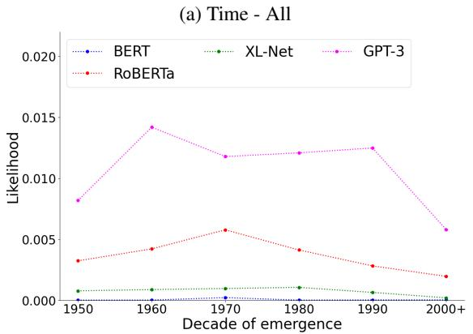

(b) Time - US  
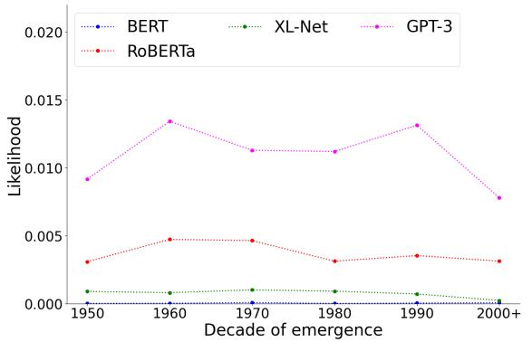

(c) Time - UK  
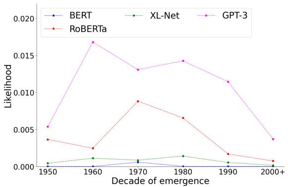  
Figure 7: Mean LM probabilities over slang tokens in sentences across different time periods.

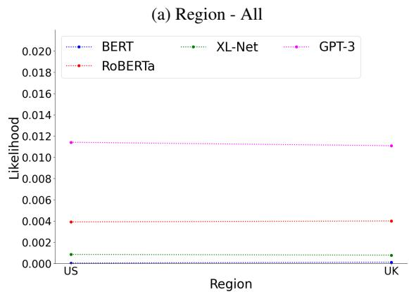

(b) Region - Pre 1980  
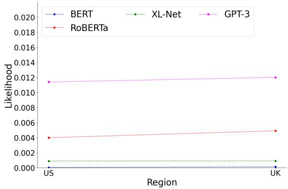

(c) Region - Post 1980  
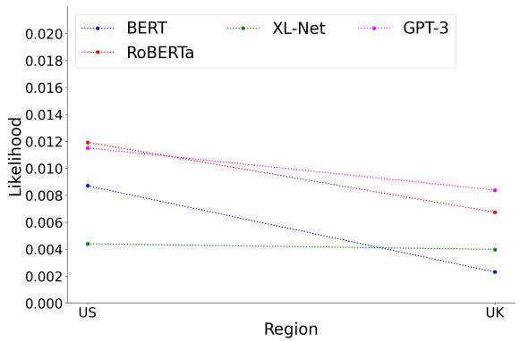  
Figure 8: Mean LM probabilities over slang tokens in sentences across different regions.

## D Effect of Tokenization in Probing

In our experiments shown in Section 4.4 and Appendix C involving probing probabilities, we only consider the subset of sentences in which both the corresponding slang and literal paraphrase (if applicable) can be presented using a single token. We perform this sampling procedure because we observe that all models tend to assign much higher probabilities to subword tokens. That is, regardless of whether a word is used as a slang or a literal paraphrase, words that comprise of subword tokens always attain much higher probabilities. Table 8 shows probabilities on slang containing sentences from OpenSub-Slang partitioned by tokenization. This is problematic as the tokenization scheme is dictating the magnitute of the probabilities over distributional semantics. We thus control for this confound by only considering sentences where all words of interest can be tokenized into a single token.

(a) BERT
<table><tr><td>Tokenization</td><td>Literal</td><td>Slang</td></tr><tr><td>All Single</td><td>0.00017</td><td>4.24e-05</td></tr><tr><td>Slang: Single Literal: Multiple</td><td>0.208</td><td>1.81e-05</td></tr><tr><td>Slang: Multiple 0.000118 Literal: Single</td><td>0.252</td><td></td></tr><tr><td>Tokenization</td><td>(b) RoBERTa</td><td></td></tr><tr><td>All Single</td><td>Literal 0.0146</td><td>Slang 0.00555</td></tr><tr><td>Slang: Single</td><td>0.265</td><td>0.00454</td></tr><tr><td>Literal: Multiple Slang: Multiple</td><td></td><td></td></tr><tr><td>Literal: Single</td><td>0.0111</td><td>0.29</td></tr><tr><td>Tokenization</td><td>(c) XLNet</td><td></td></tr><tr><td>All Single</td><td>Literal 0.00163</td><td>Slang</td></tr><tr><td>Slang: Single</td><td>0.118</td><td>0.000642 0.00141</td></tr><tr><td>Literal: Multiple</td><td></td><td></td></tr><tr><td>Slang: Multiple Literal: Single</td><td>0.00484</td><td>0.0831</td></tr><tr><td></td><td></td><td></td></tr><tr><td>Tokenization</td><td>(d) GPT-3 Literal</td><td></td></tr><tr><td>All Single</td><td></td><td>Slang</td></tr><tr><td>Slang: Single</td><td>0.0293</td><td>0.014</td></tr><tr><td>Literal: Multiple</td><td>0.285</td><td>0.0125</td></tr><tr><td></td><td>0.0208</td><td></td></tr><tr><td>Slang: Multiple Literal: Single</td><td></td><td>0.182</td></tr></table>

Table 8: Mean language model likelihood scores of slang and literal tokens under different tokenization conditions. The first row in each table shows the probability scores on sentences where both the slang and literal tokens are tokenized into single tokens by all models. The next two rows show results on sentences where the individual model tokenizes one word type with multiple tokens but uses a single token to represent the other.